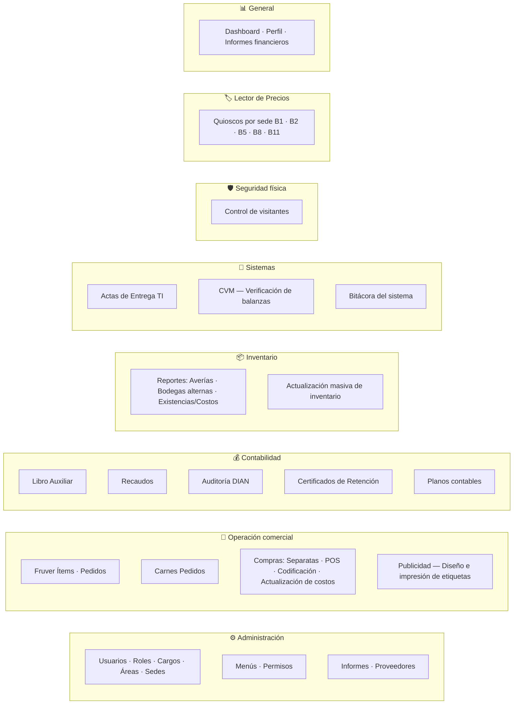

# 01 · Resumen Ejecutivo

**Documentación técnica — Aplicativo SEAO**

---

|                       |                                                                         |
| --------------------- | ----------------------------------------------------------------------- |
| **Documento**         | 01 — Resumen Ejecutivo                                                  |
| **Versión**           | 1.0                                                                     |
| **Fecha**             | 14 de julio de 2026                                                     |
| **Audiencia**         | Dirección · Comité técnico · Gerencia de sistemas · Contratistas nuevos |
| **Confidencialidad**  | Uso interno                                                             |
| **Tiempo de lectura** | ~15 minutos                                                             |

---

## 1 · ¿Qué es el aplicativo?

El **aplicativo interno de Supermercados Belalcázar** es una **plataforma web privada** que soporta la operación diaria de la cadena de 14 sedes en Yumbo (Valle del Cauca) y alrededores. Es la herramienta con la que compradores, contadores, personal de sistemas, seguridad y sedes ejecutan tareas de negocio que el ERP Siesa Biable no cubre por sí solo.

Se accede en `https://aplicativo.supermercadobelalcazar.com` desde navegador, con autenticación por usuario o mediante Microsoft 365.

### 1.1 Visión resumida

- **Público único:** empleados de Abastecemos de Occidente S.A.S. — el aplicativo **no es de cara al cliente**.
- **Alcance:** 19 dominios funcionales operativos (ver §3).
- **Escala:** 72 usuarios activos, 14 sedes, 2 empresas del grupo (Abastecemos y Tobar), ~63 tablas MySQL propias + integración con ~20 tablas del ERP.
- **Estado:** en producción y evolucionando activamente hacia una arquitectura modular (SRA).

### 1.2 Roles principales del sistema

| Rol operativo                    | Qué hace en el aplicativo                                                                  |
| -------------------------------- | ------------------------------------------------------------------------------------------ |
| **Administrador**                | Gestiona usuarios, menús, permisos, informes                                               |
| **Comprador**                    | Crea solicitudes de actualización de costos, codificación de productos, edita separatas    |
| **Contador / Auxiliar contable** | Consulta recaudos, libro auxiliar, hace auditoría DIAN, descarga certificados de retención |
| **Sistemas / TI**                | Registra actas de entrega de equipos, verifica CVM, consulta bitácora                      |
| **Personal de sede**             | Registra visitantes, hace pedidos Fruver/Carnes, consulta precios                          |
| **Publicidad**                   | Diseña e imprime etiquetas de precio                                                       |

---

## 2 · Arquitectura en 3 párrafos

**El aplicativo tiene tres capas físicas.** La **primera** es una SPA en React que corre en el navegador del usuario. La **segunda** es un backend PHP alojado en un hosting cPanel comercial, que actúa como _gateway de identidad_ — autentica al usuario, aplica permisos granulares, guarda datos administrativos, y decide si reenviar la petición a la tercera capa. La **tercera** es un framework PHP propio en un servidor dentro de la LAN corporativa, que consulta directamente a las bases PostgreSQL del ERP Siesa Biable.

**El acceso a la LAN se hace a través de un túnel Cloudflared**, lo que permite publicar el servidor interno en Internet sin abrir puertos en la red corporativa. Un token compartido + una lista blanca de IPs autoriza las llamadas del backend cPanel al framework LAN. La identidad del usuario final se propaga mediante un header `X-Usuario-Origen` para que cada consulta al ERP quede ligada a la persona que la originó.

**Los datos están separados por propósito:** MySQL en cPanel guarda todo lo del aplicativo (usuarios, sesiones, permisos, pedidos, actas, visitantes, logs), mientras que PostgreSQL en la LAN es fuente de verdad del ERP (comprobantes, movimientos, terceros, retenciones). El aplicativo lee del ERP pero no escribe en él — con la única excepción de la configuración de auditoría DIAN.

Ver [02 · Arquitectura General](./02-arquitectura-general.md) para el diagrama completo.

---

## 3 · Dominios funcionales

El aplicativo cubre 19 módulos organizados en 8 áreas de negocio. Este es el mapa que un usuario nuevo debe conocer:

Los módulos con mayor movimiento diario son **Recaudos**, **Libro Auxiliar** (por contabilidad), **Codificación de Productos** y **Separatas** (por compras), **CVM** y **Actas** (por sistemas), y los **Lectores de Precios** en las sedes.

---

## 4 · Stack tecnológico

Resumen de una línea:

> **React 19 + Vite** en el navegador · **PHP 7/8 + MySQL 8** en cPanel · **PHP puro + PostgreSQL** en LAN · **Cloudflare + Cloudflared** como conector.

### 4.1 Componentes principales

| Capa            | Tecnología                                         | Rol                                          |
| --------------- | -------------------------------------------------- | -------------------------------------------- |
| Frontend SPA    | React 19.2, Vite 7.1, React Router 7               | UI + orquestación de peticiones              |
| Backend cPanel  | PHP 7/8, PDO, Apache                               | Gateway de identidad + persistencia propia   |
| Framework LAN   | PHP puro (~250 líneas de núcleo, sin dependencias) | Router monolítico a 30 acciones sobre el ERP |
| Base MySQL      | MySQL 8.0.37                                       | 63 tablas + 1 vista del aplicativo           |
| Base PostgreSQL | Siesa Biable (ERP)                                 | 2 empresas: `biable01`, `biable02`           |
| DNS / borde     | Cloudflare                                         | DNS + WAF + TLS + Tunnel                     |
| SSO             | Microsoft 365 / Entra ID                           | Login federado opcional                      |
| Agente local    | WPF C#                                             | Impresión de etiquetas en Monarch y TSC      |

Ver [04 · Frontend](./04-arquitectura-frontend.md) y [13 · Dependencias](./13-dependencias.md) para el detalle.

---

## 5 · Números clave

Estado actual observable (14 de julio de 2026):

| Métrica                               | Valor                    |
| ------------------------------------- | ------------------------ |
| Usuarios en la BD                     | 72 (histórico + activos) |
| Roles configurados                    | 2 (`admin`, `usuario`)   |
| Sedes físicas                         | 14                       |
| Empresas del grupo                    | 2 (Abastecemos, Tobar)   |
| Endpoints backend cPanel              | ~110                     |
| Acciones registradas en framework LAN | 30                       |
| Tablas MySQL del aplicativo           | 63 + 1 vista             |
| Módulos funcionales frontend          | 19                       |
| Dependencias npm                      | 27 runtime + 11 dev      |
| Dependencias PHP vendorizadas         | 7                        |
| Cronjobs activos                      | 6                        |
| Terminales POS en LAN                 | ~15 (varias sedes)       |

---

## 6 · Características diferenciales

Cinco decisiones arquitectónicas que hacen a este aplicativo distinto de un CRUD web genérico:

### 6.1 Separación estricta identidad ↔ ERP

El navegador nunca alcanza el ERP directamente ni por respuesta transparente. Cada consulta al ERP pasa por el backend cPanel, que decide autenticidad y autorización antes de reenviar. **Un token de usuario comprometido da acceso al aplicativo, no al ERP.**

### 6.2 Autorización granular por rol × cargo

Cada usuario tiene rol (`admin` o `usuario`) **y** cargo (Auxiliar Contable, Supervisor de Sede, etc.). Los permisos se otorgan por menú y por acción (ver/crear/editar/eliminar), y la **regla es AND**: rol Y cargo deben permitir la acción. Ver [11](./11-autorizacion.md).

### 6.3 Trazabilidad usuario → ERP

Cuando el backend cPanel llama al framework LAN, envía el header `X-Usuario-Origen` con el ID y login del usuario originador. Los logs del framework quedan ligados al usuario final, no al servidor cPanel. **Cada consulta al ERP puede rastrearse hasta la persona que la disparó.**

### 6.4 Sesión única por usuario

Un usuario tiene **una única sesión activa** a la vez. Login desde un segundo dispositivo invalida el primero. Elimina tokens huérfanos, reduce superficie de compromiso.

### 6.5 Framework LAN sin dependencias

El router del framework interno es código propio (~250 líneas) sin librerías externas. **Cero CVEs de terceros, cero curva de aprendizaje** para nuevos desarrolladores. Es la parte del sistema más auditable.

---

## 7 · Estado del proyecto (evaluación honesta)

Evaluación consolidada de los documentos 12, 26 y 27:

### 7.1 Fortalezas

| Área                                                                      | Evaluación   |
| ------------------------------------------------------------------------- | ------------ |
| Autenticación (bcrypt, tokens CSPRNG, SSO Microsoft, doble check)         | 🟢 Sólida    |
| Autorización (AND rol × cargo, sin bypass, deny by default)               | 🟢 Sólida    |
| Aislamiento del ERP (túnel + IP allow-list + Bearer + `X-Usuario-Origen`) | 🟢 Excelente |
| Perímetro de red (Cloudflare, sin puertos entrantes en LAN)               | 🟢 Sólido    |
| Logging y trazabilidad (centralizado, contexto rico, usuario originador)  | 🟢 Sólido    |
| Framework LAN (auditabilidad, cero dependencias)                          | 🟢 Excelente |

### 7.2 Áreas a mejorar

| Área                                                        | Evaluación |
| ----------------------------------------------------------- | ---------- |
| Gestión de secretos (credenciales hardcoded en PHP)         | 🟡 Regular |
| Protección XSS del cliente (token en localStorage, sin CSP) | 🟡 Regular |
| Rate limiting (no aplicado en login)                        | 🟡 Regular |
| Testing automatizado                                        | 🔴 Ausente |
| Ambiente de staging                                         | 🔴 Ausente |
| Monitoreo activo                                            | 🔴 Ausente |
| Retención de logs y datos                                   | 🟡 Manual  |

### 7.3 Deuda técnica

Se identificaron **49 ítems de deuda técnica** clasificados en 3 severidades: **12 altas**, **23 medias**, **14 bajas**. Detalles en [26](./26-deuda-tecnica.md).

Los **5 riesgos críticos** que exigen atención inmediata son:

1. Credenciales de BD hardcoded en PHP.
2. Sin rate limiting en `login.php`.
3. Secretos embebidos en el bundle JS.
4. Sin ambiente de staging.
5. Conocimiento tácito del único desarrollador.

Ver [27](./27-riesgos.md) para el mapa completo y [25](./25-refactorizacion.md) para el plan de mitigación.

---

## 8 · Roadmap resumido

Cuatro horizontes a 36 meses (detalle en [28](./28-roadmap.md)):

- **H1 · Endurecimiento inmediato (0–3 meses).** Cerrar los 5 riesgos críticos. 12 iniciativas, ~4 semanas persona.
- **H2 · Consolidación estructural (3–9 meses).** Eliminar duplicaciones, fortalecer BD, migrar cookies HttpOnly. ~10 SP.
- **H3 · Madurez operacional (9–15 meses).** Testing automatizado, Sentry, OpenAPI, refactor de coherencia. ~14 SP.
- **H4 · Evolución estratégica (15–36 meses).** TypeScript, CI/CD, cumplimiento Ley 1581, alta disponibilidad. 30–80 SP selectivas.

Total refactorización H1+H2+H3: **~28 semanas persona** — completable en **14 meses** con dedicación parcial.

---

## 9 · Índice de la documentación técnica

Este resumen es el punto de entrada. La documentación completa consiste en 28 documentos + 11 sub-documentos de módulos. Ordenados por bloque:

**Arquitectura y visión** — 02, 03, 04, 05, 07, 08 · **Flujo de sistemas** — 06, 09 · **Seguridad e identidad** — 10, 11, 12 · **Datos y configuración** — 13, 14, 15 · **Operación** — 16, 17, 18, 19 · **Convenciones y análisis estratégico** — 22, 25, 26, 27, 28 · **Documentos operativos por dominio** — carpeta `23-modulos/`.

Ver [`README.md`](./README.md) para el índice completo con estado de cada documento.

---

## 10 · Cómo leer esta documentación según tu rol

**Si eres nuevo en el equipo y vas a desarrollar:**

1. Empieza aquí (01).
2. Lee 02 (arquitectura general) + 06 (flujo de una petición) para el mapa mental completo.
3. Ve al [17 · Manual del Desarrollador](./17-manual-desarrollador.md) para setup local + añadir un módulo end-to-end.
4. Ten a mano [09 · APIs](./09-api-endpoints.md), [14 · BD](./14-base-de-datos.md) y [22 · Convenciones](./22-convenciones.md).

**Si eres soporte / mesa de ayuda:**

1. Lee 01 + 18 (Manual de Soporte).
2. Ten [10 · Autenticación](./10-autenticacion.md) y [11 · Autorización](./11-autorizacion.md) a mano para incidentes de acceso.

**Si operas la infraestructura:**

1. Lee 01 + 08 (Infraestructura) + 16 (Deploy) + 19 (Operación).
2. Ten [15 · Configuración](./15-configuracion.md) y [12 · Seguridad](./12-seguridad.md) a mano.

**Si eres directivo o comité técnico:**

1. Lee 01 + 27 (Riesgos) + 28 (Roadmap).
2. Reserva [12 · Seguridad](./12-seguridad.md) y [26 · Deuda Técnica](./26-deuda-tecnica.md) como referencia.

**Si eres auditor / consultor externo:**

1. Empieza en 01.
2. Continúa con 02, 12, 14, 26, 27.
3. Consulta módulos específicos según el alcance.

---

## 11 · Contactos y responsables

| Rol                       | Responsable actual                                        |
| ------------------------- | --------------------------------------------------------- |
| Desarrollador principal   | (Jonathan — desarrollador interno de sistemas Belalcázar) |
| Área dueña del aplicativo | Sistemas / TI · Abastecemos de Occidente S.A.S.           |
| Proveedor de hosting      | (registrar)                                               |
| Proveedor DNS + WAF       | Cloudflare                                                |
| Proveedor SSO             | Microsoft 365                                             |
| Equipo del ERP            | Siesa Biable (equipo interno o proveedor)                 |
| Auditoría contable / DIAN | Contabilidad · Belalcázar                                 |

⚠ Estos contactos deben mantenerse actualizados por el área de Sistemas.

---

## 12 · Cambios importantes recientes

- **Refactor del `api.js` centralizado** — extracción a `utils/http/*` con `request()` declarativo.
- **Extensión del sistema de permisos** — de checkbox binario a granular (ver/crear/editar/eliminar) por rol × cargo × menú.
- **Consolidación del logger central** con endpoint `logs/ingest.php`.
- **Migración gradual de módulos** al patrón "thin orchestrator + hooks/components/utils".
- **Adopción del design system "Apple-inspired"** con `#f5f5f7`, `#03996b`, tipografía `-apple-system`, radios `16px`.

---

## 13 · Cierre

Este aplicativo representa **cinco a diez años de trabajo** consolidados en un sistema que funciona, atiende operación crítica del negocio y evoluciona activamente. Su arquitectura toma decisiones sobrias (separación de capas, aislamiento del ERP, deny by default en permisos) que lo hacen defendible ante auditoría y mantenible por un equipo pequeño.

Las deudas técnicas identificadas son **manejables** — ninguna es un impedimento estructural. El roadmap propuesto las atiende sin necesidad de reescrituras drásticas.

**El activo intangible más importante del proyecto es esta documentación.** Hasta ahora, buena parte del conocimiento vivía en la cabeza del desarrollador principal. Con estos 28 documentos, la organización tiene un plano navegable del sistema — condición necesaria para escalar el equipo, para auditorías externas, y para la continuidad ante cualquier eventualidad.

---

<b>Supermercados Belalcázar</b> · Documento 01 — Resumen Ejecutivo · v1.0 · 14 de julio de 2026

