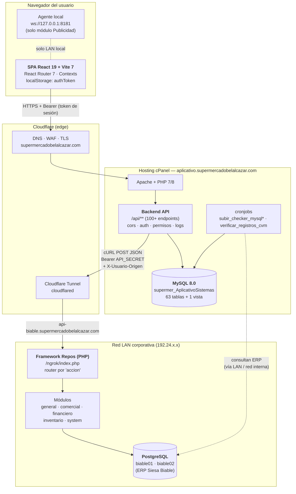
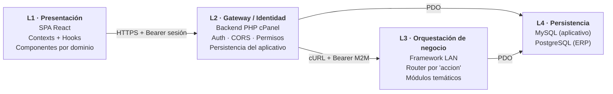
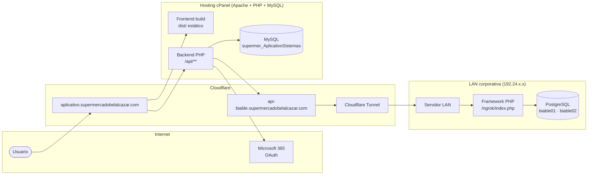
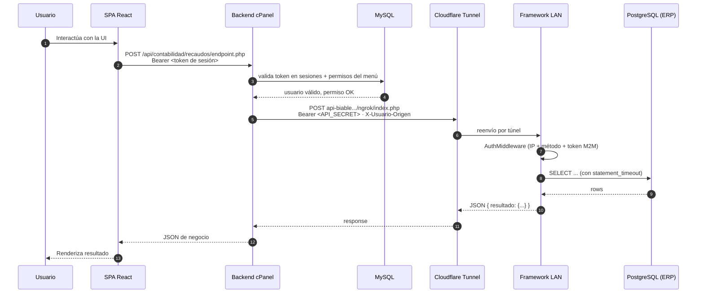

# 02 · Arquitectura General

**Documentación técnica — Aplicativo SEAO**

---

|                      |                                                                                              |
| -------------------- | -------------------------------------------------------------------------------------------- |
| **Documento**        | 02 — Arquitectura General                                                                    |
| **Versión**          | 1.0                                                                                          |
| **Fecha**            | 14 de julio de 2026                                                                          |
| **Depende de**       | `README.md` (índice maestro)                                                                 |
| **Lo usan**          | 03 Backend · 04 Frontend · 05 Framework · 06 Flujo de petición · 07 UML · 08 Infraestructura |
| **Confidencialidad** | Uso interno                                                                                  |

---

## 1 · Objetivo

Establecer una **visión unificada de todo el sistema** a nivel arquitectónico: cuáles son los componentes que lo forman, dónde vive cada uno físicamente, con qué otros se comunica, qué responsabilidad tiene, y con qué protocolo intercambia información. Este documento fija el vocabulario y los diagramas macro que el resto de la documentación reutiliza.

No entra en el detalle interno de cada componente (eso lo hacen los documentos 03, 04, 05 y el conjunto 23-Módulos). Aquí solo se muestra el sistema **como un todo**.

---

## 2 · Descripción global

El aplicativo interno de Supermercados Belalcázar es una **aplicación web de tres capas físicas y cuatro capas lógicas**, publicada en Internet a través de Cloudflare y con un extremo interno privado dentro de la LAN corporativa alcanzado mediante un túnel Cloudflared.

- La **capa 1** es la SPA React que corre en el navegador del usuario.
- La **capa 2** es el backend PHP alojado en cPanel, que actúa como _gateway_ de identidad y como orquestador de todas las llamadas de negocio.
- La **capa 3** es un framework PHP propio ubicado en un servidor dentro de la LAN, que expone un único endpoint de dispatch por acción y accede a las bases de datos del ERP.
- La **capa 4** son las **bases de datos**: MySQL para el aplicativo (en cPanel) y PostgreSQL para el ERP Siesa Biable (en LAN).

Además existen dos actores auxiliares:

- Un **agente local WebSocket** en el PC del usuario para impresión de etiquetas (módulo Publicidad).
- Un **conjunto de cronjobs** en el hosting que replican datos del ERP hacia MySQL.

---

## 3 · Diagrama de arquitectura macro

**Lectura del diagrama.** Todo flujo funcional atraviesa como mínimo tres saltos: navegador → cPanel → LAN. El navegador nunca habla directamente con la LAN; el backend cPanel es siempre el intermediario que decide autenticidad, autorización y logging antes de reenviar la petición al framework interno.

---

## 4 · Componentes y responsabilidades

### 4.1 Tabla resumen

| #   | Componente                             | Ubicación física         | Tecnología                             | Responsabilidad principal                                                                                                                                     | Evidencia                                                                |
| --- | -------------------------------------- | ------------------------ | -------------------------------------- | ------------------------------------------------------------------------------------------------------------------------------------------------------------- | ------------------------------------------------------------------------ |
| C1  | **SPA Frontend**                       | Navegador del usuario    | React 19.2, Vite 7.1, React Router 7.8 | Renderizar UI, gestionar sesión local, ruteo protegido, orquestar llamadas al backend                                                                         | `frontend/package.json`, `frontend/src/App.jsx`, `frontend/src/main.jsx` |
| C2  | **Cloudflare Edge**                    | Internet (edge)          | Cloudflare DNS + WAF + TLS             | Resolver dominio, terminación TLS, protección DDoS/WAF                                                                                                        | Dominios `supermercadobelalcazar.com`, `aplicativo.…`, `api-biable.…`    |
| C3  | **Cloudflare Tunnel**                  | Cloudflare ↔ LAN         | `cloudflared`                          | Publicar el framework LAN sin abrir puertos en la LAN                                                                                                         | `backend/api/config/lan_api.php` (URL `api-biable.…`)                    |
| C4  | **Backend API cPanel**                 | Hosting cPanel           | PHP 7/8, PDO, Apache                   | Autenticación de usuarios, autorización por menú+acción, logging, subida de archivos, envío de correos, generación de PDF/Excel, proxy hacia el framework LAN | `backend/backend/api/**`                                                 |
| C5  | **MySQL del aplicativo**               | cPanel                   | MySQL 8.0.37                           | Persistencia del aplicativo: usuarios, sesiones, permisos, menús, pedidos, actas, visitantes, logs, CVM, plantillas                                           | `mysqlphpmyadmin.sql` (63 tablas)                                        |
| C6  | **Cronjobs**                           | cPanel                   | PHP CLI                                | Replicar/verificar datos ERP hacia MySQL por sede                                                                                                             | `backend/backend/cron/*.php`                                             |
| C7  | **Framework LAN**                      | Servidor interno LAN     | PHP + PDO PostgreSQL                   | Router monolítico por `accion`, ejecuta la lógica de cada acción y consulta al ERP                                                                            | `repo/index.php`, `repo/core/*`, `repo/modules/**`                       |
| C8  | **PostgreSQL del ERP**                 | LAN                      | PostgreSQL                             | Datos maestros del ERP Siesa Biable de dos empresas                                                                                                           | `repo/core/database.php`, `.env` (bases `biable01`, `biable02`)          |
| C9  | **Agente WebSocket local**             | PC del usuario           | WPF C# (según memoria del proyecto)    | Recibir plantillas del frontend e imprimir en Monarch/TSC                                                                                                     | `frontend/.env` (`VITE_WEBSOCKET_AGENT_PRINTER`)                         |
| C10 | **Aplicativo Proveedores** (adyacente) | cPanel — otro subdominio | (fuera del alcance de estos ZIP)       | Portal para proveedores externos                                                                                                                              | CORS allow-list y `api_keys` (registro `aplicativo proveedor`)           |

### 4.2 Detalle por componente

**C1 — SPA Frontend.** Se sirve como estático desde el mismo hosting cPanel gracias al `.htaccess` que reescribe todas las rutas SPA hacia `/index.html`. Su punto único de comunicación con la red es `src/services/api.js`, que a su vez descansa sobre las primitivas de `src/utils/http/*` (`request`, `fetchWithTimeout`, `runResultadoReport`).

**C2 — Cloudflare Edge.** Administra dos dominios visibles públicamente: `aplicativo.supermercadobelalcazar.com` (frontend + backend) y `api-biable.supermercadobelalcazar.com` (framework LAN publicado vía túnel). Toda petición al aplicativo pasa por Cloudflare, incluyendo la petición interna que el backend hace al framework.

**C3 — Cloudflare Tunnel (cloudflared).** Publica el framework LAN sin exponer IP pública ni abrir puertos entrantes en la red corporativa. El backend cPanel resuelve `api-biable.…`, Cloudflare enruta a través del túnel hasta el servidor LAN, y el framework responde por la misma vía.

**C4 — Backend API cPanel.** Es el **único intermediario** entre el navegador y el framework LAN. Sus responsabilidades:

- **CORS y preflight** (`api/middlewares/cors.php`) con allow-list explícito.
- **Autenticación de usuario final** (`api/login.php`, `api/verify_token.php`, `api/middlewares/auth.php`) usando tokens de sesión almacenados en MySQL.
- **Autenticación federada** contra Microsoft 365 (`api/login_microsoft.php`).
- **Autorización granular** por menú y por acción (`api/middlewares/check_permission.php`, `check_role.php`).
- **Persistencia del aplicativo** (usuarios, pedidos, actas, permisos, etc.) contra MySQL local.
- **Reenvío al framework LAN** (`api/services/LanClient.php`) cuando la operación necesita datos del ERP.
- **Envío de correos** (PHPMailer) y **generación de documentos** (TCPDF, FPDF, PhpSpreadsheet, ZipStream).
- **Logging centralizado** (`api/logs/ingest.php`, `api/utils/remote_logger.php`) con fallback local.

**C5 — MySQL del aplicativo.** Base de datos `supermer_AplicativoSistemas` con 63 tablas y 1 vista. Alberga la lógica de negocio propia del aplicativo (no del ERP). El detalle completo del modelo relacional se cubre en el documento 14.

**C6 — Cronjobs.** Se detectan cinco variantes por sede (`subir_checker_mysql.php`, `_2`, `_5`, `_8`, `_11`) y una tarea de verificación (`verificar_registros_cvm.php`). Aún requieren análisis más profundo antes de documentarlos definitivamente (ver README §3.2, item 1).

**C7 — Framework LAN.** Es un router monolítico. Su `index.php` (81 líneas, `repo/index.php`) hace tres cosas: (a) carga los módulos, (b) valida vía `AuthMiddleware::validate()` (método HTTP, IP allow-list, Bearer M2M), y (c) despacha la acción JSON entrante contra una tabla asociativa `$rutas = ['accion' => ['Clase','metodo']]`.

**C8 — PostgreSQL del ERP.** Dos esquemas (`biable01`, `biable02`) representan las dos empresas del grupo. El framework decide contra cuál conectarse en tiempo de ejecución (`Database::getInstance($dbname)`, `repo/core/database.php`).

**C9 — Agente WebSocket local.** Corre en cada PC autorizado. El frontend le envía plantillas de etiquetas ya serializadas en el dialecto que la impresora entiende (MPCL II para Monarch, TSPL2 para TSC), autenticando la conexión con `VITE_TOKEN_AGENT_PRINTER`. No pasa por Cloudflare ni por el backend.

**C10 — Aplicativo Proveedores (adyacente).** No forma parte de los ZIP entregados, pero se lo referencia en:

- `backend/api/middlewares/cors.php` — origen permitido `https://proveedor.supermercadobelalcazar.com`.
- `backend/api/config/database_proveedor.php` — conexión dedicada.
- `mysqlphpmyadmin.sql` → tabla `api_keys` — registro con aplicación `aplicativo proveedor`.

Se documenta como **sistema colindante** en 08-Infraestructura.

---

## 5 · Vista lógica (capas)

Aunque físicamente hay tres capas, la vista lógica del sistema tiene cuatro niveles bien diferenciados:

**Nota sobre la separación L2/L3.** Es intencional y aporta valor de seguridad: el ERP nunca queda expuesto directamente al frontend, ni siquiera transitivamente. Un atacante que comprometa el token de un usuario obtiene lo que ese usuario puede hacer en el aplicativo, no acceso directo al ERP.

---

## 6 · Relaciones y protocolos

### 6.1 Matriz de comunicación

| Origen → Destino               | Protocolo                                    | Autenticación                                                         | Formato                             | Timeout                                        | Evidencia                                                        |
| ------------------------------ | -------------------------------------------- | --------------------------------------------------------------------- | ----------------------------------- | ---------------------------------------------- | ---------------------------------------------------------------- |
| SPA → Backend cPanel           | HTTPS `POST/GET`                             | `Authorization: Bearer <token de sesión>`                             | JSON                                | Configurable por endpoint (`fetchWithTimeout`) | `frontend/src/utils/http/client.js`                              |
| SPA → Agente impresora         | `ws://127.0.0.1:8181`                        | Token en `VITE_TOKEN_AGENT_PRINTER`                                   | JSON con `.PRN` incrustado          | —                                              | `frontend/.env`                                                  |
| Backend cPanel → Framework LAN | HTTPS `POST` (a través de Cloudflare Tunnel) | `Authorization: Bearer <API_SECRET>` + `X-Usuario-Origen: <id-login>` | JSON con `{ "accion": "...", ... }` | 60 s (`LAN_API_TIMEOUT`)                       | `backend/api/services/LanClient.php`                             |
| Framework LAN → PostgreSQL     | PDO `pgsql`                                  | Usuario/pass por BD (`biable01`, `biable02`)                          | SQL                                 | `SET statement_timeout` por consulta pesada    | `repo/core/database.php`                                         |
| Backend cPanel → MySQL         | PDO `mysql`                                  | Usuario/pass en `config/database.php`                                 | SQL                                 | Sin timeout explícito                          | `backend/api/config/database.php`                                |
| Framework LAN → Logs API       | HTTPS `POST`                                 | `X-API-KEY`                                                           | JSON                                | 1500 ms (`CURLOPT_TIMEOUT_MS`)                 | `repo/core/logger.php`                                           |
| Backend cPanel → Microsoft 365 | HTTPS OAuth 2.0                              | Tenant/Client id                                                      | JSON                                | —                                              | `backend/api/login_microsoft.php` (⚠ pendiente lectura profunda) |

### 6.2 Restricciones de red que refuerzan la arquitectura

- **IP allow-list del framework LAN** (`repo/.env` → `ALLOWED_IP`): solo permite peticiones desde IPs conocidas de Cloudflare + oficina + localhost. Un atacante que obtenga `API_SECRET` no puede usarlo desde una IP arbitraria.
- **Método HTTP obligatorio**: el framework LAN solo acepta `POST` (`repo/core/authmiddleware.php::checkMethod`).
- **CORS con allow-list explícito** en el backend cPanel (`backend/api/middlewares/cors.php`).
- **`.htaccess` que niega el acceso directo al `.env`** en el framework LAN (`repo/.htaccess`).

---

## 7 · Vista de despliegue simplificada

El detalle exhaustivo (con IPs, puertos, cronjobs, backups y el aplicativo de proveedores) se aborda en el documento 08.

---

## 8 · Vista de flujo de una petición típica

Se muestra el patrón más frecuente: **usuario consulta un dato del ERP**.

Los flujos alternativos (login local, login Microsoft, subida de archivo, impresión de etiqueta) se detallan en el documento 06.

---

## 9 · Principios arquitectónicos observados

Aunque el proyecto está en migración progresiva a **SRA (Arquitectura Modular)**, ya se identifican principios rectores en el código actual:

1. **Separación estricta entre identidad (L2) y negocio ERP (L3).** El navegador nunca alcanza el ERP, ni siquiera a través de una respuesta transparente. El backend puede aplicar reglas de autorización antes de reenviar.
2. **Único punto de entrada al framework LAN.** Todo el ERP se consulta a través de un archivo (`repo/index.php`) que despacha por acción. Facilita audit-trail y control centralizado.
3. **Reglas de red como primera línea de defensa.** IP allow-list, método HTTP fijo, `.env` fuera del docroot, CORS explícito, Bearer en cada capa. No se depende únicamente del token.
4. **Persistencia dual, propósito claro.** MySQL = "lo del aplicativo", PostgreSQL = "lo del ERP". No hay confusión de responsabilidades.
5. **Cliente HTTP centralizado en el frontend.** Un único `request()` con opciones declarativas (`check`, `unwrap`, `messageKeys`, etc.) evita duplicación y facilita cambiar comportamiento de red global.
6. **Logs centralizados con fallback.** Todos los componentes intentan primero enviar a la API de logs; si falla, escriben localmente.
7. **Convención de módulo frontend consistente**: `hooks/` + `components/` + `utils/` + orquestador delgado. Detectado en los módulos ya refactorizados.

---

## 10 · Referencias cruzadas

| Necesitas saber…                              | Documento                                                   |
| --------------------------------------------- | ----------------------------------------------------------- |
| Detalle interno del backend cPanel            | [03 · Arquitectura Backend](./03-arquitectura-backend.md)   |
| Detalle interno del frontend                  | [04 · Arquitectura Frontend](./04-arquitectura-frontend.md) |
| Cómo funciona el router del framework LAN     | [05 · Framework Interno](./05-framework-interno.md)         |
| Recorrido completo de una petición end-to-end | [06 · Flujo de una Petición](./06-flujo-de-una-peticion.md) |
| Diagramas UML formales                        | [07 · Diagramas UML](./07-diagramas-uml.md)                 |
| Infraestructura (IPs, DNS, puertos, cronjobs) | [08 · Infraestructura](./08-diagramas-infraestructura.md)   |
| Catálogo completo de endpoints                | [09 · APIs](./09-api-endpoints.md)                          |
| Autenticación (usuario + M2M + Microsoft)     | [10 · Autenticación](./10-autenticacion.md)                 |

---

## 11 · Hipótesis y evidencia pendiente

Este documento se apoya únicamente en lo observable en los ZIP y el dump SQL. Los siguientes puntos se declararon como **hipótesis razonables** o **datos no observables**:

- **⚠ Hipótesis:** el frontend `dist/` está servido desde el mismo cPanel que el backend. Evidencia: `backend/.htaccess` reescribe rutas SPA hacia `index.html`, pero el `dist/` no viene en `frontend.zip` (solo el fuente). Se confirma indirectamente porque `VITE_API_BASE_URL` apunta al mismo dominio del backend.
- **⚠ Hipótesis:** el servidor LAN corre CentOS/Rocky Linux. Evidencia indirecta: el logger del framework LAN reporta `aplicacion = 'API_Biable_CentOS'` (`repo/core/logger.php`).
- **No observable:** topología física interna de la LAN (switches, VLANs, direccionamiento completo). Solo se ve el rango `192.24.32.x`/`192.24.33.x` en `cajas.ip`.
- **No observable:** configuración del túnel Cloudflared (archivo `config.yml`, `ingress rules`). Solo se ve el hostname público resultante.

---

<b>Supermercados Belalcázar</b> · Documento 02 — Arquitectura General · v1.0 · 14 de julio de 2026

