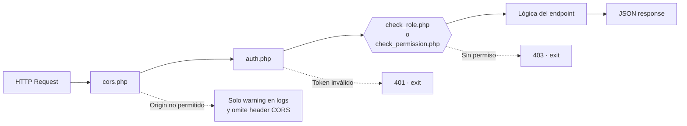
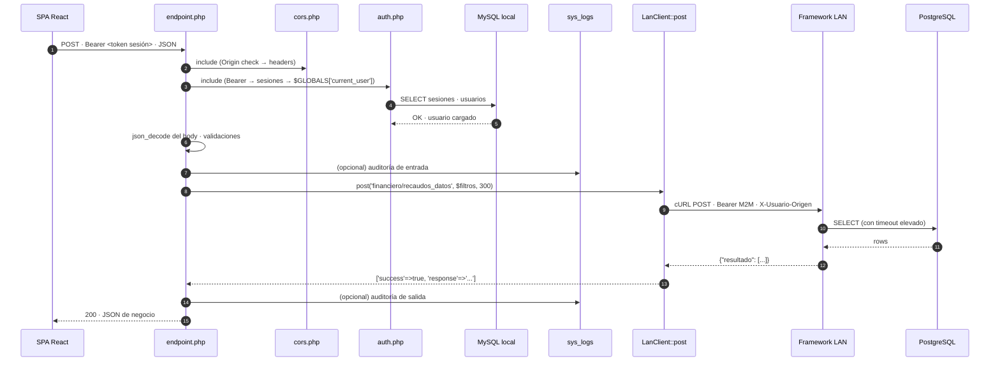
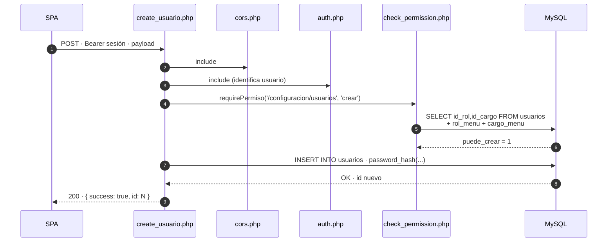

<div align="center">


# 03 · Arquitectura Backend

**Documentación técnica — Aplicativo SEAO**

</div>

---

|                      |                                                                                                             |
| -------------------- | ----------------------------------------------------------------------------------------------------------- |
| **Documento**        | 03 — Arquitectura Backend                                                                                   |
| **Versión**          | 1.0                                                                                                         |
| **Fecha**            | 14 de julio de 2026                                                                                         |
| **Depende de**       | 02 · Arquitectura General · 05 · Framework Interno · 08 · Infraestructura                                   |
| **Lo usan**          | 06 · Flujo de petición · 09 · APIs · 10 · Autenticación · 11 · Autorización · 12 · Seguridad · 23 · Módulos |
| **Confidencialidad** | Uso interno                                                                                                 |

---

## 1 · Objetivo

Documentar la **arquitectura del backend PHP** que corre en el hosting cPanel (`aplicativo.supermercadobelalcazar.com/api/`). Es la capa L2 del sistema: gateway de identidad, controlador de permisos, orquestador de llamadas al framework LAN y persistencia del dominio propio del aplicativo en MySQL.

Aquí se cubren: organización del código, patrones, servicios comunes, modelos, middlewares, utilitarios, dependencias vendorizadas y ciclo de vida de un endpoint típico.

---

## 2 · Ubicación y ejecución

- **Ruta base pública:** `https://aplicativo.supermercadobelalcazar.com/api/**`
- **Servidor:** Apache + PHP 7 u 8 en el hosting cPanel (la duplicación de `mod_php7`/`mod_php8` en `.htaccess` indica soporte para ambas).
- **Modelo de ejecución:** _un archivo `.php` = un endpoint_. Apache resuelve la URL directamente al archivo del filesystem. No hay router central en el backend cPanel (a diferencia del framework LAN).
- **Vida por petición:** cada endpoint incluye sus dependencias (middlewares, config, modelos, utils), atiende la petición, escribe la respuesta y termina. Sin estado en memoria entre requests.

---

## 3 · Estructura de carpetas

```
backend/backend/                        ← docroot Apache (nota: doble anidamiento)
├── .htaccess                           ← SPA-rewrite + cache + límites PHP
├── index.html                          ← entrypoint del SPA compilado
├── logo.svg                            ← branding
├── files/                              ← storage de uploads y CHECKER*.TXT
├── images/                             ← imágenes servidas al aplicativo
├── cron/                               ← cronjobs (ver doc 08)
├── utils/                              ← librerías vendorizadas de terceros
│   ├── PhpSpreadsheet-master/
│   ├── TCPDF-main/
│   ├── ZipStream-PHP-main/
│   ├── fpdf/
│   ├── phpmailer/
│   ├── tc-lib-pdf-main/
│   └── vendor/
└── api/                                ← BACKEND propiamente dicho
    ├── config/                         ← 5 archivos de configuración
    ├── middlewares/                    ← 7 middlewares horizontales
    ├── models/                         ← 9 modelos de dominio
    ├── services/                       ← LanClient + logger (nivel de servicio)
    ├── utils/                          ← 4 utilitarios propios
    ├── logs/ingest.php                 ← receptor de logs central
    ├── login.php · login_microsoft.php · logout.php · verify_token.php · forgot_password.php
    ├── areas/     · cargos/    · sedes/       · usuarios/  · roles/  · perfil/  · proveedores/
    ├── menu/
    ├── carnes/    · fruver/    · compras/     · contabilidad/       · informes/ · inventario/
    ├── seguridad/ · sistemas/  · publicidad/  · lector_precios/
    ├── formularios/
    ├── subida_archivos/
    └── system/
```

**28 subcarpetas de dominio + 6 archivos raíz** para autenticación. Cada carpeta agrupa endpoints por función de negocio.

---

## 4 · Endpoints por dominio (volumen actual)

Conteo real observado de archivos `.php` bajo `api/**` (excluyendo `models`, `middlewares`, `config`, `utils`, `services`):

| Dominio                         | # endpoints | Rol                                                                     |
| ------------------------------- | ----------: | ----------------------------------------------------------------------- |
| `compras/`                      |          20 | Separata, actualización de costos, codificación, permisos de inventario |
| `formularios/`                  |          14 | Formularios web-side de solicitudes (costos, codificación)              |
| `sistemas/`                     |          10 | CVM (formulario + reportes), logs                                       |
| `seguridad/`                    |           8 | Gestión de visitantes                                                   |
| `menu/`                         |           5 | Menús dinámicos + permisos                                              |
| `lector_precios/`               |           5 | Uno por sede (B1, B2, B5, B8, B11)                                      |
| `contabilidad/`                 |           5 | Auditoría DIAN, libro auxiliar, recaudos, planos                        |
| `informes/`                     |           4 | Configuración y consulta de informes                                    |
| `fruver/`                       |           4 | Ítems y pedidos                                                         |
| `carnes/`                       |           4 | Pedidos                                                                 |
| `usuarios/`                     |           3 | CRUD                                                                    |
| `sedes/`                        |           3 | CRUD                                                                    |
| `proveedores/`                  |           3 | CRUD                                                                    |
| `inventario/`                   |           3 | Permisos y utilitarios                                                  |
| `cargos/`                       |           3 | CRUD                                                                    |
| `areas/`                        |           3 | CRUD                                                                    |
| `roles/`                        |           2 | Consulta + acciones por usuario                                         |
| `perfil/`                       |           2 | Ver y actualizar perfil                                                 |
| `system/`                       |           1 | Health-check                                                            |
| `subida_archivos/`              |           1 | Update de inventarios                                                   |
| `publicidad/`                   |           1 | Endpoint de impresora                                                   |
| **Total endpoints funcionales** |   **≈ 104** |                                                                         |

Más los **archivos raíz** (`login.php`, `login_microsoft.php`, `logout.php`, `verify_token.php`, `forgot_password.php`, `logs/ingest.php`) → **≈ 110 endpoints** en producción.

---

## 5 · Patrones estructurales convivientes

Se observan **dos generaciones** de organización de endpoints, ambas activas — evidencia del proceso gradual de migración a SRA que se mencionó en el README.

### 5.1 Patrón A · "un archivo por operación"

**Mayoritario.** Cada operación es un archivo `.php` autónomo.

```
api/usuarios/
├── create_usuario.php
├── get_usuarios.php
└── update_usuario.php

api/carnes/pedidos/
├── get_items.php
├── guardar_item.php
├── guardar_pedido.php
└── verificar_pedido_hoy.php
```

**Ventajas:**

- URL 1:1 con archivo → fácil de encontrar cuando algo falla.
- Cada endpoint declara explícitamente sus dependencias (fácil de auditar).
- Cambios aislados: modificar `get_usuarios.php` no puede romper `create_usuario.php`.

**Desventajas:**

- Duplicación de includes de cabecera (cors + auth + db + logger repetidos ~100 veces).
- Es difícil añadir un middleware transversal sin tocar todos los archivos.

### 5.2 Patrón B · "endpoint consolidado por dominio"

**Emergente.** Un único `endpoint.php` por dominio que despacha internamente por parámetro.

```
api/contabilidad/dian/endpoint.php
api/contabilidad/libro_auxiliar/endpoint.php
api/contabilidad/recaudos/endpoint.php
api/publicidad/printer/endpoint.php
api/system/status/endpoint.php
```

**Ventajas:**

- Middlewares aplicados una sola vez.
- Similar en filosofía al framework LAN → menor sorpresa arquitectónica.
- Facilita el testing con mocks.

**Desventajas:**

- URL ya no revela la operación (hay que leer el JSON del cuerpo).
- Curva de aprendizaje para nuevos desarrolladores.

**Convivencia:** los dos patrones coexisten hoy. En 25 (Refactorización) se recomendará una guía de cuándo usar cada uno.

---

## 6 · Anatomía de un endpoint típico (Patrón A)

Ejemplo canónico basado en múltiples endpoints observados:

```php
<?php
// ── 1) Middlewares transversales ────────────────────────────────
include_once './middlewares/cors.php';        // CORS + preflight
include_once './config/database.php';         // clase Database
include_once './models/user.php';             // modelo(s) necesario(s)
include_once './utils/logger.php';            // logger

// ── 2) Autenticación (side-effect: setea $GLOBALS) ─────────────
// (algunos endpoints usan './middlewares/auth.php' aquí)

// ── 3) Cabecera de respuesta ───────────────────────────────────
header("Content-Type: application/json");

// ── 4) Verificar método HTTP ───────────────────────────────────
if ($_SERVER['REQUEST_METHOD'] !== 'POST') {
    http_response_code(405);
    exit;
}

// ── 5) Recursos: conexión BD + logger ──────────────────────────
$database = new Database();
$db = $database->getConnection();
$logger = new Logger($db, 'Cpanel', 'produccion');

// ── 6) Lectura y validación del payload ────────────────────────
$data = json_decode(file_get_contents("php://input"));
if (empty($data->campo1) || empty($data->campo2)) {
    http_response_code(400);
    echo json_encode(['success' => false, 'message' => '...']);
    exit;
}

// ── 7) Autorización granular (si aplica) ───────────────────────
// requirePermiso('/ruta/menu', 'crear');

// ── 8) Lógica de negocio ───────────────────────────────────────
// (SQL contra MySQL local + posible llamada a LanClient::post)

// ── 9) Respuesta ───────────────────────────────────────────────
http_response_code(200);
echo json_encode(['success' => true, 'data' => $resultado]);
```

Los endpoints reales pueden omitir algunos pasos (según el propósito), pero el orden es siempre el mismo. La estabilidad de este molde facilita añadir endpoints nuevos.

---

## 7 · Middlewares (`api/middlewares/`)

Los middlewares del backend cPanel no siguen el modelo de "pipeline con next()" — son **archivos incluidos** que se autoejecutan y establecen `$GLOBALS` con la información resultante. Simple, pragmático, y suficiente para el volumen actual.

### 7.1 Inventario y responsabilidad

| Archivo                | Efecto al incluirse                                                                                                                                                   | Comentario                                                                                     |
| ---------------------- | --------------------------------------------------------------------------------------------------------------------------------------------------------------------- | ---------------------------------------------------------------------------------------------- |
| `cors.php`             | Verifica `Origin` contra allow-list, escribe headers CORS, responde `200` en preflights `OPTIONS`                                                                     | Allow-list: `localhost:3000`, `localhost:3001`, `aplicativo.…`, `proveedor.…`                  |
| `auth.php`             | Extrae Bearer, valida token en tabla `sesiones`, carga `usuarios`, setea `$GLOBALS['current_user']` y `$GLOBALS['current_rol_id']`. Si falla, responde `401` y `exit` | Punto de entrada de la identidad del usuario                                                   |
| `auth_menu.php`        | Variante de `auth.php` con contexto adicional para operaciones de menús                                                                                               | Requiere lectura profunda                                                                      |
| `check_role.php`       | Valida que `id_rol` del usuario esté en el conjunto permitido para la operación                                                                                       | Autorización por rol                                                                           |
| `check_permission.php` | Autorización **granular** por menú + acción (`ver`/`crear`/`editar`/`eliminar`). Consulta `rol_menu` y `cargo_menu` en cada request (lógica AND: rol Y cargo)         | **Sin bypass para rol 1** — decisión consciente. `break-glass` opcional dejado como comentario |
| `validate_access.php`  | Endpoint estilo Patrón A que valida acceso a una ruta+empresa concretas                                                                                               | Consumido por el frontend para deshabilitar UI                                                 |
| `rate_limit.php`       | Rate limiting por `identifier` (típicamente IP + endpoint) usando archivos JSON en `sys_get_temp_dir()`                                                               | Defaults: 30 req / 60 s. Persistencia en filesystem — no usa Redis                             |

### 7.2 Composición típica



Los tres puntos rojos son **corte inmediato con `exit`**. No hay forma de que un endpoint ejecute lógica sin haber pasado por los middlewares que decidió incluir.

### 7.3 Observación crítica

`auth.php` **actúa por efecto lateral**: al incluirse, ejecuta código de nivel top que instancia `AuthMiddleware`, valida, y publica `$GLOBALS['current_user']`. Si la validación falla, hace `exit` desde el propio archivo.

- **Ventaja:** los endpoints solo tienen que hacer `include 'auth.php'` y ya saben que hay usuario válido después.
- **Desventaja:** difícil de testear en aislamiento; imposible "correr" `auth.php` sin efectos observables. Está identificado como candidato a refactor en 25.

---

## 8 · Modelos (`api/models/`)

Nueve archivos, uno por entidad. Todos siguen el mismo patrón: clase con propiedades públicas, `__construct($db)` que recibe la conexión PDO, y métodos que operan contra su tabla.

| Modelo          | Tabla MySQL                                       | Uso principal                                                        |
| --------------- | ------------------------------------------------- | -------------------------------------------------------------------- |
| `user.php`      | `usuarios` (+ joins a `cargos`, `sedes`, `areas`) | Autenticación, perfil                                                |
| `session.php`   | `sesiones`                                        | Crear/validar/eliminar sesiones (una por usuario)                    |
| `menu.php`      | `menus`, `rol_menu`, `cargo_menu`                 | Menú dinámico + permisos                                             |
| `rol.php`       | `roles`                                           | Consulta y gestión de roles                                          |
| `area.php`      | `areas`                                           | CRUD                                                                 |
| `cargo.php`     | `cargos`                                          | CRUD                                                                 |
| `sede.php`      | `sedes`                                           | CRUD                                                                 |
| `proveedor.php` | `cmproveedores`                                   | CRUD del catálogo de proveedores                                     |
| `provider.php`  | (alternativa)                                     | ⚠ Requiere revisión — posible duplicado histórico de `proveedor.php` |

### 8.1 Patrón "modelo activo simple"

Los modelos no son un ORM. Son clases de acceso a datos con SQL escrito a mano. Ejemplo del modelo `User`:

- **Propiedades públicas** que reflejan columnas + campos de joins (`cargo_nombre`, `sede_nombre`, `area_nombre`).
- **Método `login()`** que hace `JOIN` a `cargos`, `sedes` y `areas`, valida `password_verify()` y `activo == 1`, y devuelve `["success" => true|false, "error" => …]`.

### 8.2 Modelo `Session` — sesión única por usuario

`Session::create` merece atención. Usa `INSERT ... ON DUPLICATE KEY UPDATE`:

```sql
INSERT INTO sesiones (id_usuario, token, fecha_expira)
VALUES (:id_usuario, :token, :fecha_expira)
ON DUPLICATE KEY UPDATE token = :token_update, fecha_expira = :fecha_expira_update
```

**Consecuencia funcional:** cada usuario tiene **una única sesión activa**. Login desde un segundo dispositivo invalida el token del primero (porque `id_usuario` es PK). Esto es una decisión de diseño de seguridad — se documenta explícitamente en 10 (Autenticación).

---

## 9 · Servicios (`api/services/`)

### 9.1 `LanClient.php` — cliente hacia el framework LAN

Único punto donde el backend cPanel habla con el framework LAN. Su implementación consiste en:

1. **Ensamblar el payload** anteponiendo `accion` a los parámetros.
2. **Determinar el usuario originador** desde `$GLOBALS['current_user']` (`id + login`) para el header `X-Usuario-Origen`.
3. **Construir headers**: `Content-Type: application/json`, `Authorization: Bearer LAN_API_TOKEN`, `Content-Length`, y `X-Usuario-Origen`.
4. **cURL POST** con `CURLOPT_CONNECTTIMEOUT = 10 s` y `CURLOPT_TIMEOUT` configurable (default `LAN_API_TIMEOUT = 60 s`).
5. **Traducir errores de red** a `success=false` con `http_code=504` y mensaje descriptivo.
6. **Devolver estructura homogénea** `['success' => bool, 'http_code' => int, 'response' => string]`.

**Contrato para los endpoints que lo consumen:** cualquier endpoint que necesite datos del ERP hace:

```php
require_once __DIR__ . '/../services/LanClient.php';
$result = LanClient::post('financiero/recaudos_datos', $filtros, 300);
if (!$result['success']) { /* manejar timeout / conectividad */ }
$body = json_decode($result['response'], true);
$data = $body['resultado']; // convención del framework LAN
```

### 9.2 `services/logger.php` — logger a nivel de servicio

Instanciable con `$db`, `$aplicacion`, `$entorno`. Escribe en la tabla `sys_logs` (MySQL). Expone métodos `info()`, `warning()`, `error()`, `debug()` que envuelven a `write()`.

Convive con `utils/remote_logger.php` (envía a la misma API central de logs que usa el framework LAN — endpoint `logs/ingest.php`).

**Diferencia clave:**

|            | `services/logger.php`        | `utils/remote_logger.php`       |
| ---------- | ---------------------------- | ------------------------------- |
| Destino    | Tabla MySQL local `sys_logs` | HTTP `POST` a `logs/ingest.php` |
| Latencia   | Baja (misma máquina)         | Sujeta a la red                 |
| Fallback   | `error_log()` PHP            | (⚠ requiere revisión)           |
| Uso típico | Auditoría transaccional      | Logs distribuidos multi-origen  |

---

## 10 · Utilitarios (`api/utils/`)

| Archivo             | Propósito                                                                             |
| ------------------- | ------------------------------------------------------------------------------------- |
| `env_loader.php`    | Carga variables desde archivos `.env` (equivalente al `Env` del framework LAN)        |
| `logger.php`        | Duplicado local del logger — coexiste con `services/logger.php` (⚠ deuda técnica)     |
| `proxy_image.php`   | Sirve imágenes desde `backend/images/` con headers y validación (⚠ requiere revisión) |
| `remote_logger.php` | Cliente HTTP hacia `logs/ingest.php`                                                  |

---

## 11 · Dependencias vendorizadas (`backend/utils/`)

Se distribuyen **por copia directa** (no via Composer). Cada librería está en su carpeta con la estructura del repo original.

| Librería           | Uso                                                      | Alternativa moderna    |
| ------------------ | -------------------------------------------------------- | ---------------------- |
| **PhpSpreadsheet** | Exportar reportes a Excel `.xlsx`                        | Igual (mantener)       |
| **TCPDF**          | Generación de PDF (certificados, comprobantes)           | Igual (mantener)       |
| **tc-lib-pdf**     | PDF alternativo, escala mejor con documentos complejos   | Igual (mantener)       |
| **FPDF**           | PDF ligero (probablemente restos de código antiguo)      | Reemplazable por TCPDF |
| **ZipStream-PHP**  | Streaming de ZIPs para descargas de reportes voluminosos | Igual                  |
| **PHPMailer**      | SMTP saliente vía `mail.…:465`                           | Igual                  |
| **vendor/**        | Carpeta genérica, requiere revisión de contenido         | ⚠ Pendiente            |

⚠ **Recomendación adelantada a 25:** migrar todo `utils/` a Composer para poder actualizar por CVEs sin tocar cada carpeta manualmente. No urgente — el aislamiento actual del hosting minimiza el riesgo.

---

## 12 · Config (`api/config/`)

| Archivo                  | Contenido                                                                         |
| ------------------------ | --------------------------------------------------------------------------------- |
| `database.php`           | Clase `Database` — MySQL principal (`supermer_AplicativoSistemas`)                |
| `database_proveedor.php` | Clase `DatabaseProveedor` — MySQL de proveedores (`supermer_AplicativoProveedor`) |
| `lan_api.php`            | Constantes `LAN_API_URL`, `LAN_API_TOKEN`, `LAN_API_TIMEOUT`                      |
| `correo_config.php`      | Retorna array con host/user/pass/port SMTP                                        |
| `correo_config2.php`     | Variante alterna (⚠ requiere revisión)                                            |

**Deuda observada:** las credenciales están en código PHP (no en `.env`). Se documenta en 12 (Seguridad) y 26 (Deuda Técnica).

---

## 13 · Ciclo de vida completo — endpoint que consulta el ERP

Ejemplo end-to-end: `POST /api/contabilidad/recaudos/endpoint.php`.



Tres BD tocadas en el camino (MySQL para sesión + PostgreSQL para datos + MySQL nuevamente para el log). Cada capa registra su propio segmento.

---

## 14 · Ciclo de vida — endpoint puramente local (sin LAN)

Ejemplo: `POST /api/usuarios/create_usuario.php`.



**Endpoints como este nunca cruzan el túnel Cloudflared.** Todo se resuelve en cPanel.

---

## 15 · Escritura vs lectura — separación observable

De los ≈110 endpoints, ~85% son **lectura** o **operaciones locales del aplicativo**. Solo un puñado hace _"escritura al ERP"_ — todas pasan por `LanClient::post` y la única acción de escritura registrada en el framework LAN es `financiero/auditoria_dian_config_guardar` (ver documento 05 §11).

**Consecuencia arquitectónica importante:** el backend cPanel es fuente de verdad del **estado del aplicativo** (usuarios, sesiones, permisos, pedidos, actas, etc.), mientras que el ERP sigue siendo fuente de verdad del **estado contable/comercial**. No hay ambigüedad sobre "quién manda".

---

## 16 · Fortalezas del diseño

- **Un archivo = un endpoint** simplifica la depuración por reproducción.
- **Middlewares como includes** son fáciles de leer y de auditar sin conocer un framework.
- **`LanClient` centraliza** toda la comunicación con el ERP en un único punto.
- **Sesión única por usuario** (`INSERT ON DUPLICATE KEY UPDATE`) evita fugas de tokens residuales.
- **Rate limiting propio** sin dependencia de Redis/Memcached.
- **Persistencia de logs en tabla `sys_logs`** habilita queries analíticas.
- **`check_permission` sin bypass automático** obliga a configurar permisos incluso para el superadmin (política estricta).

---

## 17 · Debilidades y deuda identificada

| #   | Debilidad                                                                       | Impacto                                                           | Documento donde se profundiza |
| --- | ------------------------------------------------------------------------------- | ----------------------------------------------------------------- | ----------------------------- |
| 1   | Credenciales de BD y SMTP hardcodeadas                                          | Riesgo si el repo se filtra                                       | 12, 26                        |
| 2   | `auth.php` actúa por efecto lateral                                             | Difícil de testear en aislamiento                                 | 25                            |
| 3   | Duplicación entre `services/logger.php` y `utils/logger.php`                    | Confusión sobre cuál usar                                         | 26                            |
| 4   | Cinco archivos `lector_precios/get_producto_b*.php` casi idénticos              | Cambios requieren 5 ediciones                                     | 25                            |
| 5   | Cinco cronjobs `subir_checker_mysql*.php` idénticos por sede                    | Idem                                                              | 25                            |
| 6   | Duplicidad `models/proveedor.php` vs `models/provider.php`                      | Ambigüedad                                                        | 26                            |
| 7   | Dependencias vendorizadas sin gestor                                            | Actualización manual por CVEs                                     | 25                            |
| 8   | Endpoints raíz mezclados con carpetas (`login.php` afuera, `usuarios/` adentro) | Inconsistencia estructural                                        | 22 (Convenciones)             |
| 9   | Rate limit basado en archivos en `sys_get_temp_dir()`                           | Compartido entre procesos, pero limpiable por sysadmin sin querer | 25                            |
| 10  | No hay OpenAPI/Swagger — el contrato de cada endpoint solo está en su código    | Onboarding lento                                                  | 09 (APIs) hace el catálogo    |

---

## 18 · Puntos que requieren análisis más profundo

- **`login_microsoft.php`** — flujo OAuth 2.0 con Microsoft 365. Aún no se ha leído a fondo. Necesario para completar 10.
- **`auth_menu.php`** — variante de `auth.php`. Se sospecha que carga info adicional del menú para reducir queries del frontend. Requiere lectura.
- **`models/provider.php`** vs `models/proveedor.php` — verificar cuál está en uso.
- **`utils/vendor/`** — inventariar contenido.
- **`utils/proxy_image.php`** — revisar controles de seguridad (path traversal, whitelisting).
- **`correo_config2.php`** — determinar cuándo se usa vs `correo_config.php`.
- **`sistemas/cvm/*`** y **`sistemas/logs/*`** — módulos completos aún por documentar (irán a 23).

---

## 19 · Referencias cruzadas

| Necesitas saber…                                      | Documento                                                   |
| ----------------------------------------------------- | ----------------------------------------------------------- |
| Vista macro y capas                                   | [02 · Arquitectura General](./02-arquitectura-general.md)   |
| SPA que consume estos endpoints                       | [04 · Arquitectura Frontend](./04-arquitectura-frontend.md) |
| Framework LAN al que llama `LanClient`                | [05 · Framework Interno](./05-framework-interno.md)         |
| Diagrama end-to-end de una request                    | [06 · Flujo de una Petición](./06-flujo-de-una-peticion.md) |
| Catálogo completo de endpoints (con params y errores) | [09 · APIs](./09-api-endpoints.md)                          |
| Autenticación en detalle                              | [10 · Autenticación](./10-autenticacion.md)                 |
| Autorización granular por menú/acción                 | [11 · Autorización](./11-autorizacion.md)                   |
| Seguridad de red y credenciales                       | [12 · Seguridad](./12-seguridad.md)                         |
| Modelo relacional MySQL                               | [14 · Base de Datos](./14-base-de-datos.md)                 |

---

<div align="center">
<sub><b>Supermercados Belalcázar</b> · Documento 03 — Arquitectura Backend · v1.0 · 14 de julio de 2026</sub>
</div>
