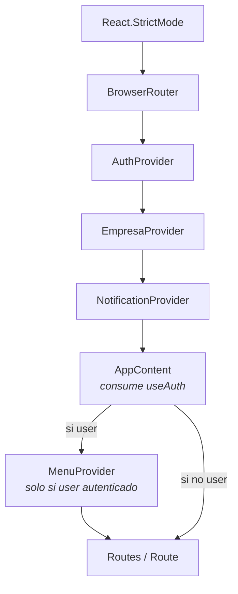
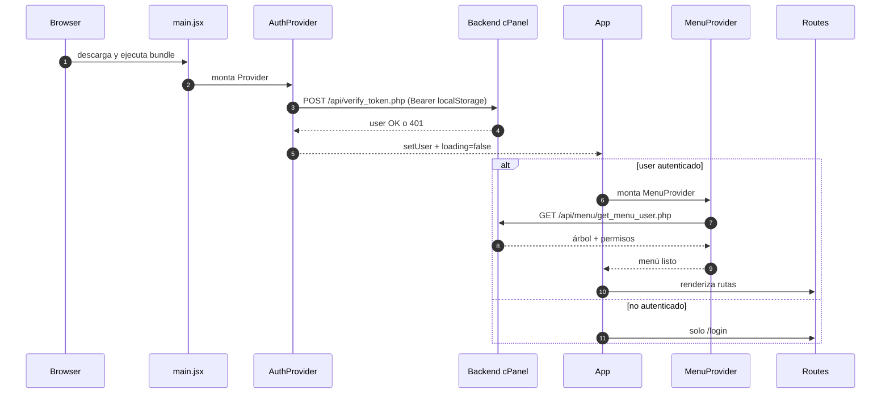
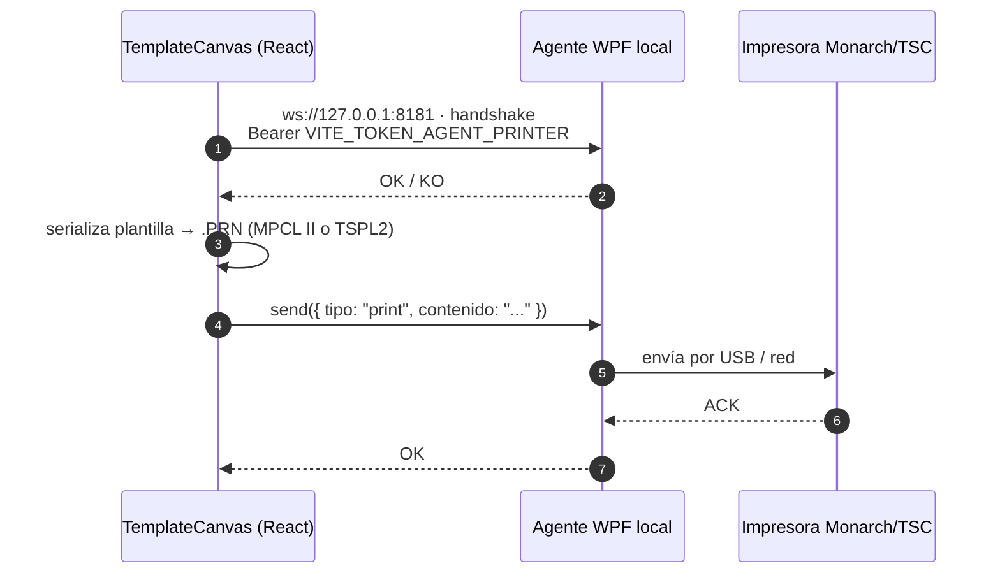

<div align="center">


# 04 · Arquitectura Frontend

**Documentación técnica — Aplicativo SEAO**

</div>

---

|                      |                                                                                                                |
| -------------------- | -------------------------------------------------------------------------------------------------------------- |
| **Documento**        | 04 — Arquitectura Frontend                                                                                     |
| **Versión**          | 1.0                                                                                                            |
| **Fecha**            | 14 de julio de 2026                                                                                            |
| **Depende de**       | 02 · Arquitectura General · 03 · Arquitectura Backend                                                          |
| **Lo usan**          | 06 · Flujo de petición · 09 · APIs · 10 · Autenticación · 11 · Autorización · 22 · Convenciones · 23 · Módulos |
| **Confidencialidad** | Uso interno                                                                                                    |

---

## 1 · Objetivo

Documentar la arquitectura del **frontend SPA** que corre en el navegador del usuario: stack, organización, componentes, hooks, contextos, servicios, capa HTTP centralizada, ruteo, estado global, ciclo de renderizado y patrones de composición.

Es la capa L1 del sistema, publicada en `https://aplicativo.supermercadobelalcazar.com/` y servida como estático desde el mismo hosting cPanel que el backend.

---

## 2 · Stack tecnológico

Fuente: `frontend/package.json`.

### 2.1 Núcleo

| Dependencia                    | Versión               | Rol                               |
| ------------------------------ | --------------------- | --------------------------------- |
| **React**                      | `^19.2.1`             | Framework de UI                   |
| **React DOM**                  | `^19.2.1`             | Renderer navegador                |
| **React Router DOM**           | `^7.8.2`              | Ruteo declarativo                 |
| **Vite**                       | `^7.1.2`              | Bundler + dev server              |
| **@vitejs/plugin-react**       | `^5.0.0`              | Fast Refresh + JSX                |
| **vite-plugin-imagemin**       | `^0.6.1`              | Optimización de imágenes en build |
| **vite-plugin-css-modules**    | `^0.0.1`              | Soporte de CSS Modules            |
| **core-js** / **whatwg-fetch** | `^3.47.0` / `^3.6.20` | Polyfills                         |

### 2.2 UI e interacción

| Dependencia                                                                   | Rol                             |
| ----------------------------------------------------------------------------- | ------------------------------- |
| **lucide-react** `^0.544.0`                                                   | Íconos SVG (uso mayoritario)    |
| **react-icons** `^5.5.0`                                                      | Colección alternativa de íconos |
| **@fortawesome/react-fontawesome** `^3.0.2` + `free-solid-svg-icons` `^7.0.1` | FontAwesome (uso puntual)       |
| **framer-motion** `^12.23.22`                                                 | Animaciones declarativas        |
| **react-transition-group** `^4.4.5`                                           | Transiciones CSS legacy         |

### 2.3 Documentos y exportación

| Dependencia                                       | Rol                                     |
| ------------------------------------------------- | --------------------------------------- |
| **exceljs** `^4.4.0` + **xlsx** `^0.18.5`         | Exportar reportes a `.xlsx`             |
| **jspdf** `^3.0.4` + **jspdf-autotable** `^5.0.2` | Generar PDFs client-side                |
| **html2canvas** `^1.4.1`                          | Snapshots del DOM para incrustar en PDF |
| **react-to-print** `^3.2.0`                       | Impresión de secciones específicas      |
| **file-saver** `^2.0.5`                           | Descarga de blobs generados             |

### 2.4 Captura y decodificación

| Dependencia                                                | Rol                                           |
| ---------------------------------------------------------- | --------------------------------------------- |
| **react-webcam** `^7.2.0`                                  | Captura de webcam (visitantes, CVM)           |
| **browser-image-compression** `^2.0.2`                     | Compresión antes de subir                     |
| **@zxing/browser** `^0.1.5` + **@zxing/library** `^0.21.3` | Escaneo de códigos de barras (Lector Precios) |
| **html5-qrcode** `^2.3.8`                                  | QR scanning alternativo                       |
| **jsqr** `^1.4.0`                                          | QR scanning nativo canvas                     |
| **quagga** `^0.12.1`                                       | Barcode alternativo legacy                    |

### 2.5 Notas del stack

- **Sin TypeScript.** El proyecto usa JSX + JS con `@types/react` como devDep para el editor.
- **Sin gestor de estado global externo** (Redux/Zustand/Jotai). El estado se maneja con **React Context + hooks**.
- **Sin libería de formularios** tipo React Hook Form. Los formularios usan `useState` + validación manual.
- **Múltiples librerías para el mismo problema** (íconos ×3, barcode ×4, PDF client-side ×3). Se documenta en 26.

---

## 3 · Configuración de build (`vite.config.js`)

Puntos destacables:

- **`server.port = 3000`**, `open: true`, `host: true` (accesible desde red LAN durante desarrollo).
- **`build.outDir = 'dist'`**, `assetsDir = 'assets'`.
- **`rollupOptions.manualChunks.vendor = ['react', 'react-dom']`** → chunk separado para el núcleo React.
- **Aliases**: `'@' → /src`, `'@components' → /src/components`.
- **`css.modules`** activado con `localsConvention: 'camelCase'` y `generateScopedName: '[name]__[local]___[hash:base64:5]'` — imports como `import styles from './Foo.module.css'` funcionan y el resultado es aislado por componente.
- **`vite-plugin-imagemin`** optimiza gif/png/jpg/svg en build (calidad JPEG 80%, PNG level 7).

---

## 4 · Estructura de carpetas (`frontend/src/`)

```
src/
├── main.jsx                    ← bootstrap: providers globales + BrowserRouter
├── App.jsx                     ← declaración de rutas (protegidas y públicas)
├── App.css · index.css         ← estilos globales
│
├── assets/                     ← imágenes y estáticos importados en código
├── contexts/                   ← 4 contextos globales
│   ├── AuthContext.jsx
│   ├── EmpresaContext.jsx
│   ├── MenuContext.jsx
│   └── NotificationContext.jsx
│
├── hooks/                      ← 3 hooks reutilizables
│   ├── useAuth.js              (re-export de AuthContext)
│   ├── useDynamicMenu.js       (carga y refresca el árbol de menús)
│   └── usePermission.js        (verificación granular de permisos)
│
├── services/                   ← 4 archivos de servicio
│   ├── api.js                  ← fachada única (~1580 líneas)
│   ├── api.js.back             ← respaldo previo al refactor (deuda menor)
│   ├── menuService.js
│   └── roleService.js
│
├── utils/                      ← utilitarios propios
│   └── http/                   ← capa HTTP centralizada (7 archivos)
│       ├── config.js           ← API_BASE_URL desde import.meta.env
│       ├── ApiError.js         ← clase de error tipada
│       ├── headers.js          ← buildHeaders + getToken
│       ├── url.js              ← buildUrl (base + query params)
│       ├── parse.js            ← pickMessage · unwrapResultado · unwrapReturn
│       ├── client.js           ← request · fetchWithTimeout · runResultadoReport
│       └── index.js            ← barrel export
│
└── components/                 ← todos los componentes de UI
    ├── AdminPanel/  · Auth/  · Carnes/  · Compras/  · Contabilidad/
    ├── DashBoard/   · Fruver/ · Informes/ · Inventario/ · Layout/
    ├── LectorPrecios/  · Perfil/  · Publicidad/  · Routing/
    ├── Seguridad/   · Sistemas/  · Solicitudes/  · UI/
```

**19 subcarpetas de componentes**, organizadas por dominio (no por tipo).

---

## 5 · Bootstrap (`main.jsx`)

Cuatro niveles de providers anidados:

```jsx
<React.StrictMode>
  <BrowserRouter>
    <AuthProvider>
      <EmpresaProvider>
        <App /> {/* <App> monta <NotificationProvider> y <MenuProvider> */}
      </EmpresaProvider>
    </AuthProvider>
  </BrowserRouter>
</React.StrictMode>
```

Y dentro de `App.jsx`:

```jsx
<NotificationProvider>
  <AppContent /> {/* AppContent monta <MenuProvider> tras autenticar */}
</NotificationProvider>
```

### 5.1 Diagrama de composición de providers



### 5.2 Por qué ese orden

- **BrowserRouter primero:** `AuthContext` usa `useNavigate()` para redirigir a `/login` en logout.
- **AuthProvider antes que Empresa/Menu:** ambos dependen del usuario autenticado.
- **NotificationProvider en `<App>`, no en `main.jsx`:** decisión de encapsulamiento — las notificaciones son responsabilidad de `App`, no del bootstrap.
- **MenuProvider dentro de `<AppContent>` y **solo tras autenticar**:** evita hacer `get_menu_user.php` para visitantes sin sesión.

---

## 6 · Contextos globales

### 6.1 `AuthContext.jsx` — sesión del usuario

Responsabilidades:

- **Estado**: `user`, `loading`, `error`.
- **`login(credentials)`** — llama `apiService.login`, persiste `authToken` y `userRole` en `localStorage`, setea `user`.
- **`logout(message, redirect)`** — invalida en servidor, limpia `localStorage` y `sessionStorage`, redirige a `/login`.
- **`verifyToken()`** — al montar la app, verifica el token guardado contra `verify_token.php`.
- **`userRef`** — `useRef` para exponer el usuario sin causar re-renders (usado por handlers de red).

**Persistencia**: `localStorage.authToken`, `localStorage.userRole`, `sessionStorage.hasRedirectedThisSession`.

### 6.2 `EmpresaContext.jsx` — empresa activa (Abastecemos / Tobar)

Determina cuál de las dos empresas del grupo se consulta al ERP. El valor viaja al backend en el payload (`{ empresa: 'abastecemos' | 'tobar' }`) y de ahí al framework LAN, que lo traduce a `biable01` / `biable02` (ver 05 §6). La UI muestra un selector — cambiar de empresa cambia todo lo que se consulta.

### 6.3 `MenuContext.jsx` — árbol de menús + permisos

**Punto arquitectónico importante.** Este contexto carga el árbol de menús (y los permisos granulares embebidos) **una sola vez por sesión** y lo distribuye a toda la app. Ver `frontend/src/contexts/MenuContext.jsx`:

> _"Evita que cada componente que necesite permisos vuelva a pedir `get_menu_user.php` por su cuenta."_

Bajo el capó envuelve al hook `useDynamicMenu`, que:

- Al montar, llama `menuService.getMenuUser()` → `GET /api/menu/get_menu_user.php`.
- Recibe un árbol con nodos `{ nombre, ruta, icono, children, puede_ver, puede_crear, puede_editar, puede_eliminar }`.
- Expone búsqueda recursiva `buscarNodoRecursivo`, `tieneAccesoARuta`, `obtenerPermisosPorRuta`.
- **Refresca en background cada 60 s** (según lo consignado en el contexto del proyecto), habilitando revocación de permisos en vivo.

### 6.4 `NotificationContext.jsx` — notificaciones toast

- Estado: `notifications[]`.
- API: `addNotification({ type, message })`, `removeNotification(id)`.
- Auto-remove tras un `setTimeout`.
- Se renderiza vía `<NotificationContainer />` en `App.jsx`.

Uso: cualquier componente hace `useNotification().addNotification({ type: 'error', message: '...' })`.

---

## 7 · Hooks propios

### 7.1 `useAuth.js` — re-export de conveniencia

Un archivo de una línea que re-exporta `useAuth` desde `AuthContext`. Existe por convención: los componentes importan hooks desde `hooks/`, no desde `contexts/`.

### 7.2 `useDynamicMenu.js` — carga del árbol

Motor de `MenuContext`. Consume `menuService` + `roleService` (endpoints backend `menu/get_menu_user.php` y `roles/get_acciones_usuario.php`).

Expone:

- `menu` — árbol jerárquico.
- `userInfo` — info del usuario enriquecida.
- `acciones` — separadas en `accionesRapidas[]` y `funcionalidadesEspeciales[]`.
- `loading`, `error`.
- Utilities: `buscarNodoRecursivo`, `tieneAccesoARuta`.

### 7.3 `usePermission.js` (aka `usePermisos`) — verificación granular

Hook único de permisos con dos modos:

- **Modo síncrono (default):** lee del árbol ya cargado en `MenuContext`, cero fetches.
- **Modo autoritativo (`verificarServidor: true`):** consulta `/api/middlewares/validate_access.php` con la ruta + empresa, útil para guards estrictos.

Devuelve `{ permisos: { ver, crear, editar, eliminar }, puedeVer, puedeCrear, puedeEditar, puedeEliminar, hasAccess, loading, error, ruta }`.

**La ruta se resuelve sola con `useLocation()`**, aunque puede forzarse otra con `rutaManual`.

---

## 8 · Servicios (`src/services/`)

### 8.1 `api.js` — fachada única

Es el **único punto** donde el resto del código hace llamadas al backend. ~1580 líneas.

Estructura interna:

```javascript
// Wrappers locales que fuerzan auth: "required" en toda la app
const buildHeaders = (opts = {}) =>
  originalBuildHeaders({ ...opts, auth: "required" });
const request = (url, opts = {}) =>
  originalRequest(url, { ...opts, auth: "required" });

export const apiService = {
  // AUTENTICACION
  async login(credentials) {
    /* ... */
  },
  async verifyToken(token) {
    /* ... */
  },
  async logout(token) {
    /* ... */
  },

  // ADMIN
  async getUsuarios() {
    /* ... */
  },
  async createUsuario(data) {
    /* ... */
  },
  async updateUsuario(id, data) {
    /* ... */
  },

  // ...decenas de métodos agrupados por dominio...
};
```

**Convenciones observadas:**

- Todos los métodos son `async`.
- Reutilizan `request()` de `utils/http/client.js` para el caso mayoritario.
- Casos especiales (login con lectura de texto, subida por chunks, blob download, reportes con timeout largo) usan las primitivas HTTP directamente (`buildUrl`, `buildHeaders`, `fetchWithTimeout`, `runResultadoReport`).
- Nombres de método reflejan la operación de negocio (`obtenerRecaudos`, `guardarPedidoCarnes`), no el endpoint.

### 8.2 `menuService.js` — atajo para menús

Servicio dedicado a los endpoints de menú. Podría haber estado en `api.js` — se separó porque tiene requerimientos de refresco periódico y caché diferenciados.

### 8.3 `roleService.js` — atajo para roles/acciones

Idem para consultas de rol.

### 8.4 `api.js.back` — respaldo pre-refactor

Legado del refactor del `api.js` centralizado. Es deuda menor (ver 26).

---

## 9 · Capa HTTP centralizada (`utils/http/`)

Es una de las **piezas mejor diseñadas** del proyecto y una migración reciente exitosa.

### 9.1 Módulos

| Archivo       | Exporta                                                            | Rol                                                          |
| ------------- | ------------------------------------------------------------------ | ------------------------------------------------------------ |
| `config.js`   | `API_BASE_URL`                                                     | Base URL desde `import.meta.env.VITE_API_BASE_URL`           |
| `ApiError.js` | `ApiError`                                                         | Error tipado (extiende `Error`, guarda `status` y `payload`) |
| `headers.js`  | `buildHeaders`, `getToken`                                         | Construye headers con token opcional                         |
| `url.js`      | `buildUrl`                                                         | Concatena base + path + query params                         |
| `parse.js`    | `pickMessage`, `unwrapResultado`, `unwrapReturn`, `readTextAsJson` | Estrategias de desempaquetado del JSON                       |
| `client.js`   | `fetchWithTimeout`, `request`, `runResultadoReport`                | Primitivas de red                                            |
| `index.js`    | barrel export                                                      | Punto único de import                                        |

### 9.2 La función `request()` — declarativa

Firma:

```javascript
request(path, {
  method, // "GET" | "POST" | ...
  params, // query string
  body, // objeto → JSON, FormData → multipart
  auth, // "required" | "optional" | "none"
  tokenArg, // token explícito
  requireToken, // exigir token o lanzar
  contentTypeJson, // default true (excepto FormData)
  accept, // fija Accept
  headers, // extras
  statusMessages, // { 403: "..." } evaluado ANTES de parsear
  check, // "success" | "ok" | "ok+success" | "error-field" | "none"
  messageKeys, // dónde buscar el mensaje de error
  errorMessage, // fallback
  okBeforeParse, // validar response.ok ANTES de leer cuerpo
  okErrorMessage, // mensaje si okBeforeParse falla
  unwrap, // "json" | "resultado" | "return"
});
```

**Ventaja clave:** un solo lugar concentra las decisiones de "cuándo hay error", "cómo se llama el mensaje", "cómo se desempaqueta el resultado". Los ~110 endpoints se consumen con opciones declarativas — el 95% cae en el caso por defecto.

### 9.3 `fetchWithTimeout` — abortos coordinados

Envuelve `fetch` para:

- Cortar por timeout con un `AbortController` interno.
- Encadenar un `AbortSignal` externo (útil si el componente se desmonta).
- No mapear `AbortError` a un mensaje concreto — lo delega al llamante (los mensajes varían por endpoint).

### 9.4 `runResultadoReport` — atajo para reportes pesados

Especializado para el patrón "framework LAN devuelve `{ resultado: {...} }` tras varios minutos". Usa `fetchWithTimeout` con timeouts largos + `unwrapResultado` automático + traducción de `AbortError` a un mensaje amigable.

Consumido por `obtenerReporteRecaudos`, `obtenerDatosAuxiliar` y similares.

---

## 10 · Ruteo (`App.jsx`)

### 10.1 Filosofía

Todas las rutas se declaran **explícitamente** en `App.jsx`. No hay lazy loading, no hay generación dinámica desde el árbol de menú. El menú del sidebar es dinámico (viene de `MenuContext`), pero las rutas son estáticas.

### 10.2 Patrón de ruta protegida

```jsx
<Route
  path="/contabilidad/recaudos"
  element={
    <PrivateRoute>
      <Layout>
        <Recaudos />
      </Layout>
    </PrivateRoute>
  }
/>
```

Cada ruta lleva **tres capas de envoltorio**: `PrivateRoute` (auth guard) → `Layout` (sidebar + topbar) → componente.

### 10.3 Rutas públicas (sin `PrivateRoute` ni `Layout`)

- `/login` — pantalla de login.
- `/LectorPrecios`, `/LectorPrecios2/5/8/11` — quioscos de consulta de precios en sedes.

Los lectores de precios son intencionalmente **sin auth** porque son terminales físicos accesibles por cualquier cliente en tienda (ver 23-LectorPrecios).

### 10.4 Redirect catch-all

```jsx
<Route
  path="*"
  element={<Navigate to={user ? "/inicio" : "/login"} replace />}
/>
```

Cualquier URL desconocida redirige a inicio o a login según autenticación.

### 10.5 Rutas por dominio (extracto)

| Prefijo                    | Sub-rutas                                                                                           | Componente raíz |
| -------------------------- | --------------------------------------------------------------------------------------------------- | --------------- |
| `/inicio`                  | (dashboard)                                                                                         | `Dashboard`     |
| `/perfil`                  | (perfil de usuario)                                                                                 | `PerfilUsuario` |
| `/configuracion/**`        | `menus`, `sedes`, `areas`, `cargos`, `usuarios`, `proveedores`, `actualizar_inventario`, `informes` | Admin Panel     |
| `/fruver/**`               | `admin_items`, `pedidos`                                                                            | Fruver          |
| `/carnes/**`               | `pedidos`                                                                                           | Carnes          |
| `/compras/**`              | `separata`, `actualizacion_costos`, `codificacion_productos`, `permisos_inventario`                 | Compras         |
| `/contabilidad/**`         | `planos_contables`, `libro_auxiliar`, `recaudos`, `prefijos_dian`                                   | Contabilidad    |
| `/sistemas/**`             | `logs`, `cvm`, `reportes_cvm`                                                                       | Sistemas        |
| `/seguridad/**`            | `visitantes`                                                                                        | Seguridad       |
| `/publicidad/**`           | (canvas de impresión)                                                                               | Publicidad      |
| `/informes`                | (informes financieros)                                                                              | Informes        |
| `/inventarios/reportes/**` | `averias`, `bodegas_alternas`, `existencias_costos`                                                 | Inventario      |
| `/LectorPrecios*`          | 5 variantes por sede                                                                                | Lector Precios  |

---

## 11 · Componentes — patrón "thin orchestrator"

En los módulos ya refactorizados (`LibroAuxiliar`, `Recaudos`, `PedidosFruver`, `FormularioPedidos`, `ExistenciasAverias`, `TemplateCanvas`, `LectorPrecios`, según el contexto del proyecto), se observa una estructura consistente:

```
components/Contabilidad/Recaudos/
├── Recaudos.jsx                ← orquestador ligero (renderiza)
├── hooks/                      ← lógica de estado y red
│   ├── useRecaudosData.js
│   └── useRecaudosFiltros.js
├── components/                 ← subcomponentes
│   ├── FiltrosPanel.jsx
│   ├── ResultadosTabla.jsx
│   └── AccionesBar.jsx
└── utils/                      ← helpers puros
    └── formatoRecaudos.js
```

**Principios:**

- El orquestador es "delgado": llama a los hooks, arma la UI, no contiene lógica de negocio.
- La lógica vive en `hooks/`.
- La composición visual vive en `components/`.
- Los helpers puros (formato, validación, cálculo) viven en `utils/`.

Este patrón se está aplicando gradualmente a los módulos restantes.

---

## 12 · Sistema de diseño ("Apple-inspired")

Del contexto del proyecto y de estilos observados, el aplicativo sigue una convención visual homogénea:

| Elemento                  | Valor                                                                    |
| ------------------------- | ------------------------------------------------------------------------ |
| Fondo base                | `#f5f5f7`                                                                |
| Color corporativo         | `#03996b`                                                                |
| Tipografía                | `-apple-system, BlinkMacSystemFont, "Segoe UI", …`                       |
| Border-radius de tarjetas | `16px`                                                                   |
| Inputs                    | Floating label con patrón de "notch"                                     |
| Loading                   | `<LoadingScreen isVisible title subtitle variant="fullscreen" />` global |

`components/UI/` centraliza los primitivos reutilizables (LoadingScreen, NotificationContainer, botones, modales, etc.).

---

## 13 · Ciclo de renderizado

### 13.1 Arranque frío



### 13.2 Refresco periódico de menú (60 s)

`useDynamicMenu` mantiene un `setInterval` que revalida el árbol contra el backend. Si un administrador revoca un permiso, el usuario afectado lo pierde en la vista dentro de un minuto sin cerrar sesión. Persiste el árbol previo mientras el fetch está en vuelo, evita parpadeos.

### 13.3 Cambio de empresa

Cuando el usuario cambia entre Abastecemos y Tobar (`EmpresaContext`):

1. Se actualiza el valor del contexto.
2. Cualquier componente que dependa de `empresa` re-renderiza.
3. Los hooks que hacen fetch (p. ej. `useRecaudosData`) tienen `empresa` en su array de dependencias y disparan nuevo fetch automáticamente.
4. La respuesta llega con datos de `biable02` en lugar de `biable01`.

Este flujo funciona **sin recargar la página** y sin invalidar la sesión.

---

## 14 · Manejo de errores en el frontend

### 14.1 Cadena de captura

```
apiService.metodo()  →  request() (utils/http/client.js)  →  lanza ApiError
                                                              ↓
                                    hook (useAuth, useRecaudosData, ...) captura
                                                              ↓
                              addNotification({ type:'error', message })
                                                              ↓
                                        NotificationContainer renderiza toast
```

### 14.2 `ApiError` como error tipado

Consumidores pueden inspeccionar:

```javascript
try {
  await apiService.obtenerRecaudos(filtros);
} catch (err) {
  if (err instanceof ApiError && err.status === 403) {
    addNotification({
      type: "warning",
      message: "Sin permiso para esta operación",
    });
  } else {
    addNotification({ type: "error", message: err.message });
  }
}
```

### 14.3 Sesión expirada

`AuthContext.verifyToken` detecta 401 en la primera llamada tras montar la app y hace `logout("Sesión expirada")` con mensaje. `PrivateRoute` redirige inmediatamente a `/login`.

Si el 401 ocurre a mitad de sesión (token invalidado por login de otro dispositivo, ver §8 doc 03), el manejo depende de cada hook — algunos ya llaman `logout` explícitamente. Se recomienda centralizarlo en `request()` (deuda documentada en 25).

---

## 15 · Variables de entorno frontend (`frontend/.env`)

| Variable                       | Rol                                       | Sensibilidad                                    |
| ------------------------------ | ----------------------------------------- | ----------------------------------------------- |
| `VITE_API_BASE_URL`            | URL base del backend cPanel               | Baja (público al ser build de Vite)             |
| `VITE_MICROSOFT_TENANT_ID`     | Tenant Azure AD                           | Baja (público)                                  |
| `VITE_MICROSOFT_CLIENT_ID`     | Client ID de la app registrada            | Baja (público)                                  |
| `VITE_MICROSOFT_REDIRECT_URI`  | Redirect URI OAuth                        | Baja (público)                                  |
| `VITE_LECTOR_PASSWORD`         | Password para acceso al lector de precios | **⚠ ALTA — hoy queda embebida en el bundle JS** |
| `VITE_WEBSOCKET_AGENT_PRINTER` | URL del agente de impresora local         | Media (revela un puerto local)                  |
| `VITE_TOKEN_AGENT_PRINTER`     | Token del agente de impresora             | **⚠ ALTA — hoy queda embebida en el bundle JS** |

**Observación crítica:** todo lo que empieza con `VITE_` **queda embebido en el bundle** distribuido al navegador. `VITE_LECTOR_PASSWORD` y `VITE_TOKEN_AGENT_PRINTER` son accesibles a cualquiera que inspeccione el JS. Se documenta en 12.

---

## 16 · Impresión de etiquetas — agente WebSocket local

Único caso donde el frontend habla directamente con un servicio local (no con el backend cPanel).



El detalle del protocolo (MPCL II vs TSPL2, dialectos por firmware, plantillas guardadas en tabla `plantillas_etiquetas`) se cubrirá en 23-Publicidad.

---

## 17 · Persistencia en el navegador

| Almacenamiento                  | Clave                      | Contenido                      | Vida                      |
| ------------------------------- | -------------------------- | ------------------------------ | ------------------------- |
| `localStorage`                  | `authToken`                | Token de sesión (64 hex chars) | Hasta logout o expiración |
| `localStorage`                  | `userRole`                 | ID del rol del usuario         | Idem                      |
| `sessionStorage`                | `hasRedirectedThisSession` | Flag anti-loop de redirección  | Cierre de pestaña         |
| `localStorage` (varios módulos) | Filtros, preferencias      | Estado UI persistente          | Indefinido                |

**Nota:** `localStorage` es accesible a cualquier script del mismo origen. Se documenta en 12 la implicación (XSS puede robar el token).

---

## 18 · Fortalezas del diseño frontend

1. **Capa HTTP centralizada** — un solo lugar decide política de red.
2. **Contextos ordenados por dependencia** — el orden de providers refleja el orden de datos.
3. **`MenuContext` único** — cero fetches redundantes de `get_menu_user.php`.
4. **`usePermisos` con dos modos** — permite balancear performance vs autoridad.
5. **Patrón thin orchestrator + hooks/components/utils** — coherente y escalable.
6. **CSS Modules con hashing** — cero riesgo de colisión de clases.
7. **Manejo de aborts** — `fetchWithTimeout` encadena signals externos y limpia timers.
8. **Chunk separado para React** — mejora cache-hit en despliegues.

---

## 19 · Debilidades y deuda identificada

| #   | Debilidad                                                                  | Impacto                                    | Doc          |
| --- | -------------------------------------------------------------------------- | ------------------------------------------ | ------------ |
| 1   | Múltiples librerías para lo mismo (íconos ×3, barcode ×4, PDF ×3)          | Bundle pesado                              | 25, 26       |
| 2   | `VITE_LECTOR_PASSWORD` y `VITE_TOKEN_AGENT_PRINTER` embebidos en el bundle | Riesgo de seguridad                        | 12           |
| 3   | Token de sesión en `localStorage`                                          | Susceptible a XSS                          | 12           |
| 4   | Sin lazy loading de rutas                                                  | Bundle inicial más grande                  | 25           |
| 5   | `api.js` de 1580 líneas — difícil de navegar                               | Onboarding                                 | 25           |
| 6   | `api.js.back` remanente del refactor                                       | Confusión                                  | 26           |
| 7   | Sin TypeScript                                                             | Errores en tiempo de ejecución             | 28 (Roadmap) |
| 8   | Sin capa central que traduzca 401 → logout                                 | Duplicación en hooks                       | 25           |
| 9   | Rutas declaradas manualmente y menú aparte pueden desincronizarse          | Rutas que existen sin menú o menú sin ruta | 22           |
| 10  | Sin tests automatizados en el ZIP                                          | Regresiones potenciales                    | 28           |

---

## 20 · Puntos que requieren análisis más profundo

- **`components/Publicidad/PrintCanvas` y `TemplateCanvas`** — piezas centrales del módulo de etiquetas, aún por leer.
- **`components/Sistemas/CVM/**`\*\* — formulario + reportes con imágenes.
- **`components/Seguridad/Gestion Visitantes/**`\*\* — flujo completo con captura de webcam.
- **`hooks/useDynamicMenu.js`** — leer completo el mecanismo de refresco silencioso.
- **`components/Auth/Login`** — flujo Microsoft SSO en el cliente.
- **`components/LectorPrecios/**`\*\* — quiosco público con acceso por password local.

---

## 21 · Referencias cruzadas

| Necesitas saber…                        | Documento                                                                                      |
| --------------------------------------- | ---------------------------------------------------------------------------------------------- |
| Vista macro                             | [02 · Arquitectura General](./02-arquitectura-general.md)                                      |
| Endpoints que consume el frontend       | [03 · Arquitectura Backend](./03-arquitectura-backend.md) · [09 · APIs](./09-api-endpoints.md) |
| Diagrama completo end-to-end            | [06 · Flujo de una Petición](./06-flujo-de-una-peticion.md)                                    |
| Autenticación (login local + Microsoft) | [10 · Autenticación](./10-autenticacion.md)                                                    |
| Autorización granular                   | [11 · Autorización](./11-autorizacion.md)                                                      |
| Seguridad (localStorage, XSS, tokens)   | [12 · Seguridad](./12-seguridad.md)                                                            |
| Convenciones de nombres y organización  | [22 · Convenciones](./22-convenciones.md)                                                      |
| Módulos concretos                       | [23 · Módulos](./23-modulos/README.md)                                                         |

---

<div align="center">
<sub><b>Supermercados Belalcázar</b> · Documento 04 — Arquitectura Frontend · v1.0 · 14 de julio de 2026</sub>
</div>
