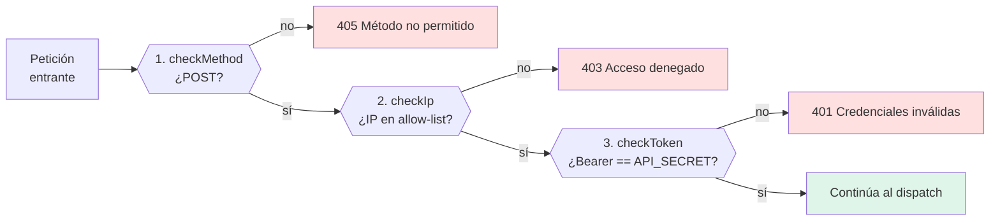
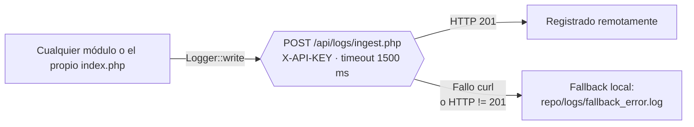
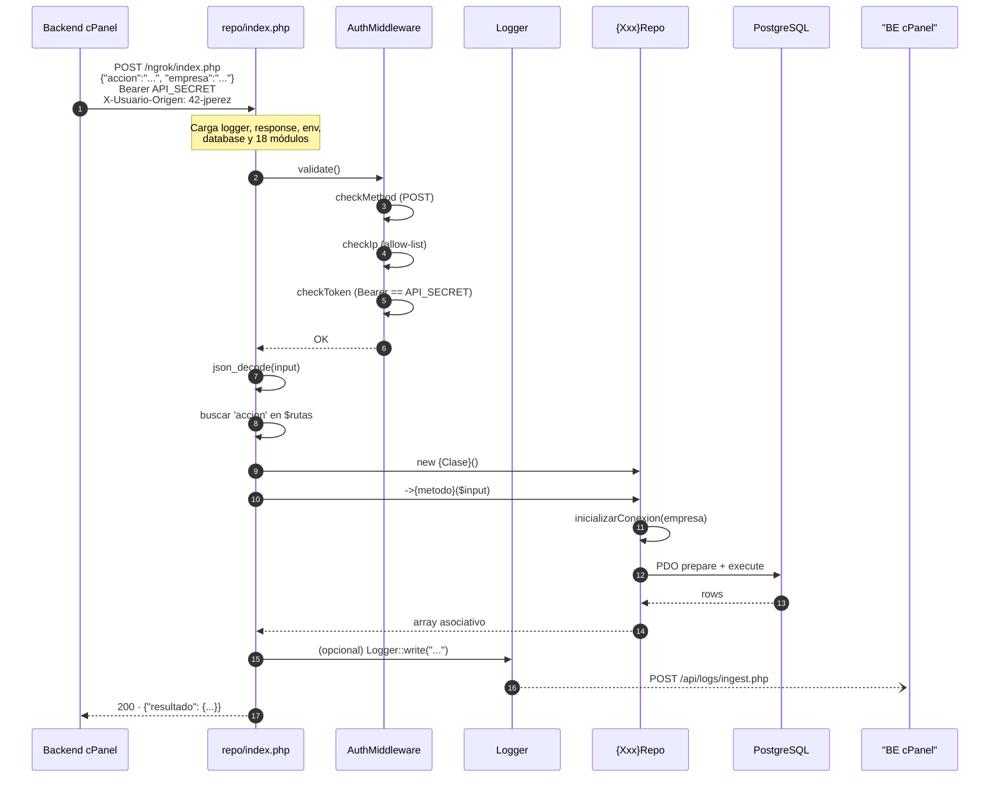

<div align="center">


# 05 · Framework Interno

**Documentación técnica — Aplicativo SEAO**

</div>

---

|                      |                                                                                         |
| -------------------- | --------------------------------------------------------------------------------------- |
| **Documento**        | 05 — Framework Interno                                                                  |
| **Versión**          | 1.0                                                                                     |
| **Fecha**            | 14 de julio de 2026                                                                     |
| **Depende de**       | 02 · Arquitectura General · 08 · Infraestructura                                        |
| **Lo usan**          | 06 · Flujo de petición · 09 · APIs · 10 · Autenticación · 12 · Seguridad · 23 · Módulos |
| **Confidencialidad** | Uso interno                                                                             |

---

## 1 · Objetivo

Explicar **cómo funciona el framework PHP interno** que corre en el servidor LAN corporativo: qué recibe, cómo autentica, cómo decide qué código ejecutar, cómo consulta la base de datos y cómo responde. Se documenta pieza por pieza y se muestra el ciclo de vida completo de una petición.

Este framework no es un producto de terceros — es **código propio**, minimalista (~250 líneas en `core/` + `index.php`), sin dependencias externas. Todo lo que hace es visible en `repo/`.

---

## 2 · Naturaleza del framework

Es un **router monolítico basado en tabla de dispatch por acción**, con las siguientes características de diseño:

- **Un solo endpoint HTTP** (`/ngrok/index.php`) recibe todas las peticiones.
- **Un único método aceptado**: `POST`.
- **Payload JSON** con un campo obligatorio `accion` que actúa como discriminador.
- **Tabla asociativa** `$rutas` que mapea `accion → [Clase, método]`.
- **Instanciación directa** de la clase y llamada al método pasándole el payload completo.
- **Respuesta JSON** homogénea vía `Response::json()` / `Response::error()`.
- **Sin autoload, sin routing por URL, sin controladores intermedios, sin ORM, sin DI container.**

Es una arquitectura deliberadamente simple. Su valor está en la **claridad del punto de entrada** y en la **fácil auditabilidad**: se puede leer `index.php` de arriba a abajo y saber todo lo que el framework hace en una request.

---

## 3 · Estructura de carpetas

```
repo/
├── .env               ← credenciales BD, API_SECRET, IP allow-list, logs
├── .env.bak           ← respaldo (deuda técnica menor)
├── .htaccess          ← deniega servir .env directamente
├── index.php          ← 82 líneas — bootstrap + auth + dispatch
├── core/              ← 5 clases: Logger, Response, Env, Database, AuthMiddleware
│   ├── logger.php
│   ├── response.php
│   ├── env.php
│   ├── database.php
│   └── authmiddleware.php
├── logs/              ← fallback local cuando la API de logs falla
└── modules/           ← 5 dominios de negocio
    ├── general/       ← motivos, líneas, bodegas
    ├── comercial/     ← inventario_item
    ├── financiero/    ← comprobantes, notas, libro auxiliar, retenciones, recaudos, DIAN
    ├── inventario/    ← reportes (averías, bodegas alternas, existencias/costos), saldos
    └── system/        ← status
```

Los archivos con sufijos `.bak`, `.bak2`, `.back`, `.php2` son **respaldos históricos** que conviven con la versión vigente. Se documentan como deuda técnica menor en 26.

---

## 4 · El corazón: `repo/index.php`

Punto único de entrada. Sus 82 líneas están estructuradas en 5 fases:

### 4.1 Fase 1 — Configuración de errores y zona horaria

```php
ini_set('display_errors', 0);          // nunca exponer errores al cliente
ini_set('display_startup_errors', 0);
error_reporting(E_ALL);
date_default_timezone_set('America/Bogota');
```

### 4.2 Fase 2 — Carga de núcleo y `.env`

```php
require_once __DIR__ . '/core/logger.php';
require_once __DIR__ . '/core/response.php';
require_once __DIR__ . '/core/env.php';
Env::load(__DIR__ . '/.env');
require_once __DIR__ . '/core/database.php';
require_once __DIR__ . '/core/authmiddleware.php';
```

El orden importa: `Logger` y `Response` primero (porque `Env` puede necesitarlos), `Env` antes que `Database` (porque las credenciales vienen del entorno), y `AuthMiddleware` al final.

### 4.3 Fase 3 — Carga de módulos

18 `require_once` que cargan todos los repositorios disponibles al arrancar la request:

```php
require_once __DIR__ . '/modules/general/motivos.php';
require_once __DIR__ . '/modules/general/lineas.php';
require_once __DIR__ . '/modules/general/bodegas.php';
require_once __DIR__ . '/modules/comercial/inventario_item.php';
// ... 14 más
```

⚠ **Costo observado:** cada request paga la carga de las 18 clases aunque solo use una. En este framework el costo es bajo (archivos pequeños), pero es la principal candidata a mejora futura (autoloader PSR-4).

### 4.4 Fase 4 — Middleware y validación de entrada

```php
try {
    AuthMiddleware::validate();

    $inputRaw = file_get_contents('php://input');
    $input = json_decode($inputRaw, true);

    if (json_last_error() !== JSON_ERROR_NONE || !isset($input['accion'])) {
        Response::error(400, "Estructura JSON invalida o accion faltante");
    }
```

Tres validaciones en orden estricto:

1. **Autenticación** (§5).
2. **Payload JSON parseable**.
3. **Campo `accion` presente**.

Cualquier fallo devuelve `4xx` inmediatamente. No hay ejecución de lógica de negocio hasta pasar los tres filtros.

### 4.5 Fase 5 — Dispatch

```php
$rutas = [
    'listar_motivos'                          => ['MotivosRepo',       'listar'],
    'buscar_motivo_por_id'                    => ['MotivosRepo',       'buscarPorId'],
    'listar_lineas'                           => ['LineasRepo',        'listar'],
    'buscar_lineas'                           => ['LineasRepo',        'buscar'],
    // …
    'system/database_status_check'            => ['SystemStatusRepo',  'verificarEstadoBaseDatos']
];

if (!array_key_exists($accion, $rutas)) {
    Logger::write("Accion no soportada solicitada: " . $accion);
    Response::error(404, "Endpoint no encontrado");
}

$clase   = $rutas[$accion][0];
$metodo  = $rutas[$accion][1];
$instancia = new $clase();
$resultado = $instancia->$metodo($input);

Response::json(200, ["resultado" => $resultado]);
```

**Contrato de la tabla `$rutas`:**

- La clave es un string libre (puede ser plano como `listar_motivos` o namespaceado como `contabilidad/auxiliar_datos`).
- El valor es `[ClaseRepo, nombreDelMétodo]`.
- La clase se instancia sin argumentos.
- El método recibe el payload completo (`$input`), no argumentos posicionales.
- El resultado se envuelve en `{ "resultado": ... }` en la respuesta.

### 4.6 Fase 6 — Catch global

```php
} catch (Exception $e) {
    Logger::write(
        "Caida catastrofica del script: " . $e->getMessage(),
        "ERROR",
        $e->getTraceAsString()
    );
    Response::error(500, "Fallo critico en la ejecucion del servidor");
}
```

Cualquier excepción no manejada aterriza aquí: se registra con stack trace y se devuelve un 500 genérico al cliente. **Nunca se filtra el mensaje interno al cliente.**

---

## 5 · Middleware de autenticación M2M

`repo/core/authmiddleware.php` implementa **autenticación máquina-a-máquina** en tres capas encadenadas:



### 5.1 `checkMethod`

Rechaza cualquier método que no sea `POST` con `405`. Efecto colateral positivo: preflights `OPTIONS`, `GET` de escáneres y `HEAD` de crawlers quedan bloqueados de inmediato sin ejecutar lógica.

### 5.2 `checkIp`

Extrae la IP del cliente considerando primero `HTTP_X_FORWARDED_FOR` (necesario porque las peticiones llegan a través de Cloudflare) y cayendo a `REMOTE_ADDR`. Compara contra `ALLOWED_IP` del `.env`, que actualmente contiene:

```
190.8.176.113        ← ⚠ hipótesis: IP del hosting cPanel
104.21.92.122        ← ⚠ hipótesis: IP de Cloudflare
190.71.74.202        ← ⚠ hipótesis: IP fija de la oficina
127.0.0.1            ← localhost (pruebas desde el mismo host)
```

Cualquier IP fuera de la lista recibe `403` y queda registrada en logs.

### 5.3 `checkToken`

Busca el header `Authorization` en tres ubicaciones distintas (compatibilidad con distintas configuraciones de Apache/cPanel):

1. `getallheaders()['Authorization']` si está disponible.
2. `$_SERVER['HTTP_AUTHORIZATION']`.
3. `$_SERVER['REDIRECT_HTTP_AUTHORIZATION']` (fallback para hosts que reescriben).

Compara **exactamente** con `Bearer ` + valor de `API_SECRET`. Cualquier discrepancia → `401`.

### 5.4 Consecuencia de las tres capas

Un atacante que consiga uno solo de los tres factores (método correcto, IP autorizada, token válido) **no puede** ejecutar nada. Necesitaría los tres simultáneamente. Y las IPs autorizadas son direcciones de infraestructura interna, no adivinables.

---

## 6 · Conexión a base de datos

`repo/core/database.php` implementa un **singleton por nombre de base de datos** con selección dinámica de credenciales.

### 6.1 Puntos clave del diseño

- **Singleton por `$dbname`**: `Database::getInstance('biable01')` y `Database::getInstance('biable02')` mantienen conexiones separadas en el mismo request.
- **Motor**: PostgreSQL vía `pgsql:host=...;port=...;dbname=...`.
- **Selección de credenciales**: si `$dbname === 'biable02'` intenta usar `DB_USER_TOBAR` / `DB_PASS_TOBAR`; en el resto usa `DB_USER` / `DB_PASS`.
- **Atributos PDO**:
  - `ERRMODE_EXCEPTION` (todos los errores lanzan `PDOException`).
  - `DEFAULT_FETCH_MODE = FETCH_ASSOC` (arrays asociativos por defecto).
  - `EMULATE_PREPARES = false` (prepared statements reales, mitiga inyección SQL).
- **`setQueryTimeout($segundos, $dbname)`**: helper estático que ejecuta `SET statement_timeout` — usado por reportes pesados y por el health check.

### 6.2 Ejemplo de uso desde un módulo

```php
class BodegasRepo {
    private function inicializarConexion($input) {
        $empresa = isset($input['empresa']) ? $input['empresa'] : 'abastecemos';
        $dbName = ($empresa === 'tobar') ? 'biable02' : 'biable01';
        $this->db = Database::getInstance($dbName);
    }
    // …
}
```

**Patrón observado en múltiples módulos:** el payload puede incluir un campo `empresa` que el módulo traduce a nombre de BD PostgreSQL. Esto permite servir a las dos empresas del grupo (Abastecemos y Tobar) con el mismo código.

---

## 7 · Logger

`repo/core/logger.php` implementa **logging remoto con fallback local**.

### 7.1 Diagrama



### 7.2 Payload enviado

```json
{
  "timestamp": "2026-07-14 10:22:07",
  "aplicacion": "API_Biable_CentOS",
  "tipo_log": "INFO | DEBUG | WARN | ERROR",
  "mensaje": "…",
  "stack_trace": "…",
  "usuario": "<id-login>  ó  'App Cliente / Servidor Web'  ó  'Sistema / No autenticado'",
  "ip": "…",
  "host": "…",
  "entorno": "produccion"
}
```

### 7.3 Identificación del usuario originador

El logger identifica **quién disparó la operación en última instancia** siguiendo esta prioridad:

1. Header `X-Usuario-Origen` — lo inyecta el backend cPanel (`LanClient.php`) con el id/login del usuario que hizo la petición al aplicativo. **Es el caso feliz**.
2. Si no viene ese header pero sí un `Authorization` → `"App Cliente / Servidor Web"` (petición M2M sin trazabilidad de usuario).
3. Si no viene ninguno → `"Sistema / No autenticado"`.

Este mecanismo permite **trazar cada consulta al ERP hasta el usuario que la originó**, aunque técnicamente sea el backend cPanel el que ejecuta la llamada.

---

## 8 · Formato de respuesta uniforme

`repo/core/response.php` — 15 líneas, siempre igual:

```php
Response::json($httpCode, $payload);   // header + json_encode + exit
Response::error($httpCode, $mensaje);  // atajo → json con { "error": mensaje }
```

Salidas típicas del framework:

| Caso                           | HTTP  | Cuerpo                                                              |
| ------------------------------ | ----- | ------------------------------------------------------------------- |
| Éxito                          | `200` | `{ "resultado": <lo que devolvió el método> }`                      |
| JSON inválido / falta `accion` | `400` | `{ "error": "Estructura JSON invalida o accion faltante" }`         |
| Token inválido                 | `401` | `{ "error": "Credenciales de API invalidas" }`                      |
| IP no autorizada               | `403` | `{ "error": "Acceso de red denegado para IP: …" }`                  |
| Acción no registrada           | `404` | `{ "error": "Endpoint no encontrado" }`                             |
| Método no `POST`               | `405` | `{ "error": "Metodo HTTP no permitido" }`                           |
| Excepción no controlada        | `500` | `{ "error": "Fallo critico en la ejecucion del servidor" }`         |
| BD caída (health check)        | `200` | `{ "resultado": { status: "offline", … } }` (excepción intencional) |

Todas las respuestas fijan `Content-Type: application/json; charset=UTF-8` y `X-Content-Type-Options: nosniff`.

---

## 9 · Convención de los módulos ("repos")

Todos los módulos siguen la misma forma canónica:

```php
<?php
class {NombreDominio}Repo {
    private $db;

    public function __construct() {
        // Opcional: conexión por defecto
        $this->db = Database::getInstance();
    }

    private function inicializarConexion($input) {
        // Opcional: selección biable01/biable02 por 'empresa' del payload
    }

    public function {accion}($input) {
        // 1) leer parámetros de $input con defaults seguros
        // 2) validar (Response::error si algo esencial falta)
        // 3) ejecutar consulta parametrizada (PDO prepare + execute)
        // 4) retornar array asociativo ["success" => true, "data" => …]
        //    o cualquier estructura serializable
    }
}
```

### 9.1 Ejemplo mínimo (`motivos.php`)

```php
class MotivosRepo {
    private $db;
    public function __construct() { $this->db = Database::getInstance(); }

    public function listar() {
        $stmt = $this->db->query("SELECT * FROM motivos ORDER BY id_motivo LIMIT 10");
        return $stmt->fetchAll();
    }

    public function buscarPorId($id) {
        if (!is_numeric($id)) { Response::error(400, "Parametro ID invalido"); }
        $stmt = $this->db->prepare("SELECT * FROM motivos WHERE id_motivo = :id");
        $stmt->execute(['id' => $id]);
        return $stmt->fetch() ?: null;
    }
}
```

### 9.2 Ejemplo con selección de empresa (`bodegas.php`)

Ver §6.2. Este es el patrón cuando la operación puede aplicar a cualquiera de las dos empresas del grupo.

### 9.3 Ejemplo de reporte pesado (`recaudos_repo.php`)

Los reportes que pueden mover miles de filas siguen un patrón adicional:

```php
public function obtenerRecaudos($parametros) {
    ini_set('memory_limit', '2048M');
    ini_set('max_execution_time', 600);
    set_time_limit(600);
    // …
    Database::setQueryTimeout(600, $dbName);
    // …
}
```

**Observación:** cada reporte pesado eleva su propio timeout/memoria. No hay configuración global. Esto es intencional — solo los reportes que lo necesitan pagan el costo.

### 9.4 Ejemplo con selección de status (`status_repo.php`)

Health check del ERP con umbrales configurables (`800ms` degradado, `3000ms` offline). Interesante decisión de diseño: **devuelve HTTP 200 incluso cuando la BD está caída**, con `status: "offline"` en el cuerpo. Motivación (según el comentario del código): "para que el dashboard interprete el estado sin lanzar error de red".

---

## 10 · Ciclo de vida completo de una request



**Duración típica** (estimada, no medida): 30–200 ms para operaciones simples; 5–120 s para reportes pesados con timeouts elevados.

---

## 11 · Catálogo actual de acciones registradas

Total: **18 acciones** en producción, agrupadas por módulo. Este catálogo se mantiene sincronizado con el mapa `$rutas` de `repo/index.php`.

### 11.1 Módulo `general`

| Acción                 | Clase::método              | Propósito                 |
| ---------------------- | -------------------------- | ------------------------- |
| `listar_motivos`       | `MotivosRepo::listar`      | Listar motivos (tope 10)  |
| `buscar_motivo_por_id` | `MotivosRepo::buscarPorId` | Motivo específico         |
| `listar_lineas`        | `LineasRepo::listar`       | Listar líneas de producto |
| `buscar_lineas`        | `LineasRepo::buscar`       | Buscar línea por término  |
| `listar_bodegas`       | `BodegasRepo::listar`      | Listar bodegas            |
| `buscar_bodegas`       | `BodegasRepo::buscar`      | Buscar bodega             |

### 11.2 Módulo `comercial`

| Acción               | Clase::método                      |
| -------------------- | ---------------------------------- |
| `obtener_datos_item` | `InventarioRepo::obtenerDatosItem` |

### 11.3 Módulo `financiero`

| Acción                                     | Clase::método                                       |
| ------------------------------------------ | --------------------------------------------------- |
| `obtener_comprobantes_ce`                  | `ComprobantesRepo::obtenerComprobantesCe`           |
| `obtener_detalle_pdf_ce`                   | `ComprobantesRepo::obtenerDetallePdfCe`             |
| `obtener_notas`                            | `NotasRepo::obtenerNotas`                           |
| `obtener_detalle_pdf_nota`                 | `NotasRepo::obtenerDetallePdfNota`                  |
| `contabilidad/auxiliar_sedes`              | `AuxiliarRepo::obtenerSedes`                        |
| `contabilidad/auxiliar_proveedores`        | `AuxiliarRepo::buscarProveedores`                   |
| `contabilidad/auxiliar_datos`              | `AuxiliarRepo::obtenerDatosAuxiliar`                |
| `obtener_certificado_retencion`            | `RetencionesRepo::obtenerCertificadoRetencion`      |
| `obtener_certificado_reteica_yumbo`        | `RetencionesRepo::obtenerCertificadoReteicaYumbo`   |
| `obtener_certificado_reteica_palmira`      | `RetencionesRepo::obtenerCertificadoReteicaPalmira` |
| `obtener_certificado_reteiva`              | `RetencionesRepo::obtenerCertificadoReteiva`        |
| `financiero/recaudos_datos`                | `RecaudosRepo::obtenerRecaudos`                     |
| `financiero/auditoria_dian`                | `AuditoriaRepo::obtenerAuditoriaDian`               |
| `financiero/auditoria_dian_config`         | `AuditoriaRepo::obtenerConfiguracionDian`           |
| `financiero/auditoria_dian_config_guardar` | `AuditoriaRepo::guardarConfiguracionDian`           |

### 11.4 Módulo `inventario`

| Acción                                    | Clase::método                                            |
| ----------------------------------------- | -------------------------------------------------------- |
| `inventario/existencias_averias`          | `AveriasRepo::obtenerExistenciasAverias`                 |
| `inventario/reporte_bodegas_alternas`     | `BodegasAlternasRepo::obtenerReporteBodegasAlternas`     |
| `inventario/reporte_existencias_costos`   | `ExistenciasCostosRepo::obtenerReporteExistenciasCostos` |
| `inventario/buscar_proveedores`           | `AveriasRepo::buscarProveedores`                         |
| `inventario/buscar_criterios1`            | `AveriasRepo::buscarCriterio1`                           |
| `inventario/existencias_proveedor_saldos` | `SaldosRepo::obtenerSaldosInventarioProveedor`           |

### 11.5 Módulo `system`

| Acción                         | Clase::método                                |
| ------------------------------ | -------------------------------------------- |
| `system/database_status_check` | `SystemStatusRepo::verificarEstadoBaseDatos` |

**Total real: 30 acciones.** (El "18" que mencioné antes correspondía a los `require_once`; las acciones registradas son más porque una misma clase expone varios métodos.)

---

## 12 · Cómo agregar una nueva acción (paso a paso)

Este procedimiento se referencia desde el documento 17 (Manual del Desarrollador). Aquí se resume el mecanismo, no la política.

1. **Elegir el módulo**: `general`, `comercial`, `financiero`, `inventario` o `system`. Si el dominio no existe, crear una nueva subcarpeta bajo `modules/`.
2. **Crear o modificar la clase `{Xxx}Repo`** con el método público que implemente la lógica. Firma esperada: `public function nombreDelMetodo($input) { … }`.
3. **Registrar el archivo** en `index.php` con `require_once` (bloque de la fase 3).
4. **Registrar la acción** en el mapa `$rutas` con la clave que consumirá el backend cPanel.
5. **Documentar**:
   - Añadir la acción a la tabla del §11 de este documento.
   - Añadir el endpoint correspondiente al documento 09.
6. **Probar** enviando la petición desde el backend cPanel (o vía `curl` desde una IP autorizada).

---

## 13 · Fortalezas del diseño

- **Auditabilidad total.** Todas las acciones ejecutables están listadas en un solo archivo (`index.php`). Cualquier auditoría empieza y termina ahí.
- **Ninguna dependencia externa.** Cero riesgo de vulnerabilidades por CVEs de terceros. Cero coste de mantenimiento de `composer.json`.
- **Aislamiento del ERP.** El framework es el único que conoce las credenciales y las queries del ERP. El backend cPanel no ejecuta SQL contra PostgreSQL nunca.
- **Trazabilidad usuario → query.** Header `X-Usuario-Origen` propaga la identidad del usuario final hasta los logs del framework.
- **Formato de respuesta homogéneo.** Los consumidores (frontend + backend cPanel) siempre encuentran `{ "resultado": ... }` o `{ "error": ... }`. Facilita la capa `runResultadoReport` del frontend.
- **Timeouts locales por consulta.** Los reportes pesados ajustan sus propios límites sin afectar al resto.

---

## 14 · Debilidades observadas

Se documentan aquí para servir de insumo a los documentos 25 (Refactorización) y 26 (Deuda Técnica). **No son criterios de descalificación** — el diseño elegido es válido para la escala actual del proyecto.

| Debilidad                                                                                                          | Impacto                                                                             | Mitigación propuesta (25/26)                                              |
| ------------------------------------------------------------------------------------------------------------------ | ----------------------------------------------------------------------------------- | ------------------------------------------------------------------------- |
| 18 `require_once` en cada request                                                                                  | Overhead menor de I/O                                                               | Autoloader PSR-4 opcional                                                 |
| Archivos `.bak`, `.bak2`, `.back`, `.php2` en `modules/`                                                           | Confusión y potencial ejecución accidental si Apache los sirve                      | Mover a rama Git o eliminar                                               |
| Mapa `$rutas` monolítico crece linealmente                                                                         | 30 acciones hoy; a 100+ será difícil de escanear visualmente                        | Descomponer por módulo (`$rutas = array_merge($general, $financiero, …)`) |
| `Database::getInstance()` sin `null` explícito en `__construct` de módulos que aún no llaman `inicializarConexion` | Podría abrir conexión a la BD por defecto aunque el módulo apunte a la otra empresa | Lazy connection — solo abrir cuando `inicializarConexion` decida          |
| Sin métricas de latencia por acción                                                                                | Detección tardía de acciones que degradan                                           | Registrar `microtime()` inicio/fin en un array y enviarlo al logger       |
| `.env.bak` versionado junto al `.env`                                                                              | Riesgo de exposición si `.htaccess` no cubre `.env.bak`                             | Renombrar o eliminar                                                      |

---

## 15 · Puntos pendientes de análisis profundo

- **`AuditoriaRepo::guardarConfiguracionDian`** — es la única acción del framework que escribe (todos los demás leen). Requiere lectura del código para documentar la persistencia (¿en PostgreSQL? ¿en un archivo? ¿en MySQL vía otro canal?).
- **Módulo `financiero/dian/`** — auditoría DIAN completa: qué compara, con qué reporta, cómo persiste su configuración.
- **`InventarioRepo::obtenerDatosItem`** — no se leyó todavía; requiere revisión para incorporar sus columnas al documento 14.

---

## 16 · Referencias cruzadas

| Necesitas saber…                            | Documento                                                   |
| ------------------------------------------- | ----------------------------------------------------------- |
| Vista macro del sistema                     | [02 · Arquitectura General](./02-arquitectura-general.md)   |
| Cómo el backend cPanel llama al framework   | [03 · Arquitectura Backend](./03-arquitectura-backend.md)   |
| Recorrido end-to-end (SPA → framework → BD) | [06 · Flujo de una Petición](./06-flujo-de-una-peticion.md) |
| Catálogo completo de endpoints              | [09 · APIs](./09-api-endpoints.md)                          |
| Autenticación M2M en profundidad            | [10 · Autenticación](./10-autenticacion.md)                 |
| Base de datos del ERP                       | [14 · Base de Datos](./14-base-de-datos.md)                 |
| Deuda técnica consolidada                   | [26 · Deuda Técnica](./26-deuda-tecnica.md)                 |

---

<div align="center">
<sub><b>Supermercados Belalcázar</b> · Documento 05 — Framework Interno · v1.0 · 14 de julio de 2026</sub>
</div>
