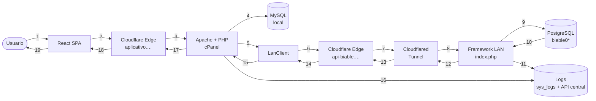
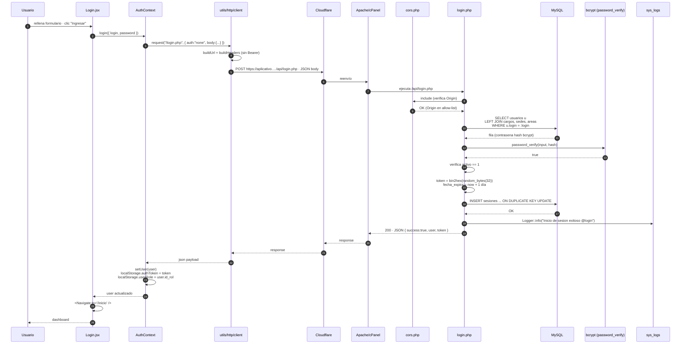
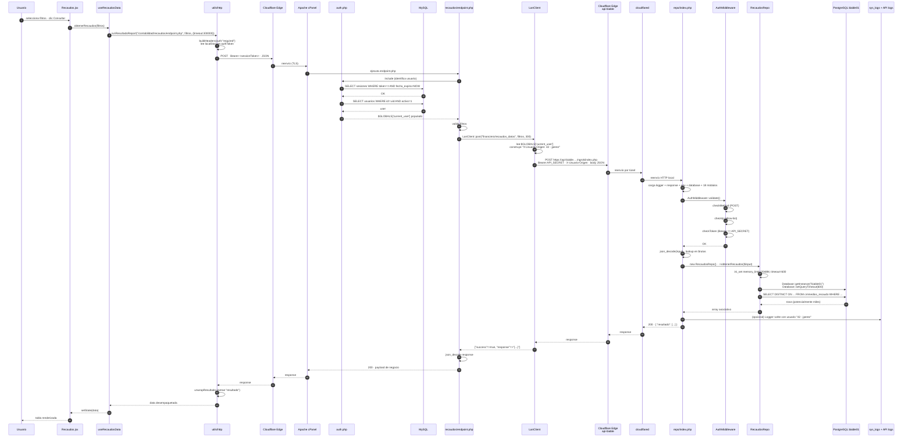
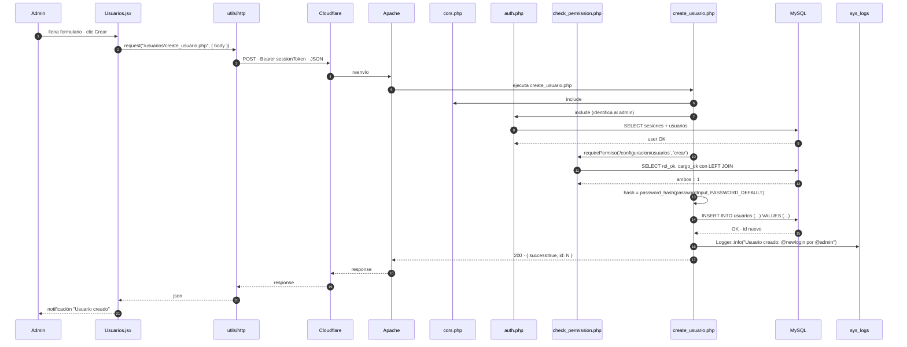
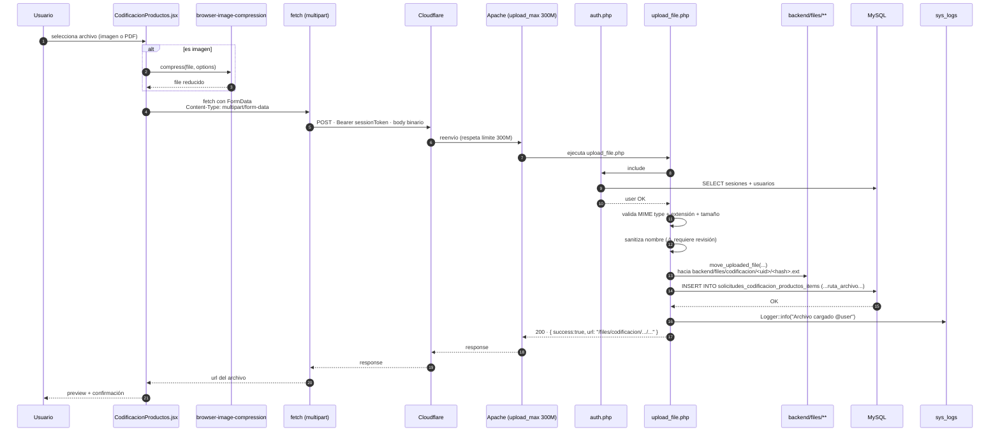
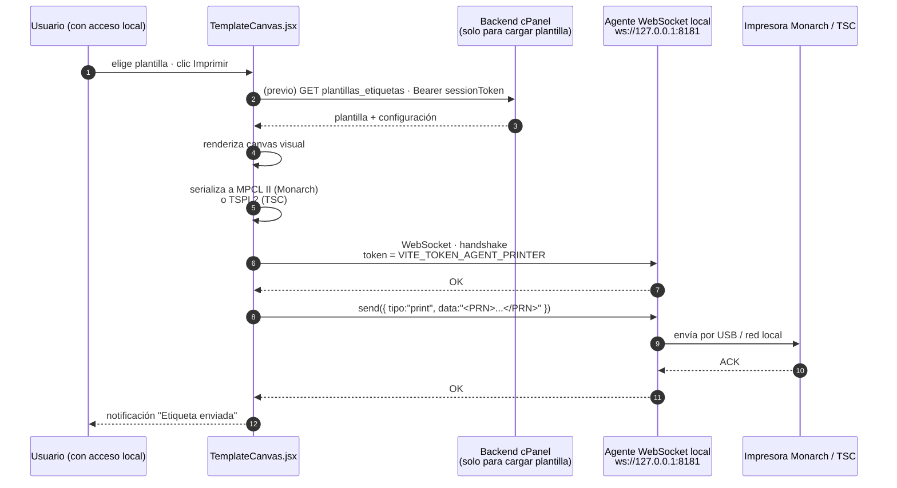
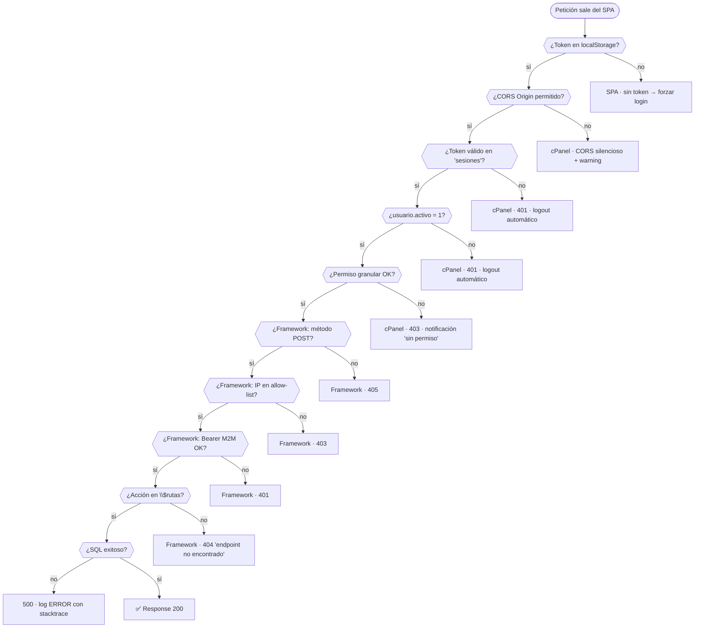

<div align="center">


# 06 · Flujo Completo de una Petición

**Documentación técnica — Aplicativo SEAO**

</div>

---

|                      |                                                                                                                                   |
| -------------------- | --------------------------------------------------------------------------------------------------------------------------------- |
| **Documento**        | 06 — Flujo de una Petición                                                                                                        |
| **Versión**          | 1.0                                                                                                                               |
| **Fecha**            | 14 de julio de 2026                                                                                                               |
| **Depende de**       | 02 · Arquitectura · 03 · Backend · 04 · Frontend · 05 · Framework · 08 · Infraestructura · 10 · Autenticación · 11 · Autorización |
| **Lo usan**          | 09 · APIs · 17 · Manual del Desarrollador · 18 · Soporte                                                                          |
| **Confidencialidad** | Uso interno                                                                                                                       |

---

## 1 · Objetivo

Documentar el **recorrido completo de una petición** de extremo a extremo, incluyendo todos los saltos, verificaciones, transformaciones de datos y respuestas involucradas. Se cubren los cinco escenarios canónicos:

1. **Login local** (usuario/contraseña).
2. **Consulta al ERP** (lectura de datos PostgreSQL vía framework LAN).
3. **Operación puramente local** (CRUD sobre MySQL, sin tocar el framework).
4. **Subida de archivo** (upload de imágenes/documentos).
5. **Impresión de etiqueta** (frontend ↔ agente WebSocket local, sin backend).

Estos cinco escenarios cubren aproximadamente el **95%** de los flujos observables en el sistema.

---

## 2 · Escenario base — anatomía de una request típica

Antes de entrar a los cinco escenarios específicos, este es el "esqueleto" que comparten todos los flujos que pasan por el backend cPanel:



**Interpretación general:** una petición que consulta datos del ERP atraviesa **19 hops** en total. Aunque parezca alto, cada hop tiene una latencia baja (mayoritariamente ms) y la totalidad rara vez supera los 500 ms para operaciones simples. Los reportes pesados pueden tardar decenas de segundos, pero eso es dominado por la ejecución del SQL en PostgreSQL, no por los saltos de red.

---

## 3 · Escenario 1 · Login local

**Trigger:** el usuario ingresa `login` + `password` en la pantalla de login.

### 3.1 Diagrama de secuencia completo



### 3.2 Puntos críticos de este flujo

- **Sin token en la petición** — es la excepción al patrón: `auth: "none"` en `request()`. El endpoint `login.php` verifica CORS pero **no** incluye `auth.php` (esto ya se documentó en 10 §3.2).
- **No pasa por el framework LAN.** Es una operación puramente local; solo toca MySQL cPanel.
- **La respuesta contiene el token y el user completo** — el frontend puede pintar la UI sin fetch adicional.
- **`AuthContext` es quien decide navegar** — el endpoint solo devuelve datos.
- **`sys_logs`** recibe INFO con `login` del usuario, sede, rol; los intentos fallidos también quedan registrados con `login_intentado` (ver 12 §10).

### 3.3 Variantes: los tres modos de fallo

| Causa             | HTTP  | Log level | Cómo lo ve el usuario                             |
| ----------------- | ----- | --------- | ------------------------------------------------- |
| Usuario no existe | `404` | WARNING   | "El usuario no existe"                            |
| Password ≠        | `401` | WARNING   | "Usuario o contrasena incorrectos"                |
| `activo = 0`      | `403` | WARNING   | "Usuario inactivo, contacte con el administrador" |

⚠ La diferenciación entre los tres facilita la enumeración de usuarios (ver 12 §11.4 · Information Disclosure). Recomendación consolidada en 12 §12.

---

## 4 · Escenario 2 · Consulta al ERP (flujo canónico)

**Trigger:** el usuario abre "Contabilidad → Recaudos", elige filtros y presiona "Consultar".

Este es el flujo **más representativo** del sistema. La mayoría de operaciones de negocio siguen este mismo patrón (auditoría DIAN, libro auxiliar, inventarios, existencias, saldos, etc.).

### 4.1 Diagrama de secuencia completo



### 4.2 Anatomía de tokens/headers en este flujo

En el camino la petición pasa por **dos capas de autenticación distintas**:

| Salto                          | Header enviado                                                            | Verificado por                            |
| ------------------------------ | ------------------------------------------------------------------------- | ----------------------------------------- |
| SPA → cPanel                   | `Authorization: Bearer <sessionToken 64-hex>`                             | `auth.php` valida contra `sesiones`       |
| cPanel → LAN (via `LanClient`) | `Authorization: Bearer <API_SECRET>` + `X-Usuario-Origen: <id> - <login>` | `AuthMiddleware::validate` en `index.php` |

El token del usuario **nunca** viaja al framework LAN. La identidad del usuario se propaga en `X-Usuario-Origen`, pero el LAN no puede verificarla — confía en el backend cPanel para ese punto. Es una consecuencia intencional del modelo de "backend como gateway de identidad" (ver 02 §5).

### 4.3 Timing observable

Tiempo típico (estimaciones — no medidas):

| Segmento                                  | Duración         |
| ----------------------------------------- | ---------------- |
| SPA → cPanel (red + auth)                 | 30–80 ms         |
| cPanel → LAN (túnel + auth M2M)           | 40–120 ms        |
| PostgreSQL (query simple)                 | 5–100 ms         |
| PostgreSQL (reporte pesado como Recaudos) | 3 000–120 000 ms |
| Serialización + retorno                   | 20–200 ms        |
| **Total operación simple**                | **~200–500 ms**  |
| **Total reporte pesado**                  | **~3 s – 2 min** |

Los reportes pesados usan `runResultadoReport` con timeouts de 300 s en el frontend y 600 s en el módulo del framework — margen suficiente para PostgreSQL agregaciones complejas.

### 4.4 Puntos de logging en este flujo

Un solo request puede generar hasta **5 entradas de log**:

1. `auth.php` — WARNING si el token es inválido (no aplica en el caso feliz).
2. `check_permission.php` — WARNING si falta permiso (no aplica en el caso feliz).
3. `AuthMiddleware::validate` — WARNING si falla método/IP/token M2M.
4. `RecaudosRepo` — puede loggear INFO/DEBUG contextual (según implementación).
5. Api central de logs — recibe todo lo relevante del framework LAN.

En el caso feliz, típicamente **0 o 1 entrada** por request. En caso de fallo, se genera la cadena de warnings correspondiente para forense.

---

## 5 · Escenario 3 · Operación puramente local (CRUD en MySQL)

**Trigger:** el usuario administrador crea un nuevo usuario en `/configuracion/usuarios`.

Este flujo **nunca cruza el túnel Cloudflared**. Todo se resuelve en el hosting cPanel.

### 5.1 Diagrama de secuencia



### 5.2 Diferencias con el escenario 2

| Aspecto                         | Escenario 2 (ERP)  | Escenario 3 (local)                    |
| ------------------------------- | ------------------ | -------------------------------------- |
| Cruza el túnel                  | Sí                 | **No**                                 |
| Hops totales                    | ~19                | ~11                                    |
| BDs tocadas                     | MySQL + PostgreSQL | Solo MySQL                             |
| Autenticación M2M               | Sí                 | **No aplica**                          |
| Trazabilidad `X-Usuario-Origen` | Sí                 | No necesaria (usuario está aquí mismo) |
| Duración típica                 | 200–500 ms         | 80–200 ms                              |

Este es el flujo más rápido del sistema. Todos los CRUD administrativos (usuarios, áreas, cargos, sedes, proveedores, informes) siguen este patrón.

---

## 6 · Escenario 4 · Subida de archivo

**Trigger:** el usuario adjunta un PDF o imagen en el módulo Codificación de Productos.

### 6.1 Diagrama



### 6.2 Puntos críticos

- **Compresión client-side** con `browser-image-compression` **antes** de subir → reduce ancho de banda y tiempo.
- **Límite de subida:** `upload_max_filesize=300M`, `post_max_size=300M` en `.htaccess`.
- **Timeout PHP elevado:** `max_execution_time=300`, `max_input_time=300` en `.htaccess`.
- **Memory limit:** `memory_limit=512M`.

### 6.3 Preocupaciones de seguridad ya identificadas (ver 12 §5.5, §5.6)

⚠ Áreas pendientes de revisión profunda:

- ¿Se sanitiza el nombre de archivo (no `../`)?
- ¿Se valida la extensión contra una whitelist?
- ¿`backend/files/**` tiene un `.htaccess` que impida ejecución de `.php`?
- ¿`utils/proxy_image.php` valida las rutas que sirve?

Se marcan como acción para 19-Operación + 23-Compras/Codificación.

---

## 7 · Escenario 5 · Impresión de etiqueta (frontend ↔ agente local)

**Trigger:** el usuario en Publicidad selecciona una plantilla y clic "Imprimir".

Único flujo del sistema donde el frontend **no** habla con el backend cPanel para la operación principal.

### 7.1 Diagrama



### 7.2 Puntos característicos

- **Sin túnel, sin Cloudflare, sin backend en el momento crítico.** El agente corre en la misma máquina del usuario.
- **Doble dialecto de impresora:** MPCL II para Monarch 9830/9906; TSPL2 para TSC ME240/MB240T/MB241T. El frontend decide en base a la configuración de la plantilla.
- **Autenticación por token compartido** (`VITE_TOKEN_AGENT_PRINTER`) — con la debilidad ya documentada de que está en el bundle público (ver 12 §6.1).
- **Persistencia server-side de plantillas** en la tabla `plantillas_etiquetas` de MySQL (consultada al inicio con el flujo normal por Bearer).

### 7.3 Consecuencias operativas

- Si el agente no está corriendo → el frontend muestra "no se pudo conectar al agente", pero el resto del aplicativo sigue funcional.
- Si el usuario está en una máquina sin agente instalado (p. ej. desde casa) → el módulo Publicidad no puede imprimir, pero sí puede diseñar plantillas.

---

## 8 · Flujo de errores — cómo se propaga un fallo

Diagrama consolidado de qué pasa cuando algo falla en cada punto de la cadena:



### 8.1 Puntos de falla y su manejo

| Punto                    | Detección                       | Efecto UX                                           | Log                  |
| ------------------------ | ------------------------------- | --------------------------------------------------- | -------------------- |
| Sin token                | `AuthContext` al montar         | Redirige a `/login`                                 | —                    |
| Token expirado           | `auth.php` en cualquier request | Frontend cae en 401 → `logout("Sesión expirada")`   | WARNING              |
| Origen CORS no permitido | `cors.php`                      | Petición bloqueada silenciosamente                  | WARNING              |
| Sin permiso granular     | `check_permission.php`          | `NotificationContainer` muestra toast "sin permiso" | WARNING con contexto |
| Framework LAN caído      | `LanClient` timeout             | Frontend muestra "servicio no disponible"           | ERROR                |
| BD PostgreSQL caída      | `SystemStatusRepo` health check | Dashboard muestra bandera roja                      | WARN                 |
| Excepción no controlada  | catch global en `index.php`     | 500 genérico al cliente                             | ERROR con stacktrace |

Ninguna falla expone información interna al usuario final. Todos los mensajes al cliente son controlados y con foco en acción concreta.

---

## 9 · Latencia end-to-end desglosada

Estimación de latencia acumulada para el flujo canónico (Escenario 2, consulta ERP):

```mermaid
gantt
    title Cronograma de una consulta al ERP (operación simple, ~450 ms)
    dateFormat  X
    axisFormat  %L
    section Cliente
    Serialización JSON       :0, 5
    section Red frontal
    TLS + Cloudflare edge    :5, 30
    section Backend cPanel
    Parse + CORS + auth.php  :30, 60
    Query sesiones + user    :60, 90
    Construir payload LAN    :90, 100
    section Túnel + framework
    cURL + Cloudflare        :100, 130
    Cloudflared túnel        :130, 150
    Bootstrap framework LAN  :150, 200
    AuthMiddleware validate  :200, 210
    section PostgreSQL
    Query simple             :210, 260
    section Regreso
    Serialización framework  :260, 275
    Túnel de regreso         :275, 305
    LanClient parsea         :305, 315
    Backend serializa        :315, 330
    Regreso Cloudflare       :330, 380
    Deserialización SPA      :380, 400
    Render React             :400, 450
```



Los puntos **más caros** son:

1. **TLS + Cloudflare edge** (ida + vuelta): ~50 ms combinados.
2. **Bootstrap del framework LAN** (18 `require_once`): ~50 ms.
3. **Query PostgreSQL** — variable según la consulta (5 ms mínimo, cientos de ms típico).
4. **Render React**: ~30–100 ms para tablas grandes.

**Optimizaciones futuras** (para 25):

- Autoloader PSR-4 en el framework LAN reduciría el bootstrap.
- Caché de la matriz de permisos evitaría el segundo query en cada request autorizada.
- HTTP/2 push o preconnect a `api-biable.…` desde el frontend puede recortar handshakes.

Ninguna es urgente al volumen actual.

---

## 10 · Casos límite y comportamientos especiales

### 10.1 Reintentos

**No hay reintentos automáticos** en el sistema. Si una request falla, el frontend muestra el error y espera acción del usuario. Justificación:

- Escrituras: reintentar puede duplicar.
- Lecturas: el usuario puede repetir la acción manualmente.
- El framework LAN devuelve `success=false` con mensaje claro, no requiere lógica de detección.

### 10.2 Peticiones concurrentes del mismo usuario

- **Múltiples GETs simultáneos** son inofensivos — cada uno crea su propia conexión PDO.
- **Login concurrente desde dos dispositivos** — el segundo dispara `ON DUPLICATE KEY UPDATE` en `sesiones`, invalidando al primero. El primer dispositivo verá `401` en su siguiente request y hará logout automático.
- **Reportes pesados simultáneos** — pueden saturar memoria de PHP; los reportes elevan `memory_limit` a 2 GB, así que dos concurrentes pueden agotar recursos. **No se ha observado protección** contra este caso.

### 10.3 Sesión expirada durante uso

- `auth.php` devuelve `401` en la siguiente request.
- El frontend cae en el catch de `apiService` → `AuthContext.logout("Sesión expirada")` → redirect `/login` con mensaje.
- El usuario re-loguea y puede continuar (los datos escritos hasta ese momento persisten).

### 10.4 Framework LAN caído

- `LanClient::post` devuelve `success=false, http_code=504, response={error}` (ver 03 §9.1).
- El endpoint del backend cPanel debería propagar este error como respuesta al frontend.
- El frontend muestra "servicio no disponible" y ofrece reintentar.
- **`system/status/endpoint.php`** puede detectar esto vía `SystemStatusRepo::verificarEstadoBaseDatos` y mostrar bandera en el dashboard.

### 10.5 Cloudflare Tunnel caído

- El túnel se cae → `LanClient` recibe timeout de cURL → mismo comportamiento que "framework caído".
- Cloudflare mantiene retries a nivel de edge, pero si el `cloudflared` daemon en LAN muere, no hay ruta.
- Recuperación: reiniciar el daemon en el servidor LAN. Requiere procedimiento operativo (doc 19).

---

## 11 · Cómo trazar una petición en producción

Guía práctica para soporte (referenciada en doc 18):

### 11.1 Datos que se pueden correlacionar

1. **Timestamp** en el navegador (DevTools → Network).
2. **`Authorization: Bearer <token>`** — permite identificar al usuario.
3. **Query `SELECT * FROM sesiones WHERE token = '...'`** → `id_usuario`.
4. **Query `SELECT * FROM usuarios WHERE id = ...`** → login del usuario.
5. **Query `SELECT * FROM sys_logs WHERE usuario = '<login>' AND timestamp BETWEEN ... AND ...`** → cadena completa de eventos.
6. Para lo que ejecutó el framework LAN, filtrar en la API central de logs por `usuario = '<id> - <login>'`.

### 11.2 Comandos útiles

```sql
-- Últimos 20 eventos de un usuario
SELECT timestamp, tipo_log, aplicacion, mensaje
FROM sys_logs
WHERE usuario = 'jperez'
ORDER BY timestamp DESC
LIMIT 20;

-- Errores en la última hora
SELECT timestamp, aplicacion, mensaje, stack_trace
FROM sys_logs
WHERE tipo_log = 'ERROR' AND timestamp > NOW() - INTERVAL 1 HOUR
ORDER BY timestamp DESC;

-- Sesión activa de un usuario
SELECT id_usuario, LEFT(token, 8) AS token_prefix, fecha_inicio, fecha_expira
FROM sesiones
WHERE id_usuario = (SELECT id FROM usuarios WHERE login = 'jperez');
```

---

## 12 · Resumen visual — matriz de flujos

| Escenario               | SPA | Backend cPanel  |  MySQL cPanel  | LanClient | Framework LAN | PostgreSQL | Agente local | Duración típica |
| ----------------------- | :-: | :-------------: | :------------: | :-------: | :-----------: | :--------: | :----------: | :-------------: |
| 1 · Login local         | ✅  |       ✅        |       ✅       |           |               |            |              |    80–200 ms    |
| 2 · Consulta ERP simple | ✅  |       ✅        |       ✅       |    ✅     |      ✅       |     ✅     |              |   200–500 ms    |
| 2b · Reporte pesado ERP | ✅  |       ✅        |       ✅       |    ✅     |      ✅       | ✅ (lento) |              |   3 s – 2 min   |
| 3 · CRUD local          | ✅  |       ✅        |       ✅       |           |               |            |              |    80–200 ms    |
| 4 · Upload de archivo   | ✅  |       ✅        |       ✅       |           |               |            |              |  200 ms – 5 s   |
| 5 · Impresión etiqueta  | ✅  | ✅ (solo carga) | ✅ (plantilla) |           |               |            |      ✅      |  100 ms – 3 s   |

---

## 13 · Referencias cruzadas

| Necesitas saber…                         | Documento                                                   |
| ---------------------------------------- | ----------------------------------------------------------- |
| Vista general de todos los componentes   | [02 · Arquitectura General](./02-arquitectura-general.md)   |
| Cómo se autentica el usuario             | [10 · Autenticación](./10-autenticacion.md)                 |
| Cómo se autoriza cada operación          | [11 · Autorización](./11-autorizacion.md)                   |
| Interior del framework LAN               | [05 · Framework Interno](./05-framework-interno.md)         |
| Backend cPanel en detalle                | [03 · Arquitectura Backend](./03-arquitectura-backend.md)   |
| Frontend en detalle                      | [04 · Arquitectura Frontend](./04-arquitectura-frontend.md) |
| Catálogo de endpoints con params/errores | [09 · APIs](./09-api-endpoints.md)                          |
| Cómo diagnosticar errores en producción  | [18 · Manual de Soporte](./18-manual-soporte.md)            |
| Análisis de seguridad de cada punto      | [12 · Seguridad](./12-seguridad.md)                         |

---

<div align="center">
<sub><b>Supermercados Belalcázar</b> · Documento 06 — Flujo de una Petición · v1.0 · 14 de julio de 2026</sub>
</div>
