<div align="center">


# 07 · Diagramas UML

**Documentación técnica — Aplicativo SEAO**

</div>

---

|                      |                                                                                                                                              |
| -------------------- | -------------------------------------------------------------------------------------------------------------------------------------------- |
| **Documento**        | 07 — UML                                                                                                                                     |
| **Versión**          | 1.0                                                                                                                                          |
| **Fecha**            | 14 de julio de 2026                                                                                                                          |
| **Depende de**       | 02 · Arquitectura · 03 · Backend · 04 · Frontend · 05 · Framework · 06 · Flujo · 10 · Autenticación · 11 · Autorización · 14 · Base de Datos |
| **Lo usan**          | 17 · Desarrollador · 23 · Módulos                                                                                                            |
| **Confidencialidad** | Uso interno                                                                                                                                  |

---

## 1 · Objetivo

Reunir la **vista UML del sistema** en un solo lugar: casos de uso, clases, componentes, paquetes, actividades, secuencia y despliegue. Los diagramas ya presentes en otros documentos se referencian aquí para completar el mapa. Todos los diagramas están en Mermaid.

---

## 2 · Casos de uso (Use Case Diagram)

Actores: **Usuario del aplicativo**, **Administrador**, **Comprador**, **Contador**, **Auxiliar de Sistemas**, **Portero de sede**, **Cliente en tienda** (lector precios), **Sistema (cronjobs)**.

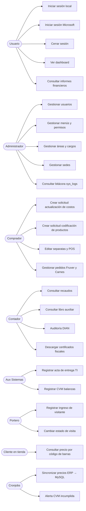

---

## 3 · Diagrama de paquetes (Package Diagram)

Organización del código por dominio.

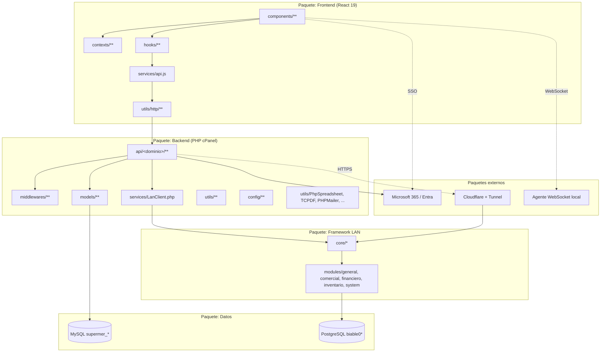

---

## 4 · Diagrama de componentes (Component Diagram)

Cada componente expone interfaces (círculos vacíos) y consume interfaces (semicírculos).

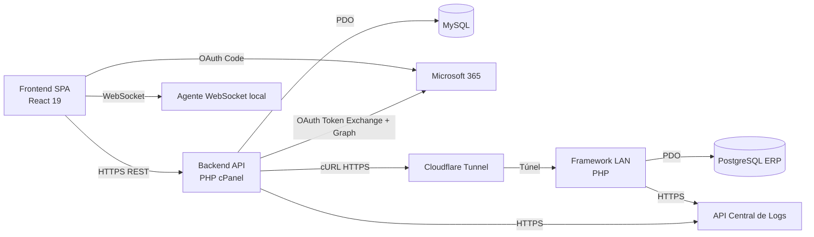

**Interfaces expuestas por cada componente:**

| Componente            | Expone (`>`)                             | Consume (`<`)                                          |
| --------------------- | ---------------------------------------- | ------------------------------------------------------ |
| **SPA**               | UI HTTPS                                 | `IREST` de API, `IOAuth` de MS, `IWebSocket` de agente |
| **API cPanel**        | `IREST` (100+ endpoints), `ILogsIngest`  | `IPDO_MySQL`, `IREST_LAN`, `IOAuth`, `IGraph`          |
| **Framework LAN**     | `IREST_LAN` (30 acciones vía dispatcher) | `IPDO_PG`, `ILogsIngest`                               |
| **MySQL / PG**        | `IPDO`                                   | —                                                      |
| **Cloudflare Tunnel** | Proxy HTTPS                              | Servicio HTTP local del LAN                            |
| **Agente WebSocket**  | `IWebSocket` (impresión)                 | Impresora vía USB/red local                            |

---

## 5 · Diagrama de despliegue (Deployment Diagram)

Documentado con detalle en [08 · Infraestructura](./08-diagramas-infraestructura.md). Vista UML condensada:

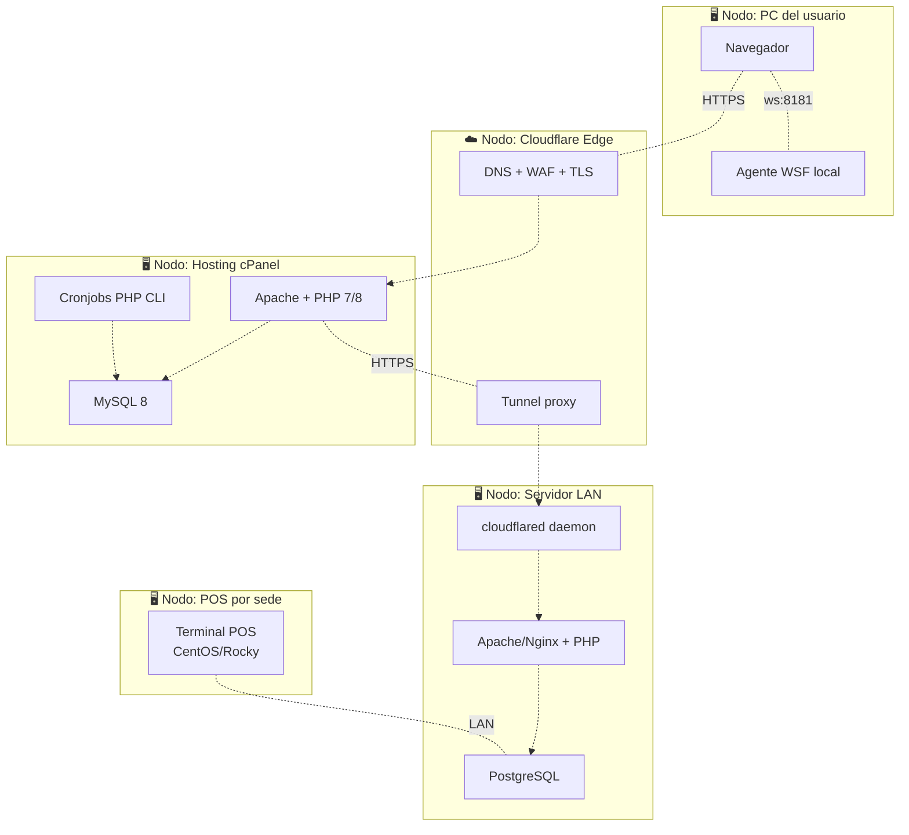

---

## 6 · Diagrama de clases — capa de dominio del backend cPanel

Se muestran las clases principales que forman la "columna vertebral" del backend.

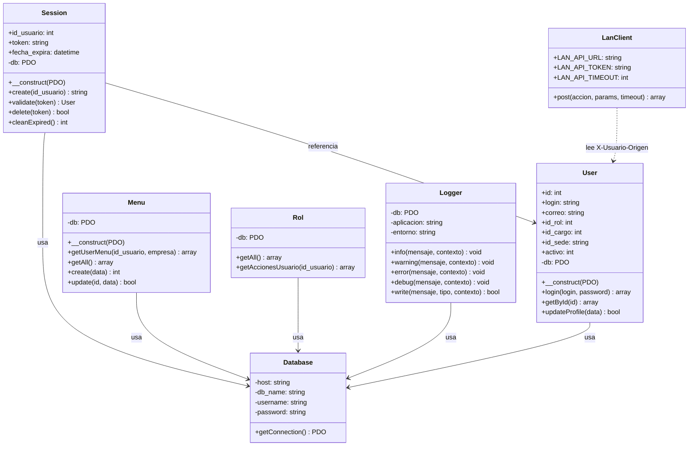

---

## 7 · Diagrama de clases — framework LAN

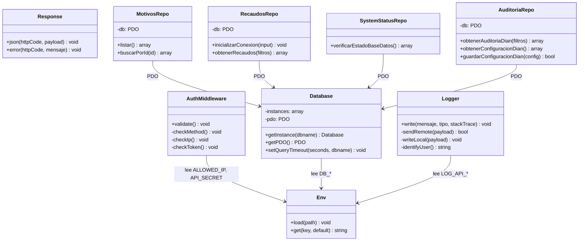

**Convención observada:** todo repositorio termina en `Repo` y expone métodos públicos que reciben `$input` (array asociativo con el payload).

---

## 8 · Diagrama de clases — capa HTTP del frontend

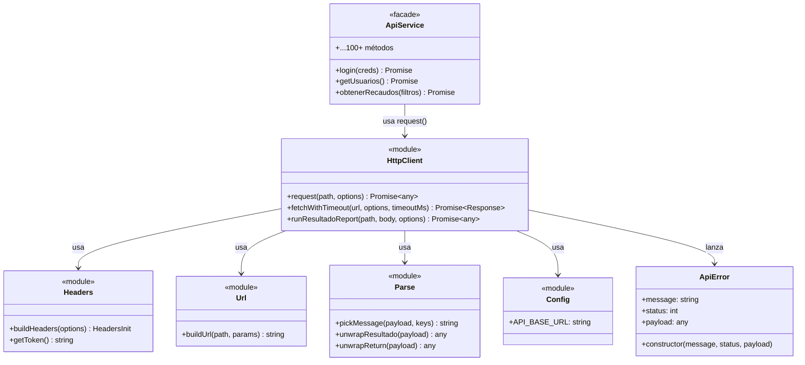

---

## 9 · Diagrama de secuencia — login local

Ver diagrama completo en [10 §3.1](./10-autenticacion.md) y [06 §3.1](./06-flujo-de-una-peticion.md). Referencia aquí.

## 10 · Diagrama de secuencia — consulta al ERP

Ver [06 §4.1](./06-flujo-de-una-peticion.md).

## 11 · Diagrama de secuencia — autorización granular

Ver [11 §12](./11-autorizacion.md).

## 12 · Diagrama de secuencia — SSO Microsoft

Ver [10 §4.1](./10-autenticacion.md).

---

## 13 · Diagrama de actividades — flujo de codificación de productos

Muestra el flujo de negocio completo del módulo Compras / Codificación (uno de los más elaborados).

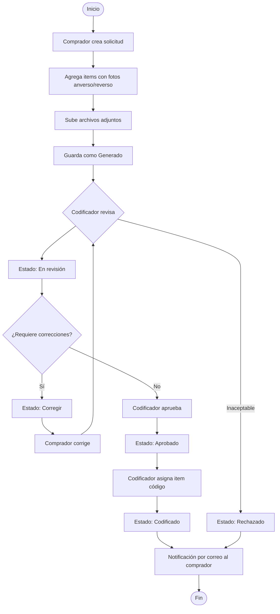

---

## 14 · Diagrama de actividades — auditoría DIAN

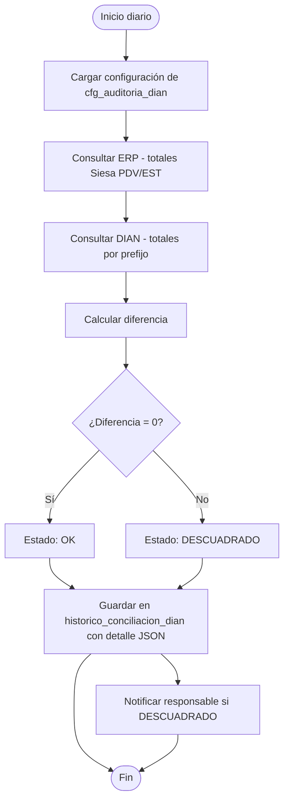

---

## 15 · Diagrama de actividades — control de visitantes

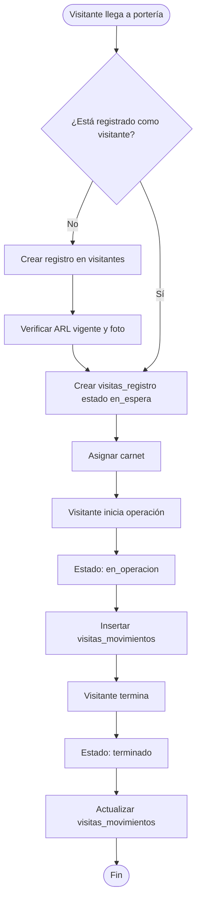

---

## 16 · Diagrama de estados — sesión de usuario

Ver [10 §8](./10-autenticacion.md). Reproducido para completitud.

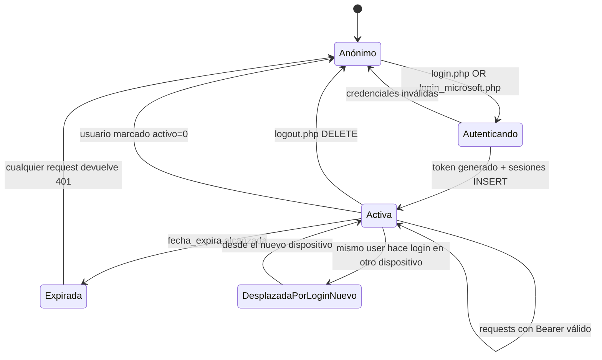

---

## 17 · Diagrama de estados — solicitud de codificación

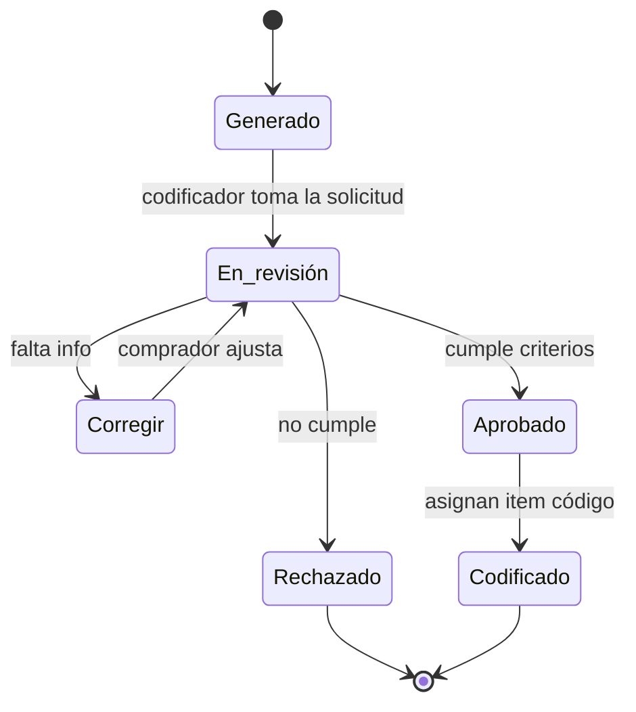

---

## 18 · Diagrama de estados — solicitud de actualización de costos

```mermaid
stateDiagram-v2
    [*] --> pendiente
    pendiente --> en_revision : responsable la toma
    en_revision --> aprobada : cumple política
    en_revision --> rechazada : no cumple
    aprobada --> aplicada : LanClient::post cambio_precio al ERP
    rechazada --> [*]
    aplicada --> [*]
```

---

## 19 · Diagrama de estados — visita

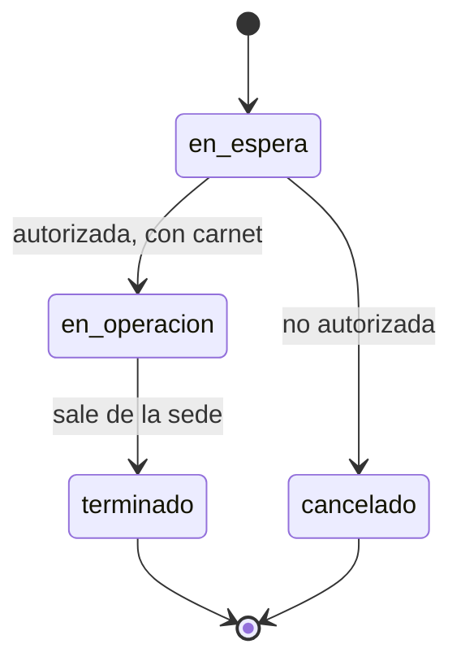

---

## 20 · Diagrama de estados — CVM (registro de balanza)

Inferido de columnas `estado_inicial` y `estado_final` en `registros_cvm`.

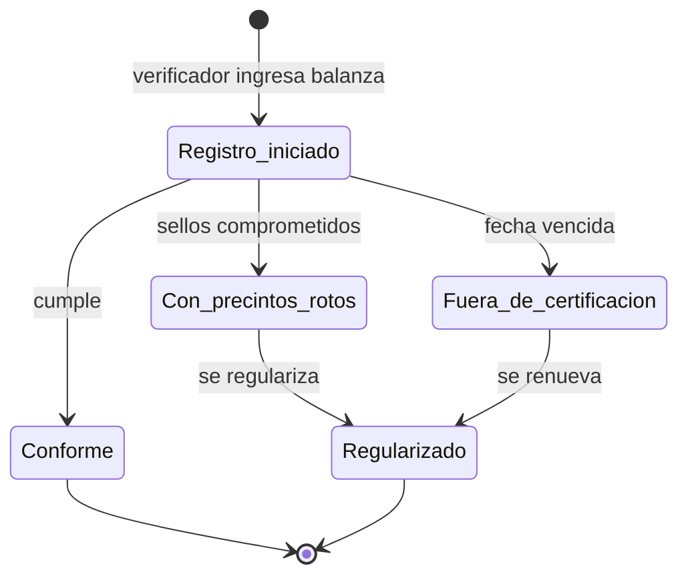

---

## 21 · Diagrama entidad-relación consolidado

El ERD completo dividido por dominios está en [14 · Base de Datos §4-§10](./14-base-de-datos.md).

---

## 22 · Referencias cruzadas

| Necesitas saber…                   | Documento                                                                                                  |
| ---------------------------------- | ---------------------------------------------------------------------------------------------------------- |
| Arquitectura general               | [02 · Arquitectura General](./02-arquitectura-general.md)                                                  |
| Detalle interno de cada componente | [03](./03-arquitectura-backend.md) · [04](./04-arquitectura-frontend.md) · [05](./05-framework-interno.md) |
| Diagramas de flujo end-to-end      | [06 · Flujo](./06-flujo-de-una-peticion.md)                                                                |
| Detalles de despliegue             | [08 · Infraestructura](./08-diagramas-infraestructura.md) · [16 · Deploy](./16-deploy.md)                  |
| ERDs completos                     | [14 · Base de Datos](./14-base-de-datos.md)                                                                |

---

<div align="center">
<sub><b>Supermercados Belalcázar</b> · Documento 07 — UML · v1.0 · 14 de julio de 2026</sub>
</div>
