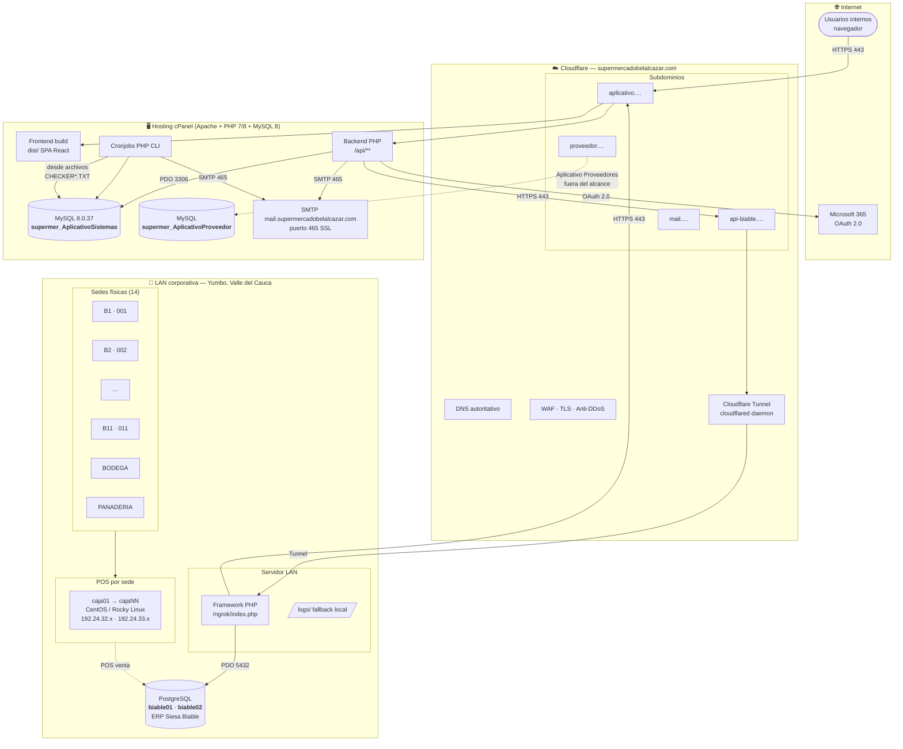
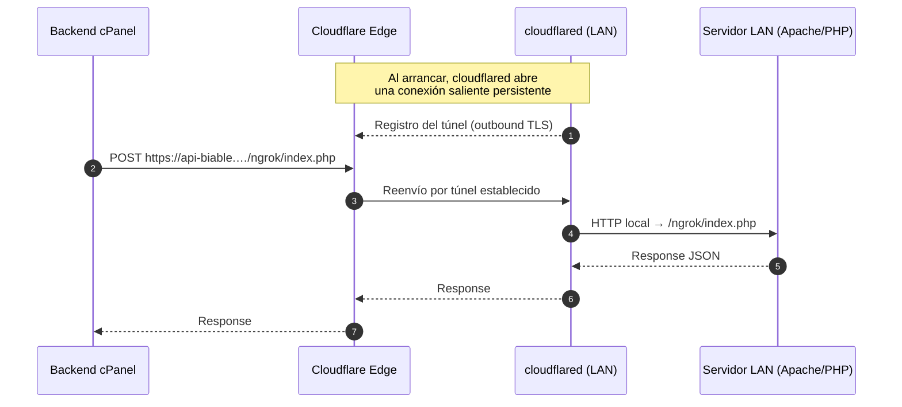
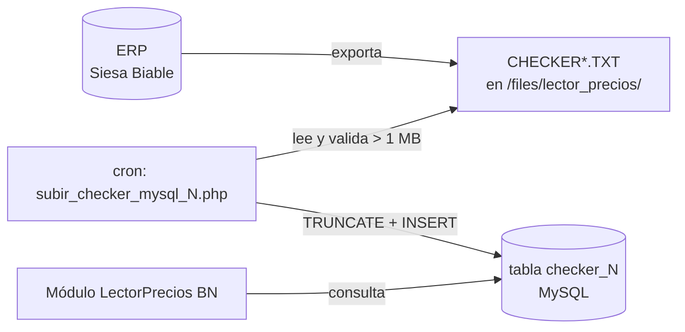
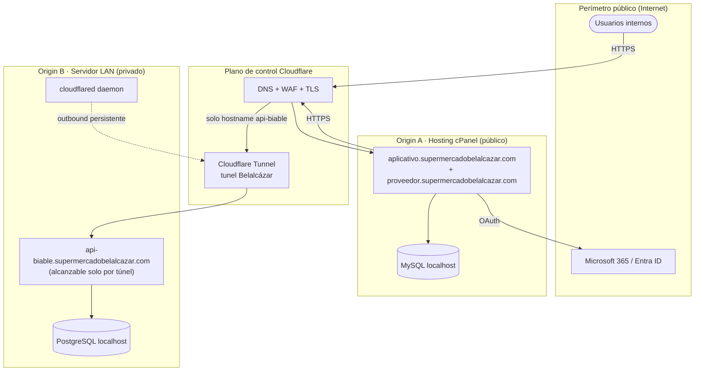

# 08 · Diagramas de Infraestructura

**Documentación técnica — Aplicativo SEAO**

---

|                      |                                               |
| -------------------- | --------------------------------------------- |
| **Documento**        | 08 — Infraestructura                          |
| **Versión**          | 1.0                                           |
| **Fecha**            | 14 de julio de 2026                           |
| **Depende de**       | 02 · Arquitectura General                     |
| **Lo usan**          | 12 · Seguridad · 16 · Deploy · 19 · Operación |
| **Confidencialidad** | Uso interno                                   |

---

## 1 · Objetivo

Documentar la **topología de infraestructura completa** que sustenta el aplicativo interno: DNS y servicios de Cloudflare, hosting cPanel, red LAN corporativa, servidores, bases de datos, cronjobs, sistemas colindantes y todos los canales de red que los conectan. Se especifican hostnames, dominios, puertos, protocolos y direccionamiento IP conocido.

---

## 2 · Vista de conjunto

---

## 3 · Cloudflare — DNS y servicios de borde

### 3.1 Zona `supermercadobelalcazar.com`

Cloudflare administra el DNS del dominio principal. Se identifican en el código los siguientes hostnames en uso:

| Hostname                                | Rol                                | Apunta a                                           | Evidencia                                                                                                |
| --------------------------------------- | ---------------------------------- | -------------------------------------------------- | -------------------------------------------------------------------------------------------------------- |
| `aplicativo.supermercadobelalcazar.com` | Frontend + Backend cPanel          | Hosting cPanel (IP pública del hosting)            | `frontend/.env` (`VITE_API_BASE_URL`), `frontend/.env` (`VITE_MICROSOFT_REDIRECT_URI`), CORS del backend |
| `api-biable.supermercadobelalcazar.com` | Framework LAN publicado por túnel  | Cloudflared → servidor LAN                         | `backend/api/config/lan_api.php` (`LAN_API_URL`)                                                         |
| `proveedor.supermercadobelalcazar.com`  | Aplicativo Proveedores (adyacente) | Hosting cPanel (BD `supermer_AplicativoProveedor`) | CORS del backend + `database_proveedor.php`                                                              |
| `mail.supermercadobelalcazar.com`       | Servidor SMTP saliente             | (hosting o servidor de correo dedicado)            | `backend/api/config/correo_config.php` (`host` + puerto 465)                                             |

### 3.2 Servicios de Cloudflare utilizados

- **DNS autoritativo** para todos los subdominios anteriores.
- **TLS/SSL** (terminación en Cloudflare, luego HTTPS o HTTP a origin — depende de la configuración de "SSL/TLS mode" que **no es observable** desde el código).
- **WAF** — presencia implícita (todas las peticiones pasan por Cloudflare). Reglas específicas no observables.
- **Anti-DDoS** — por defecto del plan.
- **Cloudflare Tunnel** (siguiente sección).

⚠ **Hipótesis:** el hosting cPanel tiene IP pública fija que no aparece en los ZIP; solo se observa una IP `190.8.176.113` en la allow-list del framework LAN, compatible con "IP del hosting o rango público de Cloudflare" (`repo/.env` → `ALLOWED_IP`).

---

## 4 · Cloudflare Tunnel (cloudflared)

### 4.1 Propósito

Publicar el framework LAN sin abrir puertos entrantes en la red corporativa. La LAN es _originadora_ del túnel: `cloudflared` establece una conexión saliente hacia Cloudflare y a partir de ahí Cloudflare enruta las peticiones que llegan a `api-biable.…` hacia el proceso del framework.

### 4.2 Diagrama del túnel

### 4.3 Elementos no observables desde el código

⚠ Requieren consulta directa a la infraestructura para completar el documento 16 (Deploy):

- Nombre exacto del túnel en la consola Cloudflare Zero Trust.
- Archivo `config.yml` de `cloudflared` (hostname → servicio, ingress rules).
- Servicio del sistema (`systemd` unit o `docker`) que mantiene `cloudflared` vivo.
- Usuario que corre el daemon.
- Rotación de credenciales del túnel.

---

## 5 · Hosting cPanel

### 5.1 Rol y contenido

Hosting cPanel (proveedor no identificable desde el código). Contiene simultáneamente:

- **Frontend estático**: la salida `dist/` de `vite build`.
- **Backend PHP**: la carpeta `backend/` con toda la API.
- **Cronjobs**: la carpeta `cron/` — ver §7.
- **MySQL local**: dos bases (`supermer_AplicativoSistemas` y `supermer_AplicativoProveedor`).

### 5.2 Reglas Apache (`.htaccess` raíz del backend)

Extracto relevante (`backend/backend/.htaccess`):

- **SPA routing:** todas las URLs que no coinciden con archivo real ni con `/api/` se reescriben a `/index.html` (la SPA maneja el resto).
- **Cache long-term** para `.js`, `.css`, imágenes, fuentes (`max-age=31536000, immutable`).
- **No-cache** para `index.html` (asegura que siempre se detecte nueva versión).
- **Límites de subida** elevados: `upload_max_filesize = 300M`, `post_max_size = 300M`, `max_execution_time = 300`, `memory_limit = 512M`.

⚠ **Nota:** estas directivas están duplicadas para `mod_php7` y `mod_php8`. Solo la que coincide con la versión activa surte efecto — cuál esté activa depende del `MultiPHP Manager` de cPanel, no observable desde código.

### 5.3 Servicios auxiliares en el hosting

| Servicio                                                      | Uso                                                                       | Evidencia                                                                                              |
| ------------------------------------------------------------- | ------------------------------------------------------------------------- | ------------------------------------------------------------------------------------------------------ |
| **SMTP saliente** (`mail.supermercadobelalcazar.com:465` SSL) | Envío de notificaciones (CVM, actas, alertas)                             | `backend/api/config/correo_config.php`                                                                 |
| **File storage** en `backend/files/`                          | Uploads de la codificación de productos + archivos `CHECKER*.TXT` del ERP | `backend/api/formularios/codificacion_productos/upload_*.php`, `backend/cron/subir_checker_mysql*.php` |
| **Image storage** en `backend/images/`                        | Imágenes servidas por el aplicativo                                       | Existencia de la carpeta                                                                               |

### 5.4 Credenciales observadas en el código

Se documentan aquí **solo como evidencia arquitectónica** (no como práctica recomendada). El documento 12 (Seguridad) las trata como deuda técnica prioritaria.

| Recurso                              | Usuario                                   | Ubicación en código                         |
| ------------------------------------ | ----------------------------------------- | ------------------------------------------- |
| MySQL `supermer_AplicativoSistemas`  | `supermer_Jonathan`                       | `backend/api/config/database.php`           |
| MySQL `supermer_AplicativoProveedor` | `supermer_Jonathan`                       | `backend/api/config/database_proveedor.php` |
| SMTP `mail.…`                        | `no-responder@supermercadobelalcazar.com` | `backend/api/config/correo_config.php`      |
| PostgreSQL `biable01` / `biable02`   | `biable01` / `biable02`                   | `repo/.env`                                 |

---

## 6 · Red LAN corporativa

### 6.1 Rangos IP observados

Todo el direccionamiento visible pertenece al rango privado **`192.24.32.0/23`** (`192.24.32.0` – `192.24.33.255`). Se detecta a partir de la tabla `cajas`.

### 6.2 Servidor LAN (host del framework)

⚠ **Hipótesis:** un único host expone el framework. Evidencia indirecta: `repo/core/logger.php` reporta `aplicacion = 'API_Biable_CentOS'`, lo que sugiere que el sistema operativo del host es CentOS o Rocky Linux (consistente con los POS).

Componentes que corren en ese host:

- Servidor web (Apache o Nginx — **no observable**) sirviendo `repo/index.php`.
- Daemon `cloudflared`.
- Cliente PDO PostgreSQL contra `biable01` y `biable02` (mismo host o LAN — **`DB_HOST=localhost`** en `repo/.env` sugiere **mismo host**).

### 6.3 Sedes físicas

Extraídas de `mysqlphpmyadmin.sql` — tabla `sedes`:

| `id_sede`   | Nombre        | Ciudad                              |
| ----------- | ------------- | ----------------------------------- |
| `001`       | Belalcázar 1  | Yumbo, Valle del Cauca              |
| `002`       | Belalcázar 2  | Yumbo, Valle del Cauca              |
| `003`       | Belalcázar 3  | —                                   |
| `004`       | Belalcázar 4  | —                                   |
| `005`       | Belalcázar 5  | —                                   |
| `006`       | Belalcázar 6  | —                                   |
| `007`       | Belalcázar 7  | —                                   |
| `008`       | Belalcázar 8  | —                                   |
| `010`       | Belalcázar 10 | —                                   |
| `011`       | Belalcázar 11 | —                                   |
| `013`       | Belalcázar 9  | — (id `013` mapea a "Belalcázar 9") |
| `BODEGA`    | BODEGA        | —                                   |
| `PANADERIA` | PANADERIA     | —                                   |
| `WESTERN`   | WESTERN       | —                                   |

### 6.4 Terminales POS (tabla `cajas`)

Los POS registrados corren mayoritariamente **CentOS 6.9/6.10/7** y **Rocky Linux 8.10**, con IPs privadas en `192.24.32.x` y `192.24.33.x`. Se comunican con el ERP Siesa Biable (fuera del alcance del aplicativo, pero son la fuente original de los datos que consulta el framework LAN).

---

## 7 · Cronjobs

Se ubican en `backend/backend/cron/`. Su propósito es **replicar / verificar datos** entre el ERP y MySQL.

### 7.1 Inventario de cronjobs

| Script                        | Fuente                                           | Destino MySQL    | Propósito                                     |
| ----------------------------- | ------------------------------------------------ | ---------------- | --------------------------------------------- |
| `subir_checker_mysql.php`     | `files/lector_precios/CHECKER1.TXT`              | tabla `checker1` | Cargar catálogo de precios de la sede B1      |
| `subir_checker_mysql_2.php`   | `files/lector_precios/CHECKER2.TXT` (⚠ inferido) | `checker2`       | Idem sede B2                                  |
| `subir_checker_mysql_5.php`   | `CHECKER5.TXT`                                   | `checker5`       | Idem sede B5                                  |
| `subir_checker_mysql_8.php`   | `CHECKER8.TXT`                                   | `checker8`       | Idem sede B8                                  |
| `subir_checker_mysql_11.php`  | `CHECKER11.TXT`                                  | `checker11`      | Idem sede B11                                 |
| `verificar_registros_cvm.php` | tabla `registros_cvm`                            | Envío SMTP       | Alerta por sede si no hay registros recientes |
| `error_log`                   | (no es script, es archivo de errores)            | —                | Log de errores                                |
| `correo_log.txt`              | (archivo)                                        | —                | Bitácora del script de verificación CVM       |

### 7.2 Cadena de ejecución de los `checker*`

**Observaciones:**

- Cada script hace `TRUNCATE` antes de insertar → no hay historial, siempre estado actual.
- Validación mínima: rechaza el archivo si pesa < 1 MB.
- Credenciales MySQL están **hardcodeadas** en cada script.
- ⚠ **No observable:** cómo llegan los `CHECKER*.TXT` al hosting (FTP desde el ERP, `rsync`, `scp`, upload manual…). Requiere consulta a operación.

### 7.3 `verificar_registros_cvm.php`

- Consulta la última fecha por `id_sede` en `registros_cvm`.
- Compara con la fecha actual.
- Si la diferencia excede un umbral (⚠ verificar en lectura profunda), envía correo al supervisor de sede + copia fija a Sistemas y Procedimientos.
- Usa PHPMailer sobre `mail.supermercadobelalcazar.com:465`.
- Mapa de correos por `id_sede` embebido en el propio script (10 sedes con supervisor).

### 7.4 Frecuencia de ejecución

⚠ **No observable desde código.** Debe consultarse el `cron` de cPanel para completar 19-Operación. Se recomienda documentar allí:

- Expresión cron por cada script.
- Usuario que ejecuta.
- Archivos de log donde se redirige `stdout` / `stderr`.

---

## 8 · Bases de datos — vista de infraestructura

### 8.1 Inventario

| BD            | Motor        | Host                               | Nombre                         | Uso                                                | Detalle en                                  |
| ------------- | ------------ | ---------------------------------- | ------------------------------ | -------------------------------------------------- | ------------------------------------------- |
| Aplicativo    | MySQL 8.0.37 | cPanel (`localhost` desde backend) | `supermer_AplicativoSistemas`  | 63 tablas + 1 vista — datos propios del aplicativo | [14 · Base de Datos](./14-base-de-datos.md) |
| Proveedores   | MySQL        | cPanel                             | `supermer_AplicativoProveedor` | Aplicativo Proveedores adyacente                   | (fuera del alcance de estos ZIP)            |
| ERP empresa A | PostgreSQL   | LAN (`localhost` desde framework)  | `biable01`                     | Datos ERP Siesa Biable — Abastecemos               | [14 · Base de Datos](./14-base-de-datos.md) |
| ERP empresa B | PostgreSQL   | LAN                                | `biable02`                     | Datos ERP Siesa Biable — Tobar                     | Idem                                        |

### 8.2 Ninguna BD está expuesta a Internet

- MySQL en cPanel: solo accesible desde el propio hosting (`localhost`).
- PostgreSQL en LAN: solo accesible desde el servidor LAN (`localhost`) y por consiguiente desde el framework, que a su vez está protegido por Cloudflare Tunnel + IP allow-list + Bearer M2M.

### 8.3 Backups

⚠ **No observable desde código.** Se sospechan las siguientes fuentes de respaldo, a confirmar en 19-Operación:

- Backups automáticos de cPanel (semanal/mensual, depende del plan).
- Backup PostgreSQL en el servidor LAN (probablemente `pg_dump` en cron — no visible).
- Dump manual con phpMyAdmin (evidencia: el archivo entregado `mysqlphpmyadmin.sql` fue generado el 14-07-2026 con phpMyAdmin 5.2.2).

---

## 9 · Puertos y protocolos

### 9.1 Matriz completa

| Origen            | Destino                | Puerto   | Protocolo           | Sentido | Cifrado            |
| ----------------- | ---------------------- | -------- | ------------------- | ------- | ------------------ |
| Navegador usuario | `aplicativo.…`         | 443      | HTTPS               | ↔       | TLS (Cloudflare)   |
| Navegador usuario | Agente impresora local | 8181     | WebSocket           | ↔       | Sin TLS (loopback) |
| Backend cPanel    | `api-biable.…`         | 443      | HTTPS               | →       | TLS (Cloudflare)   |
| Backend cPanel    | Microsoft 365          | 443      | HTTPS OAuth         | ↔       | TLS                |
| Backend cPanel    | `mail.…`               | 465      | SMTPS               | →       | TLS                |
| Backend cPanel    | MySQL local            | 3306     | PDO MySQL           | ↔       | Local              |
| Cronjobs cPanel   | MySQL local            | 3306     | mysqli / PDO        | ↔       | Local              |
| Cronjobs cPanel   | `mail.…`               | 465      | SMTPS               | →       | TLS                |
| Cloudflared LAN   | Cloudflare Edge        | 443/7844 | QUIC/HTTPS saliente | →       | TLS                |
| Framework LAN     | PostgreSQL LAN         | 5432     | PDO pgsql           | ↔       | Local              |
| Framework LAN     | `aplicativo.…` (logs)  | 443      | HTTPS               | →       | TLS                |

### 9.2 Puertos entrantes en la LAN corporativa

**Ninguno para el aplicativo.** Toda la publicación es saliente vía Cloudflared. Este es un beneficio de seguridad importante:

- No hay que abrir puerto 443/80 al router de la oficina.
- No hay IP pública fija en la LAN.
- Un atacante externo no puede escanear puertos abiertos hacia el servidor LAN.

---

## 10 · Sistema colindante: Aplicativo Proveedores

No forma parte de los ZIP entregados pero está fuertemente referenciado desde el aplicativo interno.

| Aspecto                     | Evidencia                                                                |
| --------------------------- | ------------------------------------------------------------------------ |
| Dominio                     | `proveedor.supermercadobelalcazar.com` (CORS allow-list)                 |
| BD dedicada                 | `supermer_AplicativoProveedor` (`database_proveedor.php`)                |
| API key propia              | Entrada `aplicativo proveedor` en tabla `api_keys` con llave `0Vs93bYb…` |
| Tablas compartidas visibles | `cmproveedores`, `lista_precios_provee`, `proveedor_permisos_inventario` |

Se muestra como **caja gris** en los diagramas de este documento porque su interior no está documentado en el material entregado.

---

## 11 · Diagrama de infraestructura estilo Cloudflare Zero Trust

---

## 12 · Elementos pendientes de análisis

Para cerrar totalmente 08 con 100% de evidencia, se necesita acceso a información no presente en los ZIP:

1. **IP pública del hosting cPanel** — hoy solo se infiere que es una de las incluidas en `ALLOWED_IP` del framework.
2. **`config.yml` del túnel Cloudflared** (ingress rules exactas).
3. **Modo TLS de Cloudflare** (Full / Full Strict / Flexible) — impacta 12-Seguridad.
4. **Archivo `cron` de cPanel** con horarios de los cronjobs.
5. **Configuración de backups** (cPanel + PostgreSQL LAN).
6. **Rangos exactos de la LAN**, VLANs y direccionamiento del servidor LAN.
7. **Versión del daemon `cloudflared`** y método de arranque (systemd/docker).

Todos se marcarán como "requiere consulta a operación" en los documentos 16 y 19.

---

## 13 · Referencias cruzadas

| Necesitas saber…                         | Documento                                                 |
| ---------------------------------------- | --------------------------------------------------------- |
| Vista lógica y componentes               | [02 · Arquitectura General](./02-arquitectura-general.md) |
| Cómo funciona el router LAN por dentro   | [05 · Framework Interno](./05-framework-interno.md)       |
| Endpoints publicados en cada capa        | [09 · APIs](./09-api-endpoints.md)                        |
| Análisis de seguridad de red             | [12 · Seguridad](./12-seguridad.md)                       |
| Base de datos completa                   | [14 · Base de Datos](./14-base-de-datos.md)               |
| Cómo desplegar el sistema completo       | [16 · Deploy](./16-deploy.md)                             |
| Operación (backups, cronjobs, monitoreo) | [19 · Manual de Operación](./19-manual-operacion.md)      |

---

<b>Supermercados Belalcázar</b> · Documento 08 — Infraestructura · v1.0 · 14 de julio de 2026

