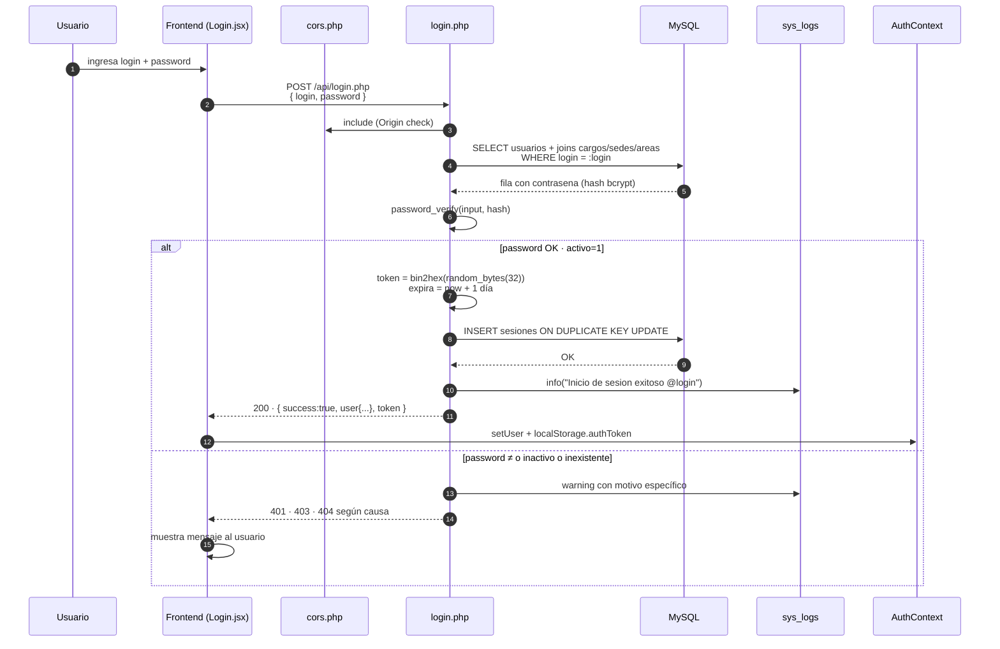
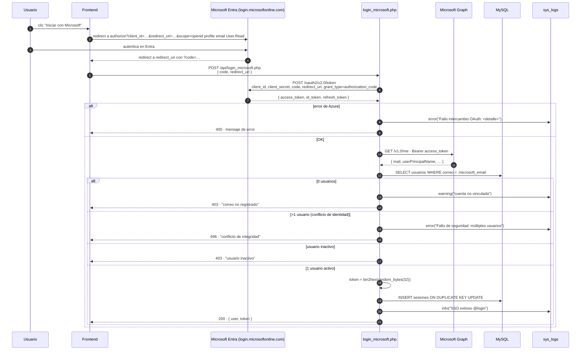
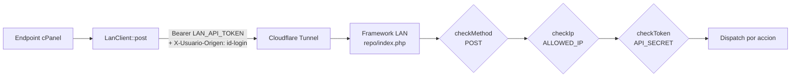
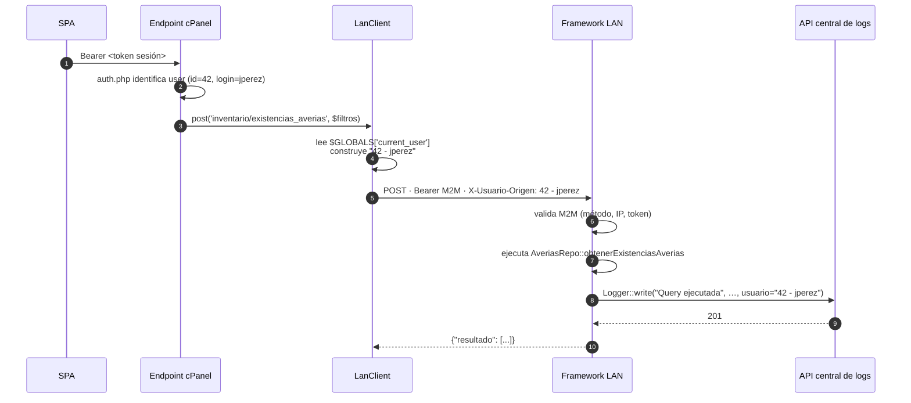
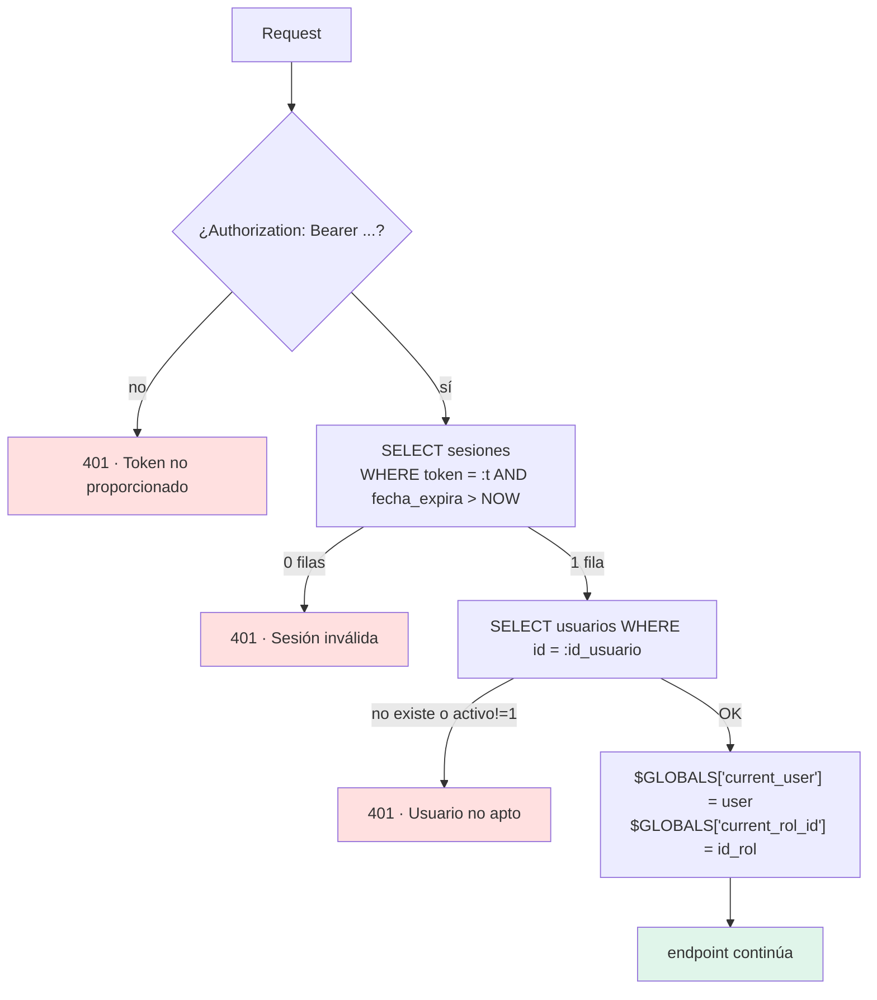
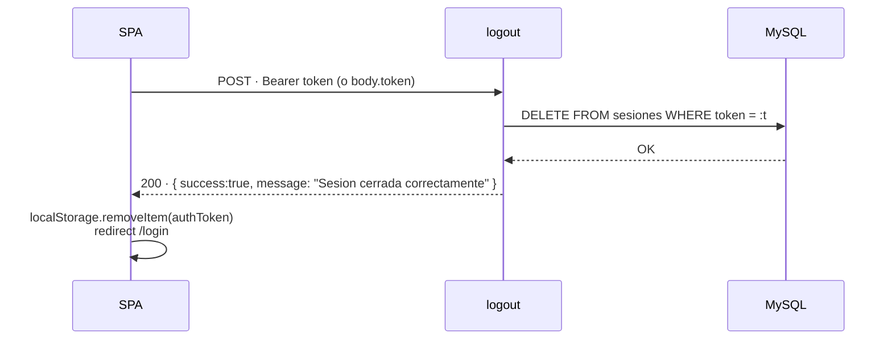
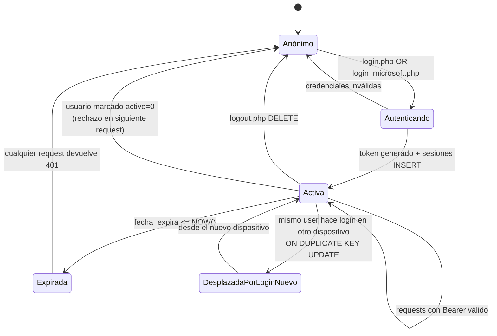

<div align="center">


# 10 · Autenticación

**Documentación técnica — Aplicativo SEAO**

</div>

---

|                      |                                                                                   |
| -------------------- | --------------------------------------------------------------------------------- |
| **Documento**        | 10 — Autenticación                                                                |
| **Versión**          | 1.0                                                                               |
| **Fecha**            | 14 de julio de 2026                                                               |
| **Depende de**       | 02 · Arquitectura General · 03 · Backend · 04 · Frontend · 05 · Framework Interno |
| **Lo usan**          | 11 · Autorización · 12 · Seguridad · 18 · Soporte                                 |
| **Confidencialidad** | Uso interno                                                                       |

---

## 1 · Objetivo

Documentar todos los **flujos de autenticación** del sistema: cómo un usuario obtiene una identidad válida, cómo se mantiene esa identidad durante la sesión, cómo se cierra, y cómo se comunican identidades entre componentes (usuario final ↔ backend ↔ framework LAN). Se cubren los tres flujos existentes en producción:

1. **Login local** con usuario y contraseña.
2. **Login federado con Microsoft 365** (SSO).
3. **Autenticación máquina-a-máquina (M2M)** entre backend cPanel y framework LAN.

---

## 2 · Modelo de identidad

### 2.1 Tabla `usuarios` (MySQL, `supermer_AplicativoSistemas`)

Columnas relevantes para autenticación:

| Columna          | Tipo                  | Rol                                           |
| ---------------- | --------------------- | --------------------------------------------- |
| `id`             | int PK auto           | Identificador interno                         |
| `login`          | varchar(50)           | Usuario de login local                        |
| `contrasena`     | varchar(255)          | Hash bcrypt (`password_hash()` de PHP)        |
| `correo`         | varchar(100) nullable | Correo corporativo — clave para SSO Microsoft |
| `id_rol`         | int                   | FK a `roles`                                  |
| `id_cargo`       | int                   | FK a `cargos`                                 |
| `id_sede`        | varchar(3)            | FK a `sedes.id_sede`                          |
| `id_area`        | int                   | FK a `areas`                                  |
| `activo`         | tinyint(1)            | Bandera de habilitación (`0` = deshabilitado) |
| `fecha_creacion` | timestamp             | Auditoría                                     |

`AUTO_INCREMENT=73` en el dump — hay unos 72 usuarios activos e históricos.

### 2.2 Tabla `sesiones`

```sql
CREATE TABLE sesiones (
  id_usuario   int NOT NULL,
  token        varchar(255) NOT NULL,
  fecha_inicio timestamp DEFAULT CURRENT_TIMESTAMP,
  fecha_expira datetime NOT NULL
);
ALTER TABLE sesiones
  ADD PRIMARY KEY (id_usuario),   -- ← una fila por usuario
  ADD KEY token (token),           -- índice para búsqueda por token
  ADD KEY fecha_expira (fecha_expira);
```

**Decisión estructural crítica:** `id_usuario` es la **clave primaria** de `sesiones`. Esto significa que cada usuario tiene **una única sesión activa** — no hay soporte para múltiples dispositivos concurrentes con el mismo usuario. Un nuevo login desde otro dispositivo **invalida silenciosamente el token anterior** vía `INSERT ... ON DUPLICATE KEY UPDATE`.

Ventajas de esta decisión:

- Elimina tokens huérfanos.
- Reduce superficie de compromiso (un token robado deja de servir en cuanto el usuario vuelve a entrar).
- Simplifica logout: el registro correcto es único y localizable.

Desventaja: el usuario no puede tener sesión abierta en desktop y móvil al mismo tiempo. Es una **decisión consciente** — no un bug.

---

## 3 · Flujo 1 · Login local

### 3.1 Diagrama de secuencia



### 3.2 Puntos clave del código (`api/login.php`)

- Solo acepta `POST`. Cualquier otro método → `405`.
- Validación de payload: `login` y `password` no vacíos.
- **Verificación de credenciales:** `password_verify($input, $row['contrasena'])`. El hash almacenado se genera con `password_hash` (PHP default → bcrypt).
- **Estado activo:** si `activo != 1`, devuelve `403` con `"Usuario inactivo"`.
- **Token:** `bin2hex(random_bytes(32))` → 64 caracteres hex, 256 bits de entropía criptográficamente segura.
- **Expiración:** `date('Y-m-d H:i:s', strtotime('+1 day'))` → sesión de **24 horas**.
- **Manejo diferenciado de errores:**

| Causa                                       | Código HTTP | Log       | Mensaje al cliente                                               |
| ------------------------------------------- | ----------- | --------- | ---------------------------------------------------------------- |
| Usuario inexistente                         | `404`       | `warning` | "El usuario no existe"                                           |
| Password incorrecto                         | `401`       | `warning` | "Usuario o contrasena incorrectos"                               |
| Usuario inactivo                            | `403`       | `warning` | "Usuario inactivo, contacte con el administrador"                |
| Fallo creando sesión (concurrencia extrema) | `500`       | `error`   | "Error de concurrencia al inicializar sesion. Intente de nuevo." |
| Datos incompletos                           | `400`       | —         | "Datos incompletos"                                              |

### 3.3 Payload de respuesta exitosa

```json
{
  "success": true,
  "message": "Login exitoso",
  "user": {
    "id": 42,
    "login": "jperez",
    "nombres_completos": "Juan Pérez",
    "correo": "jperez@…",
    "id_rol": 3,
    "id_cargo": 12,
    "id_sede": "005",
    "id_area": 3,
    "cargo_nombre": "Auxiliar Contable",
    "sede_nombre": "Belalcázar 5",
    "area_nombre": "Contabilidad",
    "activo": 1
  },
  "token": "a3f9c...64hex..."
}
```

El frontend guarda `token` en `localStorage.authToken`, guarda `id_rol` en `localStorage.userRole`, y coloca `user` en `AuthContext`.

---

## 4 · Flujo 2 · Login con Microsoft 365 (SSO)

Habilitado por `frontend/.env` (`VITE_MICROSOFT_TENANT_ID`, `VITE_MICROSOFT_CLIENT_ID`, `VITE_MICROSOFT_REDIRECT_URI`) y por `backend/api/login_microsoft.php`. Sigue el estándar **OAuth 2.0 Authorization Code Flow**.

### 4.1 Diagrama de secuencia completo



### 4.2 Elementos destacables

- **Client secret** del app registration reside en el backend cPanel (`MICROSOFT_CLIENT_SECRET` — cargado por `env_loader.php`). **No se filtra al navegador**, cumpliendo el requisito de OAuth 2.0 confidential client.
- **Scope solicitado:** `openid profile email User.Read` — suficiente para leer `mail` y `userPrincipalName` desde Microsoft Graph.
- **Cruce estricto por correo:** el enlace entre identidad Microsoft y usuario del aplicativo se hace por `correo` — no por login, no por nombre. Un usuario **debe** tener su correo corporativo en `usuarios.correo` para poder usar SSO.
- **Detección de conflicto de identidad:** si dos usuarios comparten el mismo `correo` en `usuarios`, el sistema **rechaza** el login con HTTP `498` personalizado. Preferir un fallo explícito sobre un login ambiguo.
- **Timeout de red a Azure:** `10 s` para el token exchange, `5 s` para Graph. Fallos de red producen `500` con log detallado.
- **Sesión resultante idéntica:** la sesión que crea el SSO es indistinguible de la creada por login local. Después del punto (n) del diagrama, el usuario opera con el mismo token de sesión, la misma expiración de 24 h, y las mismas capacidades.

### 4.3 Diferencias vs login local

| Aspecto                          | Local                               | Microsoft                                       |
| -------------------------------- | ----------------------------------- | ----------------------------------------------- |
| Factor de autenticación          | Contraseña en `usuarios.contrasena` | Contraseña + MFA gestionados por Entra          |
| Clave de enlace                  | `login`                             | `correo`                                        |
| Fuente de verdad de credenciales | MySQL local                         | Microsoft Entra                                 |
| Log de intento fallido           | Sí (con causa)                      | Sí (con detalle Azure)                          |
| Sesión resultante                | Idéntica                            | Idéntica                                        |
| Revocación remota                | Requiere cambio de contraseña       | Automática — deshabilitar en Entra corta acceso |

### 4.4 Ventaja operativa

Cuando un empleado sale de la organización, deshabilitar su cuenta en Microsoft 365 **rompe automáticamente** su capacidad de iniciar sesión vía SSO. No hace falta tocar el aplicativo. (Sí hay que marcar `activo=0` para bloquear también el login local si tenía contraseña.)

---

## 5 · Flujo 3 · Autenticación M2M (backend ↔ framework LAN)

Segundo modelo de autenticación, completamente distinto al del usuario final.

### 5.1 Contexto

Cuando un endpoint del backend cPanel necesita datos del ERP, llama a `LanClient::post(...)` (ver documento 03 §9.1). Esa llamada atraviesa Internet (aunque termine en la LAN por túnel), así que necesita su propia autenticación.

### 5.2 Diagrama



### 5.3 Elementos que componen la autenticación M2M

| Elemento                   | Valor observado                                                    | Fuente                                         |
| -------------------------- | ------------------------------------------------------------------ | ---------------------------------------------- |
| **Método HTTP**            | `POST` únicamente                                                  | `repo/core/authmiddleware.php`                 |
| **IP autorizadas**         | 4 IPs en `ALLOWED_IP` (hosting + Cloudflare + oficina + localhost) | `repo/.env`                                    |
| **Bearer M2M**             | `LAN_API_TOKEN == API_SECRET` (64 hex chars)                       | `backend/api/config/lan_api.php` ↔ `repo/.env` |
| **Header de trazabilidad** | `X-Usuario-Origen: <id> - <login>`                                 | `LanClient.php`                                |

Los tres primeros son **obligatorios**. El cuarto (`X-Usuario-Origen`) es opcional pero **muy recomendado**: permite rastrear en los logs del framework qué usuario final originó cada consulta al ERP.

### 5.4 Propagación de identidad usuario → M2M → logs



El log central termina con **la identidad del usuario final** aunque técnicamente fue el backend cPanel el que hizo la llamada. Esto es lo que permite auditar quién consultó qué en el ERP.

---

## 6 · Validación de token en cada request (`middlewares/auth.php`)

Todos los endpoints protegidos incluyen `middlewares/auth.php`. Su lógica:



### 6.1 Puntos que merece la pena resaltar

- **Doble validación en cada request:** primero se valida el token contra `sesiones` (existencia + no expirado), luego se re-lee el usuario y se re-verifica `activo=1`. Esto significa que **desactivar un usuario tiene efecto inmediato en su próxima request**, no espera a que expire su sesión.
- **`SELECT` con `fecha_expira > NOW()`:** no hay necesidad de un job de limpieza — las filas viejas simplemente dejan de matchear.
- **Compatibilidad de headers:** el middleware busca `Authorization` en `getallheaders()`, `HTTP_AUTHORIZATION`, y `REDIRECT_HTTP_AUTHORIZATION` para funcionar en distintas configuraciones de Apache/cPanel.
- **`$GLOBALS`:** el usuario autenticado se publica en `$GLOBALS['current_user']` para que endpoints y `LanClient` lo lean.

### 6.2 Endpoint dedicado — `verify_token.php`

Reutiliza el middleware `auth.php` y expone el resultado como respuesta. Consumido por `AuthContext.verifyToken()` en el arranque del frontend:

```json
{ "success": true, "user": { "id": …, "login": …, … } }
```

Si el token es inválido/expirado, el propio middleware ya respondió `401` y el endpoint nunca ejecuta su cuerpo.

---

## 7 · Cierre de sesión (`logout.php`)

Simple y directo:



### 7.1 Robustez del endpoint

- Acepta el token en `Authorization: Bearer …` **o** en el JSON body (`token`) como fallback.
- `DELETE` es idempotente: llamar logout dos veces no falla, la segunda simplemente no borra nada.
- No requiere autenticación adicional — poseer el token es suficiente para desactivarlo (equivalente a "quien lo tiene puede cerrarlo").

---

## 8 · Ciclo de vida completo de una sesión



### 8.1 Cuatro maneras de que una sesión termine

1. **Expiración natural** — 24 horas desde el login.
2. **Logout explícito** — `DELETE FROM sesiones`.
3. **Login desde otro dispositivo** — `ON DUPLICATE KEY UPDATE` reescribe el token.
4. **Desactivación del usuario** — próxima request devuelve `401` aunque el token esté vigente en `sesiones` (por el segundo check contra `usuarios.activo`).

---

## 9 · Almacenamiento del token en el navegador

Ver también documento 04 §17.

| Aspecto      | Valor                                                                      |
| ------------ | -------------------------------------------------------------------------- |
| Ubicación    | `localStorage.authToken`                                                   |
| Tamaño       | 64 caracteres hex                                                          |
| Envío        | Header `Authorization: Bearer <token>` en cada request                     |
| Persistencia | Sobrevive al cierre del navegador (mientras no expire y no se haga logout) |

### 9.1 Consecuencia de seguridad

`localStorage` es accesible por **cualquier script del mismo origen**. Un XSS exitoso permite exfiltrar el token. Mitigaciones actuales:

- **CSP y sanitización:** no se han observado en la evidencia — se documenta como pendiente en 12.
- **Sesión única por usuario:** un token robado que se use en otra máquina se invalida en cuanto el usuario vuelve a entrar.
- **Vencimiento de 24 h:** limita ventana de abuso.

Alternativas modernas (cookie `HttpOnly; Secure; SameSite=Strict`) se recomiendan en documento 25.

---

## 10 · `forgot_password.php` — endpoint del aplicativo de proveedores

**Aclaración importante:** aunque `forgot_password.php` está en `backend/api/`, su código consulta las columnas `nit` y `email` de `usuarios` — columnas que **no existen** en la tabla `usuarios` del aplicativo interno (ver §2.1). Además usa `correo_config2.php` y el logo de `proveedor.supermercadobelalcazar.com`.

**Interpretación:** este endpoint pertenece al **aplicativo de proveedores adyacente** (ver 02 §4.1 · C10 y 08 §10). Probablemente se dejó en `backend/api/` por comodidad de despliegue compartido, pero opera contra otra base o contra columnas específicas de esa base.

⚠ Requiere revisión con el equipo para confirmar. **El aplicativo interno no tiene actualmente flujo de recuperación de contraseña propio** — todas las contraseñas se resetean vía panel administrativo (`api/usuarios/update_usuario.php`).

---

## 11 · Matriz de códigos HTTP en autenticación

| Escenario                                             | Código                | Endpoint                | Log     |
| ----------------------------------------------------- | --------------------- | ----------------------- | ------- |
| Login local exitoso                                   | `200`                 | `login.php`             | INFO    |
| Login local — credenciales incorrectas                | `401`                 | `login.php`             | WARNING |
| Login local — usuario inactivo                        | `403`                 | `login.php`             | WARNING |
| Login local — usuario inexistente                     | `404`                 | `login.php`             | WARNING |
| Login local — datos incompletos                       | `400`                 | `login.php`             | —       |
| Login Microsoft — código válido, correo no registrado | `403`                 | `login_microsoft.php`   | WARNING |
| Login Microsoft — múltiples usuarios con mismo correo | `498` (personalizado) | `login_microsoft.php`   | ERROR   |
| Login Microsoft — usuario inactivo                    | `403`                 | `login_microsoft.php`   | —       |
| Login Microsoft — fallo intercambio código            | `400`                 | `login_microsoft.php`   | ERROR   |
| Login Microsoft — sin código o redirect_uri           | `400`                 | `login_microsoft.php`   | —       |
| verify_token — token válido                           | `200`                 | `verify_token.php`      | —       |
| verify_token — token no proporcionado                 | `401`                 | (middleware `auth.php`) | —       |
| verify_token — token inválido/expirado                | `401`                 | (middleware `auth.php`) | WARNING |
| verify_token — usuario inactivo/inexistente           | `401`                 | (middleware `auth.php`) | WARNING |
| logout — OK                                           | `200`                 | `logout.php`            | —       |
| logout — sin token                                    | `400`                 | `logout.php`            | —       |
| M2M — método incorrecto                               | `405`                 | framework LAN           | INFO    |
| M2M — IP no autorizada                                | `403`                 | framework LAN           | WARNING |
| M2M — token M2M inválido                              | `401`                 | framework LAN           | WARNING |

---

## 12 · Fortalezas de la autenticación implementada

1. **Contraseñas con `password_hash`/`password_verify`** → bcrypt con salt automático, sin uso de `md5`/`sha1` para el aplicativo interno.
2. **Tokens con `random_bytes(32)`** → CSPRNG del sistema, 256 bits de entropía.
3. **Sesión única por usuario** → limita superficie de compromiso.
4. **Doble verificación en cada request** (sesión + `activo=1`) → desactivación con efecto inmediato.
5. **Login federado con Microsoft** → aprovecha MFA corporativo, revocación automática al deshabilitar en Entra.
6. **Detección de conflictos de identidad** en SSO → falla explícito antes que login ambiguo.
7. **Trazabilidad usuario → ERP** vía `X-Usuario-Origen` → cada query al ERP queda ligada a la persona.
8. **Autenticación M2M en 3 capas** (método + IP + token) → un solo factor comprometido no basta.
9. **Log diferenciado por causa** de fallo → facilita distinguir fuerza bruta de credenciales olvidadas.

---

## 13 · Debilidades y deuda identificada

| #   | Debilidad                                                                                                          | Impacto                     | Doc           |
| --- | ------------------------------------------------------------------------------------------------------------------ | --------------------------- | ------------- |
| 1   | Token en `localStorage`                                                                                            | XSS puede exfiltrar         | 12, 25        |
| 2   | Sin CSP declarada en respuestas HTML                                                                               | XSS más fácil de aprovechar | 12            |
| 3   | Sin límite de intentos fallidos por usuario/IP en `login.php`                                                      | Fuerza bruta lenta posible  | 12, 25        |
| 4   | `MICROSOFT_CLIENT_SECRET` en `.env` del hosting cPanel (bien) pero sin rotación documentada                        | Rotación manual             | 12, 19        |
| 5   | Sesión única por usuario impide uso legítimo multi-dispositivo                                                     | UX                          | 25 (opcional) |
| 6   | Sin refresh tokens — al expirar, el usuario re-loguea                                                              | UX menor                    | 25            |
| 7   | `forgot_password.php` en `backend/api/` pero pertenece a otro aplicativo                                           | Confusión estructural       | 22, 26        |
| 8   | `sys_logs` guarda logs de intento con `login_intentado` — revisar retención y anonimización                        | Cumplimiento                | 12, 19        |
| 9   | Bearer M2M `LAN_API_TOKEN` sin rotación observable                                                                 | Rotación manual             | 12, 19        |
| 10  | IPs en `ALLOWED_IP` incluyen `127.0.0.1` — útil para debugging pero riesgoso si el servidor LAN se ve comprometido | Defensa en profundidad      | 12            |

---

## 14 · Recomendaciones (para 25 y 28)

- Migrar el token de sesión a cookie **`HttpOnly; Secure; SameSite=Strict`** con endpoint dedicado que lo lea del cookie header. Mantener compat temporal con `localStorage` durante la transición.
- Añadir **rate limiting específico** en `login.php` (5 intentos / minuto por IP + por login) usando el mismo `RateLimit` del backend.
- Añadir **CSP mínima** (`default-src 'self'`) en las respuestas HTML.
- Documentar el procedimiento de **rotación** de `MICROSOFT_CLIENT_SECRET` y `LAN_API_TOKEN`.
- Considerar **refresh tokens** con vida corta (15 min access + 30 días refresh) — solo si el modelo de sesión única sigue siendo aceptable.
- Trasladar `forgot_password.php` a su repo real (proveedores) o darle su propia carpeta.

---

## 15 · Referencias cruzadas

| Necesitas saber…                                       | Documento                                                        |
| ------------------------------------------------------ | ---------------------------------------------------------------- |
| Cómo se aplican los permisos al usuario ya autenticado | [11 · Autorización](./11-autorizacion.md)                        |
| Análisis integral de seguridad                         | [12 · Seguridad](./12-seguridad.md)                              |
| Middleware M2M en profundidad                          | [05 · Framework Interno §5](./05-framework-interno.md)           |
| Backend y `LanClient` que propaga la identidad         | [03 · Arquitectura Backend §9](./03-arquitectura-backend.md)     |
| `AuthContext` en el frontend                           | [04 · Arquitectura Frontend §6.1](./04-arquitectura-frontend.md) |
| Tablas `usuarios` y `sesiones` en detalle              | [14 · Base de Datos](./14-base-de-datos.md)                      |
| Endpoints exactos con params y respuestas              | [09 · APIs](./09-api-endpoints.md)                               |
| Diagnóstico de fallos de login                         | [18 · Soporte](./18-manual-soporte.md)                           |

---

<div align="center">
<sub><b>Supermercados Belalcázar</b> · Documento 10 — Autenticación · v1.0 · 14 de julio de 2026</sub>
</div>
