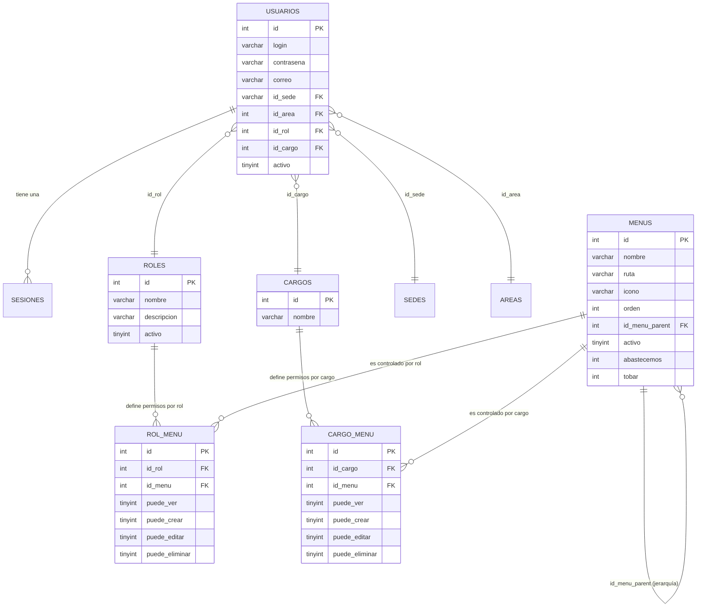
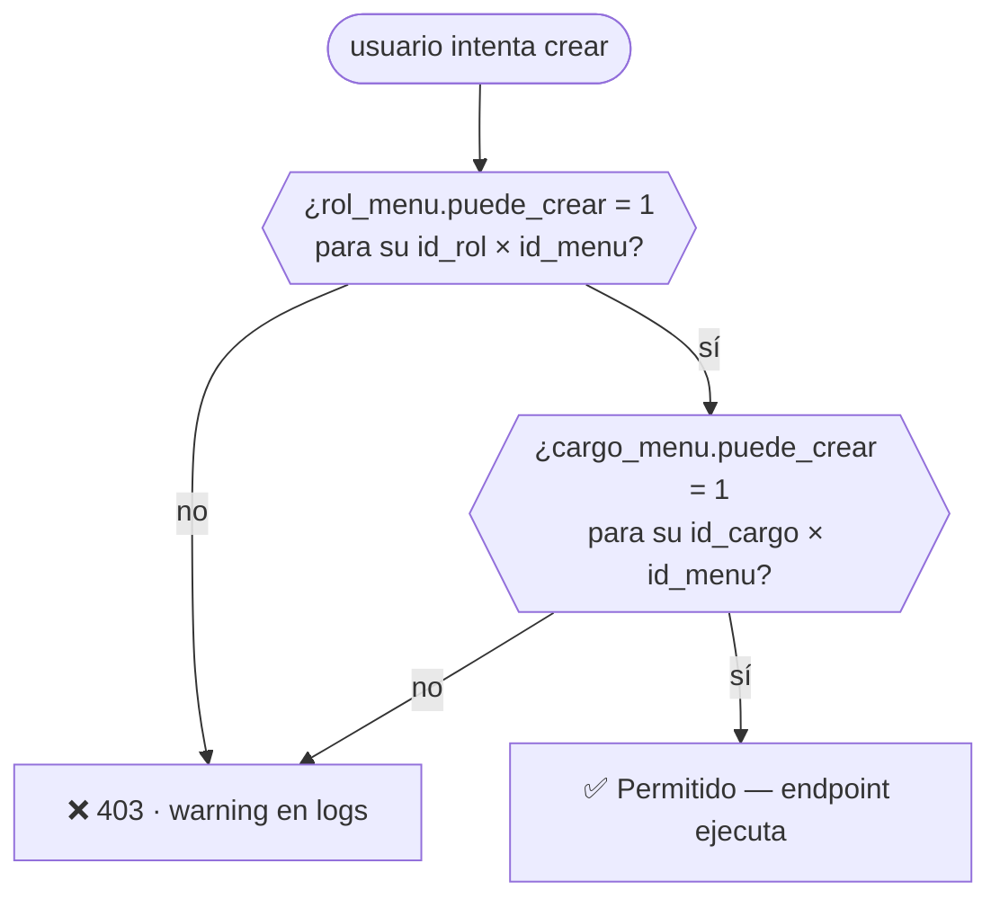
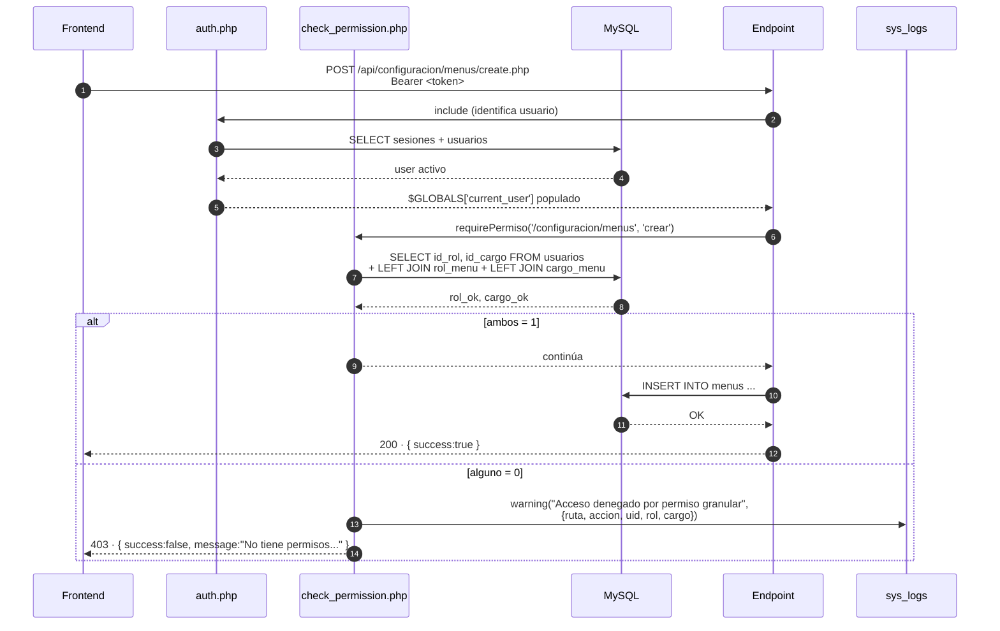
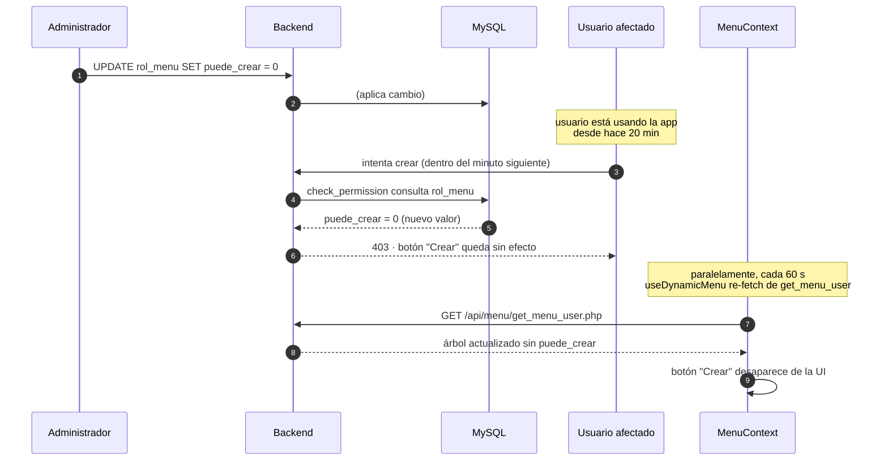

<div align="center">


# 11 · Autorización

**Documentación técnica — Aplicativo SEAO**

</div>

---

|                      |                                                                                   |
| -------------------- | --------------------------------------------------------------------------------- |
| **Documento**        | 11 — Autorización                                                                 |
| **Versión**          | 1.0                                                                               |
| **Fecha**            | 14 de julio de 2026                                                               |
| **Depende de**       | 10 · Autenticación · 03 · Backend · 04 · Frontend                                 |
| **Lo usan**          | 12 · Seguridad · 17 · Manual del Desarrollador · 22 · Convenciones · 23 · Módulos |
| **Confidencialidad** | Uso interno                                                                       |

---

## 1 · Objetivo

Documentar el modelo de **autorización** del aplicativo: cómo el sistema decide **qué puede hacer** un usuario ya autenticado. Se cubren el modelo de datos (roles, cargos, menús, permisos granulares), los dos middlewares de autorización, la propagación al frontend, la política sin bypass, y las diferencias entre las dos generaciones de control que conviven.

Este documento se concentra en el usuario final. La autorización M2M (backend ↔ framework) se cubre íntegramente en 10 · Autenticación §5.

---

## 2 · Modelo conceptual

El sistema aplica **RBAC** (Role-Based Access Control) enriquecido con una dimensión adicional de **cargo** y con **permisos granulares por acción** (`ver`, `crear`, `editar`, `eliminar`) atados a cada **menú**.

Formalmente, un usuario puede realizar una acción sobre una ruta si y solo si **ambos** son verdaderos simultáneamente:

- Su **rol** tiene la acción habilitada sobre el menú de esa ruta (`rol_menu.<accion>_ok = 1`).
- Su **cargo** tiene la acción habilitada sobre el mismo menú (`cargo_menu.<accion>_ok = 1`).

Es una lógica **AND**, no OR. Se explica en detalle en §6.

---

## 3 · Modelo de datos

### 3.1 Entidades principales



### 3.2 Detalle por tabla

**`roles`** — actualmente en producción hay 2 filas:

| id  | nombre    | descripción                |
| --- | --------- | -------------------------- |
| 1   | `admin`   | Administrador del sistema  |
| 2   | `usuario` | Usuario normal del sistema |

Es un catálogo con crecimiento previsible: pueden aparecer más roles conforme se definan perfiles de negocio.

**`cargos`** — catálogo del organigrama (Auxiliar Contable, Supervisor de Sede, etc.). Cada usuario está atado a exactamente un cargo. El listado exhaustivo se consulta desde el módulo AdminPanel / Cargos.

**`menus`** — es el corazón del modelo. Cada fila representa una entrada del menú del aplicativo. Columnas relevantes:

| Columna          | Rol                                            |
| ---------------- | ---------------------------------------------- |
| `id`             | PK                                             |
| `nombre`         | Etiqueta visible                               |
| `ruta`           | URL frontend (p. ej. `/contabilidad/recaudos`) |
| `icono`          | Nombre del ícono Lucide                        |
| `orden`          | Posición dentro del padre                      |
| `id_menu_parent` | Anidamiento (submenús)                         |
| `activo`         | `0` deshabilita globalmente                    |
| `abastecemos`    | `1` si el menú aplica a Abastecemos            |
| `tobar`          | `1` si el menú aplica a Tobar                  |

Las dos últimas son un mecanismo de **filtrado por empresa**: un menú puede existir para Abastecemos pero no para Tobar.

**`rol_menu`** — matriz de permisos por rol. Una fila por par `(id_rol, id_menu)` con los cuatro booleanos:

```sql
CREATE TABLE rol_menu (
  id_rol         INT NOT NULL,
  id_menu        INT NOT NULL,
  puede_ver      TINYINT(1) DEFAULT 1,   -- ← default TRUE en versión rol
  puede_crear    TINYINT(1) DEFAULT 0,
  puede_editar   TINYINT(1) DEFAULT 0,
  puede_eliminar TINYINT(1) DEFAULT 0
);
```

**`cargo_menu`** — matriz análoga por cargo. Nótese la diferencia sutil en defaults:

```sql
CREATE TABLE cargo_menu (
  id_cargo       INT NOT NULL,
  id_menu        INT NOT NULL,
  puede_ver      TINYINT(1) DEFAULT 0,   -- ← default FALSE en versión cargo
  puede_crear    TINYINT(1) DEFAULT 0,
  puede_editar   TINYINT(1) DEFAULT 0,
  puede_eliminar TINYINT(1) DEFAULT 0
);
```

**⚠ Observación:** `rol_menu.puede_ver` tiene default `1` mientras que `cargo_menu.puede_ver` tiene default `0`. Consecuencia práctica: si se asigna un rol nuevo a un menú sin especificar columnas, verá por defecto; si se hace lo mismo por cargo, **no** verá. Esta diferencia es probablemente intencional (los roles son categorías amplias, los cargos son concretos) pero merece documentarse porque puede sorprender.

---

## 4 · Las dos generaciones de autorización

### 4.1 Generación A · `check_role.php` — RBAC clásico

**Uso:** `requireRole([1, 3])` — el endpoint requiere que el usuario tenga uno de esos roles.

Implementación:

- Depende de que `auth.php` haya corrido antes (setea `$GLOBALS['current_rol_id']`).
- Si el rol no está en la lista permitida → **404 con página HTML falsa** (más adelante).
- Es la generación **anterior**. Sigue en uso en endpoints legacy.

### 4.2 Generación B · `check_permission.php` — RBAC granular con AND

**Uso:** `requirePermiso('/configuracion/menus', 'crear')` — el endpoint requiere que el usuario tenga permiso de "crear" sobre el menú cuya ruta es `/configuracion/menus`.

Implementación:

- Depende de `auth.php`.
- Traduce `accion` a columna (`ver → puede_ver`, `crear → puede_crear`, `editar → puede_editar`, `eliminar → puede_eliminar`).
- Consulta **`rol_menu` Y `cargo_menu`** en una sola query con dos LEFT JOIN. Ambos deben devolver `1` en la columna correspondiente.
- Sin bypass automático para el rol `admin` — se explica en §7.
- Si falla → `403` con JSON estándar y `warning` con contexto completo.

**Es la generación vigente** y la recomendada para nuevos endpoints. Coexiste con la Generación A.

---

## 5 · Query de decisión (`check_permission.php`)

Es el fragmento más importante del modelo. Está copiado casi textual desde el código:

```sql
SELECT
    COALESCE(rm.puede_crear, 0) AS rol_ok,
    COALESCE(cm.puede_crear, 0) AS cargo_ok
FROM menus m
LEFT JOIN rol_menu   rm ON rm.id_menu = m.id AND rm.id_rol   = ?
LEFT JOIN cargo_menu cm ON cm.id_menu = m.id AND cm.id_cargo = ?
WHERE m.ruta = ? AND m.activo = 1
LIMIT 1
```

_(La columna `puede_crear` se sustituye dinámicamente por `puede_ver` / `puede_editar` / `puede_eliminar` según la acción solicitada. La sustitución es segura porque el valor sale de un mapa interno — nunca del cliente.)_

Reglas de decisión:

| `rol_ok`                      | `cargo_ok` | Resultado                             |
| ----------------------------- | ---------- | ------------------------------------- |
| 1                             | 1          | ✅ Permitido                          |
| 1                             | 0          | ❌ Denegado (falta permiso del cargo) |
| 0                             | 1          | ❌ Denegado (falta permiso del rol)   |
| 0                             | 0          | ❌ Denegado                           |
| — (menú no existe / inactivo) | —          | ❌ Denegado (query devuelve 0 filas)  |

Los `LEFT JOIN` con `COALESCE(_, 0)` significan que **ausencia de fila en `rol_menu` o `cargo_menu` equivale a permiso denegado**. Esto es una política de **"deny by default"**, la más segura.

---

## 6 · Lógica AND — por qué no OR

Cuando un usuario intenta crear un elemento en `/configuracion/usuarios`:



**Motivación de esta política:**

- Los **roles** representan **capacidad técnica** (qué tipo de operación técnicamente sabe hacer el usuario). Ejemplo: rol `admin` puede administrar; rol `usuario` solo consulta.
- Los **cargos** representan **responsabilidad organizacional** (qué le corresponde en la jerarquía). Ejemplo: Auxiliar Contable de Belalcázar 5 debería ver Recaudos, pero un Supervisor de Bodega no debería, aunque ambos sean rol `usuario`.

La intersección de ambos filtra correctamente. Un rol `admin` con cargo "Portero" no debería poder editar contabilidad — el modelo AND lo previene.

---

## 7 · Política sin bypass para el rol `admin`

Del propio código (`check_permission.php`, comentario textual del desarrollador):

> _"NO hay bypass por rol. Incluso el rol 1 (superadmin) debe tener configurados sus permisos en `rol_menu` y `cargo_menu`. (Si quieres una llave de emergencia que evite quedar bloqueado, define un UID concreto: `if ((int)$usuario['id'] === 1) return; // break-glass opcional`. Dejarlo comentado significa: sin excepciones.)"_

Consecuencias:

1. **Toda operación queda auditada uniformemente.** No hay superusuarios invisibles a la matriz.
2. **Riesgo de bloqueo si `rol_menu` está mal configurado para el admin.** Si un DBA borra por error las filas del rol 1, el sistema quedaría sin operador. La mitigación documentada es el `break-glass` por UID (comentado en el código como opción).
3. **Consistencia con "deny by default".** La misma regla aplica al director general y al aprendiz.

Se documenta como **fortaleza** del diseño en §12 y como **riesgo operativo controlable** en 27.

---

## 8 · Propagación de permisos al frontend

El backend no es la única capa que verifica autorización — el frontend también, pero **por razones de UX, no de seguridad**. Cualquier verificación en el navegador es "sugerencia visual": la autoridad final siempre está en el backend.

### 8.1 Endpoint `get_menu_user.php`

Consultado una sola vez al arrancar (y refrescado silenciosamente cada 60 s, ver 04 §13.2). Devuelve el **árbol de menús** al que el usuario tiene acceso, con los permisos granulares embebidos en cada nodo:

```json
[
  {
    "id": 3,
    "nombre": "Configuración",
    "ruta": "#",
    "icono": "cog",
    "children": [
      {
        "id": 4,
        "nombre": "Menús",
        "ruta": "/configuracion/menus",
        "puede_ver": 1,
        "puede_crear": 1,
        "puede_editar": 1,
        "puede_eliminar": 0
      }
    ]
  }
]
```

El árbol se produce aplicando la misma lógica AND descrita en §6: solo aparecen las rutas donde el usuario tiene `puede_ver = 1` por rol Y por cargo.

### 8.2 `MenuContext` — distribuidor

`MenuContext` (ver 04 §6.3) mantiene el árbol en memoria y lo expone a toda la aplicación. Cero fetches redundantes.

### 8.3 `usePermisos` — hook granular en cada componente

```javascript
const { puedeVer, puedeCrear, puedeEditar, puedeEliminar } = usePermisos();

// Renderizado condicional del botón
{puedeCrear && <BotonCrear onClick={...} />}
```

O con verificación autoritativa contra el servidor:

```javascript
const { hasAccess, loading } = usePermisos(null, { verificarServidor: true });
if (loading) return <LoadingScreen />;
if (!hasAccess) return <SinPermiso />;
```

### 8.4 Endpoint `validate_access.php` — autoridad puntual

Cuando un componente necesita **verificación autoritativa** de una ruta (útil para guards estrictos de navegación), llama a `POST /api/middlewares/validate_access.php` con la ruta y empresa. La respuesta es la verdad del servidor, no una lectura del árbol en cache.

### 8.5 Doble verificación — cliente y servidor

**Ambas verificaciones son necesarias:**

- **Frontend:** oculta botones, muestra mensajes, evita clics inútiles → mejor UX.
- **Backend:** decide si la operación se ejecuta → seguridad.

Un frontend que omita la verificación produce mala UX pero no compromete seguridad. Un backend que omita la verificación es **crítico**. El proyecto los tiene ambos.

---

## 9 · Filtro adicional — `abastecemos` / `tobar` en `menus`

La tabla `menus` incluye dos columnas booleanas independientes de los permisos: `abastecemos` y `tobar`. Definen **si el menú tiene sentido en cada empresa**.

Consecuencia práctica:

- Un menú con `abastecemos=1, tobar=0` **nunca aparece** cuando el usuario opera en modo Tobar, incluso si tiene los permisos de rol y cargo.
- Es un filtro **transversal** que se aplica antes de la lógica de permisos.

Este mecanismo permite tener módulos específicos de una empresa (p. ej. certificados fiscales de Yumbo aplican solo a Abastecemos) sin tocar los permisos.

---

## 10 · Personalización — `EmpresaContext` y el usuario

El usuario puede alternar entre Abastecemos y Tobar mediante `EmpresaContext` (ver 04 §6.2). El cambio de empresa:

1. No requiere logout ni reload.
2. Filtra el menú visible según las columnas `abastecemos` / `tobar`.
3. Cambia el `empresa` que va en cada payload al backend, y de ahí a `Database::getInstance('biable01' | 'biable02')` en el framework LAN.

⚠ **Restricción no observable:** no se ve en el código si un usuario puede alternar libremente entre ambas empresas o si su acceso está atado a una. Requiere revisión (posiblemente vía la columna `id_sede` del usuario o una tabla adicional). Se marca para 12 y 17.

---

## 11 · Enmascaramiento con 404 falso (`check_role.php`)

`check_role.php` implementa una técnica de **security-through-obscurity de bajo costo**:

Cuando un usuario intenta acceder a un endpoint que su rol no permite, **si la petición no es JSON** (es decir, alguien navegando directamente a la URL), responde con **HTML de "404 Not Found" imitando pixel-a-pixel la página de error de LiteSpeed Web Server**.

Motivación probable:

- **Un atacante que enumere URLs** no distingue entre "no existe" y "no autorizado".
- **Un usuario legítimo** que llegó por error a una URL fuera de su alcance simplemente ve un 404 y vuelve al menú.
- **Un cliente JSON** (el propio SPA) recibe `404` con JSON `{ success: false }` estándar.

Consideraciones:

- El fingerprint "LiteSpeed" es una elección estética — el hosting puede o no ser LiteSpeed realmente. Los usuarios que noten discrepancia con el resto del sitio podrían inferir la técnica.
- No sustituye a un WAF real, pero eleva ligeramente el costo de reconocimiento.

`check_permission.php` **no** usa esta técnica — responde `403` explícito con mensaje claro. Es una diferencia consciente entre las dos generaciones.

---

## 12 · Ciclo de vida completo de una autorización



**Latencia adicional por la autorización:** una query extra por request. Se puede optimizar con caché en Redis, pero **no es prioridad** dado el volumen actual y la frescura que se gana consultando en cada request (los cambios de permisos aplican de inmediato).

---

## 13 · Cambios en caliente — revocación en vivo

Escenario: un administrador revoca el permiso `puede_crear` a un rol para un menú específico.



**Dos niveles de revocación en vivo:**

- **Backend (inmediato):** la próxima request que use `check_permission` verá el nuevo valor.
- **Frontend (dentro de 60 s):** la UI se auto-corrige silenciosamente.

Ninguno de los dos requiere que el usuario cierre sesión.

---

## 14 · Diferencias operativas entre las dos generaciones

| Aspecto                             | Generación A · `check_role`                              | Generación B · `check_permission` |
| ----------------------------------- | -------------------------------------------------------- | --------------------------------- |
| Granularidad                        | Rol (todo o nada)                                        | Rol × Cargo × Menú × Acción       |
| Respuesta ante denegación (browser) | HTML 404 falso                                           | JSON 403                          |
| Respuesta ante denegación (JSON)    | 404 con `{ success:false }`                              | 403 con mensaje explicativo       |
| Bypass para admin                   | Depende del uso (si se pasa `[1]` en `requireRole([1])`) | Sin bypass automático             |
| Uso recomendado hoy                 | Endpoints legacy o de rol simple                         | Nuevos endpoints                  |
| Frecuencia de query                 | 1 SELECT                                                 | 2 SELECT                          |

⚠ **Recomendación (25):** migrar gradualmente los endpoints que usan `check_role` a `check_permission`. No urgente — el modelo A sigue siendo válido para operaciones intrínsecamente "todo o nada" (por ejemplo, endpoints de administración exclusivos del rol 1).

---

## 15 · Guía práctica — cómo autorizar una operación nueva

Para el documento 17. Aquí solo el esqueleto:

1. **Identificar la ruta del menú** que gobierna la operación (columna `menus.ruta`).
2. **Identificar la acción** (`ver` / `crear` / `editar` / `eliminar`).
3. **En el endpoint backend**, incluir:

   ```php
   include_once '../middlewares/cors.php';
   include_once '../config/database.php';
   include_once '../middlewares/auth.php';
   include_once '../middlewares/check_permission.php';
   header('Content-Type: application/json');

   requirePermiso('/mi/ruta', 'crear');
   // ... lógica del endpoint ...
   ```

4. **Configurar la matriz de permisos** vía el módulo AdminPanel:
   - Insertar/actualizar la fila `rol_menu` para el rol que necesite acceso.
   - Insertar/actualizar la fila `cargo_menu` para cada cargo que lo requiera.
5. **En el frontend**, usar `usePermisos()` para condicionar botones y guards.

---

## 16 · Fortalezas del diseño

1. **Deny by default** — ausencia de configuración equivale a acceso denegado.
2. **Doble dimensión (rol AND cargo)** — refleja el mundo real: capacidad técnica ∩ responsabilidad organizacional.
3. **Sin bypass para admin** — audibilidad uniforme.
4. **Filtro por empresa** independiente de los permisos → módulos por empresa sin duplicar configuración.
5. **Revocación en vivo (backend inmediato, frontend en 60 s)** sin logout.
6. **Verificación en cada request** — cambios aplican sin caché.
7. **Frontend + Backend** — UX + seguridad correctamente separadas.
8. **404 falso opcional** — reconocimiento más costoso para atacantes.
9. **Logs enriquecidos en cada denegación** — con `uid`, `rol`, `cargo`, `ruta`, `accion` → forense completo.
10. **Consulta parametrizada con `LIMIT 1`** — sin riesgo de inyección, indexable.

---

## 17 · Debilidades y deuda identificada

| #   | Debilidad                                                                                                                       | Impacto                                                             | Doc    |
| --- | ------------------------------------------------------------------------------------------------------------------------------- | ------------------------------------------------------------------- | ------ |
| 1   | Dos generaciones convivientes (`check_role` vs `check_permission`)                                                              | Confusión para nuevos desarrolladores                               | 22, 25 |
| 2   | `rol_menu.puede_ver` default `1` vs `cargo_menu.puede_ver` default `0`                                                          | Confusión, riesgo de exposición no intencional al asignar rol nuevo | 22     |
| 3   | Sin caché de la matriz de permisos                                                                                              | Query extra por cada request autorizada (aceptable hoy)             | 25     |
| 4   | Sin UI/API para auditar "quién puede hacer qué sobre un menú"                                                                   | Difícil verificar la matriz completa                                | 25     |
| 5   | Restricción de empresa por usuario **no observable** en el código actual                                                        | Riesgo de acceso cruzado si no está bloqueado                       | 12     |
| 6   | La query dinámica interpola nombre de columna (`puede_ver` / `puede_crear`…) — es segura porque viene de un mapa, pero es sutil | Nuevo desarrollador podría copiar el patrón sin la validación       | 22     |
| 7   | Sin herramienta de simulación de permisos ("¿si le asignara este cargo, qué vería?")                                            | Diseño de cargos por ensayo/error                                   | 25     |
| 8   | `menus` es fuente de verdad pero las rutas del frontend se declaran manualmente en `App.jsx`                                    | Riesgo de desincronización: menús huérfanos o rutas sin menú        | 22, 25 |

---

## 18 · Puntos pendientes de análisis profundo

- **¿Se filtra el acceso a los datos por sede?** Un usuario de la sede 005 no debería ver recaudos de la sede 001, pero eso depende de las queries de cada módulo, no del middleware. Requiere revisar cada módulo en 23.
- **`auth_menu.php`** — variante de `auth.php` con contexto extra. Determinar exactamente qué añade.
- **Restricción por empresa a nivel de usuario** — verificar si existe una tabla `usuario_empresa` o si el filtro es solo visual.
- **Endpoint `get_acciones_usuario.php`** — determinar cómo se calculan las `accionesRapidas` y `funcionalidadesEspeciales` que expone `useDynamicMenu`.

---

## 19 · Referencias cruzadas

| Necesitas saber…                                          | Documento                                                     |
| --------------------------------------------------------- | ------------------------------------------------------------- |
| Cómo se autentica el usuario que después se autoriza      | [10 · Autenticación](./10-autenticacion.md)                   |
| Análisis integral de seguridad                            | [12 · Seguridad](./12-seguridad.md)                           |
| Middlewares y ciclo de request                            | [03 · Backend](./03-arquitectura-backend.md)                  |
| Hook `usePermisos` y `MenuContext`                        | [04 · Frontend](./04-arquitectura-frontend.md)                |
| Endpoints exactos (`get_menu_user`, `validate_access`, …) | [09 · APIs](./09-api-endpoints.md)                            |
| Tablas `rol_menu`, `cargo_menu`, `menus` en detalle       | [14 · Base de Datos](./14-base-de-datos.md)                   |
| Cómo un desarrollador agrega permisos a un módulo nuevo   | [17 · Manual del Desarrollador](./17-manual-desarrollador.md) |
| Riesgos de configuración                                  | [27 · Riesgos](./27-riesgos.md)                               |

---

<div align="center">
<sub><b>Supermercados Belalcázar</b> · Documento 11 — Autorización · v1.0 · 14 de julio de 2026</sub>
</div>
