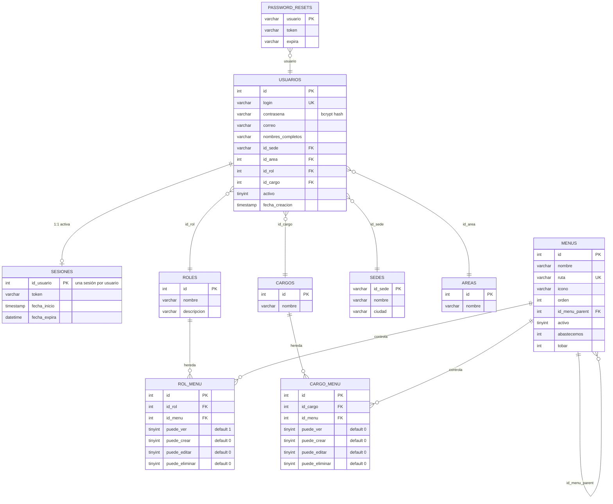
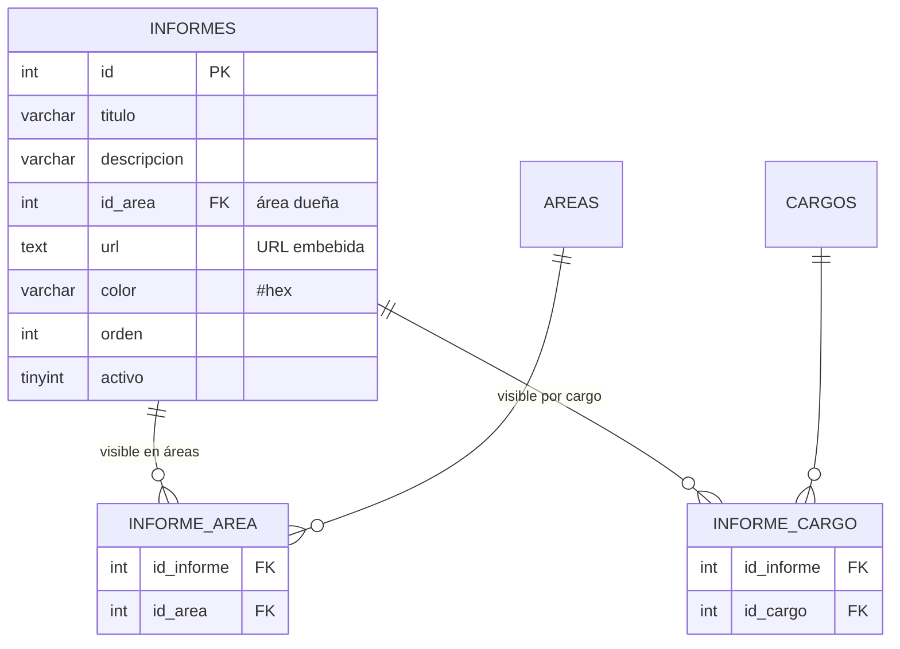
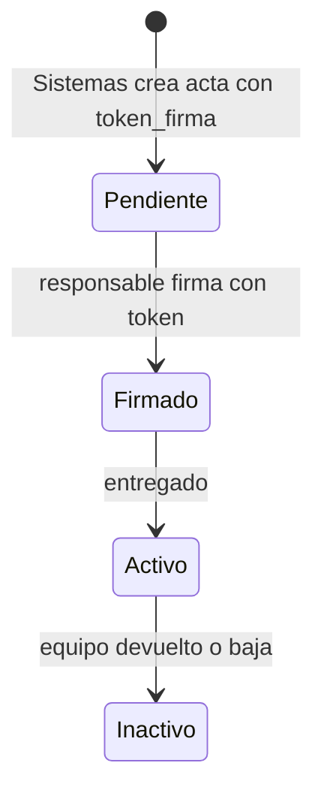
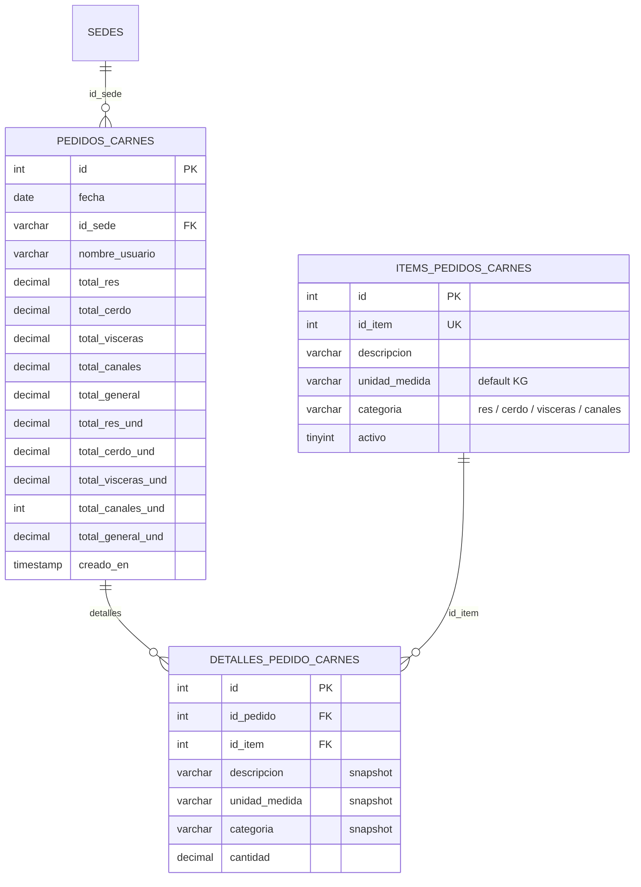
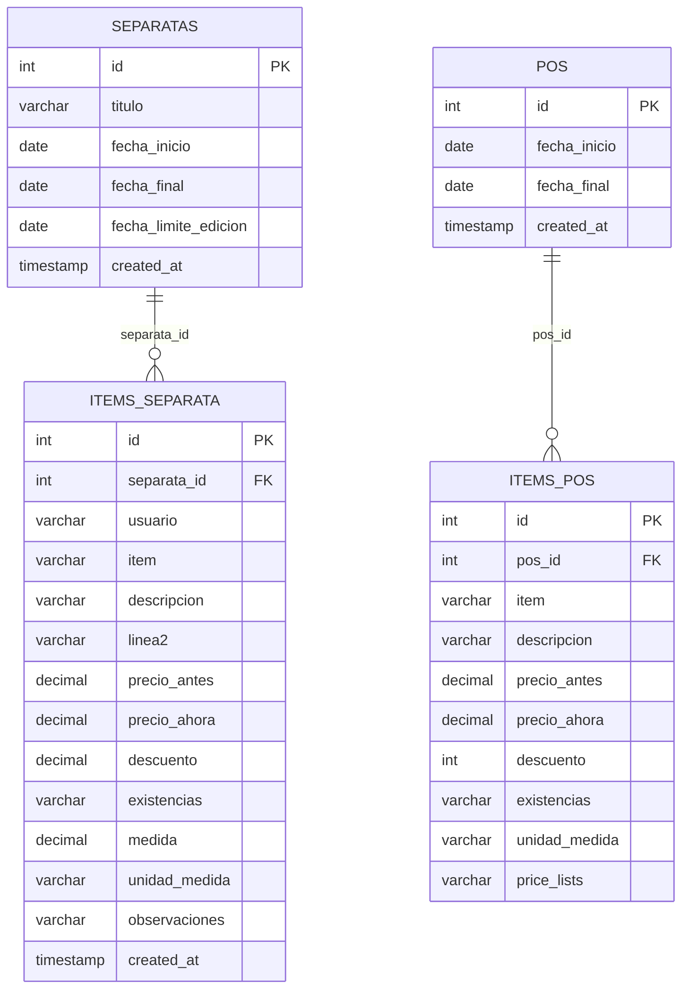
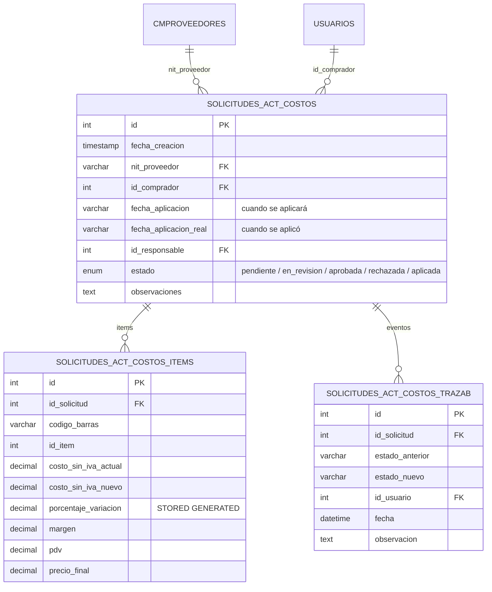
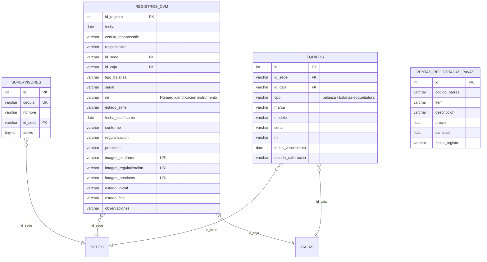
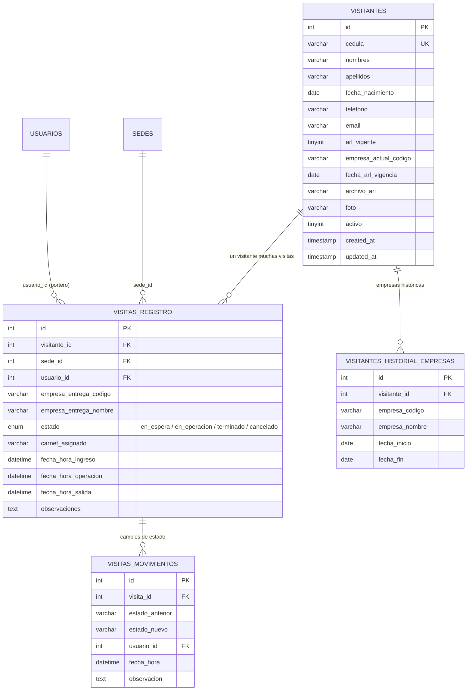
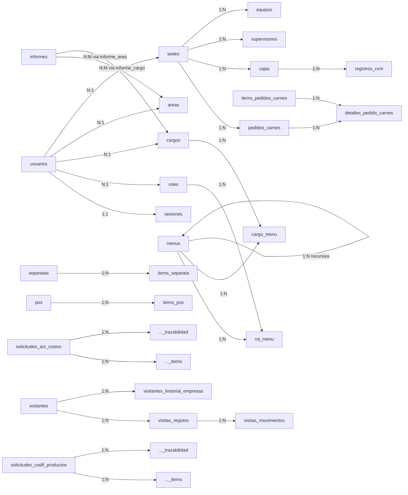

<div align="center">


# 14 · Base de Datos

**Documentación técnica — Aplicativo SEAO**

</div>

---

|                      |                                                                                                                   |
| -------------------- | ----------------------------------------------------------------------------------------------------------------- |
| **Documento**        | 14 — Base de Datos                                                                                                |
| **Versión**          | 1.0                                                                                                               |
| **Fecha**            | 14 de julio de 2026                                                                                               |
| **Depende de**       | 02 · Arquitectura · 03 · Backend · 05 · Framework · 08 · Infraestructura · 10 · Autenticación · 11 · Autorización |
| **Lo usan**          | 09 · APIs · 12 · Seguridad · 17 · Desarrollador · 19 · Operación · 23 · Módulos                                   |
| **Confidencialidad** | Uso interno                                                                                                       |

---

## 1 · Objetivo

Documentar el **modelo de datos** completo del sistema: las 63 tablas de MySQL con su esquema, agrupadas por dominio funcional, con diagramas entidad-relación (ERD) por bloque, cardinalidades, claves primarias y foráneas, y anotaciones semánticas. Se documenta también el **esquema PostgreSQL del ERP** (Siesa Biable) tal como es consultado por el framework LAN — con la advertencia de que **el modelo PostgreSQL no está bajo control del aplicativo**; se documenta a partir de las queries encontradas en `repo/modules/**`.

---

## 2 · Inventario general

### 2.1 Motores y ubicación

| BD                     | Motor        | Host   | Nombre                         | Tablas                  | Documentado en |
| ---------------------- | ------------ | ------ | ------------------------------ | ----------------------- | -------------- |
| **Aplicativo interno** | MySQL 8.0.37 | cPanel | `supermer_AplicativoSistemas`  | **63 tablas + 1 vista** | §3–§10         |
| ERP empresa A          | PostgreSQL   | LAN    | `biable01` (Abastecemos)       | (esquema del ERP)       | §11            |
| ERP empresa B          | PostgreSQL   | LAN    | `biable02` (Tobar)             | (idem estructural)      | §11            |
| Aplicativo Proveedores | MySQL        | cPanel | `supermer_AplicativoProveedor` | (fuera del alcance)     | §12            |

### 2.2 Charset y collation MySQL

- **Charset:** `utf8mb4` (soporte completo Unicode + emojis).
- **Collation:** dos convivientes:
  - `utf8mb4_0900_ai_ci` (default MySQL 8) — la mayoritaria.
  - `utf8mb4_unicode_ci` — usada en `api_keys`, `sys_logs`, `actas_entrega`, `historico_conciliacion_dian`, `proveedor_permisos_inventario`.

⚠ **Observación:** el uso mixto puede producir errores al hacer `JOIN` entre tablas con collations distintas. No se detectan JOINs problemáticos en el código actual, pero es un riesgo silencioso. Se documenta en 26.

### 2.3 Engine

Todas las tablas son **InnoDB** — soporta transacciones, foreign keys y row-level locking. Correcta elección para la carga transaccional del aplicativo.

---

## 3 · Agrupación por dominio funcional

Las 63 tablas se dividen en **11 dominios**:

```mermaid
flowchart TB
    subgraph SEG["🔐 Seguridad y sesión (10)"]
        SEG1[usuarios · sesiones · password_resets<br/>roles · cargos · areas · sedes<br/>menus · rol_menu · cargo_menu]
    end
    subgraph SIS["⚙️ Sistemas (5)"]
        SIS1[sys_logs · api_keys<br/>empresas · informes<br/>informe_area · informe_cargo]
    end
    subgraph ACT["📄 Actas y entregas TI (1)"]
        ACT1[actas_entrega]
    end
    subgraph FRV["🥬 Fruver (2)"]
        FRV1[items_fruver · items_pedido]
    end
    subgraph CAR["🥩 Carnes (3)"]
        CAR1[pedidos_carnes · items_pedidos_carnes<br/>detalles_pedido_carnes]
    end
    subgraph COM["🛒 Compras (6)"]
        COM1[separatas · items_separata · pos · items_pos<br/>solicitudes_actualizacion_costos + items + trazabilidad<br/>solicitudes_codificacion_productos + items + trazabilidad]
    end
    subgraph CTB["💰 Contabilidad / DIAN (2 + 1 vista)"]
        CTB1[cfg_auditoria_dian · historico_conciliacion_dian<br/>v_dias_conciliados — vista]
    end
    subgraph INV["📦 Inventario / ERP mirror (11)"]
        INV1[items · cod_barras · lista_precios · lista_precios_provee<br/>resumen_inventario · impuestos · criterios_itm_1<br/>checker1 · checker2 · checker5 · checker8 · checker11<br/>cmproveedores · proveedor_permisos_inventario<br/>cfg_averias_proveedores · cfg_bodegas_reporte<br/>cfg_existencias_lineas · cfg_existencias_locales]
    end
    subgraph CVM["⚖️ Sistemas / CVM (4)"]
        CVM1[registros_cvm · equipos · supervisores<br/>ventas_registradas_pavas]
    end
    subgraph SEC["🛡️ Seguridad de acceso físico (4)"]
        SEC1[visitantes · visitas_registro<br/>visitas_movimientos · visitantes_historial_empresas]
    end
    subgraph PUB["🖨️ Publicidad (1)"]
        PUB1[plantillas_etiquetas]
    end
    subgraph POS["🏪 POS / Sedes físicas (1)"]
        POS1[cajas]
    end
```



**Total: 63 tablas + 1 vista.** Distribuidas de esta forma:

| Dominio                 |           # tablas | Rol                                                          | Detalle en § |
| ----------------------- | -----------------: | ------------------------------------------------------------ | ------------ |
| Seguridad y sesión      |                 10 | Identidad, autenticación, RBAC                               | §4           |
| Sistemas / plataforma   |                  5 | Logs, API keys, empresas, informes                           | §5           |
| Actas de entrega TI     |                  1 | Actas firmadas de entrega de equipos                         | §6           |
| Fruver                  |                  2 | Catálogo y pedidos                                           | §7           |
| Carnes                  |                  3 | Pedidos con cabecera-detalle                                 | §7           |
| Compras                 | 6 + trazabilidades | Separatas, POS de compra, actualización costos, codificación | §7           |
| Contabilidad / DIAN     |        2 + 1 vista | Configuración e histórico de auditoría                       | §8           |
| Inventario ERP mirror   |                 11 | Réplica local del catálogo ERP                               | §9           |
| Sistemas / CVM          |                  4 | Verificación metrológica de balanzas                         | §10          |
| Seguridad acceso físico |                  4 | Visitantes y contratistas                                    | §10          |
| Publicidad              |                  1 | Plantillas de etiquetas                                      | §10          |
| POS / Sedes físicas     |                  1 | Terminales POS por sede                                      | §10          |

---

## 4 · Dominio: Seguridad y sesión

Ya cubierto extensivamente en 10 · Autenticación §2 y 11 · Autorización §3. Diagrama consolidado:



### Notas específicas de este dominio

- **`password_resets`** aparece en el schema pero **no hay endpoint activo** en el aplicativo interno que la use (ver 10 §10). Es residuo del aplicativo de proveedores o preparación para un feature futuro.
- **Foreign keys**: aunque los joins funcionan por convención de nombres, **no todas las FK están declaradas explícitamente** con `CONSTRAINT`. Es una relajación pragmática que facilita cargas masivas pero pierde integridad referencial. Se documenta en 26.

---

## 5 · Dominio: Sistemas / plataforma

### 5.1 Tablas

**`sys_logs`** — log centralizado (ver 03 §9.2, 08 §5.3):

| Columna       | Tipo         | Rol                                       |
| ------------- | ------------ | ----------------------------------------- |
| `id`          | bigint PK    | —                                         |
| `timestamp`   | datetime     | Momento del evento                        |
| `aplicacion`  | varchar(100) | Origen (`Cpanel`, `API_Biable_CentOS`, …) |
| `tipo_log`    | varchar(20)  | INFO / WARNING / ERROR / DEBUG            |
| `mensaje`     | text         | Mensaje humano-legible                    |
| `stack_trace` | text         | Opcional                                  |
| `usuario`     | varchar(100) | Login o "Sistema"                         |
| `ip`          | varchar(45)  | IPv4/IPv6                                 |
| `host`        | varchar(100) | Hostname del origen                       |
| `entorno`     | varchar(20)  | `produccion`, `desarrollo`, …             |
| `created_at`  | timestamp    | Auditoría                                 |

⚠ Riesgo documentado en 12 §10.2: sin política de rotación, la tabla crece indefinidamente.

**`api_keys`** — llaves de API para sistemas integrados:

| Columna      | Tipo         | Rol                                                                       |
| ------------ | ------------ | ------------------------------------------------------------------------- |
| `id`         | int PK       | —                                                                         |
| `llave`      | varchar(64)  | Token (⚠ almacenado en claro)                                             |
| `aplicacion` | varchar(100) | Descripción del cliente (`aplicativo proveedor`, `API_Biable_Logs`, etc.) |
| `activa`     | tinyint      | Bandera                                                                   |

**`empresas`** — catálogo maestro:

| Columna                                         | Ejemplo        |
| ----------------------------------------------- | -------------- |
| `codigo`                                        | `ABA`, `TOB`   |
| `descripcion`                                   | Razón social   |
| `direccion`, `barrio`, `ciudad`, `departamento` | Datos fiscales |

**`informes` + `informe_area` + `informe_cargo`** — dashboards embebidos (Power BI/Metabase/etc.) con control de acceso por área o por cargo:



**Semántica clara:** un informe pertenece a un área "dueña" (`informes.id_area`), pero puede ser visible por múltiples áreas y cargos mediante las tablas de relación.

---

## 6 · Dominio: Actas de entrega TI

**`actas_entrega`** — una fila = un acta firmada de entrega de equipo a un empleado.

Es una de las tablas más ricas del sistema, con 35+ columnas. Cubre:

- **Responsable**: `nombre_responsable`, `cargo_responsable`, `email`, `departamento`, `usuario`, `telefono`.
- **Equipo entregado**: `tipo_equipo` (enum `escritorio` / `portatil` / `no_aplica`), `nombre_equipo`, `marca_equipo`, `modelo_equipo`, `serial_equipo`, `condicion_equipo`, `procesador`, `ram`, `disco_duro`, `monitor`, `teclado`, `mouse`, `cargador`, `unidad_optica`, `id_activo`.
- **Otros equipos**: campo JSON `otros_equipos` para adjuntos ilimitados.
- **Software**: `software_aplica` boolean + `software_programas` texto libre.
- **Firma digital**: `firma_sistemas` (texto — probablemente base64 SVG), `firma_recibe` (JSON — probablemente `{svg, timestamp, ip}`), `token_firma` (32 chars).
- **Estado del ciclo**: `estado` (`activo`/`inactivo`/`pendiente`), `estado_firma` (`pendiente`/`firmado`).
- **Auditoría**: `fecha_creacion`, `fecha_actualizacion` (auto-update).

### 6.1 Flujo inferido



⚠ **Requiere análisis profundo del módulo Sistemas para confirmar el flujo** (ver README §3.2, item 4). El endpoint que genera y valida el `token_firma` aún no ha sido leído.

---

## 7 · Dominios: Fruver · Carnes · Compras

### 7.1 Fruver

Dos tablas simples:

- **`items_fruver`** — catálogo específico de frutas y verduras (item, descripción, valor_venta, costo_promedio, costo_ultimo).
- **`items_pedido`** — configuración de pedidos con **matriz por día de la semana** (lunes a domingo, cada uno `varchar(1)`) y campos `administrador`, `diario`, `comprador`, `observaciones`.

**Semántica:** define **qué se pide qué día**. Los pedidos concretos se persisten en el ERP vía otro flujo (no en MySQL), o bien en otras tablas no observadas.

### 7.2 Carnes — patrón cabecera-detalle



**Observación técnica:** los `detalles_*` guardan snapshots (descripción, unidad, categoría) del item al momento del pedido. Esto **desacopla** el pedido histórico de cambios futuros en el catálogo — cuando se renombra un item, los pedidos antiguos mantienen la descripción original.

### 7.3 Compras — separatas y POS

Dos patrones análogos (folletos de ofertas por temporada):



### 7.4 Compras — solicitudes con trazabilidad

Dos flujos de solicitud paralelos con estructura idéntica: **encabezado + items + trazabilidad (auditoría de cambios de estado)**.

**Actualización de costos:**



**Puntos técnicos destacables:**

- Columna **`porcentaje_variacion`** es una **columna generada** (`GENERATED ALWAYS AS ... STORED`) — MySQL la calcula automáticamente ante cada cambio de `costo_sin_iva_actual` o `costo_sin_iva_nuevo`. Buena decisión: elimina posibilidad de desincronía y no requiere trigger.
- **Estado enum** limitado a valores de negocio — bloquea inserciones erróneas.
- **Trazabilidad separada** en `_trazabilidad`: cada cambio de estado deja fila con `estado_anterior`, `estado_nuevo`, `usuario`, `fecha`, `observacion`. Es un patrón de **auditoría por evento**, no por snapshot.

**Codificación de productos** sigue exactamente el mismo patrón (encabezado + items + trazabilidad), con foco en:

- `foto_anverso`, `foto_reverso`, `archivo_adjunto` — rutas a `backend/files/**` (upload documentado en 06 §6).
- `item_asignado` — código de 6 caracteres asignado tras aprobación.
- `estado` enum: `Generado`/`En revision`/`Aprobado`/`Rechazado`/`Codificado`/`Corregir`.

---

## 8 · Dominio: Contabilidad / DIAN

### 8.1 `cfg_auditoria_dian` — configuración

Define las **reglas** con las que se compara la contabilidad Siesa contra los registros DIAN.

| Columna                      | Rol                                            |
| ---------------------------- | ---------------------------------------------- |
| `id` PK                      | —                                              |
| `categoria`                  | Bloque de negocio (`VENTAS`, `RECAUDOS`, etc.) |
| `tipo_documento`             | Tipo documental Siesa/DIAN                     |
| `sub_bloque`                 | Sub-categoría                                  |
| `grupo_sede`                 | Agrupación de sedes                            |
| `tipo_siesa`, `co_siesa`     | Coordenadas en el ERP                          |
| `descripcion`                | Etiqueta humana                                |
| `prefijos_dian`              | Lista de prefijos separados                    |
| `fecha_desde`, `fecha_hasta` | Rango de vigencia                              |
| `activo`                     | Bandera                                        |

### 8.2 `historico_conciliacion_dian` — resultado

Cada fila es una conciliación diaria completa (comentario de la tabla: _"Histórico inmutable"_).

| Columna                               | Rol                                                     |
| ------------------------------------- | ------------------------------------------------------- |
| `id` PK                               | —                                                       |
| `empresa`                             | `abastecemos` / `tobar` (default `abastecemos`)         |
| `fecha_conciliacion`                  | Fecha auditada                                          |
| `total_siesa_pdv` / `est` / `general` | Contadores del ERP                                      |
| `total_dian_pdv` / `est` / `general`  | Contadores DIAN                                         |
| `diferencia_general`                  | Diferencia entre lados                                  |
| `estado`                              | `OK` / `DESCUADRADO`                                    |
| `detalle_filas_json`                  | Detalle completo serializado en MEDIUMTEXT (~16 MB max) |
| `guardado_por`                        | Usuario que ejecutó la conciliación                     |
| `fecha_guardado`                      | Timestamp                                               |

**Diseño intencional:** el detalle vive en JSON dentro de la tabla — permite auditoría posterior sin re-consultar el ERP, aún si los datos cambian. Es un **libro contable inmutable**.

### 8.3 Vista `v_dias_conciliados`

⚠ El cuerpo de la vista **no pudo extraerse limpiamente del dump** (la línea `CREATE VIEW ... AS SELECT ...` es larga y compleja). Inferencia por su nombre y por el módulo que la usa (`AuditoriaRepo`): consulta agregada de días con estado por empresa. **Requiere extracción directa desde phpMyAdmin** para documentar.

---

## 9 · Dominio: Inventario / ERP mirror

Este es el dominio más grande (11 tablas). Su propósito es tener **datos maestros del ERP replicados localmente en MySQL** para consultas rápidas del aplicativo sin cruzar el túnel.

### 9.1 Réplica del catálogo maestro

| Tabla MySQL            | Origen ERP                    | Uso                                       |
| ---------------------- | ----------------------------- | ----------------------------------------- |
| `items` (~40 columnas) | `items` de Siesa              | Catálogo maestro completo                 |
| `cod_barras`           | `cod_barras` de Siesa         | Códigos de barras por item + presentación |
| `lista_precios`        | `lista_precios_d` de Siesa    | Precios oficiales por lapso               |
| `lista_precios_provee` | (adyacente)                   | Precios negociados con proveedores        |
| `cmproveedores`        | `proveedores` de Siesa        | Catálogo maestro de proveedores           |
| `resumen_inventario`   | `resumen_inventario` de Siesa | Existencias mensuales por sede            |
| `impuestos`            | `impuestos` de Siesa          | Catálogo de impuestos aplicables          |
| `criterios_itm_1`      | `criterios_itm_1` de Siesa    | Criterio de clasificación de items        |

### 9.2 Réplica por sede — tablas `checker*`

Cinco tablas idénticas en estructura (`checker1`, `checker2`, `checker5`, `checker8`, `checker11`) — una por sede consumidora del Lector de Precios:

```sql
CREATE TABLE checker1 (
  id_codbar   varchar(40) NOT NULL,   -- código de barras (PK lógica)
  id_item     varchar(6),
  descripcion varchar(40),
  precio      int,
  contenido   int,
  factor      varchar(10)
);
```

Alimentadas por cronjobs (`subir_checker_mysql*.php` — ver 08 §7). **Deuda estructural:** la duplicación de tabla por sede podría reemplazarse por una sola tabla con columna `id_sede` (documentado en 26).

### 9.3 Configuraciones de reportes

Tablas `cfg_*` con datos de configuración editables desde el aplicativo:

| Tabla                     | Propósito                                                                                |
| ------------------------- | ---------------------------------------------------------------------------------------- |
| `cfg_bodegas_reporte`     | Bodegas incluidas en el reporte de bodegas alternas; `tipo_bodega` = `VENTA` / `ALTERNA` |
| `cfg_existencias_lineas`  | Líneas incluidas en el reporte Existencias/Costos + `dias_cobertura` esperados           |
| `cfg_existencias_locales` | Sedes incluidas en el mismo reporte                                                      |
| `cfg_averias_proveedores` | Proveedores marcados para el reporte de averías                                          |
| `cfg_auditoria_dian`      | ya cubierta en §8.1                                                                      |

Todas comparten patrón: `codigo` + `descripcion` + `activo` + `creado_por` + `modificado_por` + timestamps.

### 9.4 `proveedor_permisos_inventario`

Configuración por proveedor **para el aplicativo de proveedores adyacente**:

| Columna                                                                                         | Rol                          |
| ----------------------------------------------------------------------------------------------- | ---------------------------- |
| `nit_proveedor`                                                                                 | PK lógica                    |
| `razon_social`                                                                                  | Info                         |
| `acceso_inventario`                                                                             | Boolean maestro              |
| `origen_consulta_saldo`                                                                         | `NIT` / etc.                 |
| `criterios`, `columnas_permitidas`, `sedes_permitidas`, `lapsos_permitidos`, `lineas_excluidas` | TEXT con listas serializadas |
| `actualizado_por`, `updated_at`                                                                 | Auditoría                    |

Define **qué puede ver cada proveedor** del inventario compartido. Se administra desde el aplicativo interno pero se consume desde el aplicativo de proveedores (ver 08 §10).

---

## 10 · Dominios: CVM · Seguridad física · Publicidad · POS

### 10.1 CVM (Control Volumétrico Metrológico)

Módulo para verificación de balanzas conforme a la resolución SIC en Colombia.



- **`registros_cvm`** — el evento operativo: qué balanza se verificó, cuándo, con qué resultado, con evidencias fotográficas.
- **`supervisores`** — catálogo de personas autorizadas para verificar por sede.
- **`equipos`** — catálogo maestro de las balanzas y sus certificaciones vigentes.
- **`ventas_registradas_pavas`** — ⚠ semántica no clara del nombre. Requiere análisis profundo (posiblemente ventas registradas en pavas/POS específicos para verificación de peso).

### 10.2 Seguridad física — control de visitantes



**Diseño notable:**

- **`visitas_movimientos`** replica el patrón de trazabilidad de compras — cada cambio de estado deja rastro auditable.
- **`visitantes_historial_empresas`** permite trazar cuándo el visitante trabajaba para qué empresa (útil para contratistas rotativos).
- El **estado `en_operacion`** (entre `en_espera` y `terminado`) representa el tiempo real en el que la persona está haciendo trabajo dentro de la sede.

### 10.3 Publicidad — `plantillas_etiquetas`

Tabla mínima:

| Columna                      | Tipo           | Rol                                                    |
| ---------------------------- | -------------- | ------------------------------------------------------ |
| `id`                         | varchar(50) PK | ID lógico legible                                      |
| `name`                       | varchar(100)   | Nombre visible                                         |
| `width`, `height`, `padding` | int            | Dimensiones canvas                                     |
| `fields`                     | longtext       | JSON con la definición completa de campos posicionados |
| `updated_at`                 | timestamp      | Auto-update                                            |

Todo el diseño de la plantilla vive **serializado en `fields`**. El módulo `TemplateCanvas.jsx` (04 §16) es quien deserializa y re-serializa al editar.

### 10.4 POS / Sedes físicas — `cajas`

| Columna   | Rol                                               |
| --------- | ------------------------------------------------- |
| `id` PK   | —                                                 |
| `id_sede` | FK a sedes                                        |
| `id_caja` | Código del POS dentro de la sede                  |
| `ip`      | IP interna del POS                                |
| `sistema` | SO del POS (`ROCKY LINUX 8.10`, `CENTOS 7`, etc.) |

Es el inventario de terminales POS de las sedes. Consumido por CVM (para asociar balanzas a caja).

---

## 11 · Esquema PostgreSQL — ERP Siesa Biable

**Este esquema no está bajo control del aplicativo.** Se documenta a partir de las queries encontradas en `repo/modules/**`. El detalle es informativo — cualquier cambio real al esquema debe consultarse con el equipo del ERP.

### 11.1 Tablas maestras leídas

| Tabla                                          | Propósito             | Módulos que la consultan                           |
| ---------------------------------------------- | --------------------- | -------------------------------------------------- |
| `items`                                        | Catálogo maestro      | `inventario_item`, `averias`, `existencias_costos` |
| `bodegas`                                      | Bodegas y locales     | `bodegas`, `bodegas_alternas`                      |
| `centro_operacion`                             | Centros de operación  | Contabilidad, DIAN                                 |
| `centro_costo`                                 | Centros de costo      | Contabilidad                                       |
| `motivos`                                      | Motivos de movimiento | `motivos`                                          |
| `lineas`                                       | Líneas de producto    | `lineas`                                           |
| `terceros`                                     | Personas y empresas   | Contabilidad, Retenciones                          |
| `proveedores` / `cmproveedores`                | Proveedores           | Auxiliar, Averías                                  |
| `ciudades`                                     | Catálogo geográfico   | Retenciones                                        |
| `impuestos`                                    | Impuestos             | Comprobantes                                       |
| `cuentas_contab`                               | Plan de cuentas       | Libro auxiliar                                     |
| `proyectos`, `vendedores`, `unidades_emp_adic` | Otros catálogos       | Varios                                             |

### 11.2 Tablas transaccionales leídas

| Tabla                                           | Propósito                                    | Módulos              |
| ----------------------------------------------- | -------------------------------------------- | -------------------- |
| `cmmedios_recaudo` (schema `public`)            | Medios de recaudo                            | `recaudos`           |
| `cmmovimiento_pdv`                              | Movimientos PDV                              | Auditoría DIAN       |
| `cmmovimiento_ventas`                           | Movimientos ventas                           | Auditoría DIAN       |
| `movimiento_contable` / `cgmovimiento_contable` | Contable                                     | Libro auxiliar       |
| `movimiento_inventario`                         | Inventario                                   | Reportes             |
| `movimiento_ventas`                             | Ventas                                       | Reportes             |
| `desc_tecnicas`                                 | Descripciones técnicas de items              | Existencias          |
| `ultimo_periodo`                                | Vista/tabla de referencia del último periodo | Averías, Existencias |
| `cmlista_precios_d`                             | Detalle de lista de precios                  | Auxiliar, Averías    |

### 11.3 Convenciones observables

- Nombres en **snake_case, todo minúsculas**.
- Prefijos temáticos: `cm*` (comercial), `cg*` (contable general), `movimiento_*` (transaccional).
- **Sin schema explícito** en la mayoría de queries (usa el schema por defecto), salvo `public.cmmedios_recaudo`.

⚠ **Limitaciones de esta documentación:**

- No hay dump PostgreSQL entregado, así que no se conoce el detalle completo de columnas ni relaciones.
- Se marca como "esquema inferido" — el mantenedor del ERP es la fuente autoritativa.

---

## 12 · Base MySQL adyacente: `supermer_AplicativoProveedor`

Fuera del alcance de los ZIP entregados. Referenciada desde:

- `backend/api/config/database_proveedor.php`
- Registro en `api_keys` (llave para "aplicativo proveedor")

Tablas compartidas visibles (referenciadas desde el aplicativo interno):

- **`proveedor_permisos_inventario`** (documentada en §9.4).
- **`lista_precios_provee`** — precios negociados.
- Contactos y accesos de proveedores (⚠ no observables sin el ZIP correspondiente).

---

## 13 · Índices y claves

### 13.1 Índices declarados

Todos los `ALTER TABLE ... ADD PRIMARY KEY` y `ADD KEY` se aplican al final del dump. Índices clave documentados en el análisis:

- **`sesiones`**: PK (`id_usuario`), KEY (`token`), KEY (`fecha_expira`) — cubre las búsquedas de auth.
- **`usuarios`**: PK (`id`), AUTO_INCREMENT — 72 registros al momento del dump.
- **`sys_logs`**: PK (`id`) bigint — permite crecimiento masivo.
- **`historico_conciliacion_dian`**: PK (`id`) UNSIGNED int — un registro por día por empresa.

### 13.2 Foreign keys

⚠ **No todas las FK están declaradas** con `CONSTRAINT`. Los joins funcionan por convención de nombres pero la integridad referencial no está garantizada a nivel BD. Es una decisión pragmática común en aplicaciones que hacen imports masivos, pero implica que:

- Un `DELETE` sobre `usuarios` no bloquea aunque queden filas huérfanas en `sesiones`, `sys_logs`, `pedidos_carnes`, etc.
- No hay `ON DELETE CASCADE` automático.
- La aplicación debe cuidar la integridad manualmente.

Se documenta como **deuda técnica media** en 26.

---

## 14 · Cardinalidades — mapa consolidado

Diagrama simplificado de las relaciones más importantes entre dominios:



---

## 15 · Recomendaciones (para 25 y 26)

### 15.1 Consolidadas

1. **Uniformar collation** — migrar todo a `utf8mb4_unicode_ci` para evitar JOIN incompatibles.
2. **Declarar FK con `CONSTRAINT`** al menos en las relaciones críticas (sesiones→usuarios, detalles→pedidos, items→solicitudes). Mejora integridad y facilita ORM futuro.
3. **Consolidar `checker1..11` en una sola tabla** con `id_sede` como columna. Reduce mantenimiento de 5 endpoints a 1.
4. **Política de retención** para `sys_logs` (job de purga mensual, mantener últimos 6 meses).
5. **Índices adicionales sugeridos**:
   - `usuarios(login)` UNIQUE (previene duplicados y acelera login).
   - `usuarios(correo)` UNIQUE (previene el "conflicto de identidad" del SSO Microsoft antes de ocurra).
   - `sys_logs(timestamp)` — todas las queries de trace filtran por rango temporal.
   - `sys_logs(usuario, timestamp)` — trace por usuario.
   - `visitas_registro(estado)` — el dashboard filtra por estado activo.
6. **Extraer la vista `v_dias_conciliados`** desde phpMyAdmin y documentar su cuerpo SQL.
7. **Migrar `password_resets`** a su aplicativo real (proveedores) o eliminarla del dump del aplicativo interno.
8. **Considerar particionamiento** por año en `sys_logs` cuando supere ~10M de filas.

---

## 16 · Puntos pendientes de análisis profundo

- **Vista `v_dias_conciliados`** — cuerpo SQL no extraíble limpiamente del dump.
- **Semántica de `ventas_registradas_pavas`** — nombre ambiguo.
- **`actas_entrega`** — flujo completo del `token_firma` (creación, envío, validación) requiere lectura del módulo Sistemas.
- **Volumen actual de cada tabla** — no observable sin acceso live.
- **PostgreSQL** — se necesita dump o consulta directa para documentar tipos, tamaños y foreign keys reales.
- **`items_pedido` de Fruver** — se define un catálogo de qué se pide qué día, pero no está claro dónde se persisten los pedidos concretos.

---

## 17 · Referencias cruzadas

| Necesitas saber…                             | Documento                                                 |
| -------------------------------------------- | --------------------------------------------------------- |
| Tablas de identidad y sesión en profundidad  | [10 · Autenticación](./10-autenticacion.md)               |
| Matriz de permisos                           | [11 · Autorización](./11-autorizacion.md)                 |
| Framework que consulta PostgreSQL            | [05 · Framework Interno](./05-framework-interno.md)       |
| Backend que consulta MySQL                   | [03 · Arquitectura Backend](./03-arquitectura-backend.md) |
| Endpoints con SQL específico por tabla       | [09 · APIs](./09-api-endpoints.md)                        |
| Módulos por dominio con sus tablas asociadas | [23 · Módulos](./23-modulos/README.md)                    |
| Deuda técnica sobre schema                   | [26 · Deuda Técnica](./26-deuda-tecnica.md)               |
| Backups y operación de BD                    | [19 · Manual de Operación](./19-manual-operacion.md)      |

---

<div align="center">
<sub><b>Supermercados Belalcázar</b> · Documento 14 — Base de Datos · v1.0 · 14 de julio de 2026</sub>
</div>
