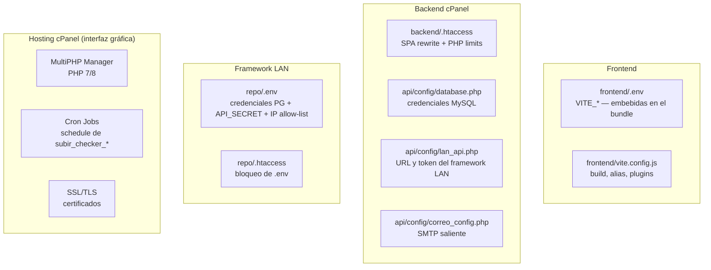

<div align="center">


# 15 · Configuración

**Documentación técnica — Aplicativo SEAO**

</div>

---

|                      |                                                                                               |
| -------------------- | --------------------------------------------------------------------------------------------- |
| **Documento**        | 15 — Configuración                                                                            |
| **Versión**          | 1.0                                                                                           |
| **Fecha**            | 14 de julio de 2026                                                                           |
| **Depende de**       | 02 · Arquitectura · 04 · Frontend · 05 · Framework · 08 · Infraestructura · 13 · Dependencias |
| **Lo usan**          | 12 · Seguridad · 16 · Deploy · 17 · Desarrollador · 19 · Operación                            |
| **Confidencialidad** | Uso interno — sensible (contiene referencias a secretos)                                      |

---

## 1 · Objetivo

Documentar **toda la configuración** del sistema: variables de entorno por componente, archivos `.env`, archivos `.htaccess` de Apache, `vite.config.js` del frontend, archivos de configuración PHP (`config/*.php`), y las decisiones operativas encapsuladas en cada uno.

Este documento **no expone secretos**: los valores sensibles (contraseñas, tokens, client secrets) se referencian por su nombre y ubicación, pero sus valores reales quedan en los archivos del hosting/servidor.

---

## 2 · Panorama general

Configuración distribuida en **cuatro planos**:



---

## 3 · Frontend — `frontend/.env`

Archivo cargado por Vite durante `npm run build`. **Todo lo prefijado con `VITE_` queda embebido en el bundle JS** distribuido al navegador (ver [04 §15](./04-arquitectura-frontend.md) y [12 §6.1](./12-seguridad.md)).

### 3.1 Variables observadas

| Variable                       | Rol                                          | Sensibilidad                        | Ejemplo (redactado)                                 |
| ------------------------------ | -------------------------------------------- | ----------------------------------- | --------------------------------------------------- |
| `VITE_API_BASE_URL`            | URL base del backend cPanel                  | 🟢 Baja                             | `https://aplicativo.supermercadobelalcazar.com/api` |
| `VITE_MICROSOFT_TENANT_ID`     | Tenant Azure AD del SSO                      | 🟢 Baja (OAuth público)             | `xxxxxxxx-xxxx-xxxx-xxxx-xxxxxxxxxxxx`              |
| `VITE_MICROSOFT_CLIENT_ID`     | Client ID de la app registrada               | 🟢 Baja (OAuth público)             | `yyyyyyyy-yyyy-yyyy-yyyy-yyyyyyyyyyyy`              |
| `VITE_MICROSOFT_REDIRECT_URI`  | Redirect URI OAuth                           | 🟢 Baja                             | `https://aplicativo.…/login/microsoft-callback`     |
| `VITE_LECTOR_PASSWORD`         | Contraseña de acceso al Lector de Precios    | 🔴 **ALTA — embebida en el bundle** | Ver §3.3                                            |
| `VITE_WEBSOCKET_AGENT_PRINTER` | URL del agente WebSocket local               | 🟡 Media                            | `ws://127.0.0.1:8181`                               |
| `VITE_TOKEN_AGENT_PRINTER`     | Token para autenticar al agente de impresora | 🔴 **ALTA — embebida en el bundle** | Ver §3.3                                            |

### 3.2 Uso desde el código

```javascript
// frontend/src/utils/http/config.js
export const API_BASE_URL = import.meta.env.VITE_API_BASE_URL;
```

Vite reemplaza `import.meta.env.VITE_*` por el valor literal en tiempo de build. **Cambiar cualquier valor requiere rebuild + redeploy** — no se puede cambiar en caliente.

### 3.3 Variables con problema de seguridad

**`VITE_LECTOR_PASSWORD`:** el frontend compara la contraseña ingresada localmente contra este valor. **Cualquier usuario con DevTools puede leerla del bundle**. Recomendación (12/25): migrar el gate a un endpoint backend que reciba la contraseña por POST y responda `success:true|false`.

**`VITE_TOKEN_AGENT_PRINTER`:** el frontend lo envía al agente WebSocket local al iniciar la conexión. Como el agente solo escucha en `127.0.0.1:8181` (loopback), el riesgo se limita a alguien con acceso físico o RDP a la máquina. Aún así, hacerlo público en el bundle no aporta y sí facilita el análisis. Recomendación: **considerar mutual auth** (agente firma un challenge al frontend y viceversa).

### 3.4 Convenciones

- Todas las variables **deben** empezar con `VITE_` para que Vite las exponga.
- Nombres en mayúsculas + guiones bajos.
- Valores sin comillas (Vite lee el archivo como pares clave=valor).

---

## 4 · Frontend — `vite.config.js`

Fuente: `frontend/vite.config.js`. Bloques relevantes:

### 4.1 Plugins

```javascript
plugins: [
  react(),
  viteImagemin({
    gifsicle: { optimizationLevel: 7, interlaced: false },
    optipng: { optimizationLevel: 7 },
    mozjpeg: { quality: 80 },
    pngquant: { quality: [0.8, 0.9], speed: 4 },
    svgo: {
      plugins: [
        { name: "removeViewBox" },
        { name: "removeEmptyAttrs", active: false },
      ],
    },
  }),
];
```

- **`react()`** — Fast Refresh + JSX transform.
- **`viteImagemin`** — optimiza imágenes de `src/assets/` durante el build. Configuración conservadora: JPEG 80% (buen balance calidad/tamaño), PNG con `pngquant` en calidad 80-90% con `speed: 4`.

### 4.2 CSS Modules

```javascript
css: {
  modules: {
    localsConvention: 'camelCase',
    generateScopedName: '[name]__[local]___[hash:base64:5]'
  }
}
```

- **`localsConvention: 'camelCase'`** — permite `styles.miClase` en JS aunque el CSS lo declare `.mi-clase`.
- **`generateScopedName`** — hashes cortos (5 caracteres base64) para que las clases finales sean legibles en DevTools.

### 4.3 Aliases

```javascript
resolve: {
  alias: {
    '@':           path.resolve(__dirname, './src'),
    '@components': path.resolve(__dirname, './src/components'),
  }
}
```

Cualquier import puede usar `@/services/api` en lugar de rutas relativas largas.

### 4.4 Build

```javascript
build: {
  outDir: 'dist',
  assetsDir: 'assets',
  rollupOptions: {
    output: {
      manualChunks: {
        vendor: ['react', 'react-dom']
      }
    }
  }
}
```

- **Chunk separado `vendor.js`** con React + ReactDOM. Los usuarios recuperan cache al actualizar el resto del código.

### 4.5 Dev server

```javascript
server: {
  port: 3000,
  open: true,
  host: true,
}
```

- **`host: true`** — el dev server escucha en `0.0.0.0`, accesible desde la LAN. Útil para probar desde móviles internos, pero **no debe usarse en redes públicas**.

---

## 5 · Backend cPanel — `.htaccess`

Ubicado en `backend/backend/.htaccess`. Este archivo gobierna Apache para el **frontend estático + backend PHP**.

### 5.1 Bloques principales

**1. SPA routing** — reescribe URLs desconocidas a `/index.html`:

```apache
RewriteEngine On
RewriteCond %{REQUEST_FILENAME} !-f
RewriteCond %{REQUEST_FILENAME} !-d
RewriteCond %{REQUEST_URI} !^/api/
RewriteRule ^ index.html [QSA,L]
```

- `!-f` y `!-d`: solo si no coincide con archivo o directorio real.
- `!^/api/`: excluye las URLs del backend (no queremos que `/api/foo.php` caiga en `index.html`).
- `[QSA,L]`: preserva query string, última regla.

**2. Cache long-term para assets con hash:**

```apache
<FilesMatch "\.(js|css|png|jpg|jpeg|gif|svg|woff|woff2|ttf|eot)$">
  Header set Cache-Control "max-age=31536000, immutable"
</FilesMatch>
```

- **1 año + `immutable`** — los assets llevan hash en el nombre (`main-abc123.js`), así que nunca cambian sin cambiar la URL.

**3. No cache para el HTML principal:**

```apache
<FilesMatch "\.(html|htm)$">
  Header set Cache-Control "no-store, no-cache, must-revalidate, proxy-revalidate, max-age=0"
</FilesMatch>
```

- El `index.html` **nunca se cachea** — así los usuarios ven el bundle nuevo al momento del deploy.

**4. Límites PHP elevados (duplicados para PHP 7 y PHP 8):**

```apache
<IfModule mod_php7.c>
  php_value upload_max_filesize  300M
  php_value post_max_size        300M
  php_value memory_limit         512M
  php_value max_execution_time   300
  php_value max_input_time       300
</IfModule>
<IfModule mod_php8.c>
  php_value upload_max_filesize  300M
  ...
</IfModule>
```

Necesarios para:

- Uploads de PDFs (Codificación de Productos).
- Cargas masivas de inventario (`update_inventario.php`).
- Cronjobs de precios que procesan MB de archivos.

⚠ **Solo la que coincide con la versión activa surte efecto.** cuál está activa depende del **MultiPHP Manager** de cPanel — no observable desde código.

### 5.2 Faltantes recomendados (ver 12 §6.4 y §6.5)

Los siguientes headers **no están** en el `.htaccess` actual y se recomiendan:

```apache
<IfModule mod_headers.c>
  Header always set Strict-Transport-Security "max-age=31536000; includeSubDomains"
  Header always set X-Content-Type-Options "nosniff"
  Header always set X-Frame-Options "DENY"
  Header always set Referrer-Policy "strict-origin-when-cross-origin"
  Header always set Content-Security-Policy "default-src 'self'; ..."
</IfModule>
```

---

## 6 · Backend cPanel — archivos de configuración PHP

Ubicados en `backend/backend/api/config/`. Cinco archivos.

### 6.1 `database.php`

Clase `Database` que expone `getConnection()` → PDO MySQL contra `supermer_AplicativoSistemas`.

```php
class Database {
    private $host = 'localhost';
    private $db_name = 'supermer_AplicativoSistemas';
    private $username = 'supermer_Jonathan';
    private $password = '***REDACTED***';
    // ...
}
```

⚠ **Credenciales hardcoded** — deuda documentada en 12 §7 e ítem crítico de 25/26.

**Atributos PDO establecidos:**

- `ERRMODE_EXCEPTION` (todos los errores lanzan `PDOException`).
- `DEFAULT_FETCH_MODE = FETCH_ASSOC` (arrays asociativos).

### 6.2 `database_proveedor.php`

Idéntica en estructura a `database.php`, apuntando a `supermer_AplicativoProveedor` (BD del aplicativo adyacente — ver [02 §4.1 · C10](./02-arquitectura-general.md)).

Consumida por endpoints puntuales que necesitan cruzar información con la BD de proveedores.

### 6.3 `lan_api.php`

Constantes que consume `LanClient::post`:

| Constante         | Valor observado                                                 | Uso                                                              |
| ----------------- | --------------------------------------------------------------- | ---------------------------------------------------------------- |
| `LAN_API_URL`     | `https://api-biable.supermercadobelalcazar.com/ngrok/index.php` | URL del framework LAN                                            |
| `LAN_API_TOKEN`   | `***REDACTED*** (64 hex)`                                       | Bearer M2M — **debe coincidir con `API_SECRET` del `repo/.env`** |
| `LAN_API_TIMEOUT` | `60`                                                            | Timeout cURL en segundos (algunos endpoints lo sobreescriben)    |

⚠ **Duplicación del token M2M** — mismo valor en `repo/.env` (`API_SECRET`) y en este archivo. Rotarlo requiere sincronía manual. Recomendación (25): cargar desde variable de entorno del hosting.

### 6.4 `correo_config.php`

Retorna un array asociativo con la configuración SMTP:

```php
return [
    'host'     => 'mail.supermercadobelalcazar.com',
    'port'     => 465,
    'username' => 'no-responder@supermercadobelalcazar.com',
    'password' => '***REDACTED***',
    'encryption' => 'ssl',
];
```

Consumido por PHPMailer en cronjobs (`verificar_registros_cvm.php`) y endpoints de aprobación/rechazo de solicitudes.

### 6.5 `correo_config2.php`

Variante con distinta cuenta remitente. ⚠ Uso exacto pendiente de confirmar (posiblemente para notificaciones al aplicativo de proveedores). Se documenta como pendiente en README §3.2.

---

## 7 · Framework LAN — `repo/.env`

Cargado por `Env::load()` (ver [05 §4.2](./05-framework-interno.md)). Es el archivo de configuración **más sensible** del sistema.

### 7.1 Variables observadas

| Variable        | Rol                                          | Sensibilidad |
| --------------- | -------------------------------------------- | ------------ |
| `DB_HOST`       | Host PostgreSQL — típicamente `localhost`    | 🟢 Baja      |
| `DB_PORT`       | Puerto — `5432`                              | 🟢 Baja      |
| `DB_NAME`       | BD por defecto — `biable01` (Abastecemos)    | 🟢 Baja      |
| `DB_USER`       | Usuario PG — `biable01`                      | 🔴 Alta      |
| `DB_PASS`       | Password PG                                  | 🔴 Alta      |
| `DB_USER_TOBAR` | Usuario PG para `biable02` (opcional)        | 🔴 Alta      |
| `DB_PASS_TOBAR` | Password PG para `biable02` (opcional)       | 🔴 Alta      |
| `API_SECRET`    | Bearer M2M **compartido con backend cPanel** | 🔴 Alta      |
| `ALLOWED_IP`    | IP allow-list separadas por coma             | 🟡 Media     |
| `LOG_API_URL`   | URL de la API central de logs                | 🟢 Baja      |
| `LOG_API_KEY`   | API key para postear logs                    | 🔴 Alta      |
| `APP_ENV`       | Entorno (`produccion`, `desarrollo`)         | 🟢 Baja      |

### 7.2 Ejemplo de estructura (con valores redactados)

```env
DB_HOST=localhost
DB_PORT=5432
DB_NAME=biable01
DB_USER=biable01
DB_PASS=***REDACTED***

# Selección alterna para empresa Tobar (opcional)
DB_USER_TOBAR=biable02
DB_PASS_TOBAR=***REDACTED***

# Token compartido con backend cPanel — debe coincidir con LAN_API_TOKEN
API_SECRET=***REDACTED_64_HEX***

# IPs autorizadas para llamar al framework
ALLOWED_IP=190.8.176.113,104.21.92.122,190.71.74.202,127.0.0.1

# API central de logs
LOG_API_URL=https://aplicativo.supermercadobelalcazar.com/api/logs/ingest.php
LOG_API_KEY=***REDACTED***

APP_ENV=produccion
```

### 7.3 Composición de `ALLOWED_IP`

Cuatro entradas identificadas — hipótesis de propósito:

| IP              | Propósito hipotético                                |
| --------------- | --------------------------------------------------- |
| `190.8.176.113` | IP pública del hosting cPanel                       |
| `104.21.92.122` | Rango de Cloudflare (puede variar)                  |
| `190.71.74.202` | IP fija de la oficina Belalcázar                    |
| `127.0.0.1`     | Localhost del propio servidor LAN (pruebas locales) |

⚠ **Recomendación operativa:** revisar semestralmente que las IPs siguen siendo válidas. Cloudflare rota sus rangos ocasionalmente.

---

## 8 · Framework LAN — `repo/.htaccess`

Bloquea el acceso HTTP directo al `.env` desde el navegador:

```apache
<Files ".env">
  Order Allow,Deny
  Deny from all
</Files>
```

⚠ **No cubre explícitamente `.env.bak`** que también existe en el mismo directorio. Debe reforzarse (ver 12 §7.3):

```apache
<FilesMatch "^\.env">
  Order Allow,Deny
  Deny from all
</FilesMatch>
```

Adicionalmente, se recomienda mover el `.env` fuera del docroot en el próximo deploy del framework LAN, y usar `Env::load(__DIR__ . '/../.env')` con path relativo — el archivo dejaría de ser accesible por HTTP incluso si se saltara el `.htaccess`.

---

## 9 · Configuración del hosting cPanel

Elementos que **no viven en el código** pero forman parte de la configuración operacional.

| Elemento            | Ubicación                 | Documentado en                                             |
| ------------------- | ------------------------- | ---------------------------------------------------------- |
| Versión PHP activa  | MultiPHP Manager          | [08 §5.2](./08-diagramas-infraestructura.md) — ⚠ verificar |
| Cronjobs scheduling | Cron Jobs → cPanel UI     | [08 §7.4](./08-diagramas-infraestructura.md) — ⚠ pendiente |
| Certificados SSL    | AutoSSL o Let's Encrypt   | ⚠ pendiente para 19                                        |
| Cuotas de disco     | cPanel Home               | ⚠ pendiente para 19                                        |
| Backup automático   | JetBackup / cPanel Backup | ⚠ pendiente para 19                                        |

---

## 10 · Configuración del ambiente Cloudflare

Elementos gestionados desde el dashboard Cloudflare — no accesibles desde el código.

| Elemento      | Descripción                     | Recomendación                                |
| ------------- | ------------------------------- | -------------------------------------------- |
| SSL/TLS mode  | Debe ser **Full Strict**        | Verificar (ver [12 §4.3](./12-seguridad.md)) |
| WAF rules     | Reglas custom                   | Documentar en 19                             |
| Rate limiting | Reglas de tasa por IP/URL       | Considerar en /api/login.php                 |
| DNS records   | A/CNAME/AAAA de los subdominios | Verificar TTLs razonables (300 s)            |
| Tunnel config | Reglas ingress de `cloudflared` | Documentar en 19                             |

---

## 11 · Configuración del sistema operativo del servidor LAN

Componentes que hacen falta para que el framework LAN funcione. ⚠ Todos requieren consulta a operación.

| Componente                  | Configuración                                                                | Documentado en |
| --------------------------- | ---------------------------------------------------------------------------- | -------------- |
| Servidor web (Apache/Nginx) | Docroot apuntando a `repo/`                                                  | ⚠ 19           |
| `cloudflared` daemon        | `config.yml` con hostname → servicio                                         | ⚠ 19           |
| PostgreSQL                  | `pg_hba.conf`, `postgresql.conf`, permisos por usuario `biable01`/`biable02` | ⚠ 19           |
| Firewall local              | Debe permitir puerto 443 saliente (para el túnel)                            | ⚠ 19           |
| Zona horaria del sistema    | Debe ser `America/Bogota` (coincide con `date_default_timezone_set` de PHP)  | ⚠ 19           |

---

## 12 · Consolidado — inventario de archivos de configuración

Vista rápida de todos los archivos que un desarrollador nuevo debe conocer:

| #   | Archivo                                     | Ubicación          | Contenido                      |
| --- | ------------------------------------------- | ------------------ | ------------------------------ |
| 1   | `frontend/.env`                             | Repo del frontend  | 7 variables `VITE_*`           |
| 2   | `frontend/vite.config.js`                   | Repo del frontend  | Build, alias, plugins          |
| 3   | `frontend/package.json`                     | Repo del frontend  | Dependencias npm (ver 13)      |
| 4   | `frontend/eslint.config.js`                 | Repo del frontend  | Reglas ESLint                  |
| 5   | `backend/.htaccess`                         | Repo del backend   | Apache rewrites + límites PHP  |
| 6   | `backend/api/config/database.php`           | Repo del backend   | Conexión MySQL principal       |
| 7   | `backend/api/config/database_proveedor.php` | Repo del backend   | Conexión MySQL proveedores     |
| 8   | `backend/api/config/lan_api.php`            | Repo del backend   | URL + token M2M                |
| 9   | `backend/api/config/correo_config.php`      | Repo del backend   | SMTP `no-responder@...`        |
| 10  | `backend/api/config/correo_config2.php`     | Repo del backend   | SMTP variante                  |
| 11  | `repo/.env`                                 | Repo del framework | Credenciales PG + secretos M2M |
| 12  | `repo/.htaccess`                            | Repo del framework | Bloqueo de `.env`              |

12 archivos que constituyen la superficie completa de configuración.

---

## 13 · Recomendaciones consolidadas

Priorizadas para 25 · Refactorización.

### 13.1 Prioridad alta

1. **Migrar credenciales `database.php`** a `.env` cargado por `env_loader.php` (que ya existe). Impacto: bajo, criticidad de seguridad: alta.
2. **Eliminar `.env.bak`** del framework LAN. Trivial.
3. **Unificar el token M2M** en una fuente única (variable de entorno del hosting).
4. **Migrar `VITE_LECTOR_PASSWORD`** a un gate server-side.
5. **Añadir headers de seguridad** (HSTS, X-Frame-Options, Referrer-Policy, CSP mínima) al `.htaccess` del backend.

### 13.2 Prioridad media

6. **Consolidar los dos `correo_config*.php`** o documentar claramente cuándo se usa cada uno.
7. **Verificar el modo TLS de Cloudflare** (debe ser Full Strict).
8. **Mover `repo/.env` fuera del docroot** del framework LAN.

### 13.3 Prioridad baja

9. **Documentar el `config.yml` de `cloudflared`** en 19.
10. **Automatizar el reload del `.htaccess`** cuando cambian los límites PHP (idealmente todo en `php.ini` del hosting).

---

## 14 · Referencias cruzadas

| Necesitas saber…                               | Documento                                                                                     |
| ---------------------------------------------- | --------------------------------------------------------------------------------------------- |
| Análisis de seguridad de las credenciales      | [12 · Seguridad §7](./12-seguridad.md)                                                        |
| Cómo se cargan los `.env` en runtime           | [05 · Framework §4](./05-framework-interno.md) · [03 · Backend](./03-arquitectura-backend.md) |
| Dependencias que estos archivos configuran     | [13 · Dependencias](./13-dependencias.md)                                                     |
| Deployment paso a paso                         | [16 · Deploy](./16-deploy.md)                                                                 |
| Operación diaria (rotación, backup, monitoreo) | [19 · Manual de Operación](./19-manual-operacion.md)                                          |
| Cambios recomendados priorizados               | [25 · Refactorización](./25-refactorizacion.md) · [26 · Deuda Técnica](./26-deuda-tecnica.md) |

---

<div align="center">
<sub><b>Supermercados Belalcázar</b> · Documento 15 — Configuración · v1.0 · 14 de julio de 2026</sub>
</div>
