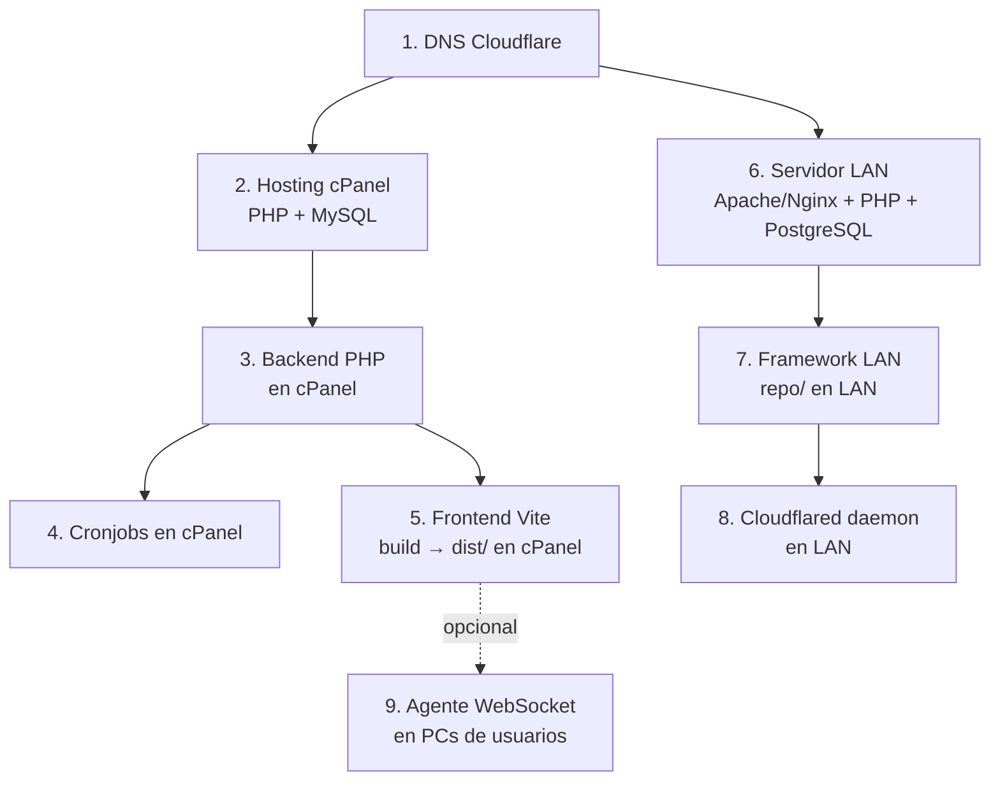

<div align="center">


# 16 · Deploy

**Documentación técnica — Aplicativo SEAO**

</div>

---

|                      |                                                               |
| -------------------- | ------------------------------------------------------------- |
| **Documento**        | 16 — Deploy                                                   |
| **Versión**          | 1.0                                                           |
| **Fecha**            | 14 de julio de 2026                                           |
| **Depende de**       | 08 · Infraestructura · 13 · Dependencias · 15 · Configuración |
| **Lo usan**          | 17 · Desarrollador · 19 · Operación · 18 · Soporte            |
| **Confidencialidad** | Uso interno — operativo                                       |

---

## 1 · Objetivo

Describir **cómo desplegar cada capa** del sistema en producción, en el orden correcto y con los prerequisitos claros. Cubre: hosting cPanel (frontend + backend + cronjobs), servidor LAN (framework + PostgreSQL), Cloudflare (DNS + túnel), y el agente local de impresión.

---

## 2 · Arquitectura de despliegue — dependencias



**Orden mínimo de despliegue de una instalación desde cero:** DNS → hosting cPanel → BD MySQL → backend → cronjobs → frontend → servidor LAN → PostgreSQL → framework → cloudflared → agentes en PC. Las actualizaciones parciales pueden hacerse en subconjuntos.

---

## 3 · Prerequisitos

### 3.1 Cuentas y accesos

| Recurso                               | Uso                                  |
| ------------------------------------- | ------------------------------------ |
| Cuenta cPanel del hosting             | Deploy frontend + backend + BD MySQL |
| Cuenta Cloudflare del dominio         | DNS + túnel                          |
| Cuenta admin del servidor LAN         | SSH + sudo                           |
| Cuenta admin Microsoft 365 (Entra ID) | Registrar app OAuth                  |

### 3.2 Software local (equipo del desarrollador)

- Node.js **≥ 20 LTS** (o 22).
- npm 10+.
- Git (opcional, si el código vive en repositorio).
- Cliente SFTP/SSH (FileZilla, WinSCP, o `scp`).
- Editor: VS Code recomendado.

### 3.3 Del hosting cPanel

- **PHP 7.4 o 8.x** habilitado en MultiPHP Manager.
- **MySQL 8.0+** activo.
- **`.htaccess`** habilitado (Apache con `AllowOverride All`).
- **Módulos Apache:** `mod_rewrite`, `mod_headers`, `mod_expires`.
- **Extensiones PHP:** `pdo_mysql`, `curl`, `mbstring`, `openssl`, `gd`, `zip`, `json`, `fileinfo` (ver [13 §8.1](./13-dependencias.md)).
- **Cuota de disco** suficiente para el bundle (~10–50 MB), backend (~30–70 MB con vendorizadas), imágenes/archivos.

### 3.4 Del servidor LAN

- **Distribución** Linux (Rocky Linux 8+ o CentOS 7+ funciona por evidencia; probablemente Debian/Ubuntu también).
- **PHP 7.4+ con `pdo_pgsql`, `curl`, `json`, `openssl`.**
- **Servidor web** Apache o Nginx apuntando a `repo/`.
- **PostgreSQL** local con BDs `biable01` y `biable02` (mantenido por el equipo del ERP Siesa Biable — el aplicativo solo lee).
- **`cloudflared` binario** — descargar de Cloudflare oficialmente.
- **Firewall local** debe permitir salida al puerto 443/tcp (túnel) y 5432/tcp local (PostgreSQL).

---

## 4 · Despliegue del frontend

### 4.1 Build

En el equipo del desarrollador, desde `frontend/`:

```bash
# 1. Instalar dependencias
npm ci

# 2. Verificar .env
cat .env
# Debe tener todas las VITE_* con valores de producción
# (ver 15 §3 para listado)

# 3. Build
npm run build

# Resultado: carpeta dist/
ls -la dist/
# → index.html, assets/*.js, assets/*.css, assets/logo.png, ...
```

Salida esperada:

- `dist/index.html` (raíz de la SPA).
- `dist/assets/*.js` (bundle principal + chunk `vendor.js` con React).
- `dist/assets/*.css` (estilos + CSS Modules hasheados).
- Imágenes optimizadas por `vite-plugin-imagemin`.

### 4.2 Deploy a cPanel

**Opción A — File Manager:**

1. En cPanel → File Manager → `public_html/` (o subcarpeta si aplica).
2. Subir todo el contenido de `dist/` (respetando estructura).
3. **Reemplazar** `index.html` y `assets/*` existentes.

**Opción B — SFTP:**

```bash
# Desde el equipo del dev
sftp usuario@aplicativo.supermercadobelalcazar.com
cd public_html
put -r dist/*
```

### 4.3 Cache-busting

- El `index.html` está configurado para no cachearse (ver [15 §5.1](./15-configuracion.md)).
- Los assets llevan hash en el nombre (`main-abc123.js`) — cambian con cada build.
- **No es necesario invalidar cache en Cloudflare** manualmente.

### 4.4 Verificación post-deploy

1. Abrir `https://aplicativo.supermercadobelalcazar.com/` en modo incógnito.
2. Comprobar que carga el login (sin error 404).
3. DevTools → Network → verificar que los assets nuevos se descargan.
4. Ejecutar login con un usuario de prueba.
5. Cambiar a `/inicio` y confirmar que el menú se carga (comprueba conexión backend).

### 4.5 Rollback

- **Mantener un backup** del `dist/` anterior antes de subir el nuevo.
- Si el nuevo build falla → restaurar los archivos anteriores por SFTP.
- Rollback típico: **~30 segundos**.

---

## 5 · Despliegue del backend cPanel

### 5.1 Estructura a desplegar

```
public_html/                     (o subdirectorio si aplica)
├── .htaccess                    ← configuración Apache
├── index.html                   ← SPA (subido en §4)
├── assets/                      ← SPA assets
├── logo.svg
├── files/                       ← storage runtime
├── images/                      ← storage runtime
├── cron/                        ← cronjobs PHP CLI
├── utils/                       ← librerías vendorizadas
└── api/                         ← endpoints PHP
```

### 5.2 Pasos

1. **Backup** del backend actual (comprimir `api/` + `utils/` + `.htaccess` a `backup-YYYYMMDD.tar.gz`).
2. **Subir** los archivos nuevos vía File Manager o SFTP.
3. **Verificar permisos:**
   - `api/`, `utils/`, `cron/`: 755
   - `files/`, `images/`: 775 (necesitan escritura desde PHP)
   - Archivos `.php`: 644
4. **Verificar** que los archivos `config/*.php` tienen las **credenciales correctas de producción**:
   - `database.php`
   - `database_proveedor.php`
   - `lan_api.php` (URL + token M2M — debe coincidir con `repo/.env` del LAN)
   - `correo_config.php`

### 5.3 Prueba de humo

```bash
# Health check
curl https://aplicativo.supermercadobelalcazar.com/api/system/status/endpoint.php \
  -H "Authorization: Bearer <token válido>" \
  -X POST -d '{}'

# Debería responder JSON con status del framework LAN
```

Si el status devuelve `offline` para PostgreSQL, revisar §7 (despliegue del framework LAN).

---

## 6 · Despliegue de la base de datos MySQL

Solo aplica en primera instalación. En actualizaciones, únicamente se corren migraciones puntuales.

### 6.1 Creación inicial (una sola vez)

1. cPanel → MySQL Databases → crear BD `supermer_AplicativoSistemas`.
2. Crear usuario `supermer_<nombre>` con contraseña fuerte.
3. Asignar permisos ALL PRIVILEGES al usuario sobre la BD.
4. Registrar credenciales en `backend/api/config/database.php`.
5. Importar el dump inicial con **phpMyAdmin → Import** (usar `mysqlphpmyadmin.sql`).

### 6.2 Migraciones (cambios de esquema)

**El proyecto no tiene sistema de migraciones automatizado.** Las alteraciones se aplican con scripts SQL manuales.

Procedimiento recomendado:

1. Preparar el script `.sql` con `ALTER TABLE`, `CREATE TABLE`, etc.
2. **Backup** de la BD (Export desde phpMyAdmin).
3. Aplicar el script en un ambiente de staging si existe.
4. Aplicar en producción vía phpMyAdmin → SQL.
5. Verificar con `SHOW CREATE TABLE <tabla>` los cambios aplicados.

⚠ **Deuda documentada en 25/28:** adoptar una herramienta de migraciones (Phinx, Flyway, o simplemente scripts numerados versionados) reduciría el riesgo de desincronía entre ambientes.

---

## 7 · Despliegue del framework LAN

### 7.1 Ubicación en el servidor

Estándar sugerido:

```
/var/www/ngrok/                  ← docroot del framework
├── .env                         ← credenciales PG + API_SECRET
├── .env.bak                     ← ⚠ eliminar (12 §7.3)
├── .htaccess                    ← bloqueo de .env
├── index.php                    ← entrypoint
├── core/
├── modules/
└── logs/                        ← writable por www-data
```

### 7.2 Configuración de Apache/Nginx

**Apache** (VirtualHost):

```apache
<VirtualHost *:80>
    DocumentRoot /var/www/ngrok
    <Directory /var/www/ngrok>
        AllowOverride All
        Require all granted
    </Directory>
</VirtualHost>
```

**Nginx** (server block):

```nginx
server {
    listen 80;
    root /var/www/ngrok;
    location ~ ^/ngrok/index\.php$ {
        include fastcgi_params;
        fastcgi_pass unix:/var/run/php/php-fpm.sock;
        fastcgi_param SCRIPT_FILENAME $document_root$fastcgi_script_name;
    }
    location ~ /\.env {
        deny all;
    }
}
```

### 7.3 `.env` de producción

Crear `/var/www/ngrok/.env` con los valores reales. Estructura documentada en [15 §7](./15-configuracion.md).

**Verificaciones críticas:**

- `API_SECRET` debe ser **idéntico** al `LAN_API_TOKEN` del backend cPanel (`backend/api/config/lan_api.php`).
- `ALLOWED_IP` debe incluir la IP pública del hosting cPanel.
- `DB_USER` / `DB_PASS` deben coincidir con los usuarios PostgreSQL configurados por el equipo del ERP.

### 7.4 Permisos

```bash
sudo chown -R www-data:www-data /var/www/ngrok
sudo chmod 750 /var/www/ngrok
sudo chmod 640 /var/www/ngrok/.env       # solo lectura para www-data
sudo chmod -R 775 /var/www/ngrok/logs    # writable
```

### 7.5 Verificación

```bash
# Desde el propio servidor LAN
curl -X POST http://localhost/ngrok/index.php \
  -H "Content-Type: application/json" \
  -H "Authorization: Bearer $(grep API_SECRET /var/www/ngrok/.env | cut -d= -f2)" \
  -d '{"accion": "system/database_status_check"}'

# Debe devolver 200 con "resultado" en el JSON
```

---

## 8 · Despliegue del túnel Cloudflared

### 8.1 Instalación (una sola vez)

```bash
# Descargar el binario oficial (Linux amd64)
curl -L https://github.com/cloudflare/cloudflared/releases/latest/download/cloudflared-linux-amd64 -o /usr/local/bin/cloudflared
chmod +x /usr/local/bin/cloudflared

# Autenticar con la cuenta Cloudflare del dominio
cloudflared tunnel login
# Abre navegador, seleccionar supermercadobelalcazar.com

# Crear el túnel
cloudflared tunnel create belalcazar-lan

# Configurar
cat > /etc/cloudflared/config.yml <<EOF
tunnel: <UUID que devolvió el create>
credentials-file: /root/.cloudflared/<UUID>.json

ingress:
  - hostname: api-biable.supermercadobelalcazar.com
    service: http://localhost:80
  - service: http_status:404
EOF

# Ruta DNS
cloudflared tunnel route dns belalcazar-lan api-biable.supermercadobelalcazar.com

# Instalar como servicio systemd
cloudflared service install
systemctl start cloudflared
systemctl enable cloudflared
```

### 8.2 Verificación

```bash
# Estado del servicio
systemctl status cloudflared

# Prueba desde una máquina externa (por ejemplo el hosting cPanel)
curl https://api-biable.supermercadobelalcazar.com/ngrok/index.php \
  -X POST -H "Content-Type: application/json" \
  -H "Authorization: Bearer <API_SECRET>" \
  -d '{"accion":"system/database_status_check"}'
```

### 8.3 Rotación del túnel

Si `cloudflared` deja de funcionar (Cloudflare rota credenciales, expiración):

```bash
sudo systemctl restart cloudflared
sudo journalctl -u cloudflared -f    # ver logs
```

---

## 9 · Cronjobs

### 9.1 Registro en cPanel

cPanel → Cron Jobs → añadir uno por cada script:

| Script                        | Frecuencia sugerida              | Comando                                                                                            |
| ----------------------------- | -------------------------------- | -------------------------------------------------------------------------------------------------- |
| `subir_checker_mysql.php`     | Cada 30 min en horario comercial | `php /home/<user>/public_html/cron/subir_checker_mysql.php > /home/<user>/logs/checker_1.log 2>&1` |
| `subir_checker_mysql_2.php`   | Idem                             | `php ... _2.php > ..._2.log 2>&1`                                                                  |
| `subir_checker_mysql_5.php`   | Idem                             | Idem                                                                                               |
| `subir_checker_mysql_8.php`   | Idem                             | Idem                                                                                               |
| `subir_checker_mysql_11.php`  | Idem                             | Idem                                                                                               |
| `verificar_registros_cvm.php` | Diario a las 08:00               | `php /home/<user>/public_html/cron/verificar_registros_cvm.php > /home/<user>/logs/cvm.log 2>&1`   |

⚠ Las **frecuencias exactas actuales** no son observables desde código — deben leerse del panel Cron Jobs de cPanel y documentarse en 19.

### 9.2 Verificación

```bash
# Ejecutar manualmente para probar antes de agendar
php /home/<user>/public_html/cron/subir_checker_mysql.php
```

Debe:

- Leer `/files/lector_precios/CHECKER1.TXT`.
- Truncar la tabla `checker1`.
- Insertar todas las filas.
- Devolver mensaje de éxito o error específico.

---

## 10 · Registro de la app OAuth en Microsoft 365

Requerido para el flujo de login SSO ([10 §4](./10-autenticacion.md)).

### 10.1 Pasos (una sola vez)

1. Ingresar a [Azure Portal](https://portal.azure.com) con la cuenta admin del tenant Belalcázar.
2. **Azure Active Directory → App registrations → New registration.**
3. **Nombre:** "Aplicativo Belalcázar" (o similar).
4. **Supported account types:** "Accounts in this organizational directory only".
5. **Redirect URI (Web):** `https://aplicativo.supermercadobelalcazar.com/login/microsoft-callback`.
6. Después de crear, tomar nota de:
   - **Application (client) ID** → va en `VITE_MICROSOFT_CLIENT_ID` (frontend) y en la config del backend.
   - **Directory (tenant) ID** → va en `VITE_MICROSOFT_TENANT_ID`.
7. **Certificates & secrets → New client secret** → guardar el value inmediatamente (después no se puede recuperar) → configurar como `MICROSOFT_CLIENT_SECRET` en el backend (⚠ debe estar en `.env` del hosting, no en código).
8. **API permissions** → Add permission → Microsoft Graph → Delegated → `openid`, `profile`, `email`, `User.Read`. Grant admin consent.

### 10.2 Rotación del client secret

Los client secrets de Azure expiran (típicamente 6 o 12 meses).

Procedimiento:

1. Crear un nuevo secret **antes** de que expire el actual.
2. Actualizar el `.env` del backend con el nuevo secret.
3. Verificar login SSO desde una cuenta de prueba.
4. Eliminar el secret viejo.

Documentar la fecha de expiración en la agenda operativa.

---

## 11 · Agente WebSocket local (módulo Publicidad)

Aplicación **externa al aplicativo web** — instalada en cada PC autorizado a imprimir etiquetas.

### 11.1 Instalación

- El instalador MSI (WPF C#) se distribuye internamente.
- Requiere Windows 10/11 y .NET 6+ runtime.
- Configuración durante la instalación: token compartido (`VITE_TOKEN_AGENT_PRINTER`) y puerto (default `8181`).
- Impresoras compatibles: Monarch 9830/9906 (MPCL II) y TSC ME240 / MB240T / MB241T (TSPL2).

### 11.2 Auto-arranque

- Configurar como servicio Windows o app de inicio.
- Verificar en Firewall de Windows que el puerto `8181` está abierto **solo para loopback (127.0.0.1)**, no para red.

### 11.3 Verificación

- Abrir el aplicativo web en la PC → Publicidad → probar impresión.
- Si falla la conexión, revisar el agente en la bandeja del sistema.

---

## 12 · Checklist consolidado de deploy inicial

Para un deploy desde cero, en orden estricto:

- [ ] DNS Cloudflare — subdominios `aplicativo.*` y `api-biable.*` creados.
- [ ] Modo TLS de Cloudflare configurado en **Full Strict** (12 §4.3).
- [ ] Hosting cPanel contratado con PHP + MySQL.
- [ ] BD MySQL `supermer_AplicativoSistemas` creada + usuario + permisos.
- [ ] Dump inicial importado.
- [ ] Backend PHP subido a `public_html/api/`.
- [ ] `backend/api/config/*.php` con credenciales de producción.
- [ ] `.htaccess` de backend en su lugar.
- [ ] Frontend construido y subido a `public_html/`.
- [ ] Cronjobs registrados con horarios.
- [ ] Servidor LAN con Apache/Nginx + PHP + PostgreSQL.
- [ ] `repo/` desplegado en `/var/www/ngrok/`.
- [ ] `repo/.env` con credenciales de producción.
- [ ] Permisos del filesystem correctos.
- [ ] `cloudflared` instalado y corriendo como servicio.
- [ ] Túnel activo (verificable con `curl` desde cPanel).
- [ ] App OAuth registrada en Azure/Entra.
- [ ] `MICROSOFT_CLIENT_SECRET` en `.env` del backend.
- [ ] Login local funciona.
- [ ] Login Microsoft funciona.
- [ ] Módulo Publicidad: agente instalado en al menos una PC.
- [ ] Verificar `sys_logs` de MySQL — debe registrar el arranque.
- [ ] Verificar `logs/` del framework LAN — debe estar creciendo.

---

## 13 · Checklist consolidado de deploy incremental

Para una actualización de código (código nuevo, sin cambios de infraestructura):

- [ ] Backup del frontend actual (`dist/` viejo) o del backend actual, o del framework LAN — según qué se actualiza.
- [ ] Subir el nuevo `dist/` o `api/` o `repo/`.
- [ ] Verificar permisos (a veces al reemplazar cambian).
- [ ] Si hay cambios de esquema BD: aplicar migración manual.
- [ ] Prueba de humo en modo incógnito.
- [ ] Verificar `sys_logs` por errores en los siguientes 15 min.
- [ ] Notificar a soporte que se hizo un despliegue (para descartar falsos positivos de reportes).

---

## 14 · Ambientes

⚠ **Observación estructural:** actualmente no se detecta evidencia de un ambiente de **staging** separado del de producción. Todo indica que se despliega directamente a `aplicativo.…`.

**Recomendación (28 · Roadmap):**

- Crear subdominio `staging.aplicativo.supermercadobelalcazar.com` con su propia BD (`supermer_AplicativoStaging`).
- Duplicar `repo/` en otro servidor LAN o en un `/var/www/ngrok_staging/` con `.env` apuntando a `biable01_staging` (si el equipo del ERP lo permite).
- Adoptar CI/CD (GitHub Actions, GitLab CI) que despliegue a staging automáticamente en push a `develop` y a producción en push a `main`.

---

## 15 · Referencias cruzadas

| Necesitas saber…                                     | Documento                                                     |
| ---------------------------------------------------- | ------------------------------------------------------------- |
| Infraestructura completa (IPs, puertos, DNS)         | [08 · Infraestructura](./08-diagramas-infraestructura.md)     |
| Dependencias que hay que tener antes de deploy       | [13 · Dependencias](./13-dependencias.md)                     |
| Variables de configuración por archivo               | [15 · Configuración](./15-configuracion.md)                   |
| Cómo iniciar el proyecto local                       | [17 · Manual del Desarrollador](./17-manual-desarrollador.md) |
| Operación post-deploy (backups, cronjobs, monitoreo) | [19 · Manual de Operación](./19-manual-operacion.md)          |
| Diagnóstico de fallos post-deploy                    | [18 · Manual de Soporte](./18-manual-soporte.md)              |

---

<div align="center">
<sub><b>Supermercados Belalcázar</b> · Documento 16 — Deploy · v1.0 · 14 de julio de 2026</sub>
</div>
