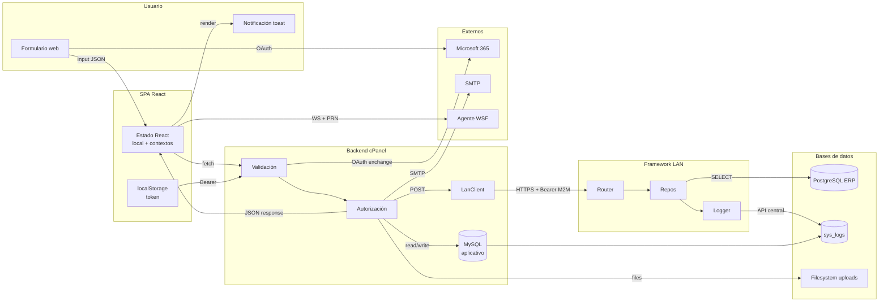
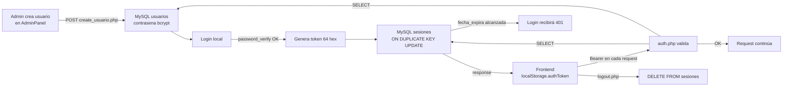
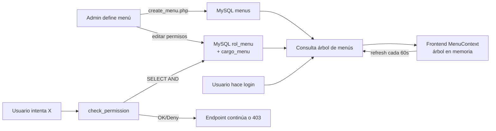
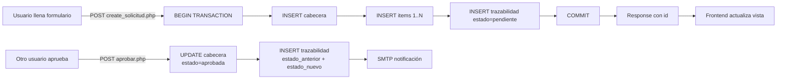
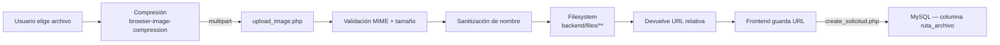
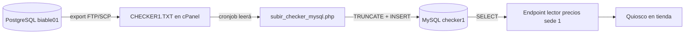

<div align="center">


# 20 · Flujo de Datos

**Documentación técnica — Aplicativo SEAO**

</div>

---

|                      |                                                                 |
| -------------------- | --------------------------------------------------------------- |
| **Documento**        | 20 — Flujo de Datos                                             |
| **Versión**          | 1.0                                                             |
| **Fecha**            | 14 de julio de 2026                                             |
| **Depende de**       | 02 · Arquitectura · 06 · Flujo de petición · 14 · Base de Datos |
| **Lo usan**          | 12 · Seguridad · 21 · Flujo de Negocio · 24 · Código Explicado  |
| **Confidencialidad** | Uso interno                                                     |

---

## 1 · Objetivo

Mientras el documento [06 · Flujo de una Petición](./06-flujo-de-una-peticion.md) describe **cómo se ejecuta** una request a nivel de hops de red y tiempos, este documento describe **qué información viaja**, en qué forma, hacia dónde, y con qué transformaciones. Es la vista "los datos" del sistema.

Se cubren:

1. Tipos de datos que circulan.
2. Formatos y contenedores.
3. Transformaciones capa por capa.
4. Persistencia de cada tipo.
5. Ciclo de vida de los datos operativos (creación, consulta, modificación, eliminación, retención).

---

## 2 · Taxonomía de datos del sistema

Cinco categorías de datos con propiedades distintas:

| Categoría              | Ejemplo                                      | Fuente de verdad                            | Vida útil                          |
| ---------------------- | -------------------------------------------- | ------------------------------------------- | ---------------------------------- |
| **Identidad y sesión** | Login, contraseña, token de sesión           | MySQL `usuarios`, `sesiones`                | Contraseña indefinida; sesión 24 h |
| **Autorización**       | Menús, permisos por rol y cargo              | MySQL `menus`, `rol_menu`, `cargo_menu`     | Indefinida hasta revocación        |
| **Operativa propia**   | Pedidos, solicitudes, actas, visitantes, CVM | MySQL (tablas de dominio)                   | Indefinida, con retención por tipo |
| **Réplica del ERP**    | Catálogo de items, precios, existencias      | PostgreSQL (fuente) → MySQL (réplica local) | Continua — refresco por cronjob    |
| **Logs y auditoría**   | `sys_logs`, `_trazabilidad`, `_movimientos`  | MySQL                                       | 6 meses recomendado                |

Cada categoría **fluye distinto** por el sistema; el resto de este documento las trata por separado.

---

## 3 · Vista global del flujo de datos



**Lectura:** los datos operativos escritos por el usuario se detienen en MySQL cPanel. Los datos del ERP fluyen solo en dirección de lectura desde PostgreSQL. Los logs fluyen "hacia arriba" desde ambas bases hasta un almacenamiento central en `sys_logs`.

---

## 4 · Datos de identidad y sesión

### 4.1 Ciclo de vida completo



### 4.2 Transformaciones

- **Contraseña plana → hash bcrypt.** Ocurre una sola vez, en `create_usuario.php` con `password_hash($input, PASSWORD_DEFAULT)`.
- **Credenciales del cliente → token de sesión.** Ocurre en `login.php` tras `password_verify`. El input del usuario se descarta; solo persiste el token generado.
- **Token → identidad del usuario.** Ocurre en `auth.php` mediante `SELECT sesiones JOIN usuarios`. El token opaco se convierte en objeto usuario en cada request.

### 4.3 Persistencia

| Dato               | Ubicación                           | Formato                           | TTL                        |
| ------------------ | ----------------------------------- | --------------------------------- | -------------------------- |
| Hash de contraseña | `usuarios.contrasena` (varchar 255) | bcrypt (empieza con `$2y$10$...`) | Hasta cambio de contraseña |
| Token de sesión    | `sesiones.token` (varchar 255)      | 64 caracteres hex                 | 24 h                       |
| Token en cliente   | `localStorage.authToken`            | 64 hex                            | Hasta logout o expiración  |
| Rol del usuario    | `localStorage.userRole`             | int                               | Idem                       |

**Sensibilidad:** el token es equivalente a una contraseña temporal. Cualquier fuga expone la sesión hasta que expire o el usuario re-loguee.

---

## 5 · Datos de autorización

### 5.1 Ciclo de vida



### 5.2 Doble camino

Los permisos viajan **por dos rutas distintas** con propósitos distintos:

- **Ruta A — al frontend** (`get_menu_user.php`): el árbol de menús con permisos embebidos. **Uso: UX** (mostrar/ocultar botones, guardar rutas).
- **Ruta B — verificación en backend** (`check_permission.php`): consulta directa a `rol_menu` × `cargo_menu`. **Uso: seguridad** (autorizar operaciones).

Ambas rutas parten de las mismas tablas, pero **el frontend nunca es autoridad**. Un usuario que modifique el árbol en memoria del navegador **no consigue nada** — la verificación autoritativa siempre ocurre server-side.

### 5.3 Transformaciones

- **Filas planas de `menus` + `rol_menu` + `cargo_menu` → árbol jerárquico.** Ocurre en `get_menu_user.php` mediante JOIN + agrupación por `id_menu_parent`.
- **Booleanos (`puede_ver`, `puede_crear`, etc.) → banderas en cada nodo del árbol.** Empaquetados en la respuesta JSON.
- **Cambio en `rol_menu` → efecto en frontend en 60 s.** Sin logout necesario (ver [11 §13](./11-autorizacion.md)).

---

## 6 · Datos operativos propios

Cubre pedidos Fruver/Carnes, solicitudes Compras, actas TI, visitantes, CVM, plantillas de etiquetas.

### 6.1 Patrón cabecera-detalle-trazabilidad

Un patrón común en el sistema:



**Puntos técnicos:**

- **Transacción** garantiza atomicidad (o se persiste todo o nada).
- Los **items** guardan **snapshot** de la descripción/precio/unidad — desacoplan la solicitud histórica de cambios futuros en el catálogo.
- Cada **cambio de estado** deja fila en la tabla `_trazabilidad` con `estado_anterior`, `estado_nuevo`, `usuario`, `fecha`, `observacion`. No se sobrescribe historia.

### 6.2 Ejemplo · Solicitud de codificación de productos

**Datos que entran:** información del producto candidato (item, descripción, código de barras, proveedor, foto anverso, foto reverso, archivo adjunto PDF).

**Datos que se persisten:**

- Fila en `solicitudes_codificacion_productos` (cabecera): comprador, fecha, estado inicial, proveedor.
- N filas en `solicitudes_codificacion_productos_items` (una por producto).
- Filas en `_trazabilidad` (una por cambio de estado).
- Archivos físicos en `backend/files/codificacion/<uid>/<hash>.<ext>`.

**Datos que salen:**

- Notificaciones por correo (aprobación, rechazo, codificado).
- Item asignado (varchar 6) tras aprobación — el nuevo código para el ERP.

### 6.3 Datos con archivos adjuntos

Los archivos (imágenes, PDFs) siguen su propio flujo:



**Nota crítica:** el archivo binario **no se guarda en BD** — solo la ruta. La BD guarda referencia, el filesystem guarda contenido.

---

## 7 · Datos del ERP (réplica local)

### 7.1 Flujo unidireccional del ERP hacia MySQL



**El aplicativo NO escribe al ERP directamente.** Los flujos:

- **De ERP → aplicativo:** cronjobs periódicos que replican precios a las tablas `checker*` en MySQL.
- **De ERP → aplicativo (en vivo):** cada consulta al framework LAN es una lectura de PostgreSQL en tiempo real (retornada al usuario que la pidió).
- **De aplicativo → ERP:** una única acción (`financiero/auditoria_dian_config_guardar`) escribe configuración de auditoría. **Todos los demás flujos son solo lectura.**

### 7.2 Transformaciones

- **Archivo `CHECKER*.TXT` (texto pipe-delimited) → filas MySQL.** El cronjob parsea línea a línea.
- **Filas PostgreSQL del ERP → JSON de respuesta.** El framework LAN transforma con `fetchAll(PDO::FETCH_ASSOC)`.
- **Resultado del framework LAN → payload de negocio.** El backend cPanel desempaqueta `{"resultado": [...]}` y lo entrega al frontend.

### 7.3 Frescura de los datos

| Origen                                              | Frescura                                                                  |
| --------------------------------------------------- | ------------------------------------------------------------------------- |
| Reportes contables (Recaudos, Libro Auxiliar, DIAN) | **Tiempo real** — cada consulta va al ERP                                 |
| Certificados de retención                           | Tiempo real                                                               |
| Catálogo de items para códigos, líneas, bodegas     | Tiempo real (via framework LAN)                                           |
| Precios en el Lector de Precios                     | Refresco por cronjob (cada 30 min aprox — ver 19)                         |
| Existencias de inventario                           | Depende: reportes son tiempo real, `resumen_inventario` puede ser mensual |

**El aplicativo mezcla flujos síncronos (para reportes) y asíncronos (para lookup rápido).** El usuario no siempre lo distingue, pero el diseño es intencional.

---

## 8 · Datos de logs y auditoría

### 8.1 Múltiples generadores, dos destinos

```mermaid
flowchart LR
    A[Backend cPanel:<br/>login, permisos,<br/>solicitudes] -->|Logger::info/warn/error| B[MySQL sys_logs]
    A -->|opcional| C[POST logs/ingest.php]
    D[Framework LAN:<br/>errores, warnings,<br/>consultas ERP] -->|Logger::write| C
    C --> B
    D -.->|si logs/ingest falla| E[repo/logs/fallback_error.log]
    F[Cronjobs] -->|archivo| G[/home/user/logs/checker_*.log]
```

**Todos los logs tienden a `sys_logs`.** Es la fuente única de verdad de auditoría.

### 8.2 Estructura del log

Cada fila en `sys_logs`:

- `timestamp` — fecha exacta.
- `aplicacion` — origen (`Cpanel`, `API_Biable_CentOS`, otros).
- `tipo_log` — INFO/WARN/ERROR/DEBUG.
- `mensaje` — texto humano.
- `stack_trace` — opcional para errores.
- `usuario` — login o `<id> - <login>` (framework LAN) o `Sistema` (sin identidad).
- `ip`, `host`, `entorno`.

### 8.3 Consultas típicas de auditoría

Ver [18 §3](./18-manual-soporte.md) para queries listas.

### 8.4 Retención

Sin política automática hoy — la tabla crece indefinidamente. Recomendación consolidada: retener 6 meses (ver [25 · P1.4](./25-refactorizacion.md)).

---

## 9 · Datos de trazabilidad de estados

### 9.1 Tablas involucradas

Cinco tablas siguen el patrón "una fila por cambio de estado":

- `solicitudes_actualizacion_costos_trazabilidad`
- `solicitudes_codificacion_productos_trazabilidad`
- `visitas_movimientos`
- (implícito) auditoría de `actas_entrega.estado` — el propio `updated_at` lo captura, aunque no hay tabla dedicada
- (implícito) auditoría de menús/permisos — actualmente **no existe**; se documenta como deuda en 26

### 9.2 Ejemplo de contenido

```
| id | id_solicitud | estado_anterior | estado_nuevo    | id_usuario | fecha                   | observacion            |
|----|--------------|-----------------|-----------------|------------|-------------------------|------------------------|
| 42 | 17           | pendiente       | en_revision     | 3          | 2026-07-10 08:45:00     | Iniciada revisión      |
| 43 | 17           | en_revision     | aprobada        | 3          | 2026-07-10 09:12:00     | Cumple política        |
| 44 | 17           | aprobada        | aplicada        | 5          | 2026-07-11 14:00:00     | Aplicada en ERP OK     |
```

Cada cambio genera un INSERT nuevo, nunca UPDATE de la fila previa. **La historia es inmutable.**

---

## 10 · Datos volátiles (no persistidos)

Datos que **fluyen pero no se persisten**:

| Dato                                | Vida                                     | Destino                                           |
| ----------------------------------- | ---------------------------------------- | ------------------------------------------------- |
| Input de formularios en tiempo real | Estado React (`useState`)                | Descartado al desmontar componente si no se envió |
| Filtros de reportes                 | `localStorage` (opcional) o estado React | Persiste hasta refresh o cambio de ruta           |
| Cache de resultados intermedios     | `useMemo`, `useCallback`                 | Descartado en re-render                           |
| Preferencias de UI del usuario      | localStorage por módulo                  | Persiste indefinidamente en el navegador          |
| Notificaciones toast                | NotificationContext                      | Timer auto-remove (~5 seg)                        |
| Preflights CORS                     | Cache navegador                          | Duración configurada por CF (típicamente 24 h)    |

---

## 11 · Datos externos que entran

### 11.1 Microsoft 365 / Entra ID

Datos recibidos durante el SSO:

- `access_token` (Bearer) — usado para consultar Microsoft Graph, no persistido.
- `id_token` (JWT) — leído para claims, no persistido.
- `refresh_token` — **no usado** en la implementación actual (podría en el futuro).
- Response de Graph `/me` → `mail`, `userPrincipalName` — usados solo para cruzar con `usuarios.correo`, no persistidos.

**Ningún dato de Microsoft se persiste en la BD del aplicativo.** Solo se usa para autenticar; el usuario del aplicativo ya existe en `usuarios`.

### 11.2 Cloudflare

No entrega datos al aplicativo — solo enruta. Cabeceras que sí llegan:

- `X-Forwarded-For` (IP real del cliente).
- `CF-Connecting-IP` (IP real del cliente, alternativa).
- `CF-Ray` (identificador de la petición, útil para trace con soporte Cloudflare).

Estas cabeceras son usadas por el framework LAN para IP allow-list (`checkIp` en `authmiddleware.php`).

### 11.3 Correo entrante

**No hay recepción de correo desde el aplicativo.** Todo es unidireccional saliente (notificaciones).

---

## 12 · Datos que salen del sistema

### 12.1 Correo saliente

Vía PHPMailer sobre `mail.supermercadobelalcazar.com:465`:

- Notificaciones de aprobación/rechazo de solicitudes.
- Alertas de CVM incumplida.
- Actas de entrega con token de firma.

Cada correo contiene datos personales (nombre, correo del destinatario) + datos operativos (número de solicitud, item, etc.).

### 12.2 Reportes descargables

- **PDF** vía TCPDF/tc-lib-pdf/jsPDF (según módulo) — para certificados, comprobantes.
- **Excel `.xlsx`** vía PhpSpreadsheet/exceljs — para reportes contables voluminosos.
- **ZIP** vía ZipStream-PHP — para descargas voluminosas con adjuntos.

El archivo se genera al vuelo, se envía al cliente y **no se persiste server-side** (salvo si se solicita explícitamente).

### 12.3 Impresión de etiquetas

El frontend envía al agente WebSocket local un payload con:

- Plantilla serializada en MPCL II (Monarch) o TSPL2 (TSC).
- Metadatos (impresora destino, cantidad).

**El agente no reporta datos al aplicativo** — es unidireccional.

---

## 13 · Ciclo de vida de datos personales (PII)

Por el impacto de la Ley 1581 de Colombia (habeas data), los datos personales merecen tratamiento explícito.

### 13.1 PII identificable

| Dato                             | Ubicación                                                                  | Fuente                             |
| -------------------------------- | -------------------------------------------------------------------------- | ---------------------------------- |
| Nombres, cédula, correo          | `usuarios`, `actas_entrega`, `visitantes`                                  | Empleados y visitantes             |
| Foto                             | `visitantes.foto`, `actas_entrega.firma_recibe`                            | Captura por webcam / firma digital |
| Cargo, área, sede                | `usuarios` + joins                                                         | Empleados                          |
| Historial de visitas             | `visitas_registro`, `visitas_movimientos`, `visitantes_historial_empresas` | Contratistas y visitantes          |
| Login (nombre implícito) en logs | `sys_logs.usuario`                                                         | Todos los usuarios                 |

### 13.2 Retención sugerida

| Categoría                 | Retención sugerida                                       |
| ------------------------- | -------------------------------------------------------- |
| Usuarios activos          | Indefinida (necesarios para operación)                   |
| Usuarios inactivos        | Anonimizar tras 5 años sin actividad (revisar con legal) |
| `sys_logs`                | 6 meses                                                  |
| Visitantes históricos     | 2 años (revisar con seguridad física)                    |
| Actas de entrega firmadas | Indefinida (documento legal)                             |

⚠ Estas retenciones deben validarse con el área legal y actualizarse en 19 y 26.

### 13.3 Derechos ARCO (Ley 1581)

Aún no implementados como endpoints. Un titular de datos que ejerza sus derechos requiere:

- **Acceso:** exportar sus datos → SQL manual hoy; endpoint recomendado en H4.
- **Rectificación:** vía AdminPanel (para empleados) o formulario (para visitantes).
- **Cancelación:** actualmente soft delete (`activo=0`). Borrado real requiere consulta con legal.
- **Oposición:** procedimiento fuera del sistema.

---

## 14 · Volumen y crecimiento esperado

Estimaciones (⚠ requieren validación con contadores reales de las tablas):

| Tabla                         | Tamaño hoy                     | Crecimiento mensual estimado                 |
| ----------------------------- | ------------------------------ | -------------------------------------------- |
| `usuarios`                    | ~72 filas                      | 0–2 filas                                    |
| `sesiones`                    | ~1 fila por usuario activo     | Constante (~30–50 filas)                     |
| `sys_logs`                    | Alto (miles/día)               | ~50k–500k filas                              |
| `pedidos_carnes` + `detalles` | Depende de sedes activas       | ~14 pedidos × 30 días = ~420 cabeceras/mes   |
| `visitas_registro`            | Alto (varias por sede/día)     | ~5-20 por sede × 14 sedes × 30 días = ~2k–8k |
| `registros_cvm`               | 1–3 por balanza × mes          | ~50–150/mes                                  |
| `checker*`                    | Cada tabla ~10k–50k filas      | Estable (TRUNCATE + INSERT en cada cron)     |
| `actas_entrega`               | Depende de rotación de equipos | ~5–20 por mes                                |

**La tabla con más presión de crecimiento es `sys_logs`** — de ahí la prioridad de la política de retención.

---

## 15 · Referencias cruzadas

| Necesitas…                                                   | Documento                                                   |
| ------------------------------------------------------------ | ----------------------------------------------------------- |
| Ver el flujo end-to-end de una petición                      | [06 · Flujo de una Petición](./06-flujo-de-una-peticion.md) |
| Ver el modelo de datos completo                              | [14 · Base de Datos](./14-base-de-datos.md)                 |
| Ver flujo desde la perspectiva de negocio                    | [21 · Flujo de Negocio](./21-flujo-de-negocio.md)           |
| Análisis de seguridad de los datos (PII, backups, retención) | [12 · Seguridad](./12-seguridad.md)                         |
| Operación (backups, retención automatizada)                  | [19 · Operación](./19-manual-operacion.md)                  |

---

<div align="center">
<sub><b>Supermercados Belalcázar</b> · Documento 20 — Flujo de Datos · v1.0 · 14 de julio de 2026</sub>
</div>
