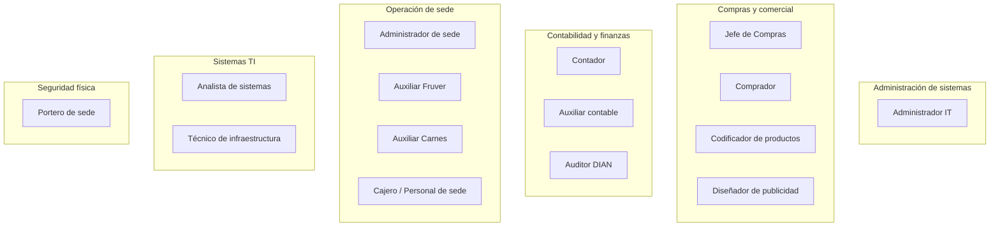
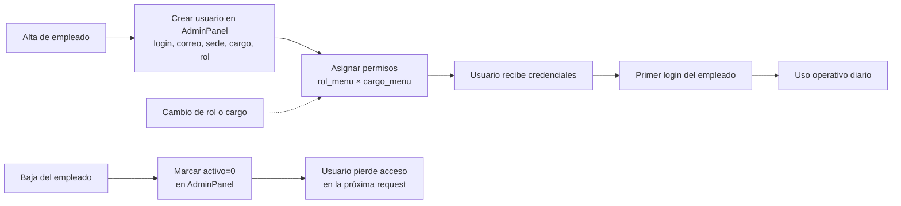
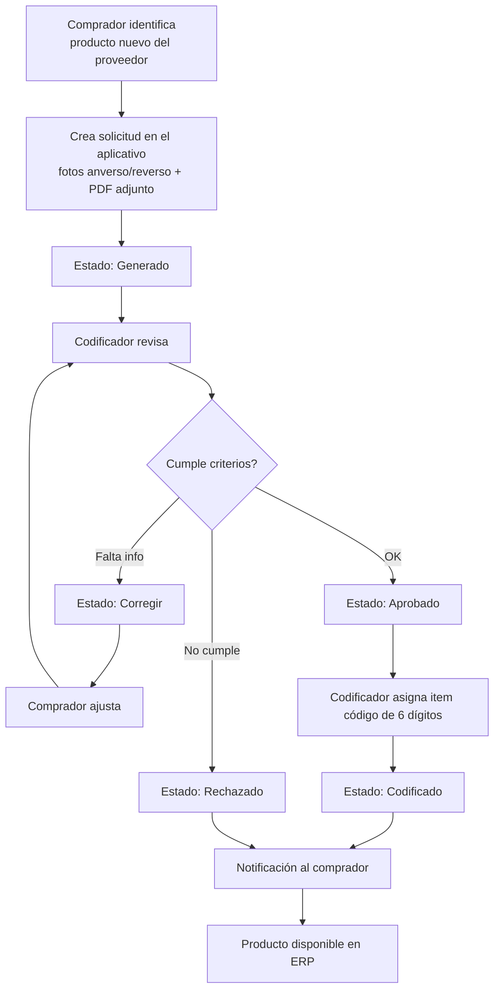
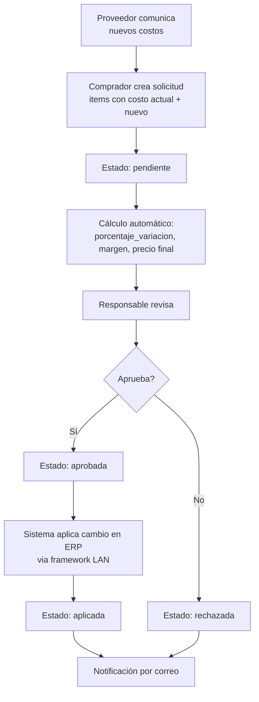
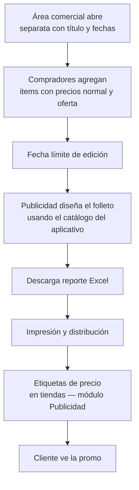
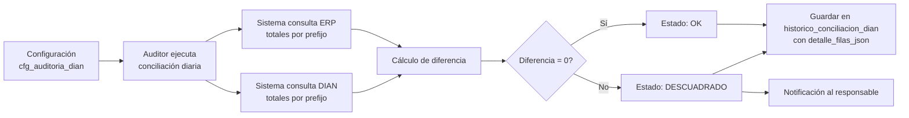
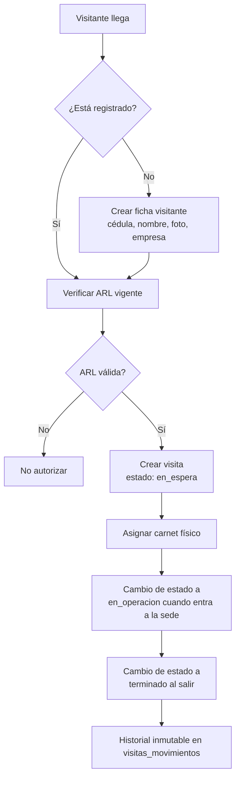
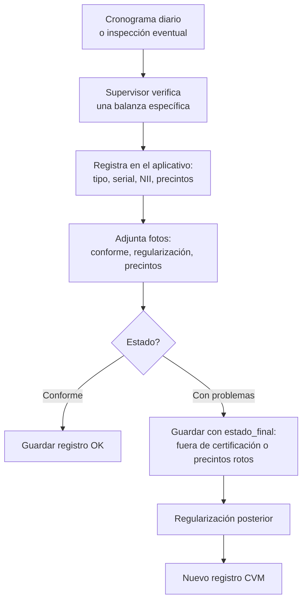

# 21 · Flujo de Negocio

**Documentación técnica — Aplicativo SEAO**

---

|                      |                                                  |
| -------------------- | ------------------------------------------------ |
| **Documento**        | 21 — Flujo de Negocio                            |
| **Versión**          | 1.0                                              |
| **Fecha**            | 14 de julio de 2026                              |
| **Depende de**       | 01 · Resumen · 20 · Flujo de Datos               |
| **Lo usan**          | 23 · Módulos · Nuevos usuarios · Área de negocio |
| **Confidencialidad** | Uso interno                                      |

---

## 1 · Objetivo

Describir el sistema **desde la perspectiva del negocio** y del usuario final: qué procesos operativos soporta, cómo encajan en la operación diaria de la cadena, quién hace qué, en qué momento, y con qué resultado esperado.

A diferencia de los documentos técnicos (02–20), este habla en el lenguaje de operaciones — no de endpoints ni de tablas. Su audiencia son gerentes de área, líderes de sede, contadores, jefes de compras y auditores externos.

---

## 2 · Contexto de negocio

**Supermercados Belalcázar** es una cadena de supermercados con **14 sedes** en Yumbo (Valle del Cauca, Colombia) y municipios cercanos. Opera bajo dos empresas del grupo:

- **Abastecemos de Occidente S.A.S.** (Abastecemos) — empresa principal.
- **Tobar** — empresa complementaria.

El aplicativo interno es la herramienta común que **conecta las áreas operativas y administrativas** que orbitan al ERP Siesa Biable. Cubre procesos que:

- El ERP no ofrece nativamente.
- Requieren workflow de aprobación (solicitudes).
- Necesitan interfaz simplificada para personal de sede o portería.
- Consolidan reportes recurrentes.

**No sustituye al ERP** — lo complementa.

---

## 3 · Actores de negocio

Cada rol operativo del aplicativo corresponde a un cargo real dentro de la organización:

Cada actor tiene un rol técnico (`admin` o `usuario`) y un cargo específico. La combinación decide qué puede hacer (ver [11 · Autorización](./11-autorizacion.md)).

---

## 4 · Los 8 procesos de negocio principales

### 4.1 Proceso 1 · Gestión de identidades y accesos

**Frecuencia:** semanal / cuando hay cambios de personal.

**Actores:** Administrador IT.

**Flujo:**

**Datos maestros que se tocan:** `usuarios`, `roles`, `cargos`, `sedes`, `areas`, `rol_menu`, `cargo_menu`.

**Puntos operativos:**

- Un empleado puede tener correo corporativo Microsoft → habilita login por SSO.
- La desactivación (`activo=0`) es preferida sobre el borrado — preserva historial de auditoría.
- Cambios de permisos surten efecto en 60 segundos sin logout.

### 4.2 Proceso 2 · Solicitud de codificación de productos

**Frecuencia:** diaria (varias por sede).

**Actores:** Comprador → Codificador → ERP.

**Flujo:**

**Valor de negocio:** trazabilidad completa del ciclo desde que un proveedor ofrece un producto nuevo hasta que está codificado en el ERP para venta.

**Datos que persisten:** cabecera, items de la solicitud, fotos, PDF adjunto, trazabilidad de estados.

### 4.3 Proceso 3 · Actualización de costos

**Frecuencia:** frecuente (proveedores ajustan precios continuamente).

**Actores:** Comprador → Responsable de aprobación → ERP.

**Flujo:**

**Valor de negocio:** protege el margen del negocio al forzar aprobación explícita de cambios de costo. Deja auditoría completa del cambio.

**Dato crítico:** la columna `porcentaje_variacion` es **generada** en BD (`GENERATED ALWAYS AS ... STORED`) — el cálculo no puede desincronizarse.

### 4.4 Proceso 4 · Preparación de folletos de ofertas (Separatas y POS)

**Frecuencia:** periódica (según calendario comercial).

**Actores:** Compradores + área de Publicidad.

**Flujo:**

**Valor de negocio:** consolida datos comerciales de todos los compradores en un solo folleto sin usar hojas de cálculo dispersas.

**Integración adyacente:** el módulo **Publicidad** con canvas de diseño de etiquetas usa las mismas listas de items — imprime directamente en impresoras Monarch/TSC de las sedes.

### 4.5 Proceso 5 · Contabilidad — reportes e informes

**Frecuencia:** diaria / semanal / mensual según reporte.

**Actores:** Contador, Auxiliar Contable.

**Flujos principales:**

- **Recaudos.** Consulta de recaudos por medio de pago, sede, rango de fecha. Genera Excel para conciliación bancaria.
- **Libro Auxiliar.** Consulta del auxiliar contable con filtros por proveedor, cuenta, centro de costo.
- **Certificados de retención.** Descarga de PDF con retenciones (renta, ReteICA, ReteIVA) por tercero y año.
- **Planos contables.** Consulta y edición de planos.

**Todos consumen datos del ERP en tiempo real** — sin cachés — para garantizar exactitud contable.

### 4.6 Proceso 6 · Auditoría DIAN

**Frecuencia:** diaria (o bajo demanda).

**Actores:** Auditor DIAN, Contabilidad.

**Flujo:**

**Valor de negocio:** cumplimiento regulatorio con la DIAN + auditoría histórica inmutable de conciliaciones diarias.

**Dato notable:** el detalle completo de cada conciliación se persiste en JSON dentro de `historico_conciliacion_dian.detalle_filas_json` — permite auditar el pasado aunque los datos del ERP cambien después.

### 4.7 Proceso 7 · Control de visitantes

**Frecuencia:** continua (durante horario de sede).

**Actores:** Portero de sede.

**Flujo:**

**Valor de negocio:** control regulatorio de ingreso de terceros (contratistas, proveedores, mensajería) con evidencia auditable de ARL vigente.

**Integración con proveedores:** el aplicativo mantiene historial de qué empresa contrataba a cada visitante en cada momento (`visitantes_historial_empresas`).

### 4.8 Proceso 8 · Verificación metrológica (CVM)

**Frecuencia:** diaria (o según cronograma legal).

**Actores:** Supervisor de balanza en la sede, Analista de Sistemas.

**Flujo:**

**Valor de negocio:** cumplimiento con la Resolución SIC sobre CVM (Control Volumétrico Metrológico) para balanzas comerciales. Evidencia legal ante inspección.

**Cronjob complementario:** `verificar_registros_cvm.php` diario alerta si alguna sede no registró CVM en el periodo esperado.

### 4.9 Procesos secundarios

Además de los 8 principales, el aplicativo soporta:

- **Pedidos Fruver** — configuración de qué se pide qué día de la semana + pedidos concretos.
- **Pedidos Carnes** — pedidos diarios por sede con detalle por categoría (res, cerdo, vísceras, canales).
- **Actas de entrega TI** — registro y firma digital de entregas de equipos a empleados.
- **Lector de Precios** — quioscos en sedes para que el cliente consulte precios por código de barras.
- **Reportes de inventario** — averías, bodegas alternas, existencias vs costos.
- **Bitácora / logs** — consulta administrativa del sistema.
- **Actualización masiva de inventario** — carga de archivos con actualizaciones al ERP.

---

## 5 · Calendario operativo típico

Vista de una semana típica en el aplicativo:

```mermaid
gantt
    title Semana típica en el aplicativo
    dateFormat  X
    axisFormat  %A

    section Diario
    Verificación CVM balanzas       :d1, 0, 7d
    Control visitantes              :d2, 0, 7d
    Consulta precios cliente        :d3, 0, 7d
    Cronjob precios ERP → MySQL     :d4, 0, 7d
    Auditoría DIAN                  :d5, 0, 7d

    section Semanal
    Pedidos Fruver por sede         :s1, 0, 1d
    Pedidos Fruver por sede         :s2, 2, 1d
    Pedidos Fruver por sede         :s3, 4, 1d
    Pedidos Carnes diarios          :s4, 0, 7d
    Consultas Recaudos              :s5, 5, 1d

    section Puntual
    Solicitudes codificación        :p1, 0, 7d
    Solicitudes actualización costos:p2, 0, 7d
    Preparación separata            :p3, 3, 2d
    Actas de entrega TI             :p4, 1, 1d
```

**Observación:** los flujos "diarios" (CVM, visitantes, lector de precios, auditoría DIAN) son de alto volumen. Los "puntuales" (solicitudes) son de bajo volumen pero de alta importancia por su impacto contable/comercial.

---

## 6 · Interacciones entre procesos

Los procesos no son islas — se conectan:

```mermaid
flowchart LR
    A[Codificación productos] -->|item nuevo| B[Actualización de costos<br/>del mismo item]
    B --> C[Item aparece en separatas]
    C --> D[Cliente ve precio en lector]
    D --> E[Se vende en el POS]
    E --> F[Movimiento en el ERP]
    F --> G[Aparece en recaudos]
    G --> H[Se audita en DIAN]

    I[Visita del proveedor<br/>registrada por portería] -.-> A
```

**Lectura:** el ciclo completo de un producto — desde que el proveedor lo trae hasta que se audita ante la DIAN — pasa por 7 módulos del aplicativo. Ninguno funciona en aislamiento.

---

## 7 · Reglas de negocio implementadas en código

El aplicativo materializa varias reglas de negocio en su código y BD:

### 7.1 Sesión única por usuario

Un usuario no puede tener dos sesiones activas simultáneas. **Motivación:** reducir tokens huérfanos, limitar superficie de compromiso.

### 7.2 Autorización AND rol × cargo

Un usuario puede realizar una acción **solo si su rol permite Y su cargo permite** esa acción sobre ese menú. **Motivación:** separar capacidad técnica (rol) de responsabilidad organizacional (cargo).

### 7.3 Deny by default

Cualquier ausencia de permiso configurado equivale a acceso denegado. **Motivación:** seguridad — errores de configuración no exponen indebidamente.

### 7.4 Sin bypass para administrador

Incluso el rol `admin` (id 1) debe tener permisos explícitos en la matriz. **Motivación:** auditabilidad uniforme.

### 7.5 Trazabilidad inmutable de estados

Cambios de estado en solicitudes y visitas dejan fila nueva en `_trazabilidad`, nunca sobrescriben. **Motivación:** auditoría legal.

### 7.6 Snapshot de datos históricos

Los detalles de pedidos guardan copia del catálogo al momento. **Motivación:** un pedido antiguo mantiene su descripción aunque el item cambie después.

### 7.7 Escritura al ERP restringida

Solo una operación (`auditoria_dian_config_guardar`) escribe al ERP. Todas las demás son lectura. **Motivación:** el aplicativo no puede corromper contabilidad accidentalmente.

### 7.8 Selección de empresa transparente

El usuario elige Abastecemos o Tobar en la UI — el resto del sistema se ajusta (menús, permisos, base de datos consultada). **Motivación:** un solo aplicativo sirve a las dos empresas del grupo.

### 7.9 Regularización posterior en CVM

Un registro con problemas puede resolverse con un nuevo registro sin borrar el anterior. **Motivación:** historia auditable ante inspección.

### 7.10 ARL vigente obligatoria para visitantes

No se puede crear visita si el visitante no tiene ARL vigente registrada. **Motivación:** cumplimiento regulatorio en seguridad y salud en el trabajo.

---

## 8 · Métricas de negocio potenciales

Datos que el aplicativo captura y podrían agregarse a un dashboard ejecutivo:

| Métrica                                                       | Fuente                                    | Utilidad                           |
| ------------------------------------------------------------- | ----------------------------------------- | ---------------------------------- |
| Solicitudes de codificación abiertas por comprador            | `solicitudes_codificacion_productos`      | Balance de carga entre compradores |
| Tiempo medio de aprobación por tipo de solicitud              | Diferencias en `_trazabilidad`            | Detectar cuellos de botella        |
| Solicitudes de actualización de costos aprobadas / rechazadas | Estado en cabecera                        | Comportamiento del área de compras |
| Registros CVM incumplidos por sede                            | Cronjob de verificación                   | Cumplimiento por sede              |
| Visitantes únicos por mes / por sede                          | `visitas_registro`                        | Actividad de contratistas          |
| Días con auditoría DIAN descuadrada                           | `historico_conciliacion_dian.estado`      | Salud contable                     |
| Uso del aplicativo por área                                   | `sys_logs` agrupado por `usuario` + `rol` | Adopción del aplicativo            |
| Errores por módulo                                            | `sys_logs.tipo_log = ERROR`               | Priorizar bugs                     |

**Actualmente no hay dashboard consolidado** — cada métrica requiere query manual. Se recomienda en [28 · H4-12](./28-roadmap.md).

---

## 9 · Riesgos operacionales del negocio

Complementan los riesgos técnicos del [documento 27](./27-riesgos.md).

### 9.1 Precios desactualizados en tiendas

**Situación:** el cronjob que replica precios ERP → MySQL falla; el lector muestra precios viejos. Si el POS cobra distinto de lo que el lector muestra, el cliente reclama.

**Mitigación actual:** ninguna alerta automática. El personal de sede lo detecta si algún cliente se queja.

**Recomendación:** alerta operativa cuando un cronjob falla (ver [27 · R-I03](./27-riesgos.md)).

### 9.2 Solicitudes bloqueadas sin visibilidad

**Situación:** una solicitud (codificación, actualización de costos) queda "en revisión" durante semanas si el codificador está ausente y no hay reasignación.

**Mitigación actual:** notificación por correo al crear la solicitud, no cuando queda estancada.

**Recomendación:** dashboard de solicitudes con SLA visible.

### 9.3 CVM incompleto por sede

**Situación:** una sede olvida hacer las verificaciones — riesgo ante inspección SIC.

**Mitigación actual:** cronjob `verificar_registros_cvm.php` alerta por correo si una sede no registra en el plazo esperado.

**Fortaleza:** el sistema ya lo cubre. Verificar que las alertas llegan efectivamente.

### 9.4 Visitantes con ARL vencida

**Situación:** un contratista con ARL vencida entra sin autorización.

**Mitigación actual:** el aplicativo bloquea el ingreso — pero solo si el portero lo ingresa por el sistema. Un ingreso "por atajo" burla el control.

**Recomendación:** hacer el ingreso por el aplicativo obligatorio; auditar sedes que no lo hacen.

### 9.5 Aprobaciones sin doble control

**Situación:** una sola persona puede aprobar solicitudes que impactan el ERP. Riesgo de fraude o error no detectado.

**Mitigación actual:** trazabilidad completa (queda registro de quién aprobó).

**Recomendación evaluar:** doble aprobación para solicitudes sobre cierto monto o porcentaje.

---

## 10 · Interfaces con sistemas externos

El aplicativo no vive en aislamiento. Sus interfaces con otros sistemas:

| Sistema externo                        | Dirección                          | Datos que fluyen                                                   |
| -------------------------------------- | ---------------------------------- | ------------------------------------------------------------------ |
| **ERP Siesa Biable**                   | Bidireccional (mayormente lectura) | Consultas de items, precios, movimientos; escritura de config DIAN |
| **Microsoft 365 / Entra ID**           | Entrante (identidad)               | Autenticación SSO                                                  |
| **Cloudflare**                         | Intermediario                      | Todo el tráfico web                                                |
| **Servidor SMTP**                      | Saliente                           | Correos operativos                                                 |
| **DIAN** (indirecto vía ERP)           | Consulta por proxy                 | Auditoría de facturación electrónica                               |
| **Impresoras Monarch/TSC**             | Saliente                           | Etiquetas de precio                                                |
| **Aplicativo Proveedores** (adyacente) | Comparte tablas                    | Precios y permisos de inventario                                   |

**Ninguna de estas interfaces es del cliente final** — todas son B2B o internas. Este aplicativo no interactúa con el cliente que compra en tienda (salvo indirectamente vía el lector de precios).

---

## 11 · Roadmap desde perspectiva de negocio

El [documento 28](./28-roadmap.md) tiene el roadmap técnico. Traducido a negocio:

**H1 · Corto plazo (0-3 meses):** aplicativo **más seguro y con red de seguridad**. Ambiente de staging permite probar cambios sin riesgo en producción.

**H2 · Mediano plazo (3-9 meses):** aplicativo **más ligero y consistente**. Los usuarios notarán carga más rápida en móviles y sedes con conexión lenta.

**H3 · Largo plazo (9-15 meses):** aplicativo **más observable**. El área de sistemas detecta problemas antes que los usuarios reporten.

**H4 · Estratégico (15-36 meses):** capacidades avanzadas como cumplimiento formal Ley 1581, alta disponibilidad, y evolución del stack.

---

## 12 · Referencias cruzadas

| Necesitas…                                         | Documento                                     |
| -------------------------------------------------- | --------------------------------------------- |
| Ver flujo técnico de datos                         | [20 · Flujo de Datos](./20-flujo-de-datos.md) |
| Ver detalle por módulo con endpoints y componentes | [23 · Módulos](./23-modulos/README.md)        |
| Ver reglas de autorización                         | [11 · Autorización](./11-autorizacion.md)     |
| Ver modelo relacional                              | [14 · Base de Datos](./14-base-de-datos.md)   |
| Roadmap técnico                                    | [28 · Roadmap](./28-roadmap.md)               |
| Riesgos técnicos y operacionales                   | [27 · Riesgos](./27-riesgos.md)               |

---

<b>Supermercados Belalcázar</b> · Documento 21 — Flujo de Negocio · v1.0 · 14 de julio de 2026

