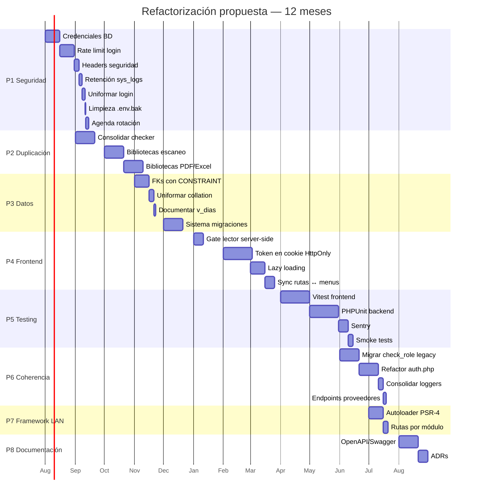

<div align="center">


# 25 · Refactorización (Propuesta)

**Documentación técnica — Aplicativo SEAO**

</div>

---

|                      |                                                   |
| -------------------- | ------------------------------------------------- |
| **Documento**        | 25 — Refactorización                              |
| **Versión**          | 1.0                                               |
| **Fecha**            | 14 de julio de 2026                               |
| **Depende de**       | 26 · Deuda Técnica · Todos los documentos previos |
| **Lo usan**          | 27 · Riesgos · 28 · Roadmap                       |
| **Confidencialidad** | Uso interno                                       |

---

## 1 · Objetivo

**Traducir la deuda técnica inventariada en [26](./26-deuda-tecnica.md) a propuestas concretas de mejora**, con: descripción del cambio, motivación, alternativas consideradas, impacto esperado y esfuerzo estimado.

**Este documento NO modifica el código.** Solo propone. Cada propuesta debe validarse con el equipo antes de ejecutarla.

Se organizan por **paquetes de trabajo agrupables**, no ítem por ítem — algunos DTs se resuelven en conjunto con menor esfuerzo.

---

## 2 · Paquete P1 · Endurecimiento de seguridad tácticos (Sprint 1–2)

Ataca la deuda 🔴 Alta de seguridad con esfuerzo bajo. **Alta relación beneficio/costo.**

Incluye DT-001, DT-002, DT-005, DT-011, DT-014, DT-015, DT-016, DT-036, DT-037.

### 2.1 P1.1 · Migrar credenciales de BD a `.env`

**Ítems atendidos:** DT-001, DT-002.

**Cambio propuesto:**

1. Crear `.env` en el hosting cPanel fuera del docroot (o dentro con `.htaccess` que lo bloquee).
2. Refactorizar `backend/api/config/database.php` para leer desde `getenv('DB_HOST')`, `getenv('DB_PASS')`, etc.
3. Aplicar lo mismo a `database_proveedor.php`.
4. Actualizar los 5 cronjobs `subir_checker_mysql*.php` para leer del mismo `.env`.

**Alternativa considerada:** usar constantes en un archivo PHP fuera del docroot. Descartada — un `.env` es más portable y ya se usa en el framework LAN, así que se estandariza.

**Impacto:** al filtrarse el repositorio de código, las credenciales de BD no viajan con él.

**Esfuerzo:** S (~1 día).

### 2.2 P1.2 · Rate limit en login

**Ítems atendidos:** DT-005.

**Cambio propuesto:**

Al inicio de `login.php` y `login_microsoft.php`:

```php
include_once '../middlewares/rate_limit.php';
$ip = $_SERVER['REMOTE_ADDR'] ?? 'unknown';
$loginAttempted = $input['login'] ?? 'anon';
RateLimit::check("login-{$ip}", 5, 60);         // 5 intentos / IP / minuto
RateLimit::check("login-{$loginAttempted}", 3, 60); // 3 intentos por login / minuto
```

**Alternativa considerada:** rate limiting a nivel Cloudflare. Válido, pero el `RateLimit` propio ya existe y ofrece granularidad por login.

**Impacto:** ataques de fuerza bruta se ralentizan drásticamente.

**Esfuerzo:** XS (~1 hora).

### 2.3 P1.3 · Headers de seguridad en `.htaccess`

**Ítems atendidos:** DT-014, DT-015.

**Cambio propuesto** — añadir al `.htaccess` del backend cPanel:

```apache
<IfModule mod_headers.c>
  Header always set Strict-Transport-Security "max-age=31536000; includeSubDomains"
  Header always set X-Content-Type-Options "nosniff"
  Header always set X-Frame-Options "DENY"
  Header always set Referrer-Policy "strict-origin-when-cross-origin"
  Header always set Content-Security-Policy "default-src 'self'; script-src 'self'; style-src 'self' 'unsafe-inline'; img-src 'self' data: https:; connect-src 'self' https://api-biable.supermercadobelalcazar.com https://login.microsoftonline.com https://graph.microsoft.com; frame-src 'none'; object-src 'none';"
  Header always set Permissions-Policy "camera=(self), microphone=(), geolocation=()"
</IfModule>
```

**Alternativa considerada:** CSP con `unsafe-inline` scripts. Descartada — inicia con política estricta y se relaja solo si hay componentes que no funcionen.

**Impacto:** mitiga XSS, clickjacking, MIME sniffing y leak de referrer.

**Esfuerzo:** XS (~30 min), pero requiere **prueba en staging** antes por si algún script inline rompe.

### 2.4 P1.4 · Retención automática de `sys_logs`

**Ítems atendidos:** DT-011.

**Cambio propuesto:**

Añadir un cronjob mensual con el script `cron/purgar_sys_logs.php`:

```php
<?php
require_once __DIR__ . '/../api/config/database.php';
$db = (new Database())->getConnection();
$stmt = $db->prepare("DELETE FROM sys_logs WHERE timestamp < DATE_SUB(NOW(), INTERVAL 6 MONTH)");
$stmt->execute();
$deleted = $stmt->rowCount();
$db->exec("OPTIMIZE TABLE sys_logs");
echo "Purgados: $deleted registros\n";
```

Registrar en cPanel Cron Jobs con frecuencia mensual (primer día del mes 03:00 AM).

**Impacto:** BD no crece indefinidamente.

**Esfuerzo:** XS.

### 2.5 P1.5 · Uniformar respuesta de login

**Ítems atendidos:** DT-016.

**Cambio propuesto:**

En `login.php`, unificar los mensajes de "usuario no existe" y "contraseña incorrecta" para no facilitar enumeración:

```php
// Antes: 404 "El usuario no existe" · 401 "Usuario o contrasena incorrectos"
// Después: siempre 401 "Credenciales inválidas"

if (!$row || !password_verify($password, $row['contrasena'])) {
    http_response_code(401);
    echo json_encode(['success' => false, 'message' => 'Credenciales inválidas']);
    // seguir logueando internamente la diferencia
    $logger->warning("Intento fallido", $login);
    exit;
}

if ($row['activo'] != 1) {
    http_response_code(403);
    echo json_encode(['success' => false, 'message' => 'Usuario inactivo, contacte con el administrador']);
    exit;
}
```

**Impacto:** un atacante no puede saber qué logins existen sin loguear correctamente.

**Esfuerzo:** XS.

### 2.6 P1.6 · Limpieza de `.env.bak`

**Ítems atendidos:** DT-036.

**Cambio propuesto:** eliminar `repo/.env.bak` del servidor LAN. Ampliar el `.htaccess` para cubrir cualquier variante:

```apache
<FilesMatch "^\.env">
  Order Allow,Deny
  Deny from all
</FilesMatch>
```

**Esfuerzo:** trivial (5 min).

### 2.7 P1.7 · Agenda de rotación de secretos

**Ítems atendidos:** DT-037.

**Cambio propuesto:** documentar en un archivo/hoja de cálculo interno las fechas límite de rotación:

- Client secret Microsoft (fecha exacta de expiración).
- `API_SECRET` (rotación anual).
- Passwords BD (rotación anual).
- Password SMTP (rotación anual).

Fechas + recordatorios 30 días antes.

**Esfuerzo:** XS (una tarde de documentación).

---

## 3 · Paquete P2 · Consolidación de duplicaciones (Sprint 3–5)

Ataca las deudas de duplicación estructural. Reduce mantenimiento a mediano plazo.

Incluye DT-008, DT-009, DT-021, DT-026, DT-027, DT-028, DT-029, DT-041.

### 3.1 P2.1 · Consolidar Lector de Precios + tablas `checker*`

**Ítems atendidos:** DT-008, DT-009.

**Cambio propuesto:**

1. **Backend:** crear tabla única `checker` con columna `id_sede`:
   ```sql
   CREATE TABLE checker (
     id_sede varchar(3) NOT NULL,
     id_codbar varchar(40) NOT NULL,
     id_item varchar(6),
     descripcion varchar(40),
     precio int,
     contenido int,
     factor varchar(10),
     PRIMARY KEY (id_sede, id_codbar)
   );
   ```
2. Migrar datos existentes con `INSERT INTO checker SELECT '001', * FROM checker1; ...`
3. Reemplazar los 5 endpoints por uno único `/api/lector_precios/get_producto.php` que recibe `id_sede`.
4. Reemplazar los 5 cronjobs por uno único con parámetro de sede o loop.
5. Actualizar rutas del frontend para pasar la sede correcta.

**Alternativa considerada:** mantener tablas separadas pero abstraer el endpoint. Descartada — resuelve solo la mitad del problema.

**Impacto:** cambios futuros (agregar columna, corregir bug) requieren 1 edición en vez de 5.

**Esfuerzo:** M (~1 semana, incluye migración y pruebas).

### 3.2 P2.2 · Consolidar bibliotecas de escaneo

**Ítems atendidos:** DT-010, DT-041 (animaciones también).

**Cambio propuesto:**

- **Escaneo:** consolidar en `@zxing/browser`. Recorrer los módulos y reemplazar:
  - `quagga` → `@zxing/browser` (uno por uno).
  - `html5-qrcode` → `@zxing/browser`.
  - `jsqr` → `@zxing/browser`.
- **Íconos:** consolidar en `lucide-react`. Reemplazar:
  - `react-icons` → equivalentes en lucide.
  - `@fortawesome/*` → equivalentes en lucide.
- **Animaciones:** consolidar en `framer-motion`. Reemplazar `react-transition-group` progresivamente.

**Ejecución:** un módulo a la vez, sin big-bang. Después de cada módulo, verificar bundle size con `vite build --report`.

**Esfuerzo:** M por librería (~2–5 días cada una).

### 3.3 P2.3 · Consolidar librerías PDF y Excel

**Ítems atendidos:** DT-027, DT-028, DT-029.

**Cambio propuesto:**

- **PDF:** consolidar en TCPDF (más completo). Migrar módulos que aún usen FPDF; deprecar `fpdf/` y `tc-lib-pdf-main/` si no aportan capacidades únicas.
- **Excel:** determinar cuál se usa realmente en cada endpoint (`exceljs` o `xlsx`) y consolidar en uno. Preferencia por `exceljs` (más maduro, mejor soporte estilos).
- **PhpSpreadsheet:** migrar completamente a Composer (`vendor/phpoffice/`). Eliminar `utils/PhpSpreadsheet-master/`.

**Esfuerzo:** M por librería.

### 3.4 P2.4 · Consolidar `models/proveedor.php` y `models/provider.php`

**Ítems atendidos:** DT-021.

**Cambio propuesto:** analizar cuál se usa realmente (grep por `require`/`include` en toda la codebase), consolidar en uno (preferir `proveedor.php`, coherente con el español del resto), eliminar el otro.

**Esfuerzo:** XS.

---

## 4 · Paquete P3 · Fortalecer el modelo de datos (Sprint 6–8)

Ataca deudas estructurales de BD. Requiere análisis cuidadoso — cambios de esquema son sensibles.

Incluye DT-022, DT-023, DT-024, DT-025.

### 4.1 P3.1 · Declarar FKs con `CONSTRAINT`

**Ítems atendidos:** DT-022.

**Cambio propuesto:**

Añadir constraints en las relaciones críticas primero:

```sql
ALTER TABLE sesiones
  ADD CONSTRAINT fk_sesiones_usuario
  FOREIGN KEY (id_usuario) REFERENCES usuarios(id) ON DELETE CASCADE;

ALTER TABLE detalles_pedido_carnes
  ADD CONSTRAINT fk_dpc_pedido
  FOREIGN KEY (id_pedido) REFERENCES pedidos_carnes(id) ON DELETE CASCADE;

ALTER TABLE detalles_pedido_carnes
  ADD CONSTRAINT fk_dpc_item
  FOREIGN KEY (id_item) REFERENCES items_pedidos_carnes(id_item);

-- ...continuar con las demás relaciones críticas
```

⚠ **Advertencia:** requiere verificar que no haya huérfanos actuales. `SELECT COUNT(*) FROM detalles_pedido_carnes d LEFT JOIN pedidos_carnes p ON p.id = d.id_pedido WHERE p.id IS NULL;` — debe devolver 0 antes de añadir el constraint.

**Esfuerzo:** M (incluye verificación de integridad previa).

### 4.2 P3.2 · Uniformar collation

**Ítems atendidos:** DT-023.

**Cambio propuesto:** migrar todas las tablas a `utf8mb4_unicode_ci`:

```sql
ALTER TABLE api_keys CONVERT TO CHARACTER SET utf8mb4 COLLATE utf8mb4_0900_ai_ci;
-- ...aplicar a todas las tablas con collation distinta
```

**Alternativa:** dejar como está y añadir `COLLATE` explícito en los JOINs — más frágil.

**Esfuerzo:** S (script SQL + prueba de humo).

### 4.3 P3.3 · Documentar la vista `v_dias_conciliados`

**Ítems atendidos:** DT-025.

**Cambio propuesto:** obtener el cuerpo SQL con `SHOW CREATE VIEW v_dias_conciliados` desde phpMyAdmin y añadirlo al documento 14. **No requiere cambio de código.**

**Esfuerzo:** XS.

### 4.4 P3.4 · Adoptar sistema de migraciones

**Ítems atendidos:** DT-007.

**Cambio propuesto:** integrar **Phinx** (herramienta PHP simple, no requiere framework):

```bash
composer require robmorgan/phinx
```

Estructura:

```
db/migrations/
├── 20260714000001_initial_schema.php
├── 20260715000001_add_column_x_to_y.php
└── ...
```

Cada cambio de esquema es un archivo versionado en Git.

**Alternativa considerada:** Flyway (Java) — descartada, mejor mantener el ecosistema PHP.

**Esfuerzo:** M (adopción inicial + migrar cambios pendientes al sistema).

---

## 5 · Paquete P4 · Modernización del frontend (Sprint 9–12)

Ataca deudas del cliente. Puede hacerse en paralelo con P3.

Incluye DT-003, DT-004, DT-013, DT-030, DT-033.

### 5.1 P4.1 · Gate del Lector de Precios server-side

**Ítems atendidos:** DT-003.

**Cambio propuesto:**

1. Crear endpoint `/api/lector_precios/verify_password.php` que recibe `password` y responde `{success: true|false}`.
2. El frontend hace el gate contra ese endpoint en vez de comparar client-side.
3. Eliminar `VITE_LECTOR_PASSWORD` del `.env` del frontend.

**Alternativa:** autenticar cada quiosco con usuario dedicado. Requiere más cambios pero es más robusto.

**Esfuerzo:** S.

### 5.2 P4.2 · Migrar token a cookie HttpOnly

**Ítems atendidos:** DT-013.

**Cambio propuesto** (fase de transición larga):

1. **Fase A** — Backend: hacer que `login.php` **además** de devolver el token, escriba una cookie `Set-Cookie: authToken=<token>; HttpOnly; Secure; SameSite=Strict; Path=/api; Max-Age=86400`.
2. **Fase B** — Backend: hacer que `auth.php` lea la cookie **antes** de leer el header (con header como fallback).
3. **Fase C** — Frontend: dejar de leer el token del backend response y confiar en la cookie. El frontend no gestiona más el token.
4. **Fase D** — Backend: eliminar el envío del token en el body. `logout.php` limpia la cookie.

**Alternativa considerada:** JWT en cookie. Descartada — el modelo actual con tabla `sesiones` funciona bien y JWT tiene sus propios problemas (revocación).

**Impacto:** XSS ya no puede exfiltrar el token.

**Esfuerzo:** L (~2 semanas, con periodo de coexistencia).

### 5.3 P4.3 · Lazy loading de rutas

**Ítems atendidos:** DT-030.

**Cambio propuesto:**

En `App.jsx`, envolver componentes grandes en `React.lazy`:

```jsx
const Recaudos = React.lazy(
  () => import("./components/Contabilidad/Recaudos/Recaudos"),
);

<Route
  path="/contabilidad/recaudos"
  element={
    <PrivateRoute>
      <Layout>
        <Suspense fallback={<LoadingScreen isVisible variant="fullscreen" />}>
          <Recaudos />
        </Suspense>
      </Layout>
    </PrivateRoute>
  }
/>;
```

Empezar por los módulos más grandes (Publicidad, Contabilidad DIAN, Recaudos).

**Impacto:** bundle inicial más pequeño; carga inicial más rápida.

**Esfuerzo:** M.

### 5.4 P4.4 · Sincronización rutas frontend ↔ tabla `menus`

**Ítems atendidos:** DT-033.

**Cambio propuesto:**

Añadir un script de verificación en el proceso de build:

1. Extraer todas las rutas declaradas en `App.jsx` (regex sobre las `path=`).
2. Consultar todas las `menus.ruta` de la BD.
3. Reportar rutas del frontend sin menú y menús sin ruta del frontend.

Correr semanal como parte de mantenimiento.

**Esfuerzo:** M.

---

## 6 · Paquete P5 · Testing y observabilidad (Sprint 13–16)

Ataca deudas de calidad — de mayor esfuerzo y visibilidad.

Incluye DT-012, DT-035, DT-049.

### 6.1 P5.1 · Introducir tests unitarios en el frontend

**Ítems atendidos:** DT-012 (parcial).

**Cambio propuesto:**

- Adoptar **Vitest** (integración nativa con Vite).
- Empezar por hooks y utils (funciones puras) — cobertura fácil.
- Meta: alcanzar 30% de cobertura en 3 meses, 60% en 6.

```javascript
// hooks/useRecaudosData.test.js
import { renderHook, act } from "@testing-library/react";
import { useRecaudosData } from "./useRecaudosData";

test("consulta recaudos y actualiza data", async () => {
  // ...
});
```

**Esfuerzo:** L (adopción + primera batch).

### 6.2 P5.2 · Introducir tests de integración en el backend

**Ítems atendidos:** DT-012 (parcial).

**Cambio propuesto:**

- Adoptar **PHPUnit**.
- Empezar por endpoints críticos: login, verify_token, check_permission.
- BD de test separada con fixtures.

**Esfuerzo:** L.

### 6.3 P5.3 · Adoptar Sentry (o similar) para monitoreo de errores

**Ítems atendidos:** DT-035.

**Cambio propuesto:**

- **Frontend:** `@sentry/react` — captura errores JS + performance.
- **Backend:** `sentry/sentry-php` — captura excepciones PHP no manejadas.

Reduce dependencia del reporte manual del usuario.

**Esfuerzo:** S (instalación); M (limpieza inicial de errores conocidos).

### 6.4 P5.4 · Prueba de humo automatizada post-deploy

**Ítems atendidos:** DT-049.

**Cambio propuesto:**

Script `deploy/smoke.sh` que corre curl a los endpoints críticos:

```bash
# health check
curl -f https://aplicativo.supermercadobelalcazar.com/api/system/status/endpoint.php ...

# login funciona
curl -f -X POST https://aplicativo.…/api/login.php -d '{"login":"test","password":"..."}'
```

Correr manualmente tras cada deploy.

**Esfuerzo:** S.

---

## 7 · Paquete P6 · Estructura y coherencia (Sprint 17–20)

Ataca deudas estructurales del código. Bajo riesgo, mejora la mantenibilidad.

Incluye DT-017, DT-018, DT-019, DT-020, DT-038, DT-039, DT-040.

### 7.1 P6.1 · Migrar endpoints legacy con `check_role` a `check_permission`

**Ítems atendidos:** DT-017.

**Cambio propuesto:** identificar los endpoints con `requireRole([...])` (grep) y migrarlos a `requirePermiso('/ruta', 'accion')`. Configurar los permisos correspondientes en `rol_menu` y `cargo_menu`.

Uno por uno, sin big-bang.

**Esfuerzo:** M.

### 7.2 P6.2 · Guía formal Patrón A vs Patrón B

**Ítems atendidos:** DT-018.

**Cambio propuesto:** el documento [22 · Convenciones §5](./22-convenciones.md) ya establece la guía. Adopción efectiva.

**Esfuerzo:** — (ya está documentado; solo requiere disciplina).

### 7.3 P6.3 · Refactor de `auth.php` sin efectos laterales

**Ítems atendidos:** DT-019.

**Cambio propuesto:**

Convertir `auth.php` en una función:

```php
// Nuevo: middlewares/auth.php
function requireAuth() {
    // ... lógica actual ...
    return $user;  // devuelve en vez de setear $GLOBALS
}
```

En cada endpoint:

```php
include_once '../middlewares/auth.php';
$currentUser = requireAuth();  // reemplaza $GLOBALS['current_user']
```

**Esfuerzo:** M (requiere actualizar todos los endpoints — ~110).

### 7.4 P6.4 · Consolidar los dos loggers del backend

**Ítems atendidos:** DT-020.

**Cambio propuesto:** analizar diferencias entre `services/logger.php` y `utils/logger.php`, consolidar en uno (probablemente `services/logger.php` — más rico).

**Esfuerzo:** S.

### 7.5 P6.5 · Aclarar endpoints del aplicativo de proveedores

**Ítems atendidos:** DT-038, DT-040.

**Cambio propuesto:**

- Mover `forgot_password.php` fuera de `backend/api/`.
- Documentar en `docs/23-modulos/proveedores-adyacente.md` (o similar) que la tabla `password_resets` y ese endpoint son del aplicativo de proveedores.

**Esfuerzo:** XS.

### 7.6 P6.6 · Uniformar ubicación de endpoints raíz

**Ítems atendidos:** DT-039.

**Cambio propuesto:** mover los endpoints raíz a subcarpetas:

- `login.php`, `login_microsoft.php`, `logout.php`, `verify_token.php` → `api/auth/`.
- Actualizar `apiService` en frontend con las nuevas rutas.

**Esfuerzo:** S. **Requiere coordinación con frontend** (breaking change de URLs).

---

## 8 · Paquete P7 · Framework LAN — mejoras de arquitectura (Sprint 21–24)

Ataca deudas del framework LAN. Bajo impacto negocio, mejora mantenibilidad futura.

Incluye DT-044, DT-045.

### 8.1 P7.1 · Autoloader PSR-4 en el framework LAN

**Ítems atendidos:** DT-044.

**Cambio propuesto:**

1. Añadir `composer.json` al framework:
   ```json
   {
     "autoload": {
       "psr-4": { "App\\": "src/" }
     }
   }
   ```
2. Migrar clases con namespace `App\Modules\Financiero\RecaudosRepo`, etc.
3. Reemplazar los 18 `require_once` por `require 'vendor/autoload.php';`.

**Alternativa considerada:** autoload manual (spl_autoload_register). Descartada — Composer es estándar.

**Impacto:** cada request paga solo lo que usa.

**Esfuerzo:** M.

### 8.2 P7.2 · Descomponer el mapa `$rutas`

**Ítems atendidos:** DT-045.

**Cambio propuesto:**

Extraer las rutas a archivos por módulo:

```php
// modules/general/routes.php
return [
    'listar_motivos' => ['MotivosRepo', 'listar'],
    'buscar_motivo_por_id' => ['MotivosRepo', 'buscarPorId'],
    // ...
];
```

Y en `index.php`:

```php
$rutas = array_merge(
    require __DIR__ . '/modules/general/routes.php',
    require __DIR__ . '/modules/comercial/routes.php',
    require __DIR__ . '/modules/financiero/routes.php',
    require __DIR__ . '/modules/inventario/routes.php',
    require __DIR__ . '/modules/system/routes.php',
);
```

**Esfuerzo:** S.

---

## 9 · Paquete P8 · Documentación y contratos (Sprint 25–28)

Ataca deudas de documentación estructural.

Incluye DT-034, DT-047.

### 9.1 P8.1 · Adoptar OpenAPI/Swagger

**Ítems atendidos:** DT-034.

**Cambio propuesto:**

- Escribir `openapi.yaml` con todos los endpoints (~110).
- Publicar la UI Swagger en `/api/docs`.
- Se mantiene manualmente al principio; en el futuro puede generarse desde comentarios PHP.

**Alternativa:** annotations en PHP. Descartada — más complejidad inicial.

**Esfuerzo:** L (~2 semanas para el yaml inicial + tooling).

### 9.2 P8.2 · Adoptar ADRs (Architecture Decision Records)

**Ítems atendidos:** DT-047.

**Cambio propuesto:** crear carpeta `docs/adr/` con documentos numerados que registran decisiones arquitectónicas:

```
docs/adr/
├── 0001-uso-de-cloudflare-tunnel.md
├── 0002-sesion-unica-por-usuario.md
├── 0003-sin-orm-en-el-framework.md
└── ...
```

Formato Michael Nygard (contexto, decisión, consecuencias).

**Esfuerzo:** M (una tarde por ADR; total ~5–10 ADRs iniciales).

---

## 10 · Cronograma sugerido

Asumiendo un equipo de 1–2 desarrolladores tiempo parcial:



**Duración estimada total:** 12 meses en modo "esfuerzo esporádico". Puede comprimirse a 6 meses con dedicación completa.

---

## 11 · Métricas de éxito

Cómo saber si el paquete funcionó:

| Paquete          | Métrica                                                                                         |
| ---------------- | ----------------------------------------------------------------------------------------------- |
| P1 Seguridad     | 0 credenciales hardcoded en el repo; escaneos pentest no reportan las mismas vulnerabilidades   |
| P2 Duplicación   | Bundle frontend < 800 KB gzipped; endpoints únicos por operación                                |
| P3 Datos         | 0 huérfanos referenciales; migraciones aplicadas sin manual                                     |
| P4 Frontend      | Bundle inicial < 400 KB; token no accesible por JS                                              |
| P5 Testing       | 60% cobertura frontend, 40% cobertura backend; 5–10 errores/mes detectados antes que el usuario |
| P6 Coherencia    | 100% endpoints con `check_permission` moderno                                                   |
| P7 Framework LAN | Bootstrap < 20 ms                                                                               |
| P8 Documentación | OpenAPI publicada; 10 ADRs registrados                                                          |

---

## 12 · Riesgos de refactorización

⚠ Refactorizar tiene riesgos propios. Anticiparlos:

| Riesgo                                   | Mitigación                                                        |
| ---------------------------------------- | ----------------------------------------------------------------- |
| Introducir bugs en código que funcionaba | Tests + prueba manual completa por paquete                        |
| Downtime durante migración de esquema    | Ventana de mantenimiento anunciada + backup previo                |
| Breaking changes de URLs (P6.6)          | Coordinación con frontend, deploy simultáneo                      |
| Regresiones no detectadas                | Adopción de tests (P5) **antes** de las refactorizaciones grandes |
| Overload del equipo                      | Priorizar; no todos los paquetes al mismo tiempo                  |
| Nostalgia del código legacy              | Documentar la motivación de cada cambio                           |

---

## 13 · Referencias cruzadas

| Necesitas…                      | Documento                                   |
| ------------------------------- | ------------------------------------------- |
| Inventario detallado de deuda   | [26 · Deuda Técnica](./26-deuda-tecnica.md) |
| Análisis de riesgos consolidado | [27 · Riesgos](./27-riesgos.md)             |
| Roadmap propuesto               | [28 · Roadmap](./28-roadmap.md)             |
| Ver análisis de seguridad       | [12 · Seguridad](./12-seguridad.md)         |
| Ver convenciones                | [22 · Convenciones](./22-convenciones.md)   |

---

<div align="center">
<sub><b>Supermercados Belalcázar</b> · Documento 25 — Refactorización · v1.0 · 14 de julio de 2026</sub>
</div>
