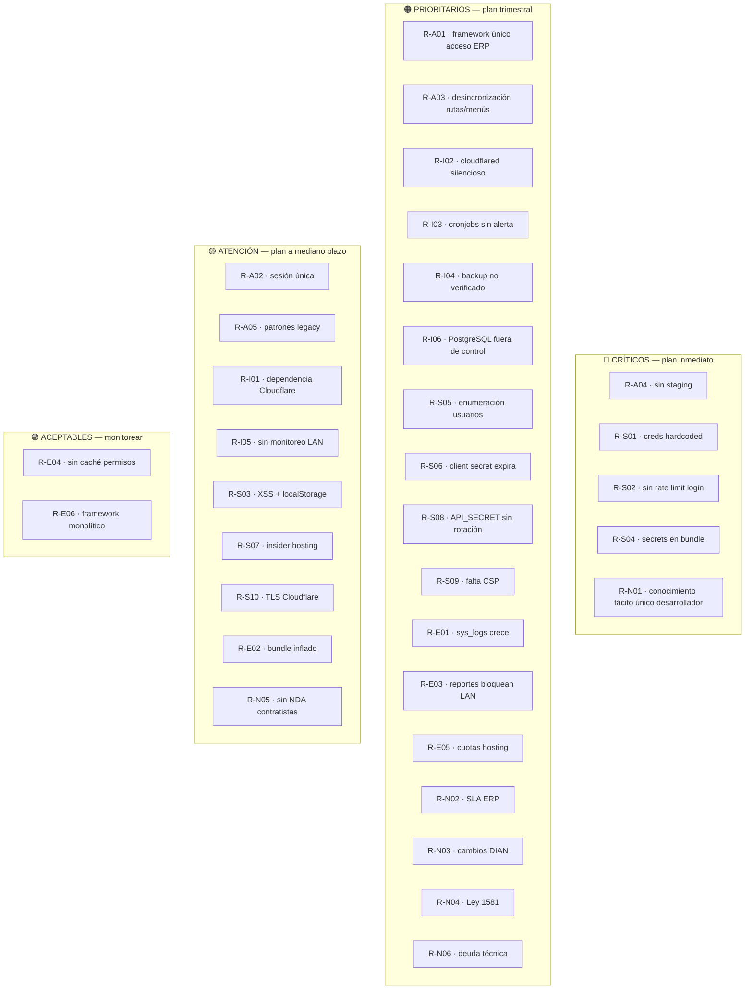

# 27 · Riesgos

**Documentación técnica — Aplicativo SEAO**

---

|                      |                                                            |
| -------------------- | ---------------------------------------------------------- |
| **Documento**        | 27 — Riesgos                                               |
| **Versión**          | 1.0                                                        |
| **Fecha**            | 14 de julio de 2026                                        |
| **Depende de**       | 12 · Seguridad · 26 · Deuda Técnica · 25 · Refactorización |
| **Lo usan**          | 28 · Roadmap · Comité de dirección técnica                 |
| **Confidencialidad** | Uso interno — sensible                                     |

---

## 1 · Objetivo

Consolidar el **mapa de riesgos** del sistema desde cinco ángulos: arquitectónicos, de infraestructura, seguridad, escalabilidad y negocio. Cada riesgo se cataloga con probabilidad, impacto, exposición actual y mitigaciones existentes o propuestas.

A diferencia de [26 · Deuda Técnica](./26-deuda-tecnica.md) — que enumera problemas del código — este documento enumera **eventos adversos que podrían materializarse** y evalúa su preparación.

---

## 2 · Método de evaluación

Cada riesgo se evalúa en la matriz clásica **probabilidad × impacto**:

|                    | Impacto Bajo | Impacto Medio | Impacto Alto | Impacto Crítico |
| ------------------ | :----------: | :-----------: | :----------: | :-------------: |
| **Prob. Muy alta** |      🟡      |      🟠       |      🔴      |       🔴        |
| **Prob. Alta**     |      🟢      |      🟡       |      🟠      |       🔴        |
| **Prob. Media**    |      🟢      |      🟢       |      🟡      |       🟠        |
| **Prob. Baja**     |      🟢      |      🟢       |      🟢      |       🟡        |

- 🟢 Aceptable — monitorear.
- 🟡 Atención — plan a mediano plazo.
- 🟠 Prioritario — plan trimestral.
- 🔴 Crítico — plan inmediato.

---

## 3 · Riesgos arquitectónicos

### 3.1 R-A01 · Framework LAN como punto único de acceso al ERP

**Descripción:** todo el aplicativo depende del framework LAN para consultar el ERP. Si `repo/index.php` falla o el servidor LAN cae, ningún módulo contable/comercial funciona.

**Probabilidad:** Media (mitigada por la simplicidad del código y la robustez del túnel).
**Impacto:** Alto (usuarios contables/compras/inventario bloqueados).
**Nivel:** 🟠 Prioritario.

**Mitigaciones actuales:**

- `SystemStatusRepo` health check.
- El backend cPanel devuelve 504 con mensaje amigable.
- El resto del aplicativo (CRUD local, permisos, actas, visitantes) sigue funcionando.

**Mitigación propuesta:** ver [25 · P7](./25-refactorizacion.md) — modularizar el router para facilitar aislar módulos caídos individualmente.

### 3.2 R-A02 · Sesión única por usuario limita casos legítimos

**Descripción:** un usuario que trabaja en dos dispositivos (oficina + móvil) se ve forzado a cerrar sesión al pasar de uno a otro.

**Probabilidad:** Alta (usuarios reales lo reportan).
**Impacto:** Bajo (UX solamente).
**Nivel:** 🟡 Atención.

**Mitigación propuesta:** evaluar cambio de política — múltiples sesiones activas con tabla `sesiones` con `id_sesion` como PK compuesta.

### 3.3 R-A03 · Rutas de frontend desacopladas de la tabla `menus`

**Descripción:** al añadir una ruta en `App.jsx` es fácil olvidar crear el registro correspondiente en `menus`; y viceversa. Consecuencia: menú visible sin ruta operativa, o ruta operativa sin menú (acceso solo por URL directa).

**Probabilidad:** Alta.
**Impacto:** Medio.
**Nivel:** 🟠 Prioritario.

**Mitigación propuesta:** ver [25 · P4.4](./25-refactorizacion.md) — script de verificación cruzada.

### 3.4 R-A04 · Ausencia de ambiente de staging

**Descripción:** cambios de código y esquema se aplican directamente en producción, con backup como única red de seguridad.

**Probabilidad:** Alta.
**Impacto:** Alto en caso de bug post-deploy.
**Nivel:** 🔴 Crítico.

**Mitigación propuesta:** ver [25 · P3.4 y P4.3](./25-refactorizacion.md) — staging separado; migraciones automatizadas.

### 3.5 R-A05 · Coexistencia de patrones legacy y nuevos

**Descripción:** dos generaciones de autorización (`check_role` y `check_permission`), dos patrones de endpoint (A y B), dos loggers, dos convenciones de timestamps (`fecha_creacion`/`created_at`).

**Probabilidad:** Muy alta (ya es la realidad).
**Impacto:** Bajo (funciona, solo confunde a nuevos desarrolladores).
**Nivel:** 🟡 Atención.

**Mitigación:** [22 · Convenciones](./22-convenciones.md) documenta cuándo aplicar cada uno + [25 · P6](./25-refactorizacion.md) migración gradual.

---

## 4 · Riesgos de infraestructura

### 4.1 R-I01 · Cloudflare como dependencia crítica

**Descripción:** todo el tráfico externo pasa por Cloudflare (DNS, WAF, TLS, túnel). Una interrupción del servicio Cloudflare deja el aplicativo inaccesible.

**Probabilidad:** Baja (Cloudflare tiene alta disponibilidad).
**Impacto:** Crítico (aplicativo entero inaccesible).
**Nivel:** 🟡 Atención.

**Mitigación actual:** ninguna — dependencia por diseño.

**Mitigación propuesta:** documentar el procedimiento de "modo emergencia" (dirigir DNS temporalmente a otro proveedor). Aceptar el riesgo residual dado el track record de Cloudflare.

### 4.2 R-I02 · Cloudflared daemon en LAN cae silenciosamente

**Descripción:** si el proceso `cloudflared` muere en el servidor LAN, el hosting cPanel deja de poder consultar al framework. Requiere reinicio manual (`systemctl restart`).

**Probabilidad:** Media (puede pasar por OOM, actualización, corte de energía).
**Impacto:** Alto.
**Nivel:** 🟠 Prioritario.

**Mitigación actual:** systemd `Restart=always` (asumido — verificar).

**Mitigación propuesta:** health check externo cada 5 min que alerte si `api-biable.…` no responde.

### 4.3 R-I03 · Cronjobs fallidos sin alerta

**Descripción:** los 5 cronjobs `subir_checker_mysql*` pueden fallar por archivos truncados, credenciales, MySQL caído. La única "detección" es que el lector de precios muestre datos viejos.

**Probabilidad:** Alta (por evidencia — hay logs de fallos previos).
**Impacto:** Medio (usuarios en tienda ven precios desactualizados).
**Nivel:** 🟠 Prioritario.

**Mitigación propuesta:** el cronjob debería enviar correo/notificación en caso de fallo, no solo escribir al log.

### 4.4 R-I04 · Backup MySQL no verificado

**Descripción:** se sospecha que existen backups automáticos vía cPanel, pero no hay verificación periódica de que sean restaurables.

**Probabilidad:** Baja de necesitar restore.
**Impacto:** Crítico si el backup no funciona.
**Nivel:** 🟠 Prioritario.

**Mitigación propuesta:** ver [19 §3.1](./19-manual-operacion.md) — prueba trimestral de restauración.

### 4.5 R-I05 · Servidor LAN sin monitoreo

**Descripción:** no hay observabilidad activa sobre el servidor LAN (uso CPU, memoria, disco, PostgreSQL).

**Probabilidad:** Media.
**Impacto:** Medio.
**Nivel:** 🟡 Atención.

**Mitigación propuesta:** instalación de agente ligero (Netdata, Prometheus node_exporter) — reporta al equipo de Sistemas.

### 4.6 R-I06 · PostgreSQL fuera del control del aplicativo

**Descripción:** las BDs `biable01` y `biable02` son mantenidas por el equipo del ERP Siesa Biable. Cambios de esquema, mantenimiento, downtime dependen de ellos.

**Probabilidad:** Alta (fuera del control).
**Impacto:** Alto.
**Nivel:** 🟠 Prioritario.

**Mitigación actual:** coordinación informal.

**Mitigación propuesta:** SLA formal con el equipo ERP (horarios de mantenimiento, notificación de cambios de esquema con antelación).

---

## 5 · Riesgos de seguridad

### 5.1 R-S01 · Credenciales en repositorio

**Descripción:** BD y SMTP hardcoded en archivos PHP. Si el repositorio se filtra (Git público accidental, backup mal protegido, contratista externo), las credenciales viajan con él.

**Probabilidad:** Media.
**Impacto:** Alto (acceso completo a BD del aplicativo).
**Nivel:** 🔴 Crítico.

**Mitigación propuesta:** [25 · P1.1](./25-refactorizacion.md) — migrar a `.env` (2 días de trabajo).

### 5.2 R-S02 · Fuerza bruta contra `login.php`

**Descripción:** sin rate limiting, un atacante puede probar 100+ combinaciones/minuto. Aunque bcrypt es lento, con logins comunes (ana, jperez) puede tener éxito.

**Probabilidad:** Media (aplicativo expuesto a Internet).
**Impacto:** Alto (acceso al aplicativo).
**Nivel:** 🔴 Crítico.

**Mitigación propuesta:** [25 · P1.2](./25-refactorizacion.md) — 1 hora de trabajo.

### 5.3 R-S03 · XSS en el frontend + token en localStorage

**Descripción:** si se introduce XSS (por `dangerouslySetInnerHTML`, input sin sanitizar, dependencia comprometida), el token de sesión puede exfiltrarse desde `localStorage`.

**Probabilidad:** Baja (React 19 protege por defecto).
**Impacto:** Alto.
**Nivel:** 🟡 Atención.

**Mitigación propuesta:** [25 · P1.3 + P4.2](./25-refactorizacion.md) — CSP + migrar a cookie HttpOnly.

### 5.4 R-S04 · Secretos en el bundle JS público

**Descripción:** `VITE_LECTOR_PASSWORD` y `VITE_TOKEN_AGENT_PRINTER` son extraíbles del bundle.

**Probabilidad:** Muy alta (cualquiera con DevTools puede leerlos).
**Impacto:** Medio-Alto según el secreto.
**Nivel:** 🔴 Crítico.

**Mitigación propuesta:** [25 · P4.1](./25-refactorizacion.md).

### 5.5 R-S05 · Enumeración de usuarios

**Descripción:** `login.php` distingue entre "usuario no existe" (404) y "contraseña incorrecta" (401), facilitando reconocimiento previo a fuerza bruta.

**Probabilidad:** Alta (parte estándar del reconocimiento).
**Impacto:** Medio.
**Nivel:** 🟠 Prioritario.

**Mitigación propuesta:** [25 · P1.5](./25-refactorizacion.md) — uniformar mensaje.

### 5.6 R-S06 · Client secret Microsoft expira

**Descripción:** el secret OAuth de Azure expira automáticamente (6/12/24 meses). Si nadie renueva a tiempo, el login Microsoft deja de funcionar.

**Probabilidad:** Alta (es cuestión de tiempo).
**Impacto:** Alto (usuarios que dependen del SSO no pueden entrar).
**Nivel:** 🟠 Prioritario.

**Mitigación propuesta:** [25 · P1.7](./25-refactorizacion.md) — agenda de rotación con alerta 30 días antes.

### 5.7 R-S07 · Insider con acceso a hosting

**Descripción:** un administrador con acceso a cPanel puede modificar código, BD, cronjobs. Sin política de doble control ni logs de administración.

**Probabilidad:** Baja.
**Impacto:** Crítico.
**Nivel:** 🟡 Atención.

**Mitigación propuesta:**

- Rotación periódica de credenciales cPanel.
- Registro de accesos al hosting (fuera del alcance del aplicativo).
- Backup independiente del proveedor de hosting.

### 5.8 R-S08 · `API_SECRET` compartido sin rotación

**Descripción:** el token M2M entre backend cPanel y framework LAN está duplicado en dos lugares y no tiene calendario de rotación.

**Probabilidad:** Baja de compromiso; Alta de exposición prolongada.
**Impacto:** Alto (acceso completo al ERP para consultas).
**Nivel:** 🟠 Prioritario.

**Mitigación propuesta:** [25 · P1.7](./25-refactorizacion.md) — rotación anual documentada.

### 5.9 R-S09 · Falta de CSP

**Descripción:** sin Content-Security-Policy en las respuestas HTML, ataques XSS son más aprovechables.

**Probabilidad:** Media.
**Impacto:** Alto.
**Nivel:** 🟠 Prioritario.

**Mitigación propuesta:** [25 · P1.3](./25-refactorizacion.md).

### 5.10 R-S10 · Modo TLS de Cloudflare no confirmado

**Descripción:** si Cloudflare está en modo "Flexible" en vez de "Full Strict", el tráfico entre Cloudflare y el hosting va sin cifrar por parte de la ruta.

**Probabilidad:** Baja de estar mal configurado; el impacto es alto si lo está.
**Impacto:** Alto.
**Nivel:** 🟡 Atención.

**Mitigación propuesta:** verificar y documentar (una acción única, no recurrente).

---

## 6 · Riesgos de escalabilidad

### 6.1 R-E01 · `sys_logs` crece indefinidamente

**Descripción:** sin política de retención, la tabla puede llegar a millones de filas y degradar performance de queries de trace.

**Probabilidad:** Muy alta (ya está creciendo).
**Impacto:** Medio (puede colmar cuota, ralentizar admin).
**Nivel:** 🟠 Prioritario.

**Mitigación propuesta:** [25 · P1.4](./25-refactorizacion.md) — purga mensual.

### 6.2 R-E02 · Bundle frontend creciendo por dependencias duplicadas

**Descripción:** múltiples librerías (íconos ×3, escaneo ×4, animaciones ×2) inflan el bundle 500 KB–1 MB innecesariamente. Impacta primera carga en conexiones lentas de sedes.

**Probabilidad:** Alta (ya ocurre).
**Impacto:** Bajo-Medio.
**Nivel:** 🟡 Atención.

**Mitigación propuesta:** [25 · P2.2, P4.3](./25-refactorizacion.md).

### 6.3 R-E03 · Query pesada de reporte bloquea el servidor LAN

**Descripción:** un reporte Recaudos o Auditoría DIAN muy grande consume 2 GB de RAM y minutos de CPU. Peticiones concurrentes pueden agotar recursos del servidor LAN.

**Probabilidad:** Media (usuarios ocasionalmente consultan rangos amplios).
**Impacto:** Alto (framework degradado para todos).
**Nivel:** 🟠 Prioritario.

**Mitigación actual:** cada reporte pesado eleva su timeout y memoria individualmente.

**Mitigación propuesta:**

- Limitar peticiones concurrentes por usuario.
- Restringir rangos de fecha máximos en la UI.
- Considerar cola asíncrona para reportes muy grandes (ejecutar en background, notificar al terminar).

### 6.4 R-E04 · Sin caché en `check_permission`

**Descripción:** cada request autorizada dispara un SELECT extra. A escala se acumula.

**Probabilidad:** Alta (es constante).
**Impacto:** Bajo hoy; podría crecer.
**Nivel:** 🟢 Aceptable.

**Mitigación propuesta:** Redis o caché en memoria para la matriz de permisos si crece el volumen.

### 6.5 R-E05 · Hosting cPanel con cuotas fijas

**Descripción:** el plan de hosting tiene límites de disco, memoria, CPU. Crecimiento no controlado (`sys_logs`, uploads) puede consumir la cuota.

**Probabilidad:** Media.
**Impacto:** Alto (queda inservible hasta rescate).
**Nivel:** 🟠 Prioritario.

**Mitigación propuesta:** monitoreo semanal + retención automática (P1.4).

### 6.6 R-E06 · Framework LAN monolítico

**Descripción:** al escalar el número de acciones a > 100, el mapa `$rutas` y los 18 `require_once` se vuelven pesados.

**Probabilidad:** Baja a corto plazo.
**Impacto:** Bajo.
**Nivel:** 🟢 Aceptable.

**Mitigación propuesta:** [25 · P7](./25-refactorizacion.md).

---

## 7 · Riesgos de negocio

### 7.1 R-N01 · Dependencia de un único desarrollador con conocimiento tácito

**Descripción:** gran parte del conocimiento del proyecto vive en la cabeza del desarrollador actual. Su ausencia (vacaciones, renuncia) afecta la capacidad de mantenimiento.

**Probabilidad:** Alta (situación común).
**Impacto:** Alto.
**Nivel:** 🔴 Crítico.

**Mitigación:** **esta documentación es la mitigación principal.** Además:

- Pair coding cuando se incorpore un desarrollador nuevo.
- ADRs (Architecture Decision Records) para decisiones futuras (ver [25 · P8.2](./25-refactorizacion.md)).

### 7.2 R-N02 · Interrupción del servicio ERP Siesa

**Descripción:** si el equipo del ERP hace cambios de esquema PostgreSQL sin coordinar, o si el ERP entero queda fuera de servicio, los módulos contables se degradan.

**Probabilidad:** Media.
**Impacto:** Alto.
**Nivel:** 🟠 Prioritario.

**Mitigación propuesta:** SLA formal con el equipo ERP (ver R-I06).

### 7.3 R-N03 · Cambio regulatorio DIAN

**Descripción:** los códigos de responsabilidad fiscal DIAN, formatos de comprobantes, retenciones cambian por resoluciones. El aplicativo tiene lógica embebida (auditoría DIAN, retenciones) que debe actualizarse.

**Probabilidad:** Media (cambios anuales).
**Impacto:** Alto (compliance regulatorio).
**Nivel:** 🟠 Prioritario.

**Mitigación propuesta:** suscripción a boletines DIAN + revisión trimestral con contabilidad + parametrizar todo lo posible (`cfg_auditoria_dian` ya ayuda).

### 7.4 R-N04 · Cumplimiento Ley 1581 (habeas data Colombia)

**Descripción:** el aplicativo guarda datos personales (empleados, visitantes con cédula/foto, contactos). La Ley 1581 exige política de tratamiento, consentimiento, derecho al olvido.

**Probabilidad:** Alta de aplicabilidad legal.
**Impacto:** Alto (multas SIC).
**Nivel:** 🟠 Prioritario.

**Mitigación propuesta:**

- Documentar formalmente la política de tratamiento.
- Implementar endpoints de "eliminar mis datos" y "exportar mis datos".
- Retención definida por tipo de dato.

### 7.5 R-N05 · Contratación externa sin cláusulas de confidencialidad

**Descripción:** cualquier contratista con acceso al código o BD podría hacer uso indebido.

**Probabilidad:** Baja si se controla; Alta si no se firma NDA.
**Impacto:** Crítico.
**Nivel:** 🟡 Atención.

**Mitigación:** proceso legal — no técnico. Fuera del alcance de este documento pero se menciona.

### 7.6 R-N06 · Costos ocultos de deuda técnica

**Descripción:** ignorar la deuda técnica no la elimina — solo la desplaza en el tiempo con intereses. Cada mes sin refactorizar aumenta el costo de refactorizar.

**Probabilidad:** Alta (es un mecanismo natural).
**Impacto:** Alto a largo plazo.
**Nivel:** 🟠 Prioritario.

**Mitigación:** ejecutar [25 · Refactorización](./25-refactorizacion.md).

---

## 8 · Mapa de calor consolidado

**Distribución:** **5 críticos**, **17 prioritarios**, **9 en atención**, **2 aceptables**.

---

## 9 · Estrategia de mitigación priorizada

### 9.1 Trimestre 1 (los 5 críticos)

- **R-A04** — plan de staging (aunque sea mínimo, un subdominio con su BD).
- **R-S01** — migrar credenciales a `.env` (2 días).
- **R-S02** — rate limit login (1 hora).
- **R-S04** — repensar `VITE_LECTOR_PASSWORD` y `VITE_TOKEN_AGENT_PRINTER`.
- **R-N01** — completar esta documentación + pair con un segundo desarrollador.

### 9.2 Trimestres 2–3 (los 17 prioritarios)

Ver [25 · Refactorización §10](./25-refactorizacion.md) para el cronograma detallado.

### 9.3 Trimestre 4 y siguientes (los 9 en atención)

Adaptar según recursos disponibles y evolución del negocio.

---

## 10 · Referencias cruzadas

| Necesitas…                                     | Documento                                       |
| ---------------------------------------------- | ----------------------------------------------- |
| Ver las deudas técnicas puntuales              | [26 · Deuda Técnica](./26-deuda-tecnica.md)     |
| Ver el plan concreto de refactorización        | [25 · Refactorización](./25-refactorizacion.md) |
| Ver el roadmap propuesto                       | [28 · Roadmap](./28-roadmap.md)                 |
| Ver análisis de seguridad detallado            | [12 · Seguridad](./12-seguridad.md)             |
| Guía operacional para monitorear estos riesgos | [19 · Operación](./19-manual-operacion.md)      |

---

<b>Supermercados Belalcázar</b> · Documento 27 — Riesgos · v1.0 · 14 de julio de 2026

