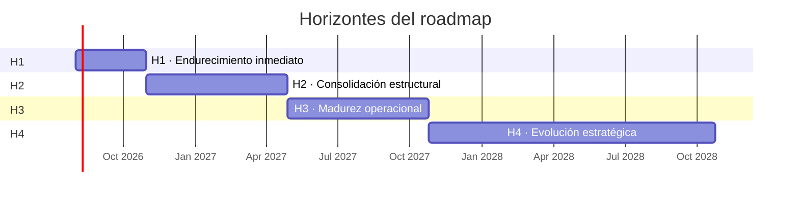
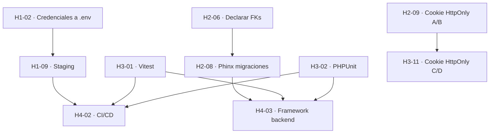

# 28 · Roadmap

**Documentación técnica — Aplicativo SEAO**

---

|                      |                                                          |
| -------------------- | -------------------------------------------------------- |
| **Documento**        | 28 — Roadmap                                             |
| **Versión**          | 1.0                                                      |
| **Fecha**            | 14 de julio de 2026                                      |
| **Depende de**       | 25 · Refactorización · 26 · Deuda Técnica · 27 · Riesgos |
| **Lo usan**          | Comité de dirección técnica                              |
| **Confidencialidad** | Uso interno                                              |

---

## 1 · Objetivo

Presentar la **visión técnica de evolución** del aplicativo a 12–36 meses, con horizontes claros, objetivos por horizonte, e iniciativas ordenadas por dependencia y valor.

Este documento no reemplaza al backlog operativo del equipo — lo enmarca. Se revisa **trimestralmente** para ajustar prioridades a la realidad del negocio.

---

## 2 · Filosofía del roadmap

Cuatro principios rectores:

1. **Continuidad sobre big-bang.** Nada de reescrituras totales. Cada iteración deja el sistema en mejor estado que la anterior, sin romper lo que funciona.
2. **Deuda antes de features.** Un mes de refactorización rinde intereses todos los meses siguientes; un mes de features carga intereses hacia adelante.
3. **Medir antes de decidir.** Las decisiones grandes (adoptar herramienta X, migrar a Y) deben apoyarse en métricas del sistema real, no en preferencias del momento.
4. **La documentación es parte del código.** Cambios que rompan la coherencia entre código y docs se consideran incompletos.

---

## 3 · Horizontes

Cuatro horizontes con criterios de éxito claros:

- **H1 · Endurecimiento inmediato** (0–3 meses).
- **H2 · Consolidación estructural** (3–9 meses).
- **H3 · Madurez operacional** (9–15 meses).
- **H4 · Evolución estratégica** (15–36 meses).

---

## 4 · Horizonte 1 · Endurecimiento inmediato (0–3 meses)

**Objetivo:** cerrar los cinco riesgos 🔴 críticos identificados en [27](./27-riesgos.md) y las cinco deudas 🔴 altas de mayor beneficio/costo de [26](./26-deuda-tecnica.md).

### 4.1 Iniciativas

| #     | Iniciativa                                                     | Referencia             | Esfuerzo     |
| ----- | -------------------------------------------------------------- | ---------------------- | ------------ |
| H1-01 | Rate limit en `login.php` y `login_microsoft.php`              | 25·P1.2 · R-S02        | XS           |
| H1-02 | Migrar credenciales BD y SMTP a `.env`                         | 25·P1.1 · R-S01        | S            |
| H1-03 | Headers de seguridad en `.htaccess` (HSTS, CSP, X-Frame, etc.) | 25·P1.3 · R-S09        | XS           |
| H1-04 | Retención automática de `sys_logs`                             | 25·P1.4 · R-E01        | XS           |
| H1-05 | Uniformar respuesta de login (mitigar enumeración)             | 25·P1.5 · R-S05        | XS           |
| H1-06 | Eliminar `.env.bak` del framework LAN                          | 25·P1.6                | XS           |
| H1-07 | Agenda de rotación de secretos con recordatorios               | 25·P1.7 · R-S06, R-S08 | XS           |
| H1-08 | Gate del Lector de Precios server-side                         | 25·P4.1 · R-S04        | S            |
| H1-09 | Ambiente de staging (subdominio + BD test)                     | 25·P3.4 · R-A04        | M            |
| H1-10 | Completar documentación técnica (este esfuerzo)                | —                      | M (en curso) |
| H1-11 | Verificar modo TLS Cloudflare Full Strict                      | R-S10                  | XS           |
| H1-12 | Verificar que backups MySQL son restaurables                   | R-I04                  | S            |

### 4.2 Criterios de éxito H1

- ✅ Ninguna credencial en código PHP versionable.
- ✅ Rate limit funcional en login.
- ✅ Headers de seguridad presentes en response HTML.
- ✅ Staging existe y se usa antes de cada deploy a producción.
- ✅ 28 documentos técnicos entregados.
- ✅ Backup MySQL probado (restauración exitosa una vez).
- ✅ Agenda de expiración de secretos publicada.

**Presupuesto:** ~4 semanas persona.

---

## 5 · Horizonte 2 · Consolidación estructural (3–9 meses)

**Objetivo:** eliminar duplicaciones significativas, fortalecer el modelo de datos, adoptar sistema de migraciones y comenzar la migración de sesiones a cookies HttpOnly.

### 5.1 Iniciativas

| #     | Iniciativa                                                               | Referencia                       | Esfuerzo |
| ----- | ------------------------------------------------------------------------ | -------------------------------- | -------- |
| H2-01 | Consolidar Lector de Precios + tablas `checker*` en 1 endpoint + 1 tabla | 25·P2.1 · DT-008, DT-009         | M        |
| H2-02 | Consolidar bibliotecas de escaneo (`@zxing/*` únicamente)                | 25·P2.2 · DT-010                 | M        |
| H2-03 | Consolidar íconos en `lucide-react`                                      | 25·P2.2 · DT-026                 | M        |
| H2-04 | Consolidar librerías PDF/Excel                                           | 25·P2.3 · DT-027, DT-028, DT-029 | M        |
| H2-05 | Consolidar `models/proveedor.php` vs `provider.php`                      | 25·P2.4 · DT-021                 | XS       |
| H2-06 | Declarar FKs con `CONSTRAINT` en relaciones críticas                     | 25·P3.1 · DT-022                 | M        |
| H2-07 | Uniformar collation MySQL                                                | 25·P3.2 · DT-023                 | S        |
| H2-08 | Adoptar Phinx para migraciones                                           | 25·P3.4 · DT-007                 | M        |
| H2-09 | Migrar token a cookie HttpOnly (fases A y B — coexistencia)              | 25·P4.2 · DT-013                 | M        |
| H2-10 | Lazy loading de rutas grandes                                            | 25·P4.3 · DT-030                 | M        |
| H2-11 | Script de sincronización rutas ↔ menús                                   | 25·P4.4 · DT-033 · R-A03         | M        |

### 5.2 Criterios de éxito H2

- ✅ Bundle frontend < 800 KB gzipped.
- ✅ 0 tablas duplicadas por sede.
- ✅ FKs declaradas en al menos las 10 relaciones más críticas.
- ✅ Todos los cambios de esquema del semestre aplicados vía migraciones Phinx.
- ✅ Token de sesión escrito como cookie (aunque el body legado siga).
- ✅ 0 rutas huérfanas / 0 menús sin ruta.

**Presupuesto:** ~10 semanas persona.

---

## 6 · Horizonte 3 · Madurez operacional (9–15 meses)

**Objetivo:** introducir testing, monitoreo activo, adoptar OpenAPI, refactorizar coherencia estructural (auth como función, un solo logger, unificar `check_role`/`check_permission`).

### 6.1 Iniciativas

| #     | Iniciativa                                                             | Referencia               | Esfuerzo |
| ----- | ---------------------------------------------------------------------- | ------------------------ | -------- |
| H3-01 | Adoptar Vitest — 30% cobertura frontend                                | 25·P5.1 · DT-012         | L        |
| H3-02 | Adoptar PHPUnit — 40% cobertura backend                                | 25·P5.2 · DT-012         | L        |
| H3-03 | Adoptar Sentry — captura de errores frontend + backend                 | 25·P5.3 · DT-035 · R-I05 | S        |
| H3-04 | Prueba de humo automatizada post-deploy                                | 25·P5.4 · DT-049         | S        |
| H3-05 | Migrar todos los endpoints con `check_role` a `check_permission`       | 25·P6.1 · DT-017         | M        |
| H3-06 | Refactor de `auth.php` como función (sin `$GLOBALS`)                   | 25·P6.3 · DT-019         | M        |
| H3-07 | Consolidar los dos loggers del backend                                 | 25·P6.4 · DT-020         | S        |
| H3-08 | Reorganizar endpoints raíz en `api/auth/`                              | 25·P6.6 · DT-039         | S        |
| H3-09 | Autoloader PSR-4 en framework LAN                                      | 25·P7.1 · DT-044         | M        |
| H3-10 | Adoptar OpenAPI/Swagger para documentación de contratos                | 25·P8.1 · DT-034         | L        |
| H3-11 | Migrar token a cookie HttpOnly (fases C y D — eliminar `localStorage`) | 25·P4.2 (final)          | M        |
| H3-12 | Alerta automatizada por fallo de cronjob                               | R-I03                    | S        |

### 6.2 Criterios de éxito H3

- ✅ 30% cobertura frontend, 40% cobertura backend.
- ✅ Sentry captura errores; usuario ya no es la primera línea de detección.
- ✅ 0 endpoints con `check_role`.
- ✅ 1 solo logger de backend cPanel.
- ✅ OpenAPI publicado y usado por al menos 1 consumidor externo.
- ✅ Token de sesión ya no visible en JS.

**Presupuesto:** ~14 semanas persona.

---

## 7 · Horizonte 4 · Evolución estratégica (15–36 meses)

**Objetivo:** transformaciones más profundas que requieren decisión de negocio: adoptar TypeScript en el frontend, migrar backend a un framework moderno, evaluar arquitectura por microservicios, cumplir Ley 1581 formalmente, adoptar CI/CD.

Este horizonte contiene decisiones más grandes que se materializan según el crecimiento del negocio y la disponibilidad de recursos.

### 7.1 Iniciativas candidatas

| #     | Iniciativa                                                                                                  | Motivación                                            | Esfuerzo                               |
| ----- | ----------------------------------------------------------------------------------------------------------- | ----------------------------------------------------- | -------------------------------------- |
| H4-01 | **Adoptar TypeScript** en el frontend                                                                       | Detectar errores en tiempo de compilación             | XL (~3 meses con migración progresiva) |
| H4-02 | **CI/CD completo** (GitHub Actions o similar) — deploy a staging en `develop`, a producción en `main`       | Reducir errores humanos de deploy                     | L                                      |
| H4-03 | **Migrar backend cPanel a Laravel/Symfony** o mantener PHP puro pero con estructura MVC formal              | Estandarizar autenticación, ORM, migraciones, testing | XL                                     |
| H4-04 | **Cumplimiento formal Ley 1581** — endpoints "exportar mis datos", "eliminar mis datos", política publicada | Cumplimiento regulatorio                              | L                                      |
| H4-05 | **Segundo servidor LAN con failover** para el framework                                                     | Alta disponibilidad                                   | XL                                     |
| H4-06 | **Adoptar Redis** para cache de permisos, sesiones, rate limit                                              | Escalabilidad                                         | M                                      |
| H4-07 | **Migrar UI a componentes con design system formal** (tokens, Storybook)                                    | Coherencia visual a escala                            | L                                      |
| H4-08 | **Cola asíncrona para reportes pesados** (BullMQ, Laravel Horizon, o simplemente cron + estado en BD)       | Descarga del framework LAN                            | L                                      |
| H4-09 | **Multi-empresa formal** — más de 2 empresas del grupo                                                      | Escalar a nuevas adquisiciones                        | L                                      |
| H4-10 | **SDK oficial de PHP para Microsoft Graph**                                                                 | Reducir riesgo de romper si Microsoft cambia el flujo | M                                      |
| H4-11 | **Auditoría de seguridad externa** (pentest)                                                                | Validación independiente                              | S (contratación) + M (remediación)     |
| H4-12 | **Métricas de negocio en el aplicativo** (dashboard interno con adopción por módulo)                        | Visibilidad ejecutiva                                 | M                                      |

### 7.2 Criterios de éxito H4

**No se prescriben metas rígidas** para H4 — se acuerdan al planificar cada iniciativa. Ejemplos de metas que podrían adoptarse:

- Frontend en TypeScript con 0 `any` en código nuevo.
- Deploy a producción con 1 clic y rollback automático en caso de smoke test fallido.
- Certificado de auditoría de seguridad externa aprobado.

---

## 8 · Iniciativas descartadas (con justificación)

Algunas ideas que **no** están en el roadmap y por qué:

| Idea descartada                     | Motivo                                                                                                             |
| ----------------------------------- | ------------------------------------------------------------------------------------------------------------------ |
| Reescritura total del framework LAN | El código actual funciona, es auditable, sin dependencias. Refactor gradual es superior a reescritura.             |
| Migrar a Node.js el backend         | Costo enorme, beneficio marginal. PHP moderno (8.x) es competitivo.                                                |
| Adoptar Redux/Zustand               | Contextos de React resuelven el estado actual sin librería adicional.                                              |
| Adoptar GraphQL                     | El REST-like actual con `resultado`/`data` es simple y funciona. GraphQL sería sobre-ingeniería.                   |
| Microservicios "porque sí"          | Ganancia sólo si el equipo crece a > 5 personas o si hay dominios de escala muy distinta. Evaluar en H4.           |
| Adoptar Docker en cPanel            | cPanel no soporta Docker en la mayoría de planes. Sería refactor de hosting completo.                              |
| Migrar a Cloud (AWS/GCP)            | Aumenta costo operacional y complejidad; el hosting cPanel actual funciona. Evaluar solo si el negocio crece 3–5×. |

---

## 9 · Métricas de seguimiento

Cómo saber si el roadmap está en curso, más allá de "las iniciativas se hacen o no":

### 9.1 Salud técnica

| Métrica                        | Baseline (hoy) | Meta H1 | Meta H2  | Meta H3  |
| ------------------------------ | :------------: | :-----: | :------: | :------: |
| Credenciales hardcoded en repo |       ~7       |    0    |    0     |    0     |
| Deudas 🔴 abiertas             |       12       |   ≤ 7   |   ≤ 3    |    0     |
| Deudas 🟡 abiertas             |       23       |  ≤ 20   |   ≤ 12   |   ≤ 5    |
| Cobertura de tests frontend    |       0%       |   0%    |   10%    |   30%    |
| Cobertura de tests backend     |       0%       |   0%    |    5%    |   40%    |
| Bundle frontend gzipped        |      ? MB      |  mismo  | < 800 KB | < 600 KB |
| Tiempo medio de deploy         |     manual     | manual  | < 30 min | < 10 min |
| MTTR ante caída                |     manual     | manual  | < 30 min | < 15 min |
| Endpoints con OpenAPI          |       0        |    0    |    0     |   100%   |

### 9.2 Salud operacional

| Métrica                              | Cadencia | Fuente                     |
| ------------------------------------ | -------- | -------------------------- |
| Uptime del aplicativo                | Mensual  | Cloudflare Analytics       |
| Uptime del framework LAN             | Mensual  | Health check + Sentry (H3) |
| Errores 5xx / semana                 | Semanal  | `sys_logs` + Sentry        |
| Requests / día                       | Mensual  | `sys_logs`                 |
| Reportes de bug de usuarios / semana | Semanal  | Canal de soporte           |
| Costos hosting                       | Mensual  | Factura hosting            |

### 9.3 Salud del proyecto

| Métrica                                          | Cadencia   |
| ------------------------------------------------ | ---------- |
| Días desde el último deploy                      | Continuo   |
| PRs abiertos > 7 días                            | Semanal    |
| Iniciativas H1/H2/H3/H4 completadas              | Trimestral |
| Documentos técnicos actualizados en el trimestre | Trimestral |

---

## 10 · Revisión periódica del roadmap

El roadmap **no es estático**. Debe revisarse:

- **Trimestralmente:** ajustar prioridades según lo que se completó, la deuda descubierta, cambios en el negocio.
- **Anualmente:** replantear horizontes; algunos ítems de H4 pueden acercarse a H2/H3 con más contexto.
- **Al ocurrir un incidente:** los riesgos que se materialicen pueden mover iniciativas más arriba.

Formato de revisión sugerido:

1. ¿Qué se completó?
2. ¿Qué se retrasó y por qué?
3. ¿Qué se descubrió nuevo?
4. ¿Qué re-priorizamos?
5. Aprobación del roadmap actualizado.

---

## 11 · Dependencias entre iniciativas

Algunas iniciativas dependen de otras y no pueden empezar sin ellas:

**Lectura:** el CI/CD (H4-02) depende del staging (H1-09), que a su vez depende de haber sacado las credenciales del código (H1-02). Estas dependencias ordenan naturalmente el roadmap.

---

## 12 · Presupuesto agregado

Estimaciones brutas del esfuerzo total en semanas persona (SP):

| Horizonte                      | Duración calendario  | SP estimadas                             |
| ------------------------------ | -------------------- | ---------------------------------------- |
| H1 · Endurecimiento inmediato  | 3 meses              | ~4 SP                                    |
| H2 · Consolidación estructural | 6 meses              | ~10 SP                                   |
| H3 · Madurez operacional       | 6 meses              | ~14 SP                                   |
| H4 · Evolución estratégica     | 24 meses (selectivo) | 30–80 SP según iniciativas seleccionadas |
| **Total**                      | **36 meses**         | **~60–110 SP**                           |

Con **1 desarrollador a 50%** (2 semanas útiles/mes en refactorización), el roadmap H1+H2+H3 (~28 SP) se completa en **~14 meses calendario**. Con dedicación completa, en **~7 meses**.

---

## 13 · Puerta de decisión — cuándo avanzar de horizonte

Para no saltarse etapas:

- **De H1 a H2:** no avanzar sin haber cerrado los 5 riesgos críticos.
- **De H2 a H3:** no avanzar sin ambiente de staging + migraciones automatizadas.
- **De H3 a H4:** no avanzar sin cobertura de tests > 30% ni monitoreo activo funcional.

Saltarse etapas no ahorra tiempo — solo aumenta el costo del backlog acumulado.

---

## 14 · Referencias cruzadas

| Necesitas…                                  | Documento                                           |
| ------------------------------------------- | --------------------------------------------------- |
| Ver la deuda que este roadmap ataca         | [26 · Deuda Técnica](./26-deuda-tecnica.md)         |
| Ver las propuestas técnicas concretas       | [25 · Refactorización](./25-refactorizacion.md)     |
| Ver los riesgos que motivan las prioridades | [27 · Riesgos](./27-riesgos.md)                     |
| Ver el estado actual del sistema            | [01 · Resumen Ejecutivo](./01-resumen-ejecutivo.md) |

---

<b>Supermercados Belalcázar</b> · Documento 28 — Roadmap · v1.0 · 14 de julio de 2026

