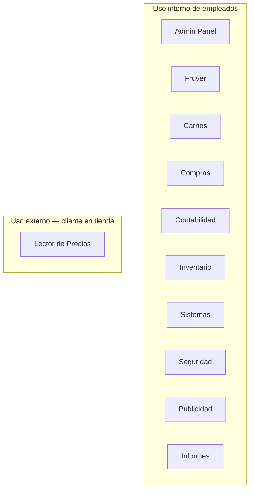

# 23 · Módulos — Índice

**Documentación técnica — Aplicativo SEAO**

---

|                      |                                           |
| -------------------- | ----------------------------------------- |
| **Documento**        | 23 — Índice de Módulos                    |
| **Versión**          | 1.0                                       |
| **Fecha**            | 14 de julio de 2026                       |
| **Depende de**       | 02..22, 24                                |
| **Lo usan**          | Desarrolladores, soporte, líderes de área |
| **Confidencialidad** | Uso interno                               |

---

## 1 · Objetivo

Este es el **índice del bloque 23**. Cada módulo funcional del aplicativo tiene su propio documento en esta carpeta, con estructura homogénea (§4).

Sirve como referencia rápida cuando un desarrollador o miembro de soporte necesita entender uno de los 11 módulos sin leer toda la documentación técnica.

---

## 2 · Los 11 módulos documentados

| Módulo            | Área de negocio                | Documento                                |
| ----------------- | ------------------------------ | ---------------------------------------- |
| Admin Panel       | Administración de sistemas     | [admin-panel.md](./admin-panel.md)       |
| Fruver            | Operación comercial            | [fruver.md](./fruver.md)                 |
| Carnes            | Operación comercial            | [carnes.md](./carnes.md)                 |
| Compras           | Compras y comercial            | [compras.md](./compras.md)               |
| Contabilidad      | Contabilidad y finanzas        | [contabilidad.md](./contabilidad.md)     |
| Inventario        | Inventario                     | [inventario.md](./inventario.md)         |
| Sistemas          | Sistemas TI (CVM, logs, actas) | [sistemas.md](./sistemas.md)             |
| Seguridad         | Seguridad física               | [seguridad.md](./seguridad.md)           |
| Publicidad        | Marketing y publicidad         | [publicidad.md](./publicidad.md)         |
| Informes          | Informes ejecutivos embebidos  | [informes.md](./informes.md)             |
| Lector de Precios | Cliente en tienda              | [lector-precios.md](./lector-precios.md) |

---

## 3 · Mapa de módulos por audiencia

Diez módulos son de uso interno por empleados. **Solo el Lector de Precios expone datos a clientes finales** en los quioscos de las sedes.

---

## 4 · Estructura estándar de cada documento de módulo

Cada uno de los 11 documentos sigue esta plantilla:

1. **Metadatos** — versión, fecha, dependencias.
2. **Objetivo** — qué hace este módulo en 2-3 frases.
3. **Actores** — quién lo usa y con qué permisos.
4. **Rutas frontend** — URLs donde vive el módulo.
5. **Componentes React** — estructura del `components/`.
6. **Endpoints backend cPanel** — endpoints usados por este módulo.
7. **Acciones del framework LAN** — si el módulo consulta el ERP.
8. **Tablas MySQL** — tablas propias del módulo.
9. **Reglas de negocio** — decisiones específicas del módulo.
10. **Flujos principales** — diagramas Mermaid de los casos de uso.
11. **Permisos por acción** — matriz de qué necesita ver/crear/editar/eliminar.
12. **Notificaciones** — correos y otras notificaciones que genera.
13. **Cronjobs relacionados** — si aplica.
14. **Deuda técnica del módulo** — hallazgos específicos.
15. **Puntos pendientes de análisis** — lo que aún necesita revisión.
16. **Referencias cruzadas** — enlaces a los documentos técnicos que apoyan.

---

## 5 · Progreso del bloque 23

| Módulo                | Estado       |
| --------------------- | ------------ |
| README (este archivo) | ✅ Entregado |
| Admin Panel           | ✅ Entregado |
| Fruver                | ✅ Entregado |
| Carnes                | ✅ Entregado |
| Compras               | ✅ Entregado |
| Contabilidad          | ✅ Entregado |
| Inventario            | ✅ Entregado |
| Sistemas              | ✅ Entregado |
| Seguridad             | ✅ Entregado |
| Publicidad            | ✅ Entregado |
| Informes              | ✅ Entregado |
| Lector de Precios     | ✅ Entregado |

---

## 6 · Referencias cruzadas

| Necesitas…                                | Documento                                                                                                   |
| ----------------------------------------- | ----------------------------------------------------------------------------------------------------------- |
| Vista arquitectónica global               | [02 · Arquitectura General](../02-arquitectura-general.md)                                                  |
| Catálogo de todos los endpoints           | [09 · APIs](../09-api-endpoints.md)                                                                         |
| Modelo relacional                         | [14 · Base de Datos](../14-base-de-datos.md)                                                                |
| Convenciones para agregar un módulo nuevo | [22 · Convenciones](../22-convenciones.md) · [17 · Manual del Desarrollador](../17-manual-desarrollador.md) |

---

<b>Supermercados Belalcázar</b> · Documento 23 — Módulos · v1.0 · 14 de julio de 2026

