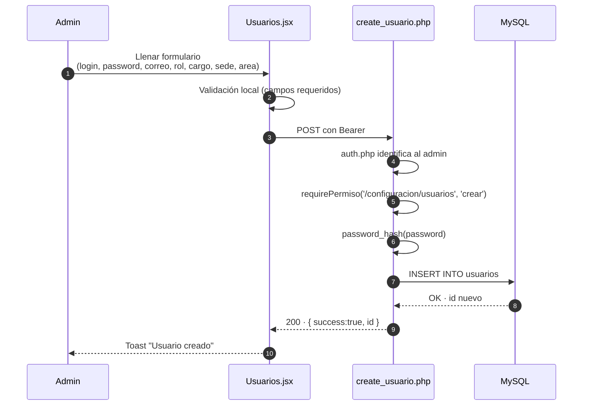
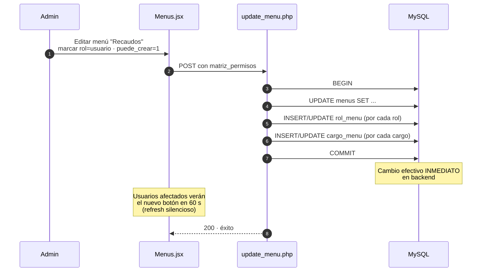

<div align="center">


# 23 · Módulo Admin Panel

**Documentación técnica — Aplicativo SEAO**

</div>

---

|                      |                        |
| -------------------- | ---------------------- |
| **Documento**        | 23 — Admin Panel       |
| **Versión**          | 1.0                    |
| **Fecha**            | 14 de julio de 2026    |
| **Depende de**       | 03, 04, 10, 11, 14, 22 |
| **Confidencialidad** | Uso interno            |

---

## 1 · Objetivo

El **Admin Panel** es el centro de configuración del aplicativo. Aquí se administran los datos maestros (usuarios, sedes, áreas, cargos, proveedores), la estructura del menú y sus permisos, los informes embebidos, y las cargas masivas de inventario. Es el módulo con la mayor concentración de operaciones de escritura sobre `supermer_AplicativoSistemas`.

---

## 2 · Actores

| Actor                   | Uso                                                                        |
| ----------------------- | -------------------------------------------------------------------------- |
| **Administrador IT**    | Uso principal — configura usuarios, permisos, menús                        |
| **Contador (limitado)** | Puede administrar informes ejecutivos                                      |
| **Cualquier empleado**  | Ve su propio perfil (`/perfil`) — no considerado Admin Panel estrictamente |

Rol técnico requerido: típicamente `admin` (id 1).

---

## 3 · Rutas frontend

Prefijo `/configuracion/`:

| Ruta                                   | Componente                    |
| -------------------------------------- | ----------------------------- |
| `/configuracion/menus`                 | `AdminPanel/Menus`            |
| `/configuracion/sedes`                 | `AdminPanel/Sedes`            |
| `/configuracion/areas`                 | `AdminPanel/Areas`            |
| `/configuracion/cargos`                | `AdminPanel/Cargos`           |
| `/configuracion/usuarios`              | `AdminPanel/Usuarios`         |
| `/configuracion/proveedores`           | `AdminPanel/Proveedores`      |
| `/configuracion/actualizar_inventario` | `AdminPanel/Inventario`       |
| `/configuracion/informes`              | `AdminPanel/Informes`         |
| `/perfil`                              | `Perfil` (separado del panel) |

---

## 4 · Componentes React

`frontend/src/components/AdminPanel/` con 8 subcarpetas — una por sub-módulo:

- `Areas/` · `Cargos/` · `Informes/` · `Inventario/` · `Menus/` · `Proveedores/` · `Sedes/` · `Usuarios/`

Cada sub-módulo sigue el patrón thin orchestrator (ver [04 §11](../04-arquitectura-frontend.md)):

```
AdminPanel/Usuarios/
├── Usuarios.jsx              ← orquestador delgado
├── hooks/                    ← useUsuariosData, useUsuariosFiltros
├── components/               ← UsuarioForm, UsuarioTable, FilterBar
└── utils/                    ← validaciones locales
```

`Menus/` es el más complejo — incluye drag-and-drop para reordenar y matriz de permisos por rol × cargo.

---

## 5 · Endpoints backend cPanel

Ver [09 §4-§7](../09-api-endpoints.md) para detalle completo. Resumen:

| Sub-módulo                | Endpoints                                                                                                          |
| ------------------------- | ------------------------------------------------------------------------------------------------------------------ |
| **Usuarios**              | `POST /api/usuarios/create_usuario.php`, `get_usuarios.php`, `update_usuario.php`                                  |
| **Roles**                 | `POST /api/roles/get_roles.php`, `get_acciones_usuario.php`                                                        |
| **Áreas**                 | `POST /api/areas/create_area.php`, `get_areas.php`, `update_area.php`                                              |
| **Cargos**                | `POST /api/cargos/create_cargo.php`, `get_cargos.php`, `update_cargo.php`                                          |
| **Sedes**                 | `POST /api/sedes/create_sede.php`, `get_sedes.php`, `update_sede.php`                                              |
| **Proveedores**           | `POST /api/proveedores/create_proveedor.php`, `get_proveedores.php`, `update_proveedor.php`                        |
| **Menús**                 | `POST /api/menu/get_menu_user.php`, `get_menus.php`, `create_menu.php`, `update_menu.php`, `update_bulk_order.php` |
| **Informes**              | `POST /api/informes/get_informes.php`, `create_informe.php`, `update_informe.php`, `update_bulk_order.php`         |
| **Actualizar Inventario** | `POST /api/subida_archivos/actualiza_inventarios/update_inventario.php`                                            |
| **Perfil**                | `POST /api/perfil/get_usuario.php`, `update_user.php`                                                              |

---

## 6 · Acciones del framework LAN

**Ninguna directamente.** El Admin Panel opera contra MySQL local; no consulta al ERP.

**Excepción:** el sub-módulo Proveedores puede consultar `cmproveedores` para autocompletar datos desde el ERP — pero esa es una consulta indirecta a través de otros endpoints, no del Admin Panel específicamente.

---

## 7 · Tablas MySQL

Ver [14 §4](../14-base-de-datos.md).

- `usuarios` — CRUD completo.
- `sesiones` — se lee para verificar y se escribe al hacer login (indirectamente, no por Admin Panel).
- `roles` — solo lectura (2 roles fijos hoy).
- `cargos` · `areas` · `sedes` — CRUD.
- `menus` · `rol_menu` · `cargo_menu` — CRUD (menús); matriz de permisos.
- `cmproveedores` — CRUD del catálogo local; se sincroniza con el ERP.
- `informes` · `informe_area` · `informe_cargo` — CRUD con relaciones N:M.

---

## 8 · Reglas de negocio

- **Soft delete de usuarios.** No hay endpoint `delete_usuario.php`. La baja se hace con `activo=0` vía `update_usuario.php`.
- **Sesión única.** Un login desde otro dispositivo invalida el anterior.
- **Rehash automático.** Si `update_usuario.php` recibe `password`, se re-hashea con `password_hash($input, PASSWORD_DEFAULT)`.
- **Sin bypass para admin.** Incluso el rol admin debe tener permisos configurados en `rol_menu` y `cargo_menu` (ver [11 §7](../11-autorizacion.md)).
- **Matriz de permisos por menú.** Cada menú tiene 4 booleanos (`ver`, `crear`, `editar`, `eliminar`) por rol y por cargo.
- **Filtro por empresa.** Los menús pueden ser específicos de Abastecemos o Tobar via las columnas `abastecemos` / `tobar` (ver [11 §9](../11-autorizacion.md)).

---

## 9 · Flujos principales

### 9.1 Crear un usuario nuevo



### 9.2 Reasignar permisos de un rol × menú



---

## 10 · Permisos por acción

Matriz observable (asumida basada en convención):

| Sub-módulo            | Ruta menú                              |      ver       |     crear      | editar |   eliminar   |
| --------------------- | -------------------------------------- | :------------: | :------------: | :----: | :----------: |
| Usuarios              | `/configuracion/usuarios`              |     admin      |     admin      | admin  | admin (soft) |
| Menús                 | `/configuracion/menus`                 |     admin      |     admin      | admin  |    admin     |
| Áreas                 | `/configuracion/areas`                 |     admin      |     admin      | admin  |      —       |
| Cargos                | `/configuracion/cargos`                |     admin      |     admin      | admin  |      —       |
| Sedes                 | `/configuracion/sedes`                 |     admin      |     admin      | admin  |      —       |
| Proveedores           | `/configuracion/proveedores`           | admin, compras | admin, compras | admin  |      —       |
| Informes              | `/configuracion/informes`              |     admin      |     admin      | admin  |    admin     |
| Actualizar Inventario | `/configuracion/actualizar_inventario` |   admin, inv   |     admin      |   —    |      —       |

⚠ **Verificar en producción** — la configuración real está en `rol_menu` y `cargo_menu` de la BD.

---

## 11 · Notificaciones

- **Creación / edición de usuario:** notificación toast en el frontend, sin correo.
- **Cambios de permisos:** sin correo — el usuario afectado nota el cambio cuando su UI se refresca en 60 s.

---

## 12 · Cronjobs relacionados

Ninguno directo del Admin Panel. Los cronjobs de precios (`subir_checker_mysql*`) usan las sedes que se administran aquí, pero no dependen de acciones del panel.

---

## 13 · Deuda técnica específica

- **Sin endpoint `delete_*` real** para varios sub-módulos — algunos casos requieren limpieza en BD manual.
- **`models/proveedor.php` vs `models/provider.php`** — duplicación que confunde qué modelo usa el sub-módulo Proveedores.
- **`update_menu.php` es transaccional pero largo** — matriz completa puede tener cientos de filas de rol_menu + cargo_menu.
- **Sin herramienta de simulación de permisos** — cambiar la matriz requiere probar con un usuario real.
- **Sin validación de sincronización** entre las rutas declaradas en `App.jsx` y las rutas en `menus`. Ver [26 · DT-033](../26-deuda-tecnica.md).

---

## 14 · Puntos pendientes de análisis

- Determinar contenido exacto de la vista de matriz de permisos de `Menus/`.
- Confirmar si `roles` está pensado para crecer o si los dos roles (`admin`, `usuario`) son suficientes por diseño.
- Verificar comportamiento cuando se elimina un rol asignado a usuarios activos.

---

## 15 · Referencias cruzadas

| Necesitas…                       | Documento                                          |
| -------------------------------- | -------------------------------------------------- |
| Autorización en profundidad      | [11 · Autorización](../11-autorizacion.md)         |
| Autenticación                    | [10 · Autenticación](../10-autenticacion.md)       |
| Endpoints con parámetros exactos | [09 · APIs](../09-api-endpoints.md)                |
| Tablas relacionadas              | [14 · Base de Datos §4-§5](../14-base-de-datos.md) |

---

<div align="center">
<sub><b>Supermercados Belalcázar</b> · 23 · Admin Panel · v1.0 · 14 de julio de 2026</sub>
</div>
