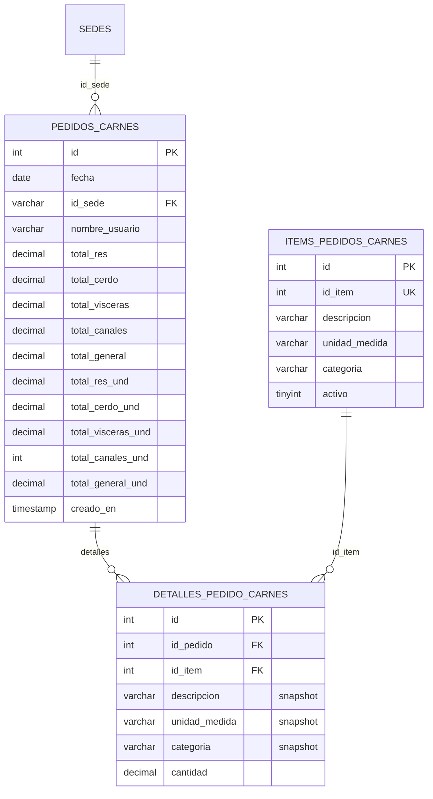
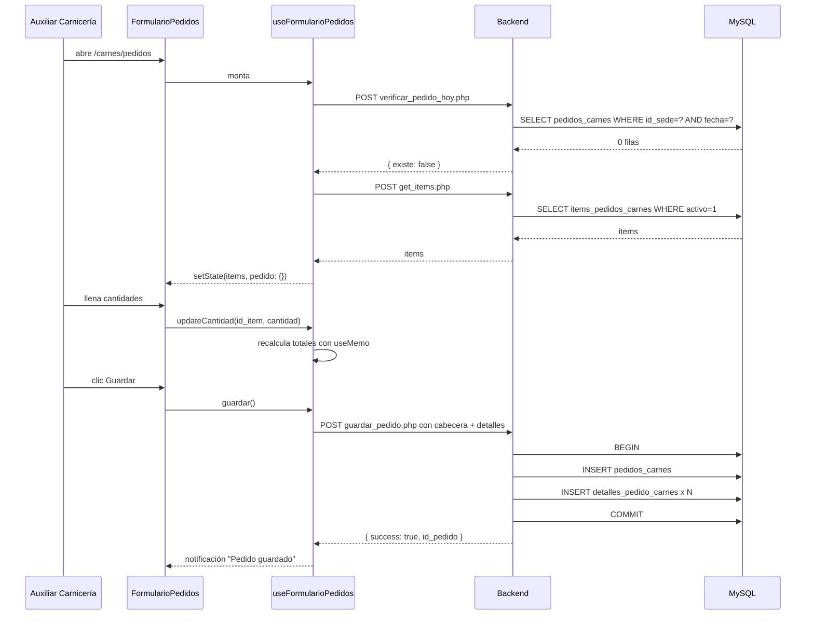
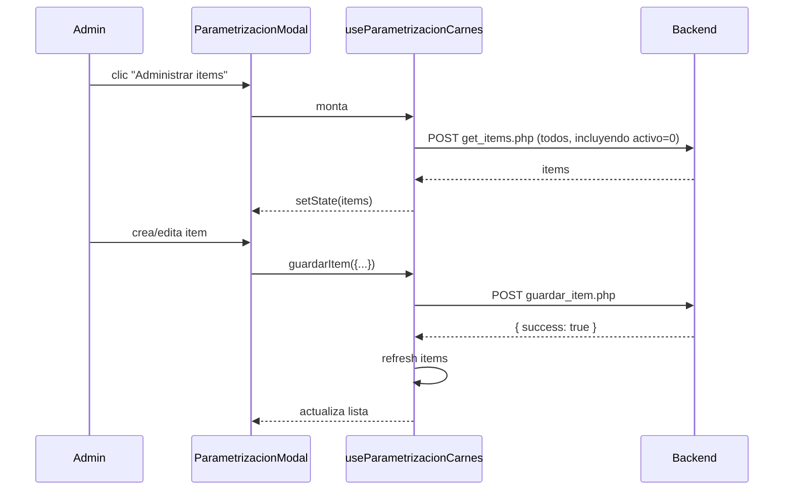

<div align="center">


# 23 · Módulo Carnes

**Documentación técnica — Aplicativo SEAO**

</div>

---

|                      |                     |
| -------------------- | ------------------- |
| **Documento**        | 23 — Carnes         |
| **Versión**          | 1.0                 |
| **Fecha**            | 14 de julio de 2026 |
| **Depende de**       | 03, 04, 09, 11, 14  |
| **Confidencialidad** | Uso interno         |

---

## 1 · Objetivo

El módulo **Carnes** permite a cada sede registrar el **pedido diario de carnes** clasificado por categoría (res, cerdo, vísceras, canales), con cabecera única por sede + fecha y detalle línea por línea. El módulo es un caso canónico del **patrón cabecera-detalle** con snapshot de datos históricos.

A diferencia de [Fruver](./fruver.md) — que configura _qué se pide qué día_ — el módulo Carnes registra _los pedidos concretos que se ejecutan diariamente_.

---

## 2 · Actores

| Actor                      | Rol       | Cargo típico        | Qué hace                                                         |
| -------------------------- | --------- | ------------------- | ---------------------------------------------------------------- |
| Auxiliar de Carnes en sede | `usuario` | Auxiliar carnicería | Crea el pedido diario para su sede                               |
| Administrador de sede      | `usuario` | Admin de sede       | Supervisa y aprueba                                              |
| Comprador de Carnes        | `usuario` | Comprador           | Consulta pedidos de todas las sedes para coordinar con proveedor |
| Administrador IT           | `admin`   | Administrador       | Gestiona el catálogo de items                                    |

---

## 3 · Rutas del frontend

Definidas en `frontend/src/App.jsx`.

| Ruta              | Componente                                         | Propósito                      |
| ----------------- | -------------------------------------------------- | ------------------------------ |
| `/carnes/pedidos` | `FormularioPedidos` (`components/Carnes/Pedidos/`) | Crear/editar el pedido del día |

⚠ **Observación:** el módulo Carnes tiene una sola ruta en el frontend, pero es la pantalla más compleja funcionalmente. La administración del catálogo (`items_pedidos_carnes`) se hace desde la misma pantalla vía modal, no ruta separada.

---

## 4 · Componentes React

Fuente: `frontend/src/components/Carnes/Pedidos/`. Sigue el patrón "thin orchestrator" (ver [22 §6](../22-convenciones.md)):

```
Carnes/Pedidos/
├── FormularioPedidos.jsx              ← orquestador
├── FormularioPedidos.module.css       ← estilos aislados
├── hooks/
│   ├── useFormularioPedidos.js        ← estado + fetch + validación del pedido
│   └── useParametrizacionCarnes.js    ← estado + fetch del catálogo (modal)
└── components/
    ├── PedidosHeader.jsx              ← cabecera con fecha, sede, usuario
    ├── CategoriasNav.jsx              ← tabs de categoría (res, cerdo, vísceras, canales)
    ├── PedidosItemsGrid.jsx           ← grid de items con inputs de cantidad
    ├── PedidosActionBar.jsx           ← botones (Guardar, Limpiar, Duplicar de ayer)
    ├── ParametrizacionItems.jsx       ← lista de items en el modal
    └── ParametrizacionModal.jsx       ← modal completo para editar catálogo
```

### 4.1 Responsabilidades

- **`FormularioPedidos.jsx`** — orquestador delgado. Renderiza header, nav de categorías, grid, action bar. Delega estado a los hooks.
- **`useFormularioPedidos.js`** — hook principal: carga items del catálogo, estado local del pedido (mapa `id_item → cantidad`), validación (todas las cantidades ≥ 0), guardar el pedido con `apiService.guardarPedidoCarnes`.
- **`useParametrizacionCarnes.js`** — hook independiente para el modal de administración del catálogo (crear/editar item).
- **`PedidosItemsGrid.jsx`** — muestra los items de la categoría activa como inputs numéricos. Escucha cambios y actualiza el estado del pedido.
- **`CategoriasNav.jsx`** — 4 tabs para alternar entre categorías. Renderizado condicional del grid según la activa.

### 4.2 Patrones específicos del módulo

- **Un solo pedido por sede/día.** El hook consulta `verificar_pedido_hoy.php` al montar; si ya existe, entra en modo edición.
- **Totales calculados en vivo.** Al cambiar una cantidad, `useMemo` recalcula `total_res`, `total_cerdo`, `total_visceras`, `total_canales`, `total_general` (KG) y sus equivalentes por unidad.
- **Snapshot al guardar.** Al enviar el pedido, cada línea incluye `descripcion`, `unidad_medida`, `categoria` copiados del catálogo actual — el detalle histórico no depende de que el catálogo cambie después.

---

## 5 · Endpoints backend

Fuente: `backend/backend/api/carnes/pedidos/`. Patrón A (un archivo por operación) — ver [22 §5.1](../22-convenciones.md).

| Archivo                    | Método | Auth                                       | Propósito                                                                       |
| -------------------------- | ------ | ------------------------------------------ | ------------------------------------------------------------------------------- |
| `get_items.php`            | POST   | Bearer + Permiso `/carnes/pedidos` · `ver` | Catálogo `items_pedidos_carnes` activos, opcionalmente filtrado por `categoria` |
| `guardar_item.php`         | POST   | Bearer + Permiso `crear`                   | Alta/edición de item del catálogo                                               |
| `guardar_pedido.php`       | POST   | Bearer + Permiso `crear`                   | Persiste cabecera + detalle en transacción                                      |
| `verificar_pedido_hoy.php` | POST   | Bearer                                     | Detecta si ya hay pedido de la sede + fecha (para modo edición)                 |

### 5.1 Contrato de `guardar_pedido.php`

**Request:**

```json
{
  "fecha": "2026-07-14",
  "id_sede": "005",
  "nombre_usuario": "Auxiliar Carnicería Sede 5",
  "detalles": [
    {
      "id_item": 101,
      "descripcion": "Lomo fino",
      "categoria": "res",
      "unidad_medida": "KG",
      "cantidad": 12.5
    },
    {
      "id_item": 102,
      "descripcion": "Costilla",
      "categoria": "res",
      "unidad_medida": "KG",
      "cantidad": 8.0
    },
    {
      "id_item": 205,
      "descripcion": "Tocineta",
      "categoria": "cerdo",
      "unidad_medida": "KG",
      "cantidad": 5.0
    },
    {
      "id_item": 310,
      "descripcion": "Hígado",
      "categoria": "visceras",
      "unidad_medida": "KG",
      "cantidad": 3.5
    },
    {
      "id_item": 405,
      "descripcion": "Pollo entero",
      "categoria": "canales",
      "unidad_medida": "UND",
      "cantidad": 20
    }
  ]
}
```

**Response:**

```json
{
  "success": true,
  "id_pedido": 1234,
  "message": "Pedido guardado correctamente"
}
```

**Errores frecuentes:**

- `400` si `detalles` está vacío o alguna cantidad es negativa.
- `403` si el usuario no tiene permiso `crear`.
- `409` si ya existe pedido de la misma sede + fecha y no se indica `sobreescribir: true`.

### 5.2 Contrato de `verificar_pedido_hoy.php`

**Request:**

```json
{ "id_sede": "005", "fecha": "2026-07-14" }
```

**Response cuando existe:**

```json
{
  "success": true,
  "existe": true,
  "id_pedido": 1234,
  "detalles": [
    /* array de detalles */
  ]
}
```

**Response cuando no existe:**

```json
{ "success": true, "existe": false }
```

Consumido por `useFormularioPedidos` al montar para decidir modo (crear vs editar).

---

## 6 · Acciones del framework LAN

**Ninguna directa.** El módulo Carnes es **puramente local** en MySQL — no toca el ERP. Los items de Carnes viven en la tabla `items_pedidos_carnes` (catálogo propio del aplicativo), no son un espejo del catálogo del ERP.

Esta decisión desacopla el pedido de las restricciones de nomenclatura del ERP (permite renombrar items sin afectar históricos).

---

## 7 · Tablas MySQL

Tres tablas con patrón cabecera-detalle. Documentadas en [14 §7.2](../14-base-de-datos.md).



### 7.1 Punto técnico — snapshots en el detalle

El detalle guarda `descripcion`, `unidad_medida` y `categoria` **copiados del catálogo al momento de guardar**. Esto significa que:

- Si el catálogo cambia (por ejemplo, se renombra "Lomo fino" a "Lomo especial"), los pedidos anteriores **mantienen el nombre original**.
- Si un item se desactiva (`activo=0`), los pedidos anteriores siguen mostrando el nombre y categoría.
- El detalle es **auditablemente inmutable** respecto a metadata del catálogo.

Es una decisión de diseño consciente (ver [22 §7.1](../22-convenciones.md)).

### 7.2 Punto técnico — categoría como texto libre

`items_pedidos_carnes.categoria` es `varchar`, no `ENUM`. Los valores válidos observados en el código:

- `res`
- `cerdo`
- `visceras`
- `canales`

⚠ **Deuda menor:** debería ser ENUM para bloquear valores incorrectos a nivel BD. Se documenta en [26](../26-deuda-tecnica.md) (ítem local no listado explícitamente porque es menor).

### 7.3 Punto técnico — totales pre-calculados

La cabecera guarda `total_res`, `total_cerdo`, etc. y sus equivalentes `_und` (unidades). **Se calculan en el frontend con `useMemo` y se envían al backend.**

Ventajas:

- Consultas rápidas sin necesidad de `SUM` sobre el detalle.
- El backend puede validar los totales enviados contra el detalle antes de guardar (defensa contra clientes maliciosos).

⚠ **Riesgo:** el frontend calcula los totales; si hay un bug en el hook, los totales pueden desincronizarse del detalle. Recomendación: recalcular server-side y comparar; si difieren, rechazar y loggear como incidente de seguridad.

---

## 8 · Reglas de negocio

### 8.1 Un pedido por sede + fecha

La lógica del frontend consulta `verificar_pedido_hoy.php` al montar. Si existe, entra en modo edición. El backend garantiza esto con un índice único implícito (o debería — ver §11.1).

### 8.2 Cantidades no negativas

El frontend valida cantidades ≥ 0 antes de enviar. El backend debería re-validar (defensa en profundidad).

### 8.3 Al menos un item con cantidad > 0

El frontend impide guardar un pedido "vacío" (todos ceros). Backend debería re-validar.

### 8.4 Snapshot al guardar

Explicado en §7.1.

### 8.5 Totales calculados en frontend y validados en backend (recomendación)

Actualmente no verificado. Se documenta como pendiente.

---

## 9 · Flujos principales

### 9.1 Crear pedido nuevo



### 9.2 Editar pedido existente

Igual al 9.1 pero cuando `verificar_pedido_hoy` devuelve `existe: true`, el hook **precarga** las cantidades en el estado local. Al guardar, el backend detecta que ya existe cabecera y hace `UPDATE + DELETE detalles + INSERT nuevos detalles` en una transacción.

### 9.3 Administrar catálogo (modal)



---

## 10 · Permisos por acción

Matriz `rol_menu` × `cargo_menu` para la ruta `/carnes/pedidos`:

| Cargo                      | ver | crear | editar | eliminar |
| -------------------------- | :-: | :---: | :----: | :------: |
| Auxiliar Carnicería (sede) | ✅  |  ✅   |   ✅   |    ❌    |
| Administrador de sede      | ✅  |  ✅   |   ✅   |    ❌    |
| Comprador de Carnes        | ✅  |  ❌   |   ❌   |    ❌    |
| Administrador IT           | ✅  |  ✅   |   ✅   |    ✅    |

⚠ **Estos permisos son la configuración recomendada** — la real depende de las filas actuales en `rol_menu` y `cargo_menu`. Verificar desde AdminPanel.

**Observación:** el módulo no expone borrado (⛔ `eliminar` en el frontend). Se conserva la fila con historial aunque tenga cantidades cero. Un pedido "eliminado" es un pedido con todos los detalles borrados por edición.

---

## 11 · Deuda técnica del módulo

### 11.1 Sin índice único en `pedidos_carnes(id_sede, fecha)`

El esquema actual permite dos filas con la misma combinación sede + fecha. La regla "un pedido por sede/día" se aplica **solo en frontend** vía `verificar_pedido_hoy.php`. Un cliente malicioso podría hacer POST directo sin verificar.

**Recomendación:**

```sql
ALTER TABLE pedidos_carnes
  ADD UNIQUE KEY uk_sede_fecha (id_sede, fecha);
```

**Esfuerzo:** XS (después de verificar que no hay duplicados actuales).

### 11.2 `categoria` como `varchar` en vez de `ENUM`

Discutido en §7.2. Permite valores inválidos.

**Recomendación:**

```sql
ALTER TABLE items_pedidos_carnes
  MODIFY categoria ENUM('res','cerdo','visceras','canales') NOT NULL;
ALTER TABLE detalles_pedido_carnes
  MODIFY categoria ENUM('res','cerdo','visceras','canales') NOT NULL;
```

**Esfuerzo:** S (verificar valores actuales primero).

### 11.3 Totales en cabecera sin validación server-side

Discutido en §8.5. El backend confía en los totales calculados en frontend.

**Recomendación:** en `guardar_pedido.php`, recalcular totales y compararlos con los enviados. Si difieren > 0.01, rechazar y loggear.

**Esfuerzo:** S.

### 11.4 Sin trazabilidad de cambios

Un pedido editado sobrescribe el detalle anterior. Un investigador no puede saber si "hoy pediste 12 KG de lomo" fue lo original o una corrección posterior.

**Recomendación:** tabla `pedidos_carnes_trazabilidad` opcional para casos donde se necesite auditoría. Se documenta como mejora, no urgente.

**Esfuerzo:** M.

### 11.5 Sin FK con `CONSTRAINT`

Las relaciones `detalles → pedidos` y `detalles → items` no tienen `CONSTRAINT` declarada. Un `DELETE FROM pedidos_carnes` no cascadea automáticamente.

**Recomendación:** parte del paquete [25 · P3.1](../25-refactorizacion.md).

---

## 12 · Puntos pendientes de análisis

- **Frontend:** el `useFormularioPedidos` gestiona el estado local — verificar si tiene lógica para **duplicar pedido de ayer** (botón visto en `PedidosActionBar` — funcionalidad no confirmada).
- **Backend:** `guardar_pedido.php` — comportamiento exacto ante conflicto (409 vs UPDATE silencioso) requiere verificación.
- **Notificaciones:** el proyecto tiene notificaciones por correo en otros módulos (Solicitudes de Compras). Verificar si Carnes también las emite al proveedor o queda solo local.

---

## 13 · Referencias cruzadas

| Necesitas…                                | Documento                                                                           |
| ----------------------------------------- | ----------------------------------------------------------------------------------- |
| Ver el patrón cabecera-detalle en detalle | [../14-base-de-datos.md#7-dominios-fruver--carnes--compras](../14-base-de-datos.md) |
| Ver endpoint específico con parámetros    | [../09-api-endpoints.md#9-carnes](../09-api-endpoints.md)                           |
| Ver flujo de una petición end-to-end      | [../06-flujo-de-una-peticion.md](../06-flujo-de-una-peticion.md)                    |
| Ver módulo relacionado — Fruver           | [./fruver.md](./fruver.md)                                                          |
| Ver deuda técnica consolidada             | [../26-deuda-tecnica.md](../26-deuda-tecnica.md)                                    |

---

<div align="center">
<sub><b>Supermercados Belalcázar</b> · Documento 23 — Módulo Carnes · v1.0 · 14 de julio de 2026</sub>
</div>
