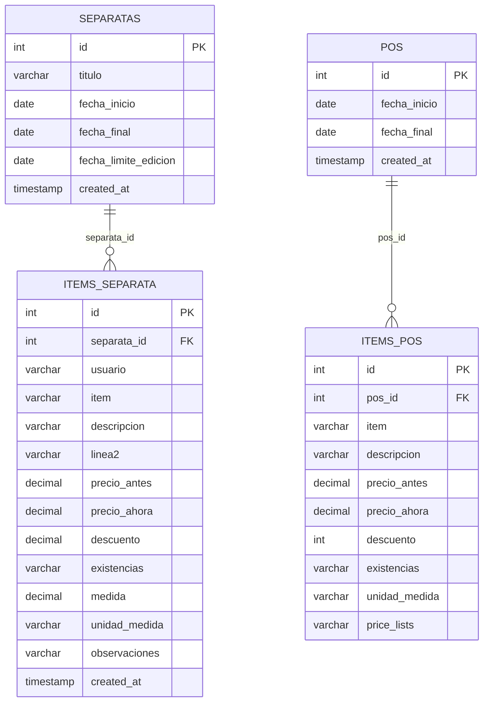
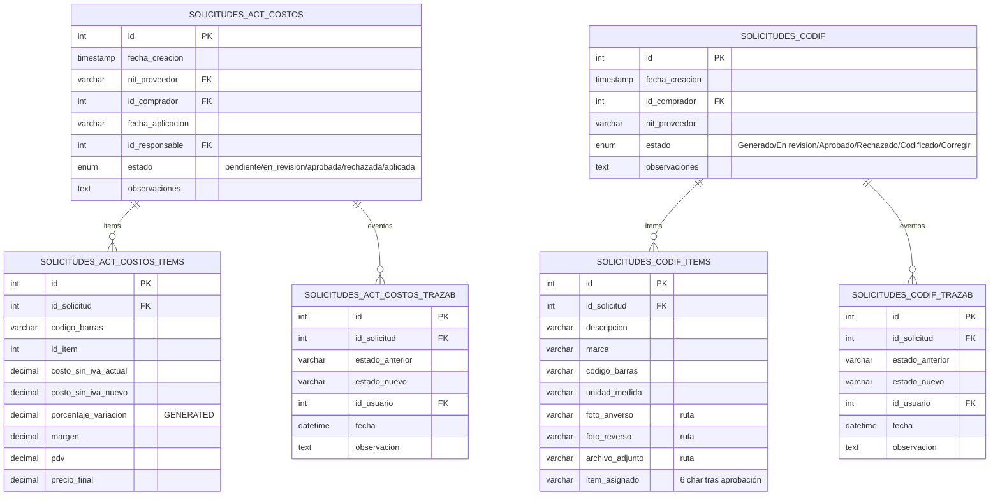
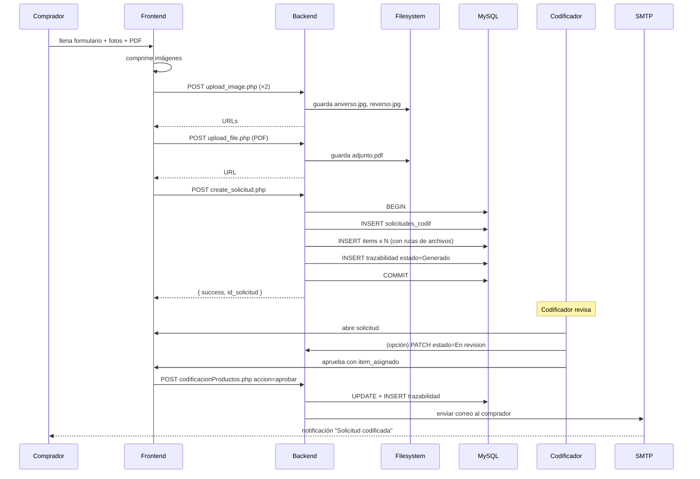
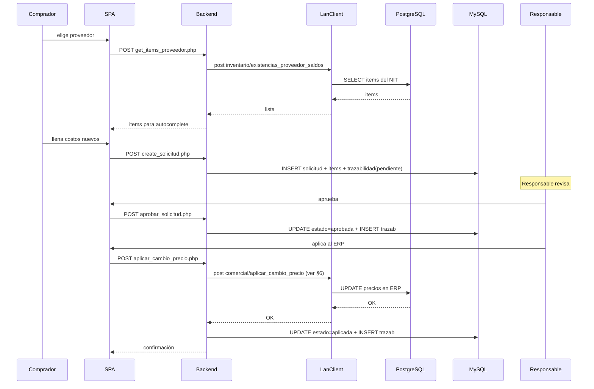
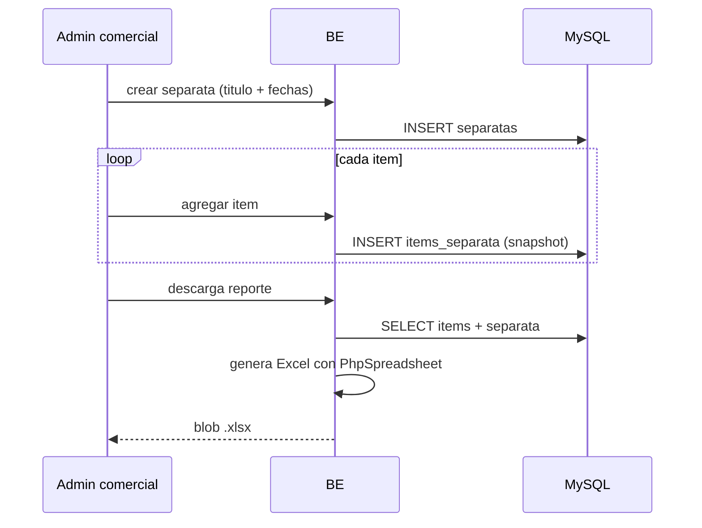

<div align="center">


# 23 · Módulo Compras

**Documentación técnica — Aplicativo SEAO**

</div>

---

|                      |                        |
| -------------------- | ---------------------- |
| **Documento**        | 23 — Compras           |
| **Versión**          | 1.0                    |
| **Fecha**            | 14 de julio de 2026    |
| **Depende de**       | 03, 04, 05, 09, 11, 14 |
| **Confidencialidad** | Uso interno            |

---

## 1 · Objetivo

**Compras** es el módulo más extenso del aplicativo. Cubre cuatro sub-dominios de trabajo del área comercial:

1. **Separatas** — folletos de ofertas periódicos con precios promocionales.
2. **POS** — variantes de folleto para POS de compra.
3. **Codificación de Productos** — flujo formal para introducir productos nuevos al ERP.
4. **Actualización de Costos** — flujo de aprobación para cambios de costo de proveedores.
5. **Permisos de Inventario** — configuración de qué proveedor puede ver qué inventario compartido.

Los cuatro flujos de "solicitud" comparten patrón de **cabecera + items + trazabilidad de estados**.

---

## 2 · Actores

| Actor                     | Rol       | Cargo típico                 |
| ------------------------- | --------- | ---------------------------- |
| Comprador                 | `usuario` | Comprador de categoría       |
| Codificador de productos  | `usuario` | Codificador (cargo dedicado) |
| Responsable de aprobación | `usuario` | Jefe de Compras / Supervisor |
| Diseñador de publicidad   | `usuario` | Diseñador                    |
| Administrador IT          | `admin`   | Configura permisos           |

---

## 3 · Rutas del frontend

| Ruta                                  | Componente                        | Sub-módulo                      |
| ------------------------------------- | --------------------------------- | ------------------------------- |
| `/compras/separata`                   | `Separata`                        | Separatas                       |
| `/compras/actualizacion_costos`       | `ActualizacionCostos`             | Actualización de costos (admin) |
| `/compras/codificacion_productos`     | `CodificacionProductos`           | Codificación (admin)            |
| `/compras/permisos_inventario`        | `PermisosInventario`              | Permisos de inventario          |
| `/formularios/actualizacion_costos`   | `FormularioActualizacionCostos`   | Actualización (usuario final)   |
| `/formularios/codificacion_productos` | `FormularioCodificacionProductos` | Codificación (usuario final)    |

**Distinción "compras/…" vs "formularios/…":**

- `/compras/**` — vista **administrativa** (aprobar, rechazar, listar todas).
- `/formularios/**` — vista **del comprador** (crear solicitud, editar propia, consultar propia).

Es el mismo dominio con dos entradas UI según rol.

---

## 4 · Componentes React por sub-módulo

Fuente: `frontend/src/components/Compras/`.

### 4.1 Separata

```
Compras/Separata/
├── Separata.jsx                       ← orquestador
├── hooks/
│   ├── useSeparatas.js                ← lista de separatas
│   ├── useItemsSeparata.js            ← items paginados de una separata
│   └── useSeparataConfig.js           ← título, fechas, edición de configuración
├── components/
│   ├── SeparataList.jsx               ← lista maestro
│   ├── ItemsGrid.jsx                  ← grid editable de items
│   ├── ItemRow.jsx                    ← fila con inputs
│   ├── ProveedorAutocomplete.jsx      ← autocomplete de proveedor
│   ├── ItemAutocomplete.jsx           ← autocomplete de item (usa ERP)
│   └── ReporteDescarga.jsx            ← botón descargar Excel
└── utils/
    ├── formatoSeparata.js
    └── validaciones.js
```

### 4.2 Codificación de Productos y Actualización de Costos

Estos dos sub-módulos usan el **Patrón B — endpoint consolidado**:

```
Compras/Codificacion Productos/
├── CodificacionProductos.jsx          ← administración
└── (sin subcarpetas hooks/components — pantalla más simple)

Compras/Actualizacion Costos/
├── ActualizacionCostos.jsx            ← administración
└── (idem)
```

Y los **formularios** correspondientes en:

```
frontend/src/components/... (rutas /formularios/*)
```

### 4.3 Inventarios (permisos)

```
Compras/Inventarios/
├── PermisosInventario.jsx
├── hooks/
│   └── usePermisosInventario.js
└── components/
    └── FormularioProveedor.jsx
```

---

## 5 · Endpoints backend

Ver [09 §10](../09-api-endpoints.md) para el catálogo completo. Resumen:

### 5.1 Separatas (`/api/compras/separata/`)

12 endpoints (Patrón A):

`get_separatas`, `check_separata`, `get_items_separata`, `save_item_separata`, `update_item_separata`, `delete_item_separata`, `get_item_data`, `get_item_history`, `last_update`, `update_fecha_limite`, `update_separata_title`, `download_report_separata`.

**Auth uniforme:** Bearer + Permiso `/compras/separata` con la acción correspondiente.

### 5.2 Actualización de Costos — vista administrativa

6 endpoints (`/api/compras/actualizacion_costos/`):

`get_solicitudes`, `get_detalle_solicitud`, `get_trazabilidad`, `aprobar_solicitud`, `aplicar_cambio_precio`, `finalizar_proceso`.

### 5.3 Actualización de Costos — vista comprador

5 endpoints (`/api/formularios/actualizacion_costos/`):

`get_items_proveedor`, `create_solicitud`, `get_solicitudes`, `get_detalle_solicitud`, `get_trazabilidad`.

### 5.4 Codificación de Productos

**Vista administrativa** (Patrón B):

- `/api/compras/codificacion_productos/codificacionProductos.php` con sub-acciones internas.

**Vista comprador** (Patrón A + uploads):

`/api/formularios/codificacion_productos/`:

`base.php`, `create_solicitud`, `update_solicitud`, `get_solicitud`, `get_solicitudes`, `get_trazabilidad`, `upload_file`, `upload_image`, `delete_upload`.

### 5.5 Permisos de Inventario

`/api/compras/inventarios/permisos_inventario.php` — endpoint consolidado.

---

## 6 · Acciones del framework LAN usadas

Sub-módulos que consultan al ERP:

| Sub-módulo              | Acciones LAN                                                                                                                                          |
| ----------------------- | ----------------------------------------------------------------------------------------------------------------------------------------------------- |
| Separatas               | `comercial/obtener_datos_item` (autocomplete), datos de ítem                                                                                          |
| Codificación            | `inventario/buscar_proveedores`, `comercial/obtener_datos_item`                                                                                       |
| Actualización de costos | `inventario/existencias_proveedor_saldos` (para autocompletar los items del proveedor), y **una acción de escritura del cambio en el ERP** al aprobar |
| Permisos de inventario  | Sin uso directo — configuración pura local                                                                                                            |

⚠ **Confirmación pendiente:** la acción exacta que aplica el cambio de precio en el ERP tras aprobar (probable `comercial/aplicar_cambio_precio` — verificar en `repo/modules/comercial/`).

---

## 7 · Tablas MySQL

Ver [14 §7.3, §7.4](../14-base-de-datos.md). Doce tablas.

### 7.1 Separatas y POS



### 7.2 Solicitudes con trazabilidad



### 7.3 Punto técnico — columna generada `porcentaje_variacion`

En `solicitudes_actualizacion_costos_items`:

```sql
porcentaje_variacion DECIMAL(6,2)
  GENERATED ALWAYS AS (
    ((costo_sin_iva_nuevo - costo_sin_iva_actual) / NULLIF(costo_sin_iva_actual, 0)) * 100
  ) STORED
```

**No puede desincronizarse.** Cualquier UPDATE de los costos recalcula automáticamente.

### 7.4 Punto técnico — estado como ENUM

Ambas solicitudes usan `ENUM` para el estado (los valores válidos están declarados a nivel BD). Bloquea inserción de valores incorrectos.

---

## 8 · Reglas de negocio

### 8.1 Ciclo de vida de solicitud de actualización de costos

`pendiente → en_revision → aprobada → aplicada` (feliz) o `en_revision → rechazada` (o final).

Cada transición inserta fila en `_trazabilidad` (nunca se sobrescribe historia).

### 8.2 Ciclo de vida de solicitud de codificación

`Generado → En revision → Aprobado → Codificado` (feliz), con transiciones adicionales:

- `En revision → Corregir → En revision` (bucle de correcciones).
- `En revision → Rechazado` (final negativo).

### 8.3 Solo el comprador propietario puede editar su solicitud

Verificado en el backend (`create_solicitud.php` guarda `id_comprador`; endpoints de edición verifican que `id_comprador == usuario_actual.id`). El aprobador nunca edita — solo cambia estado y añade observaciones.

### 8.4 Fecha límite de edición en separatas

Después de `separatas.fecha_limite_edicion`, el frontend impide edición vía `check_separata.php`. Aporta trazabilidad al proceso comercial.

### 8.5 Cambio de precio se aplica al ERP al aprobar

Solo cuando el aprobador pasa el estado a `aplicada` — el backend ejecuta `LanClient::post` con la acción de escritura al ERP. **Es la única escritura al ERP del módulo Compras.**

### 8.6 Codificador asigna código único

Al pasar a estado `Codificado`, el codificador ingresa un `item_asignado` (6 caracteres) que debe ser único en el ERP. Deja de estar "solicitado" y pasa a ser un item real.

### 8.7 Uploads limitados por MIME + tamaño

- Imágenes: `image/jpeg`, `image/png`, `image/webp` — máximo 5 MB.
- PDF: `application/pdf` — máximo 10 MB.

Validación server-side (adicional a compresión client-side).

---

## 9 · Flujos principales

### 9.1 Solicitud de codificación — ciclo completo



### 9.2 Solicitud de actualización de costos — ciclo completo



### 9.3 Separata — desde creación hasta descarga



---

## 10 · Permisos por acción (recomendados)

Matriz sugerida:

| Ruta                                  | Cargo        | ver | crear |           editar            |        eliminar         |
| ------------------------------------- | ------------ | :-: | :---: | :-------------------------: | :---------------------: |
| `/compras/separata`                   | Comprador    | ✅  |  ✅   |             ✅              | ✅ (solo items propios) |
| `/formularios/actualizacion_costos`   | Comprador    | ✅  |  ✅   |  ✅ (propias, pendientes)   |           ❌            |
| `/compras/actualizacion_costos`       | Jefe Compras | ✅  |  ❌   |         ✅ (estado)         |           ❌            |
| `/formularios/codificacion_productos` | Comprador    | ✅  |  ✅   |        ✅ (propias)         |           ❌            |
| `/compras/codificacion_productos`     | Codificador  | ✅  |  ❌   | ✅ (estado + item_asignado) |           ❌            |
| `/compras/permisos_inventario`        | Admin        | ✅  |  ✅   |             ✅              |           ✅            |

---

## 11 · Notificaciones

| Evento                             | Destinatario            | Cronjob/inline                        |
| ---------------------------------- | ----------------------- | ------------------------------------- |
| Solicitud codificación → Aprobado  | Comprador               | Inline en `codificacionProductos.php` |
| Solicitud codificación → Rechazado | Comprador               | Inline                                |
| Solicitud codificación → Corregir  | Comprador               | Inline                                |
| Solicitud actualización → Aprobada | Comprador               | Inline en `aprobar_solicitud.php`     |
| Solicitud actualización → Aplicada | Comprador + Responsable | Inline en `finalizar_proceso.php`     |

Todas usan **PHPMailer** con `no-responder@supermercadobelalcazar.com`.

---

## 12 · Deuda técnica del módulo

### 12.1 Endpoint monolítico de codificación

`codificacionProductos.php` es el único endpoint del sub-módulo administrativo — despacha por `accion` interno. Facilita mantenimiento centralizado, pero dificulta el análisis de "qué operaciones hay disponibles" sin leer el switch/case interno.

**Recomendación menor:** documentar todas las sub-acciones en un comentario al inicio del archivo o migrar a Patrón A si crece.

### 12.2 Uploads sin verificación de path traversal probada

Los endpoints de upload (`upload_file.php`, `upload_image.php`) reciben `nombre` del cliente. Verificar (ver [12 §5.5](../12-seguridad.md)) que:

- Se sanitiza el nombre (no acepta `../`).
- Se valida la extensión contra whitelist.
- `backend/files/codificacion/` tiene `.htaccess` que impide ejecución PHP.

**Deuda:** revisar por auditoría de seguridad.

### 12.3 Formulario del comprador vs vista administrativa duplican lógica

Los endpoints `/formularios/*` y `/compras/*/get_solicitudes` tienen queries muy similares. Puede consolidarse con un filtro `mio_solamente=1/0`.

**Esfuerzo:** M.

### 12.4 Ausencia de "recordatorio" de solicitudes estancadas

Una solicitud puede quedarse en `en_revision` por semanas sin que nadie lo note. No hay cronjob que alerte.

**Recomendación (28):** cronjob diario que envíe correo con lista de solicitudes > 7 días en el mismo estado.

### 12.5 Impresión de etiquetas — módulo Publicidad relacionado

Publicidad consulta las mismas listas de items pero es módulo aparte. Verificar que la coherencia se preserva (ver [./publicidad.md](./publicidad.md) cuando esté disponible).

---

## 13 · Puntos pendientes de análisis

- **Acción exacta del framework LAN** que aplica el cambio de precio (`comercial/aplicar_cambio_precio`? — no confirmado con lectura de `repo/modules/comercial/`).
- **Sub-acciones** del `codificacionProductos.php` no completamente enumeradas.
- **Uploads:** validación de path traversal y ejecución PHP en `backend/files/`.
- **`get_item_history.php`** en Separatas — inferir el rango histórico que consulta.
- **`permisos_inventario.php`** — enumeración de sub-acciones.

---

## 14 · Referencias cruzadas

| Necesitas…                                        | Documento                                                                             |
| ------------------------------------------------- | ------------------------------------------------------------------------------------- |
| Ver ERD detallado                                 | [../14-base-de-datos.md#7-dominios-fruver--carnes--compras](../14-base-de-datos.md)   |
| Ver el catálogo completo de endpoints             | [../09-api-endpoints.md#10-compras](../09-api-endpoints.md)                           |
| Ver flujo de escritura al ERP (única del sistema) | [../06-flujo-de-una-peticion.md](../06-flujo-de-una-peticion.md)                      |
| Ver seguridad de uploads                          | [../12-seguridad.md#5-seguridad-en-la-capa-de-aplicacion-backend](../12-seguridad.md) |
| Ver módulo relacionado — Contabilidad             | [./contabilidad.md](./contabilidad.md)                                                |
| Ver módulo relacionado — Publicidad               | [./publicidad.md](./publicidad.md)                                                    |

---

<div align="center">
<sub><b>Supermercados Belalcázar</b> · Documento 23 — Módulo Compras · v1.0 · 14 de julio de 2026</sub>
</div>
