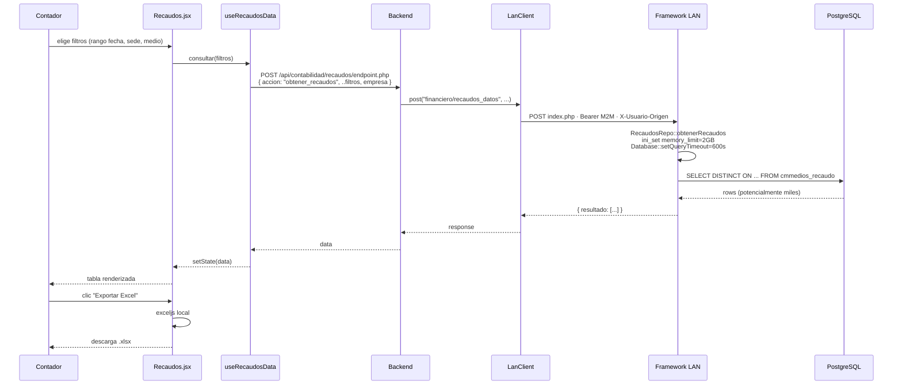
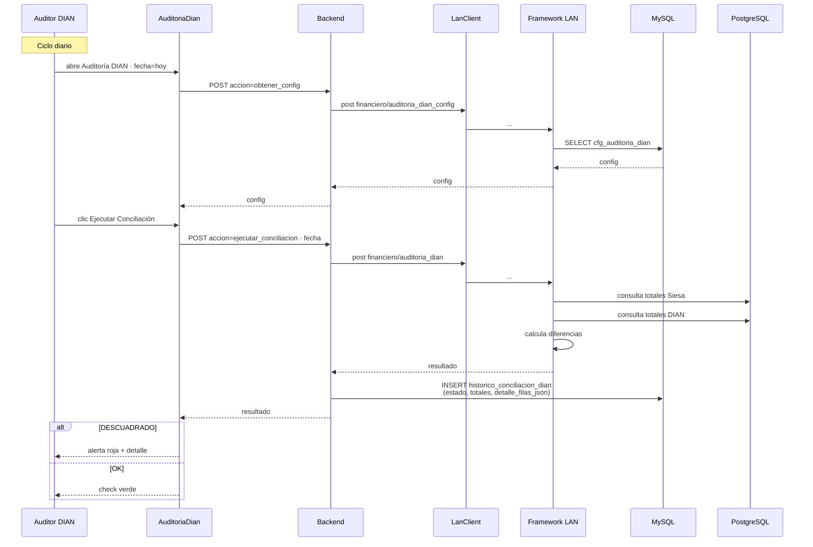
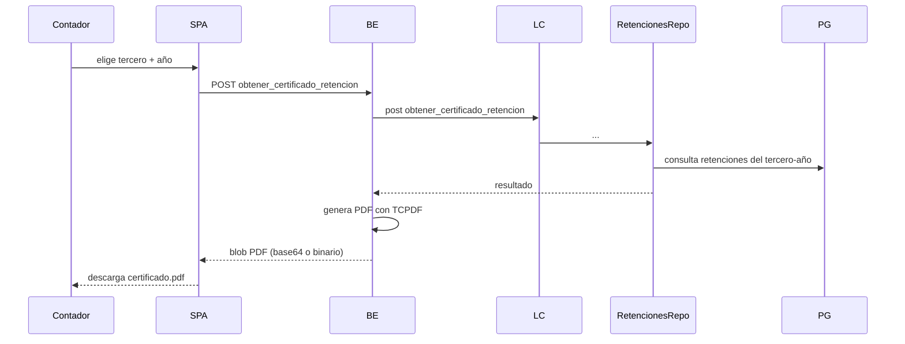

<div align="center">


# 23 · Módulo Contabilidad

**Documentación técnica — Aplicativo SEAO**

</div>

---

|                      |                        |
| -------------------- | ---------------------- |
| **Documento**        | 23 — Contabilidad      |
| **Versión**          | 1.0                    |
| **Fecha**            | 14 de julio de 2026    |
| **Depende de**       | 03, 04, 05, 09, 11, 14 |
| **Confidencialidad** | Uso interno            |

---

## 1 · Objetivo

El módulo **Contabilidad** es el mayor consumidor del framework LAN. Cubre cuatro sub-módulos que sirven al área contable:

1. **Libro Auxiliar** — consulta del auxiliar contable por proveedor, cuenta, centro de costo.
2. **Recaudos** — reporte por medio de pago, sede y rango de fecha.
3. **Auditoría DIAN** — conciliación diaria ERP ↔ DIAN con histórico inmutable.
4. **Planos contables** — mantenimiento local + integración con ERP.
5. **Prefijos DIAN** — catálogo de prefijos aceptados por DIAN (O-13, O-15, etc.).

Todo lo que se consulta viene del ERP en **tiempo real**. Todo lo que se persiste en el aplicativo son configuraciones y el histórico de auditoría (inmutable).

---

## 2 · Actores

| Actor             | Rol       | Cargo típico             |
| ----------------- | --------- | ------------------------ |
| Contador          | `usuario` | Contador                 |
| Auxiliar contable | `usuario` | Auxiliar                 |
| Auditor DIAN      | `usuario` | Auditor (cargo dedicado) |
| Administrador IT  | `admin`   | Configuración            |

---

## 3 · Rutas del frontend

| Ruta                                                    | Componente      | Sub-módulo     |
| ------------------------------------------------------- | --------------- | -------------- |
| `/contabilidad/libro_auxiliar`                          | `LibroAuxiliar` | Libro Auxiliar |
| `/contabilidad/recaudos`                                | `Recaudos`      | Recaudos       |
| `/contabilidad/dian` (o `/contabilidad/auditoria_dian`) | `AuditoriaDian` | Auditoría DIAN |
| `/contabilidad/planos_contables`                        | `Planos`        | Planos         |
| `/contabilidad/prefijos_dian`                           | `PrefijosDian`  | Prefijos DIAN  |

⚠ **Nombre exacto de las rutas** — verificar en `App.jsx`; algunos pueden variar entre `/dian` y `/auditoria_dian`.

---

## 4 · Componentes React

Fuente: `frontend/src/components/Contabilidad/`.

Todos los sub-módulos siguen el **patrón thin orchestrator + hooks + components + utils**:

```
Contabilidad/
├── Libro Auxiliar/
│   ├── LibroAuxiliar.jsx
│   ├── hooks/  (fetch, filtros, exportación)
│   ├── components/  (filtros, tabla, totalizador)
│   └── utils/  (formato moneda, formato fecha)
├── Recaudos/
│   ├── Recaudos.jsx
│   ├── hooks/
│   │   ├── useRecaudosData.js
│   │   ├── useRecaudosFiltros.js
│   │   └── useRecaudosExport.js
│   ├── components/
│   │   ├── FiltrosPanel.jsx
│   │   ├── ResultadosTabla.jsx
│   │   └── ExportarBar.jsx
│   └── utils/
│       └── formatoRecaudos.js
├── Planos/
│   ├── Planos.jsx
│   ├── hooks/
│   ├── components/
│   └── utils/
└── Prefijos DIAN/
    ├── PrefijosDian.jsx
    ├── hooks/
    ├── components/
    └── utils/
```

Los sub-módulos comparten componentes de UI comunes con [Inventario](./inventario.md): `FiltrosPanel`, `EmpresaSelector`, `LoadingScreen`.

⚠ **El componente de Auditoría DIAN** (`AuditoriaDian`) tiene la lógica más compleja del módulo — combina configuración editable + ejecución de conciliación + histórico inmutable. Requiere lectura profunda.

---

## 5 · Endpoints backend

Ver [09 §11](../09-api-endpoints.md). Todos son **Patrón B (endpoint consolidado)** — despachan por `accion` interno.

| Ruta                                            | Sub-acciones probables                                                   |
| ----------------------------------------------- | ------------------------------------------------------------------------ |
| `/api/contabilidad/libro_auxiliar/endpoint.php` | `obtener_sedes`, `buscar_proveedores`, `obtener_auxiliar`                |
| `/api/contabilidad/recaudos/endpoint.php`       | `obtener_recaudos`                                                       |
| `/api/contabilidad/dian/endpoint.php`           | `obtener_config`, `guardar_config`, `ejecutar_conciliacion`, `historico` |
| `/api/contabilidad/planos/update_planos.php`    | Actualización local                                                      |
| `/api/contabilidad/prefijos_dian/*`             | CRUD sobre catálogo                                                      |

**Auth uniforme:** Bearer + Permiso `/contabilidad/<sub>` con la acción correspondiente.

---

## 6 · Acciones del framework LAN

**Todas las lecturas contables** pasan por el framework LAN. Ver [09 §20.4](../09-api-endpoints.md).

| Acción LAN                                       | Método                                         | Uso                                                           |
| ------------------------------------------------ | ---------------------------------------------- | ------------------------------------------------------------- |
| `contabilidad/auxiliar_sedes`                    | `AuxiliarRepo::obtenerSedes`                   | Autocompletar sedes en el filtro                              |
| `contabilidad/auxiliar_proveedores`              | `AuxiliarRepo::buscarProveedores`              | Autocompletar proveedores                                     |
| `contabilidad/auxiliar_datos`                    | `AuxiliarRepo::obtenerDatosAuxiliar`           | Consulta del auxiliar                                         |
| `financiero/recaudos_datos`                      | `RecaudosRepo::obtenerRecaudos`                | Reporte de recaudos                                           |
| `financiero/auditoria_dian`                      | `AuditoriaRepo::obtenerAuditoriaDian`          | Ejecutar conciliación                                         |
| `financiero/auditoria_dian_config`               | `AuditoriaRepo::obtenerConfiguracionDian`      | Leer configuración                                            |
| `financiero/auditoria_dian_config_guardar`       | `AuditoriaRepo::guardarConfiguracionDian`      | Guardar configuración (**única escritura al ERP del módulo**) |
| `obtener_certificado_retencion`                  | `RetencionesRepo::obtenerCertificadoRetencion` | PDF de retención de renta                                     |
| `obtener_certificado_reteica_yumbo` / `_palmira` | Idem                                           | ReteICA por municipio                                         |
| `obtener_certificado_reteiva`                    | Idem                                           | ReteIVA                                                       |
| `obtener_comprobantes_ce`                        | `ComprobantesRepo`                             | Consulta de comprobantes egreso                               |
| `obtener_detalle_pdf_ce`                         | Idem                                           | PDF de comprobante                                            |
| `obtener_notas`                                  | `NotasRepo`                                    | Notas contables                                               |

**Todos son solo lectura** — salvo `auditoria_dian_config_guardar`, que es la única escritura al ERP de todo el aplicativo (ver [21 §7.7](../21-flujo-de-negocio.md)).

---

## 7 · Tablas MySQL propias

Solo dos tablas del aplicativo son propias de Contabilidad. Todo lo demás vive en PostgreSQL.

Ver [14 §8](../14-base-de-datos.md).

### 7.1 `cfg_auditoria_dian`

Configuración de las reglas con las que se compara contabilidad Siesa ↔ DIAN. Un renglón por combinación `categoria × tipo_documento × sub_bloque × grupo_sede`.

Editable desde la UI (Auditoría DIAN → Configuración).

### 7.2 `historico_conciliacion_dian`

Cada ejecución de auditoría deja un renglón nuevo. **Nunca se sobrescribe.** Cada renglón incluye `detalle_filas_json` (MEDIUMTEXT) con el detalle completo de esa auditoría — permite volver a revisarla en el futuro sin depender de que los datos del ERP hayan cambiado.

Es un **libro contable inmutable** — decisión de diseño consciente.

### 7.3 Vista `v_dias_conciliados`

Vista agregada sobre `historico_conciliacion_dian` que expone días con estado por empresa. ⚠ Cuerpo SQL no extraíble limpiamente del dump — requiere extracción directa desde phpMyAdmin.

---

## 8 · Reglas de negocio

### 8.1 Consultas siempre en tiempo real

Ningún reporte contable usa caché ni tablas materializadas. Cada consulta va al ERP. Motivación: **exactitud sobre performance**. Un desfase de segundos en un reporte contable es aceptable; un desfase de minutos no.

### 8.2 Selección de empresa

Todos los sub-módulos aceptan `empresa: "abastecemos" | "tobar"` en el payload. El framework LAN traduce a `biable01` / `biable02`. Ver [05 §6](../05-framework-interno.md).

### 8.3 Timeout elevado localmente en reportes pesados

Recaudos y Libro Auxiliar pueden tardar minutos. El módulo del framework eleva `memory_limit` a 2 GB y `max_execution_time` a 600 s localmente en el método (ver [24 §10](../24-codigo-explicado.md)).

En el frontend, `runResultadoReport` usa timeout de 300 s (5 min) — configurable si algún cliente necesita más.

### 8.4 Histórico DIAN inmutable

Al ejecutar la conciliación, el resultado (junto con el detalle completo en JSON) se persiste antes de mostrar al usuario. **No hay opción de "no guardar"** — la auditoría queda.

### 8.5 Estado calculado, no editable

`historico_conciliacion_dian.estado` se calcula automáticamente (`OK` si `diferencia_general = 0`, `DESCUADRADO` si no). No se puede editar manualmente.

### 8.6 Certificados fiscales por año

Los endpoints de certificados (retención, reteICA, reteIVA) reciben `año` y `tercero` como parámetros obligatorios. Devuelven PDF listo para descargar.

**Yumbo y Palmira tienen certificados de reteICA separados** — hipótesis: normativa municipal distinta.

---

## 9 · Flujos principales

### 9.1 Consulta de recaudos



### 9.2 Auditoría DIAN — ciclo diario



### 9.3 Descarga de certificado de retención



---

## 10 · Permisos por acción

Matriz sugerida:

| Ruta                             | Cargo        | ver |     crear     |   editar    | eliminar |
| -------------------------------- | ------------ | :-: | :-----------: | :---------: | :------: |
| `/contabilidad/libro_auxiliar`   | Contador     | ✅  |      ❌       |     ❌      |    ❌    |
| `/contabilidad/recaudos`         | Contador     | ✅  |      ❌       |     ❌      |    ❌    |
| `/contabilidad/dian`             | Auditor DIAN | ✅  | ✅ (ejecutar) | ✅ (config) |    ❌    |
| `/contabilidad/dian`             | Contador     | ✅  |      ❌       |     ❌      |    ❌    |
| `/contabilidad/planos_contables` | Contador     | ✅  |      ✅       |     ✅      |    ✅    |
| `/contabilidad/prefijos_dian`    | Auditor DIAN | ✅  |      ✅       |     ✅      |    ✅    |

**Nota:** los reportes son "solo lectura" — no hay `crear/editar/eliminar` sobre los datos del ERP desde este módulo (excepto `auditoria_dian_config_guardar`).

---

## 11 · Notificaciones y cronjobs

### 11.1 Notificación de descuadre DIAN

Cuando la conciliación resulta `DESCUADRADO`, el sistema envía correo al responsable configurado. ⚠ Verificar si es inline o si hay cronjob programado.

### 11.2 Sin cronjob de auditoría automática

La auditoría **se ejecuta manualmente** — no hay cronjob que la dispare a las 00:00. Es una decisión: el auditor debe estar frente a los datos para interpretar.

**Recomendación futura (28):** cronjob nocturno que ejecute y notifique — el auditor decide primero en la mañana.

---

## 12 · Deuda técnica del módulo

### 12.1 Reportes pesados sin cola asíncrona

Los reportes de Recaudos con rango de 6+ meses pueden tomar 2 minutos y bloquear al framework LAN para otros usuarios. Ver [27 · R-E03](../27-riesgos.md).

**Recomendación:** cola asíncrona (BullMQ, Laravel Horizon, o simple con tabla `jobs`).

### 12.2 Vista `v_dias_conciliados` no documentada

Ver §7.3. Debe extraerse su cuerpo.

### 12.3 Auditoría DIAN sin firma digital

El histórico se guarda con `guardado_por` (login del usuario). Para uso legal ante DIAN, se podría añadir firma digital del auditor.

**Esfuerzo:** M.

### 12.4 Certificados de retención sin plantilla configurable

Los PDFs se generan con plantilla fija en TCPDF. Cambiar diseño (logo, tipografía, layout) requiere modificar código.

**Recomendación menor:** externalizar plantilla como HTML + CSS + renderizar con DomPDF o Puppeteer.

### 12.5 Ausencia de dashboard "salud contable"

No hay vista consolidada que muestre "días conciliados vs no conciliados en el mes", "últimos descuadres", etc. Cada consulta se hace individualmente.

**Recomendación (28):** dashboard ejecutivo del módulo contable.

---

## 13 · Puntos pendientes de análisis

- **Sub-acciones exactas** del endpoint DIAN (`obtener_config` vs `guardar_config` vs `ejecutar_conciliacion` — nombres inferidos, verificar).
- **`v_dias_conciliados`** — extraer cuerpo SQL con `SHOW CREATE VIEW`.
- **Notificación de descuadre** — inline vs cronjob.
- **Prefijos DIAN** — endpoint exacto y modelo de datos (¿tabla propia o consulta al ERP?).
- **Certificados fiscales** — verificar cuáles municipios están soportados (además de Yumbo y Palmira).

---

## 14 · Referencias cruzadas

| Necesitas…                                  | Documento                                                                                                     |
| ------------------------------------------- | ------------------------------------------------------------------------------------------------------------- |
| Ver diagrama detallado del flujo de reporte | [../06-flujo-de-una-peticion.md#4-escenario-2-consulta-al-erp-flujo-canonico](../06-flujo-de-una-peticion.md) |
| Ver ERD de tablas DIAN                      | [../14-base-de-datos.md#8-dominio-contabilidad--dian](../14-base-de-datos.md)                                 |
| Ver framework LAN — repos consultados       | [../05-framework-interno.md](../05-framework-interno.md)                                                      |
| Ver por qué timeouts elevados localmente    | [../24-codigo-explicado.md#10-framework-lan--timeouts-locales-por-reporte-pesado](../24-codigo-explicado.md)  |
| Ver módulo relacionado — Compras            | [./compras.md](./compras.md)                                                                                  |
| Ver módulo relacionado — Inventario         | [./inventario.md](./inventario.md)                                                                            |

---

<div align="center">
<sub><b>Supermercados Belalcázar</b> · Documento 23 — Módulo Contabilidad · v1.0 · 14 de julio de 2026</sub>
</div>
