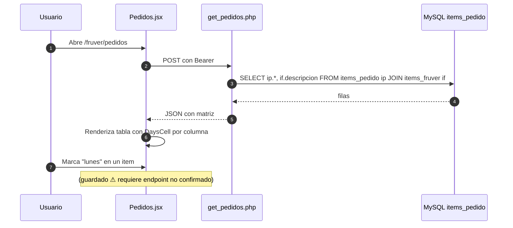
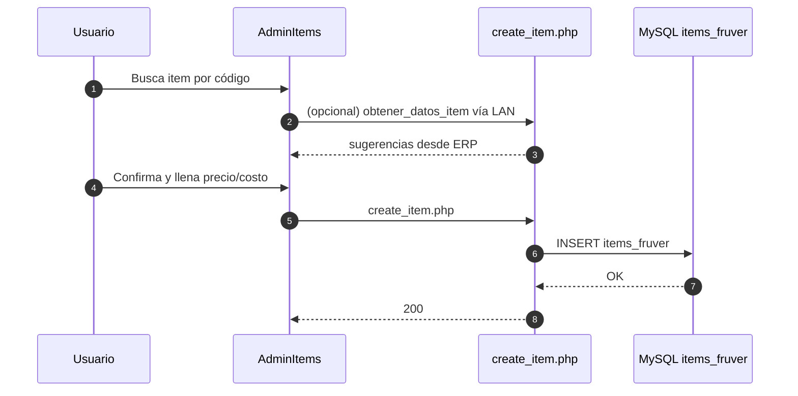

<div align="center">


# 23 · Módulo Fruver

**Documentación técnica — Aplicativo SEAO**

</div>

---

|                      |                     |
| -------------------- | ------------------- |
| **Documento**        | 23 — Fruver         |
| **Versión**          | 1.0                 |
| **Fecha**            | 14 de julio de 2026 |
| **Depende de**       | 03, 04, 09, 11, 14  |
| **Confidencialidad** | Uso interno         |

---

## 1 · Objetivo

El módulo **Fruver** administra la configuración de pedidos de frutas y verduras: el catálogo específico de items Fruver y la **matriz de qué se pide qué día de la semana** por sede. Es un módulo de configuración operativa — el catálogo maestro de items sigue viviendo en el ERP; este módulo añade metadatos operativos que el ERP no conoce.

---

## 2 · Actores

| Actor                       | Uso                                        |
| --------------------------- | ------------------------------------------ |
| **Administrador Fruver**    | Configura items y su calendario de pedidos |
| **Comprador de Fruver**     | Consulta y edita el catálogo               |
| **Auxiliar Fruver de sede** | Consulta qué se pide qué día               |

Rol técnico: típicamente `usuario` + cargo específico de Fruver o Compras.

---

## 3 · Rutas frontend

| Ruta                  | Componente                                             | Propósito                        |
| --------------------- | ------------------------------------------------------ | -------------------------------- |
| `/fruver/admin_items` | `Fruver/AdminItems` (⚠ requiere verificar path exacto) | CRUD del catálogo Fruver         |
| `/fruver/pedidos`     | `Fruver/Pedidos/Pedidos.jsx`                           | Configuración de pedidos por día |

---

## 4 · Componentes React

`frontend/src/components/Fruver/` con foco en `Pedidos/` (el más elaborado):

```
Fruver/Pedidos/
├── Pedidos.jsx                      ← orquestador
├── hooks/                           ← useFruverPedidos + variantes
├── components/
│   ├── PoliciesCard.jsx             ← tarjeta de política del pedido
│   ├── DaysCell.jsx                 ← celda mostrando días de pedido
│   ├── DaysTooltip.jsx              ← tooltip sobre días
│   ├── PedidosHeader.jsx            ← encabezado
│   ├── PedidosStats.jsx             ← agregados
│   ├── PedidosToolbar.jsx           ← barra de acciones (filtros, acciones)
│   ├── PedidosTable.jsx             ← tabla principal
│   ├── TableRow.jsx                 ← fila de la tabla
│   ├── ResultadosContainer.jsx      ← contenedor de resultados
│   └── Pagination.jsx               ← paginación
└── utils/                           ← formateo, cálculos
```

Es un módulo maduro con separación clara. **Un ejemplo del patrón thin orchestrator bien aplicado.**

---

## 5 · Endpoints backend cPanel

### 5.1 Items Fruver

- `POST /api/fruver/items/get_items.php` — lista `items_fruver`.
- `POST /api/fruver/items/create_item.php` — alta.
- `POST /api/fruver/items/update_item.php` — edición.

### 5.2 Pedidos

- `POST /api/fruver/pedidos/get_pedidos.php` — configuración de pedidos por día.

⚠ **Endpoints de escritura de pedidos:** requieren revisión — el flujo exacto de guardado y su relación con el ERP aún no está confirmado desde el código.

---

## 6 · Acciones del framework LAN

⚠ **Requiere verificación.** No hay evidencia clara de acciones LAN específicas de Fruver. Los pedidos concretos que llegan al ERP probablemente pasan por otro flujo (POS del proveedor, o carga masiva desde el ERP mismo).

**Consultas del ERP relacionadas:**

- `comercial/obtener_datos_item` — para autocompletar datos del item al añadir al catálogo Fruver.
- `general/buscar_lineas` — para asociar líneas de producto.

---

## 7 · Tablas MySQL

Ver [14 §7.1](../14-base-de-datos.md).

### 7.1 `items_fruver` — catálogo específico

| Columna          | Tipo          | Rol                             |
| ---------------- | ------------- | ------------------------------- |
| `item`           | varchar(6) PK | Código del item (mismo que ERP) |
| `descripcion`    | varchar       | Nombre humano                   |
| `valor_venta`    | decimal       | Precio de venta                 |
| `costo_promedio` | decimal       | Costo promedio ponderado        |
| `costo_ultimo`   | decimal       | Último costo comprado           |

### 7.2 `items_pedido` — matriz día × item

| Columna         | Tipo          | Rol                         |
| --------------- | ------------- | --------------------------- |
| `id`            | int PK        | —                           |
| `item`          | varchar(6) FK | Referencia a `items_fruver` |
| `lunes`         | varchar(1)    | Marca de pedido para lunes  |
| `martes`        | varchar(1)    | Marca para martes           |
| …               |               |                             |
| `domingo`       | varchar(1)    | Marca para domingo          |
| `administrador` | varchar       | Responsable administrativo  |
| `diario`        | varchar       | Marca de pedido diario      |
| `comprador`     | varchar       | Comprador asignado          |
| `observaciones` | text          | Notas libres                |

La estructura permite ver rápido **qué items se piden en cada día de la semana** para planeación.

---

## 8 · Reglas de negocio

- **Snapshot desacoplado.** El precio y costo en `items_fruver` es una copia local; puede diferir del ERP momentáneamente hasta la próxima sincronización.
- **Un item, una fila en `items_pedido`.** La matriz es por item, no por sede — la sede lee la política común.
- **Filtro por empresa.** No aplica a nivel de tabla: el módulo se muestra o no según `menus.abastecemos` / `menus.tobar`.
- **Sin borrado.** No se ha detectado endpoint de eliminación — se asume que se desactiva marcando todos los días vacíos.

---

## 9 · Flujos principales

### 9.1 Configurar qué se pide cada día



### 9.2 Agregar item al catálogo Fruver



---

## 10 · Permisos por acción

| Ruta                  |         ver         |     crear     |    editar     | eliminar |
| --------------------- | :-----------------: | :-----------: | :-----------: | :------: |
| `/fruver/admin_items` |    admin, Fruver    | admin, Fruver | admin, Fruver |  admin   |
| `/fruver/pedidos`     | admin, Fruver, sede | admin, Fruver | admin, Fruver |    —     |

⚠ Verificar en `rol_menu` y `cargo_menu` de producción.

---

## 11 · Notificaciones

Ninguna detectada — módulo silencioso.

---

## 12 · Cronjobs relacionados

Ninguno específico. Los cronjobs de precios generales (`subir_checker_mysql*`) actualizan precios usados también por Fruver.

---

## 13 · Deuda técnica específica

- **Endpoints de escritura de pedidos no completamente identificados** en el ZIP entregado — se marca como pendiente de análisis.
- **`items_pedido.lunes..domingo`** como columnas separadas hace consultas verbosas. Un modelo alternativo (`items_pedido_dia` con `id_item + dia_semana`) sería más normalizado — pero cambiaría todos los queries actuales.
- **`items_fruver.valor_venta / costo_promedio / costo_ultimo`** son copias del ERP que pueden desincronizarse. Sin política clara de cuándo se refrescan.

---

## 14 · Puntos pendientes de análisis

- Identificar el endpoint que persiste los cambios en la matriz día × item.
- Determinar si los "pedidos concretos" (no la configuración) se generan desde este módulo o desde otro.
- Confirmar interacción con el módulo Carnes (¿comparten patrón? — no, Carnes usa cabecera-detalle mientras Fruver usa matriz por día).

---

## 15 · Referencias cruzadas

| Necesitas…                                             | Documento                                  |
| ------------------------------------------------------ | ------------------------------------------ |
| Módulo Carnes (pedidos concretos con cabecera-detalle) | [carnes.md](./carnes.md)                   |
| Endpoints con detalle                                  | [09 · APIs §8](../09-api-endpoints.md)     |
| Tablas relacionadas                                    | [14 · BD §7.1](../14-base-de-datos.md)     |
| Convenciones que sigue este módulo                     | [22 · Convenciones](../22-convenciones.md) |

---

<div align="center">
<sub><b>Supermercados Belalcázar</b> · 23 · Fruver · v1.0 · 14 de julio de 2026</sub>
</div>
