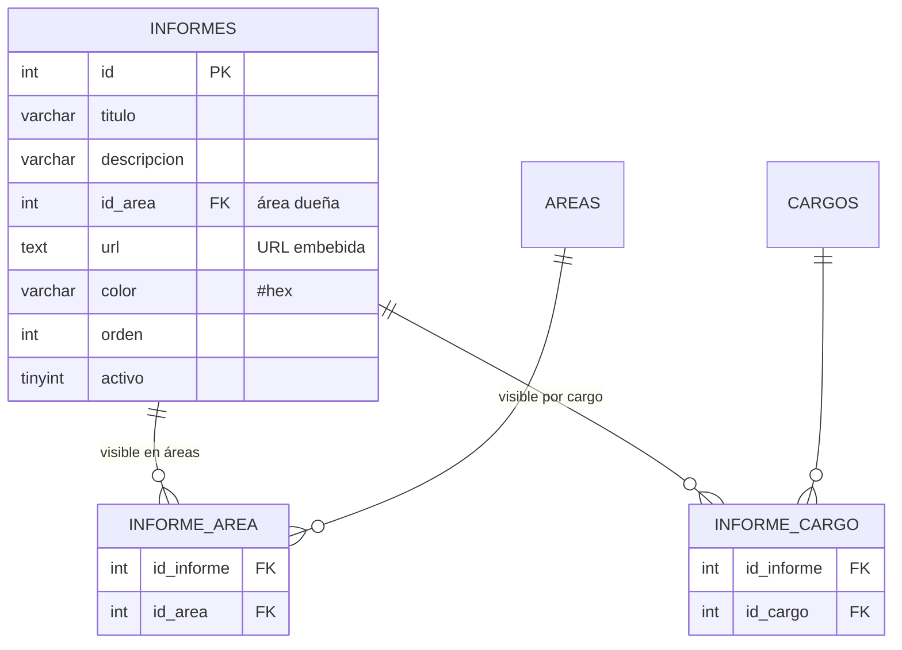
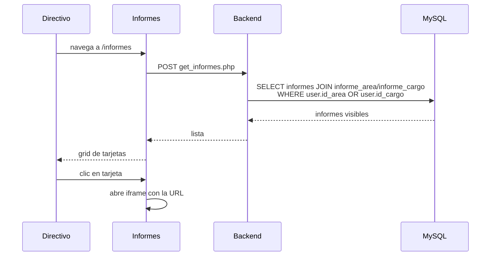
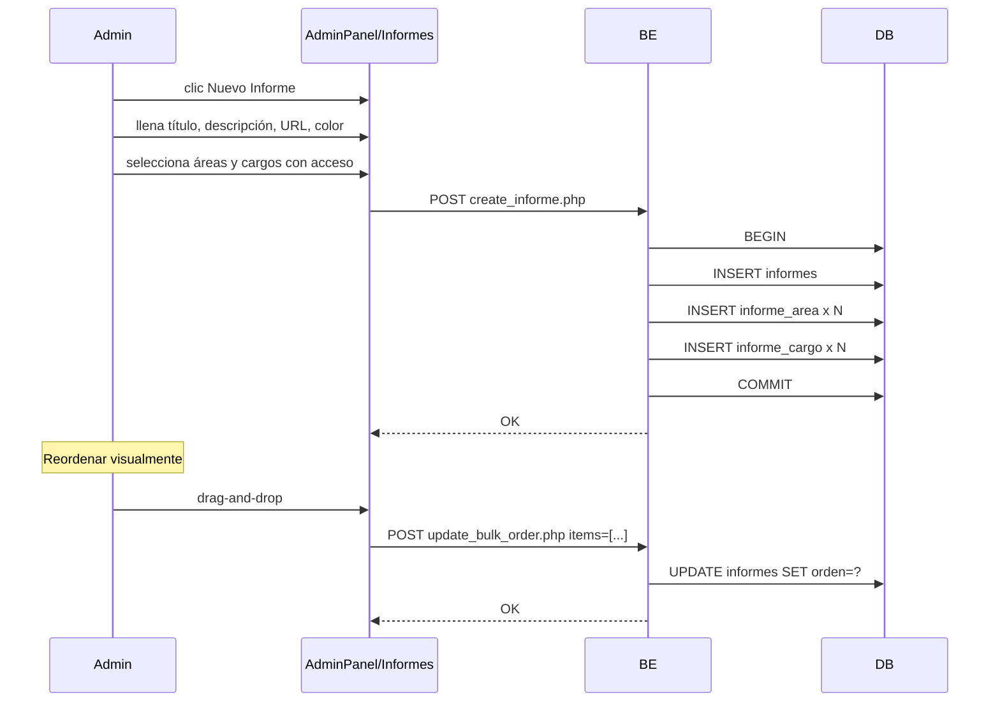

<div align="center">


# 23 · Módulo Informes

**Documentación técnica — Aplicativo SEAO**

</div>

---

|                      |                     |
| -------------------- | ------------------- |
| **Documento**        | 23 — Informes       |
| **Versión**          | 1.0                 |
| **Fecha**            | 14 de julio de 2026 |
| **Depende de**       | 03, 04, 09, 11, 14  |
| **Confidencialidad** | Uso interno         |

---

## 1 · Objetivo

El módulo **Informes** presenta al usuario **dashboards embebidos externos** (Power BI / Metabase / Looker Studio / otros) mediante URLs. Cada informe es visible solo por los usuarios cuya combinación de **área** y **cargo** lo autoriza.

Es el módulo más simple del aplicativo — no consume framework LAN ni tiene lógica compleja. Su valor está en la **capa de autorización** que decide qué informes ve cada usuario.

---

## 2 · Actores

| Actor               | Rol       | Cargo típico                          |
| ------------------- | --------- | ------------------------------------- |
| Directivo           | `usuario` | Gerente, jefe de área                 |
| Contador            | `usuario` | Contador                              |
| Analista financiero | `usuario` | Analista                              |
| Administrador IT    | `admin`   | Configura los informes y sus permisos |

---

## 3 · Rutas del frontend

| Ruta                      | Componente                                                   |
| ------------------------- | ------------------------------------------------------------ |
| `/informes`               | `Informes` (galería de informes disponibles para el usuario) |
| `/configuracion/informes` | Administración desde AdminPanel                              |

**Vista de galería:** lista de tarjetas con `titulo`, `descripcion`, `color`, ícono. Al hacer clic, se abre el iframe con la URL externa.

---

## 4 · Componentes React

Fuente: `frontend/src/components/Informes/`.

```
Informes/
├── Informes.jsx                       ← orquestador — galería
├── hooks/
│   └── useInformes.js                 ← fetch informes accesibles al usuario
├── components/
│   ├── InformesGrid.jsx               ← grid responsivo de tarjetas
│   ├── InformeCard.jsx                ← tarjeta con título, descripción, color
│   └── InformeViewer.jsx              ← iframe modal o vista dedicada
└── utils/
    └── (helpers menores)
```

⚠ Componentes exactos inferidos por convención — verificar en el filesystem.

### 4.1 Sobre el iframe

El iframe carga la URL configurada. **El aplicativo no controla la autenticación del sitio externo** — depende de cada proveedor (Power BI usa Azure AD que si coincide con el SSO del aplicativo puede aprovecharlo, Metabase requiere login separado, etc.).

---

## 5 · Endpoints backend

Fuente: `backend/backend/api/informes/`. Patrón A.

| Endpoint                | Auth                                                 | Propósito                                            |
| ----------------------- | ---------------------------------------------------- | ---------------------------------------------------- |
| `get_informes.php`      | Bearer                                               | Lista de informes visibles para el usuario en sesión |
| `create_informe.php`    | Bearer + Permiso `/configuracion/informes` · `crear` | Alta con permisos por área/cargo                     |
| `update_informe.php`    | Bearer + Permiso `editar`                            | Edición                                              |
| `update_bulk_order.php` | Bearer + Permiso `editar`                            | Reordenamiento en drag-and-drop                      |

**Sin endpoint `delete`** — soft delete o eliminación de las filas de acceso.

---

## 6 · Acciones del framework LAN

**Ninguna.** Módulo puramente local.

---

## 7 · Tablas MySQL

Ver [14 §5](../14-base-de-datos.md).



### 7.1 Semántica

- `informes.id_area` es el **área dueña** del informe (para clasificación).
- `informe_area` es la lista de **áreas que pueden ver** el informe (N a N).
- `informe_cargo` es la lista de **cargos que pueden ver** el informe (N a N).

**Un usuario ve un informe si:**

- Su `id_area` está en `informe_area` para ese informe, **O**
- Su `id_cargo` está en `informe_cargo` para ese informe.

⚠ La regla exacta (**OR** entre área y cargo, o **AND**) debe verificarse en `get_informes.php`. La convención del módulo Menús es AND, pero para Informes tiene más sentido OR.

---

## 8 · Reglas de negocio

### 8.1 Visibilidad por combinación

Detallado en §7.1. Requiere verificación empírica del AND vs OR.

### 8.2 Reordenamiento por drag-and-drop

`orden` numérico permite ordenar visualmente. El endpoint `update_bulk_order.php` recibe una lista `[{id, orden}]` y actualiza en batch.

### 8.3 Color como identidad visual

Cada informe tiene `color` en formato `#hex` — se usa en el fondo o borde de la tarjeta. Permite identidad visual por informe (verde para financieros, azul para operaciones, etc.).

### 8.4 URL sin validación de dominio

`informes.url` acepta cualquier URL. El administrador es responsable de que el sitio destino sea seguro y confiable.

**Riesgo:** un admin malicioso podría añadir un informe apuntando a un phishing con estilo corporativo. Mitigable con validación de dominio permitido.

### 8.5 Sin borrado hard

El endpoint `delete` no existe. Ocultar un informe requiere `activo = 0` desde AdminPanel.

---

## 9 · Flujos principales

### 9.1 Consultar informes del usuario



### 9.2 Administrar un informe



---

## 10 · Permisos por acción

| Ruta                      | Cargo             |              ver              | crear | editar | eliminar  |
| ------------------------- | ----------------- | :---------------------------: | :---: | :----: | :-------: |
| `/informes`               | Cualquier usuario | ✅ (según informe_area/cargo) |  ❌   |   ❌   |    ❌     |
| `/configuracion/informes` | Admin IT          |              ✅               |  ✅   |   ✅   | ✅ (soft) |

---

## 11 · Notificaciones y cronjobs

**Ninguno.**

---

## 12 · Deuda técnica del módulo

### 12.1 URL sin validación de dominio permitido

Ver §8.4. Riesgo controlable con lista blanca de dominios en `create_informe.php`.

**Esfuerzo:** XS.

### 12.2 SSO cruzado no aprovechado

El aplicativo autentica con Microsoft. Si el informe externo también usa Azure AD (típico en Power BI), el usuario debería tener SSO cruzado automático. Actualmente hay que ingresar credenciales dos veces si el iframe no comparte sesión.

**Mitigación:** para Power BI, configurar la app registration con SSO delegado. Para Metabase, integrar con OIDC.

### 12.3 Sin auditoría de acceso a informes

No se registra qué usuario abrió qué informe cuándo. Para BI ejecutivo puede ser útil saber quién consulta qué.

**Recomendación:** endpoint que registre acceso al abrir el iframe.

### 12.4 Sin metricas de uso

No hay dashboard de "informes más consultados" o "informes sin uso". Ayudaría a decidir qué mantener vs deprecar.

---

## 13 · Puntos pendientes de análisis

- **Lógica exacta AND vs OR** en `get_informes.php` (área + cargo).
- **Integración SSO cruzada** con proveedor de BI (documentar si existe).
- **Tamaño real del iframe** — full-screen vs modal.
- **Multi-nivel de organización** — ¿los informes se agrupan por categorías?

---

## 14 · Referencias cruzadas

| Necesitas…                          | Documento                                                                       |
| ----------------------------------- | ------------------------------------------------------------------------------- |
| Ver estructura de tablas            | [../14-base-de-datos.md#5-dominio-sistemas--plataforma](../14-base-de-datos.md) |
| Ver endpoints del módulo            | [../09-api-endpoints.md#7-informes-apiinformes](../09-api-endpoints.md)         |
| Ver AdminPanel donde se administran | [./admin-panel.md](./admin-panel.md)                                            |

---

<div align="center">
<sub><b>Supermercados Belalcázar</b> · Documento 23 — Módulo Informes · v1.0 · 14 de julio de 2026</sub>
</div>
