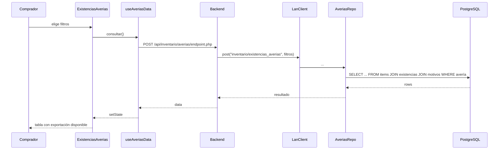
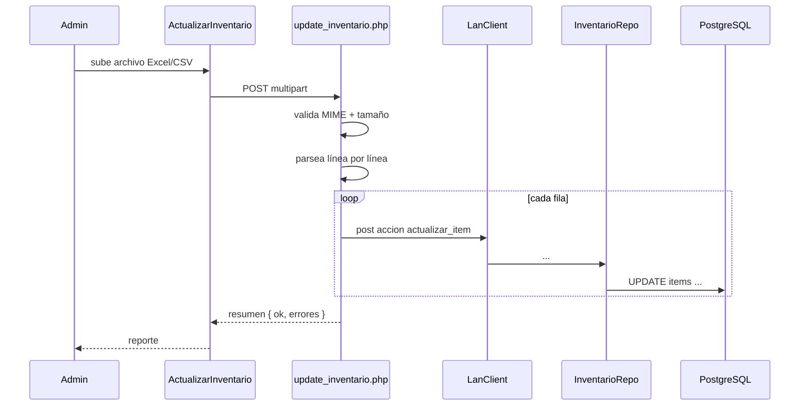
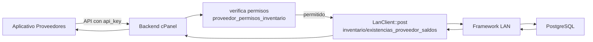

<div align="center">


# 23 · Módulo Inventario

**Documentación técnica — Aplicativo SEAO**

</div>

---

|                      |                        |
| -------------------- | ---------------------- |
| **Documento**        | 23 — Inventario        |
| **Versión**          | 1.0                    |
| **Fecha**            | 14 de julio de 2026    |
| **Depende de**       | 03, 04, 05, 09, 11, 14 |
| **Confidencialidad** | Uso interno            |

---

## 1 · Objetivo

El módulo **Inventario** ofrece **tres reportes contra el ERP** dirigidos a compras, control de inventario y auditoría interna:

1. **Averías** — existencias con estado de avería por proveedor.
2. **Bodegas Alternas** — inventario en bodegas de venta vs bodegas alternas por línea.
3. **Existencias / Costos** — cruce de existencias, costos y cobertura por línea, sede y periodo.

Todos son de **solo lectura** contra PostgreSQL vía framework LAN. El aplicativo interno guarda **solo la configuración editable** de cada reporte (qué proveedores, líneas, sedes participan) en tablas `cfg_*`.

Adicionalmente, este dominio incluye:

- Un endpoint de **actualización masiva de inventario** (`update_inventario.php`) que recibe archivos con actualizaciones al ERP.
- La configuración de **permisos de inventario para proveedores** (compartida con el aplicativo de proveedores adyacente).

---

## 2 · Actores

| Actor                  | Rol       | Cargo típico          |
| ---------------------- | --------- | --------------------- |
| Comprador              | `usuario` | Comprador             |
| Jefe de compras        | `usuario` | Jefe                  |
| Auditor interno        | `usuario` | Auditor               |
| Analista de inventario | `usuario` | Analista              |
| Administrador IT       | `admin`   | Configura los `cfg_*` |

---

## 3 · Rutas del frontend

| Ruta                                       | Componente            | Sub-módulo         |
| ------------------------------------------ | --------------------- | ------------------ |
| `/inventarios/reportes/averias`            | `ExistenciasAverias`  | Averías            |
| `/inventarios/reportes/bodegas_alternas`   | `BodegasAlternas`     | Bodegas alternas   |
| `/inventarios/reportes/existencias_costos` | `ExistenciasCostos`   | Existencias/costos |
| `/configuracion/actualizar_inventario`     | (parte de AdminPanel) | Upload masivo      |

---

## 4 · Componentes React

Fuente: `frontend/src/components/Inventario/Reportes/`.

Cada reporte sigue el patrón thin orchestrator con estructura idéntica:

```
Inventario/Reportes/<Reporte>/
├── <Reporte>.jsx                      ← orquestador
├── hooks/
│   ├── use<Reporte>Data.js            ← fetch + estado
│   ├── use<Reporte>Filtros.js         ← estado de filtros
│   └── use<Reporte>Export.js          ← exportación Excel
├── components/
│   ├── FiltrosPanel.jsx
│   ├── ResultadosTabla.jsx
│   └── ExportarBar.jsx
└── utils/
    └── formato.js
```

### 4.1 Averías (`ExistenciasAverias`)

Reporte con filtros por proveedor, sede, rango de fecha. Muestra items con estado de avería (motivo, cantidad, costo perdido). Exportable a Excel con formato corporativo.

**Datos consumidos:** vía `LanClient` acción `inventario/existencias_averias`.

### 4.2 Bodegas Alternas (`BodegasAlternas`)

Reporte que cruza existencias en bodegas de tipo `VENTA` vs `ALTERNA`. Útil para detectar desbalances (mercancía "atascada" en bodegas alternas mientras la sede queda sin producto).

**Datos consumidos:** `inventario/reporte_bodegas_alternas`.

**Configuración:** `cfg_bodegas_reporte` define qué bodegas participan (tipo `VENTA` o `ALTERNA`).

### 4.3 Existencias / Costos (`ExistenciasCostos`)

Reporte de mayor uso. Cruza existencias, costos unitarios, y **cobertura estimada en días** (basada en `dias_cobertura` esperados por línea de producto).

**Datos consumidos:** `inventario/reporte_existencias_costos`.

**Configuración:**

- `cfg_existencias_lineas` — líneas incluidas + `dias_cobertura` esperados.
- `cfg_existencias_locales` — sedes incluidas.

---

## 5 · Endpoints backend

Todos son **Patrón B** consolidados:

| Ruta                                                               | Sub-acciones                                                |
| ------------------------------------------------------------------ | ----------------------------------------------------------- |
| `/api/inventario/averias/endpoint.php`                             | `obtener_reporte`, `buscar_proveedores`, `buscar_criterios` |
| `/api/inventario/bodegas_alternas/endpoint.php`                    | `obtener_reporte`                                           |
| `/api/inventario/existencias_costos/endpoint.php`                  | `obtener_reporte`                                           |
| `/api/subida_archivos/actualiza_inventarios/update_inventario.php` | Upload masivo                                               |

⚠ **Nombres exactos** — inferidos por convención; verificar en el filesystem.

**Auth:** Bearer + Permiso `/inventarios/reportes/<sub>` · `ver`.

---

## 6 · Acciones del framework LAN usadas

| Acción LAN                                | Método                                                   | Uso                                                        |
| ----------------------------------------- | -------------------------------------------------------- | ---------------------------------------------------------- |
| `inventario/existencias_averias`          | `AveriasRepo::obtenerExistenciasAverias`                 | Reporte de averías                                         |
| `inventario/reporte_bodegas_alternas`     | `BodegasAlternasRepo::obtenerReporteBodegasAlternas`     | Reporte de bodegas                                         |
| `inventario/reporte_existencias_costos`   | `ExistenciasCostosRepo::obtenerReporteExistenciasCostos` | Reporte de existencias/costos                              |
| `inventario/buscar_proveedores`           | `AveriasRepo::buscarProveedores`                         | Autocomplete proveedor                                     |
| `inventario/buscar_criterios1`            | `AveriasRepo::buscarCriterio1`                           | Autocomplete de criterio de clasificación                  |
| `inventario/existencias_proveedor_saldos` | `SaldosRepo::obtenerSaldosInventarioProveedor`           | Consulta usada por Compras y por aplicativo de proveedores |

Todas **solo lectura**.

---

## 7 · Tablas MySQL propias

Ver [14 §9](../14-base-de-datos.md).

### 7.1 Réplica local del catálogo ERP

Estas tablas son **espejo** de tablas del ERP, alimentadas por procesos externos (ver §11):

- `items` (~40 columnas) — catálogo maestro.
- `cod_barras` — códigos por item.
- `lista_precios`, `lista_precios_provee` — precios.
- `cmproveedores` — catálogo maestro de proveedores.
- `resumen_inventario` — existencias mensuales por sede.
- `impuestos` — catálogo.
- `criterios_itm_1` — criterio de clasificación.

**Uso:** consultas rápidas locales que no requieren la latencia del framework LAN. Ejemplo: autocomplete de items en formularios.

### 7.2 Configuraciones editables (`cfg_*`)

| Tabla                     | Rol                                                                                   |
| ------------------------- | ------------------------------------------------------------------------------------- |
| `cfg_bodegas_reporte`     | Bodegas incluidas en reporte de Bodegas Alternas (`tipo_bodega`: `VENTA` / `ALTERNA`) |
| `cfg_existencias_lineas`  | Líneas incluidas en Existencias/Costos + `dias_cobertura` esperados                   |
| `cfg_existencias_locales` | Sedes incluidas en Existencias/Costos                                                 |
| `cfg_averias_proveedores` | Proveedores marcados para reporte de averías                                          |

Patrón común de columnas:

```sql
codigo         VARCHAR NOT NULL
descripcion    VARCHAR
tipo_*         VARCHAR / ENUM         -- según la config
activo         TINYINT(1) DEFAULT 1
creado_por     INT / VARCHAR
modificado_por INT / VARCHAR
created_at     TIMESTAMP DEFAULT CURRENT_TIMESTAMP
updated_at     TIMESTAMP DEFAULT CURRENT_TIMESTAMP ON UPDATE CURRENT_TIMESTAMP
```

### 7.3 Permisos de inventario para proveedores

- `proveedor_permisos_inventario` — configura qué puede ver cada proveedor del inventario compartido. Se administra desde el aplicativo interno pero **se consume desde el aplicativo de proveedores** adyacente.

Ver [14 §9.4](../14-base-de-datos.md) para detalle de columnas.

---

## 8 · Reglas de negocio

### 8.1 Reportes en tiempo real, config local

Los reportes consultan el ERP; las configuraciones (qué filtrar) están en MySQL local. Cambio de configuración en Admin surte efecto en el **siguiente reporte ejecutado** — sin recargas ni caches.

### 8.2 Filtros defensivos

Cada reporte tiene:

- **Filtros obligatorios** (rango de fecha, empresa).
- **Filtros opcionales** (proveedor, línea, sede).

Sin los obligatorios, el endpoint devuelve `400`.

### 8.3 Cobertura por línea

En Existencias/Costos, `cfg_existencias_lineas.dias_cobertura` define el objetivo por línea. El reporte calcula "días de cobertura reales = existencias / venta diaria promedio" y compara con el objetivo. **Es un indicador operativo, no una regla contable.**

### 8.4 Réplica local sin garantías de sincronía

Las tablas `items`, `cod_barras`, `lista_precios`, `cmproveedores`, `resumen_inventario`, etc. **son espejos del ERP con frescura no garantizada**. Se actualizan por procesos externos (probablemente FTP/SCP + cronjobs).

**Consecuencia:** cualquier funcionalidad que requiera datos exactos y actuales debe ir al ERP vía LanClient, no leer el espejo local.

### 8.5 Actualización masiva restringida

`update_inventario.php` recibe archivos con actualizaciones al ERP. Requiere permiso `admin` (⚠ verificar la matriz real). El upload valida línea por línea antes de aplicar.

---

## 9 · Flujos principales

### 9.1 Reporte de averías



### 9.2 Actualización masiva de inventario



⚠ Flujo hipotético — verificar el detalle exacto del endpoint.

### 9.3 Consulta de existencias por proveedor (integración con aplicativo de proveedores)



El aplicativo interno actúa como **puerta** — el proveedor no toca directamente el ERP.

---

## 10 · Permisos por acción

Matriz sugerida:

| Ruta                                       | Cargo     | ver | crear | editar | eliminar |
| ------------------------------------------ | --------- | :-: | :---: | :----: | :------: |
| `/inventarios/reportes/averias`            | Comprador | ✅  |  ❌   |   ❌   |    ❌    |
| `/inventarios/reportes/bodegas_alternas`   | Comprador | ✅  |  ❌   |   ❌   |    ❌    |
| `/inventarios/reportes/existencias_costos` | Comprador | ✅  |  ❌   |   ❌   |    ❌    |
| `/configuracion/actualizar_inventario`     | Admin     | ✅  |  ✅   |   ❌   |    ❌    |

**Configuraciones (`cfg_*`)** se administran desde AdminPanel (rutas `/configuracion/cfg_*` — inferido) y requieren permisos de admin.

---

## 11 · Cronjobs y sincronización

### 11.1 Réplica del ERP a MySQL

⚠ **No visible en los cronjobs listados (`subir_checker_*`, `verificar_registros_cvm`).** Se infiere que:

- Las tablas `items`, `cod_barras`, `lista_precios`, `cmproveedores`, `resumen_inventario`, `impuestos`, `criterios_itm_1` se alimentan desde **otro proceso externo al aplicativo** — posiblemente cronjob del ERP que exporta a un archivo y lo importa al MySQL cPanel.

**Deuda documentada:** no hay documentación operacional de estos procesos. Requiere consulta con el equipo del ERP.

### 11.2 Cronjobs propios del módulo

Ninguno — todos los reportes se ejecutan bajo demanda.

---

## 12 · Deuda técnica del módulo

### 12.1 Réplica local sin cronjob documentado

Ver §11.1. Un cambio de esquema en el ERP puede romper la réplica local silenciosamente. Sin monitoreo de frescura.

**Recomendación:** documentar el proceso completo o migrar a consultas directas al ERP para todas las funciones de autocomplete.

### 12.2 Endpoints monolíticos por reporte

Cada `endpoint.php` maneja un solo reporte, pero internamente despacha por `accion` para operaciones auxiliares (buscar proveedores, etc.). Es consistente con Patrón B, pero difícil de descubrir sin leer código.

**Sugerencia menor:** documentar las sub-acciones en un comentario.

### 12.3 Reportes pesados sin cola asíncrona

Ver [27 · R-E03](../27-riesgos.md) — igual que Contabilidad.

### 12.4 `cfg_averias_proveedores` opaca

La tabla existe pero su uso exacto no está claramente documentado. Requiere lectura del `AveriasRepo`.

### 12.5 Semántica de `ventas_registradas_pavas`

Tabla que aparece en CVM pero nombre ambiguo — ¿tiene relación con reportes de inventario? Requiere aclaración con negocio.

---

## 13 · Puntos pendientes de análisis

- **Proceso de alimentación** de tablas `items`, `cod_barras`, `resumen_inventario` — probablemente externo al aplicativo.
- **`update_inventario.php`** — formato exacto del archivo aceptado, validaciones, comportamiento ante error parcial.
- **`inventario/existencias_proveedor_saldos`** — cómo el aplicativo interno controla los permisos del proveedor que consulta.
- **Sub-acciones exactas** de cada `endpoint.php`.

---

## 14 · Referencias cruzadas

| Necesitas…                                 | Documento                                                                         |
| ------------------------------------------ | --------------------------------------------------------------------------------- |
| Ver detalle de las tablas ERP mirror       | [../14-base-de-datos.md#9-dominio-inventario--erp-mirror](../14-base-de-datos.md) |
| Ver framework LAN — repos consultados      | [../05-framework-interno.md](../05-framework-interno.md)                          |
| Ver el aplicativo de proveedores adyacente | [../02-arquitectura-general.md](../02-arquitectura-general.md)                    |
| Ver módulo relacionado — Contabilidad      | [./contabilidad.md](./contabilidad.md)                                            |
| Ver módulo relacionado — Compras           | [./compras.md](./compras.md)                                                      |

---

<div align="center">
<sub><b>Supermercados Belalcázar</b> · Documento 23 — Módulo Inventario · v1.0 · 14 de julio de 2026</sub>
</div>
