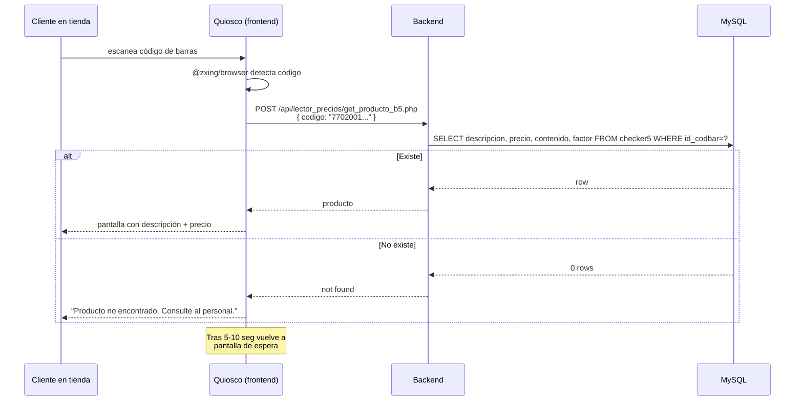
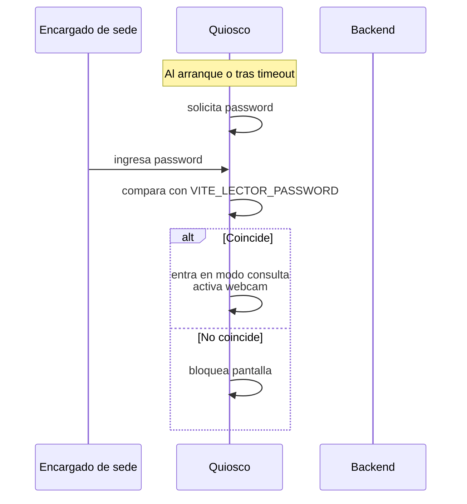

<div align="center">


# 23 · Módulo Lector de Precios

**Documentación técnica — Aplicativo SEAO**

</div>

---

|                      |                        |
| -------------------- | ---------------------- |
| **Documento**        | 23 — Lector de Precios |
| **Versión**          | 1.0                    |
| **Fecha**            | 14 de julio de 2026    |
| **Depende de**       | 03, 04, 09, 12, 14     |
| **Confidencialidad** | Uso interno            |

---

## 1 · Objetivo

El **Lector de Precios** son **quioscos físicos** en las sedes donde cualquier cliente puede escanear un producto y ver su precio, contenido y factor. Es el único módulo del aplicativo:

- Accesible **sin login de usuario del aplicativo**.
- Con **URLs distintas por sede** (`/LectorPrecios`, `/LectorPrecios2`, `/LectorPrecios5`, `/LectorPrecios8`, `/LectorPrecios11`).
- Con **tablas MySQL locales** que son réplica del ERP (`checker1`, `checker2`, `checker5`, `checker8`, `checker11`).
- Consultado desde una webcam o lector físico de códigos de barras.

Es un **frontend público** con endpoints protegidos por password compartido + IP allow-list (⚠ ver deuda de seguridad).

---

## 2 · Actores

| Actor             | Autenticación                                                                    |
| ----------------- | -------------------------------------------------------------------------------- |
| Cliente en tienda | Sin login — password compartido `VITE_LECTOR_PASSWORD` al inicializar el quiosco |
| Encargado de sede | Idem para abrir el quiosco tras reinicio                                         |

---

## 3 · Rutas del frontend

| Ruta               | Componente                      | Sede                                       |
| ------------------ | ------------------------------- | ------------------------------------------ |
| `/LectorPrecios`   | `LectorPreciosGeneric` (o `B0`) | Sede genérica (⚠ propósito exacto ambiguo) |
| `/LectorPrecios2`  | `B2`                            | Belalcázar 2                               |
| `/LectorPrecios5`  | `B5`                            | Belalcázar 5                               |
| `/LectorPrecios8`  | `B8`                            | Belalcázar 8                               |
| `/LectorPrecios11` | `B11`                           | Belalcázar 11                              |

**Todas son rutas públicas** — no envueltas en `<PrivateRoute>` (ver [04 §10.3](../04-arquitectura-frontend.md)).

**5 rutas, 5 componentes duplicados** — deuda estructural documentada.

---

## 4 · Componentes React

Fuente: `frontend/src/components/LectorPrecios/`.

```
LectorPrecios/
├── B1/
│   ├── B1.jsx                         ← orquestador de la sede 1
│   ├── hooks/
│   │   ├── useScanner.js              ← @zxing/browser
│   │   └── useLookup.js               ← fetch al backend
│   ├── components/
│   │   ├── CameraView.jsx
│   │   ├── ResultadoCard.jsx
│   │   └── HistorialSesion.jsx
│   └── utils/
│       └── formato.js
├── B2/  (estructura idéntica)
├── B5/  (idem)
├── B8/  (idem)
└── B11/ (idem)
```

**Cinco carpetas casi idénticas** — cambian solo:

- El endpoint que consultan (`get_producto_bN.php`).
- Elementos visuales menores (fondo, logo).

**Puntos técnicos comunes:**

- Uso de `@zxing/browser` para escaneo por webcam.
- Modo pantalla completa (kiosk mode) — sin scroll, con timeouts de reinicio.
- **Password local** al inicializar (`VITE_LECTOR_PASSWORD`) — un vigilante ingresa la password una vez al día.
- Almacenamiento de última consulta en `localStorage` para diagnóstico.

---

## 5 · Endpoints backend

Fuente: `backend/backend/api/lector_precios/`. Uno por sede:

| Endpoint               | Tabla consultada                |
| ---------------------- | ------------------------------- |
| `get_producto.php`     | ⚠ genérica — verificar cuál usa |
| `get_producto_b2.php`  | `checker2`                      |
| `get_producto_b5.php`  | `checker5`                      |
| `get_producto_b8.php`  | `checker8`                      |
| `get_producto_b11.php` | `checker11`                     |

**5 endpoints casi idénticos** — solo cambia el nombre de la tabla en el `SELECT`.

**Auth:** password local + IP allow-list (⚠ ver §12.1). **Sin Bearer token** — es el único bloque de endpoints sin autenticación de sesión.

### 5.1 Contrato

**Request:**

```json
{ "codigo": "7702001234567" }
```

**Response exitosa:**

```json
{
  "success": true,
  "producto": {
    "descripcion": "Aceite girasol 500ml",
    "precio": 3500,
    "contenido": 500,
    "factor": "ml"
  }
}
```

**Response cuando no existe:**

```json
{ "success": false, "message": "Producto no encontrado" }
```

---

## 6 · Acciones del framework LAN

**Ninguna.** Los precios se leen de las tablas locales `checker*` en MySQL, no del ERP en vivo.

**Motivación:** latencia mínima para el cliente en tienda — el ERP puede tardar 200+ ms; MySQL local < 10 ms.

**Costo:** los precios se refrescan por cronjob, no en tiempo real. Ver §11.

---

## 7 · Tablas MySQL

Ver [14 §9.2](../14-base-de-datos.md).

Cinco tablas idénticas en estructura (`checker1`, `checker2`, `checker5`, `checker8`, `checker11`):

```sql
CREATE TABLE checker1 (
  id_codbar   varchar(40) NOT NULL,
  id_item     varchar(6),
  descripcion varchar(40),
  precio      int,
  contenido   int,
  factor      varchar(10)
);
```

**Sin PK declarada** en el schema visto — deuda menor.

**Deuda estructural principal:** debería ser **una sola tabla con columna `id_sede`** (ver [26 · DT-009](../26-deuda-tecnica.md)).

---

## 8 · Reglas de negocio

### 8.1 Un quiosco = una sede

Cada quiosco físico está apuntado a la URL de su sede. Un cliente en la sede 5 no puede consultar precios de la sede 11 desde ese quiosco.

**Motivación:** los precios varían por sede (promociones locales, listas de precio diferenciadas). Consultar la sede equivocada daría precio incorrecto.

### 8.2 Datos leídos por TRUNCATE + INSERT

Cada refresh del cronjob `subir_checker_mysql*.php` hace `TRUNCATE checker1; INSERT ...`. **Hay una ventana pequeña (~10-30 segundos) en la que la tabla está vacía o parcial.** Durante esa ventana, cualquier consulta devuelve "producto no encontrado".

**Mitigación posible (25):** hacer swap de tabla (`RENAME TABLE`) en vez de TRUNCATE. Trabajo M.

### 8.3 Solo lectura por código de barras

El endpoint solo acepta consulta por `id_codbar`. No hay búsqueda por descripción, por precio, ni por rango. **Enfoque intencional** — evita convertir el quiosco en herramienta de "investigación de precios".

### 8.4 Sin sesión — sin registro de consulta

El endpoint no guarda quién consultó qué. **Es intencional para privacidad del cliente** — no queremos guardar qué productos consultó nadie.

Contraste: podría ser útil para analítica de "qué productos se consultan más". Trade-off decidido a favor de privacidad.

### 8.5 Password local no rota automáticamente

`VITE_LECTOR_PASSWORD` está embebido en el bundle. Rotarla implica **rebuild + redeploy del frontend**, lo que a su vez requiere reiniciar los quioscos para descargar el nuevo bundle.

**No es un flujo operativo cómodo** — de ahí el push a migrar a un gate server-side.

---

## 9 · Flujos principales

### 9.1 Consulta de precio típica



### 9.2 Inicialización del quiosco



---

## 10 · Permisos

**No aplica** — endpoints públicos sin `check_permission`.

La única "autorización" es:

- Password local (`VITE_LECTOR_PASSWORD`).
- IP allow-list en el backend (⚠ verificar que exista — no confirmado).

---

## 11 · Cronjobs

Los 5 cronjobs `subir_checker_mysql*.php` (ver [08 §7](../08-diagramas-infraestructura.md) y [16 §9](../16-deploy.md)):

| Cronjob                      | Archivo fuente  | Tabla destino | Frecuencia  |
| ---------------------------- | --------------- | ------------- | ----------- |
| `subir_checker_mysql.php`    | `CHECKER1.TXT`  | `checker1`    | Cada 30 min |
| `subir_checker_mysql_2.php`  | `CHECKER2.TXT`  | `checker2`    | Cada 30 min |
| `subir_checker_mysql_5.php`  | `CHECKER5.TXT`  | `checker5`    | Cada 30 min |
| `subir_checker_mysql_8.php`  | `CHECKER8.TXT`  | `checker8`    | Cada 30 min |
| `subir_checker_mysql_11.php` | `CHECKER11.TXT` | `checker11`   | Cada 30 min |

**Validación defensiva:** ver [24 §13](../24-codigo-explicado.md) — el cronjob rechaza el archivo si es < 1 MB (detecta transferencias truncadas).

---

## 12 · Deuda técnica del módulo

### 12.1 `VITE_LECTOR_PASSWORD` en el bundle público

Ver [DT-003 en 26](../26-deuda-tecnica.md). Cualquiera con DevTools puede leer la password. Rotar es caro (requiere rebuild + redeploy + reinicio de quioscos).

**Recomendación (25):** migrar el gate a un endpoint backend que verifique la password server-side. Ver [25 · P4.1](../25-refactorizacion.md).

### 12.2 5 tablas + 5 endpoints + 5 componentes + 5 cronjobs duplicados

Ver [DT-008, DT-009 en 26](../26-deuda-tecnica.md).

**Recomendación:** consolidar en:

- 1 tabla `checker` con columna `id_sede`.
- 1 endpoint `get_producto.php` con parámetro `id_sede`.
- 1 componente React parametrizado.
- 1 cronjob que ejecute los 5 imports.

**Esfuerzo M** — reduce mantenimiento a 1/5.

### 12.3 Ventana vacía durante TRUNCATE

Ver §8.2. Solucionable con swap de tabla.

### 12.4 Sin monitoreo automático de "conteo mínimo"

Si un cronjob falla y deja `checker5` casi vacío, el usuario en tienda ve "producto no encontrado" para casi todo. Nadie lo detecta hasta que alguien reclama.

**Recomendación:** cronjob complementario que verifique `SELECT COUNT(*) FROM checker*` y alerte si el conteo cae > 20%.

### 12.5 Sin PK en tablas `checker*`

Verificar y añadir `PRIMARY KEY (id_codbar)` con `ALTER TABLE`.

### 12.6 Ausencia de auditoría de fallo del cronjob

Los cronjobs escriben a `/home/user/logs/checker_N.log` pero no envían alerta si fallan. Ver [27 · R-I03](../27-riesgos.md).

---

## 13 · Puntos pendientes de análisis

- **`/LectorPrecios` genérico** — ¿es para una sede específica o es fallback?
- **IP allow-list** — verificar si los endpoints tienen algún control de IP (ver documentado como asumido pero no confirmado).
- **Componentes duplicados** — ¿realmente son idénticos o hay diferencias sutiles por sede?
- **Timeout de kiosk mode** — ¿cuánto tiempo antes de pedir password de nuevo?

---

## 14 · Referencias cruzadas

| Necesitas…                                       | Documento                                                                                                      |
| ------------------------------------------------ | -------------------------------------------------------------------------------------------------------------- |
| Ver por qué es una deuda estructural             | [../26-deuda-tecnica.md](../26-deuda-tecnica.md)                                                               |
| Ver plan de consolidación                        | [../25-refactorizacion.md#31-p21--consolidar-lector-de-precios--tablas-checker](../25-refactorizacion.md)      |
| Ver cronjobs en detalle                          | [../16-deploy.md#9-cronjobs](../16-deploy.md)                                                                  |
| Ver validación defensiva del cronjob             | [../24-codigo-explicado.md#13-cronjob--validacion-defensiva-del-archivo-checkertxt](../24-codigo-explicado.md) |
| Ver deuda de seguridad de `VITE_LECTOR_PASSWORD` | [../12-seguridad.md#6-seguridad-en-la-capa-de-aplicacion-frontend](../12-seguridad.md)                         |

---

<div align="center">
<sub><b>Supermercados Belalcázar</b> · Documento 23 — Módulo Lector de Precios · v1.0 · 14 de julio de 2026</sub>
</div>
