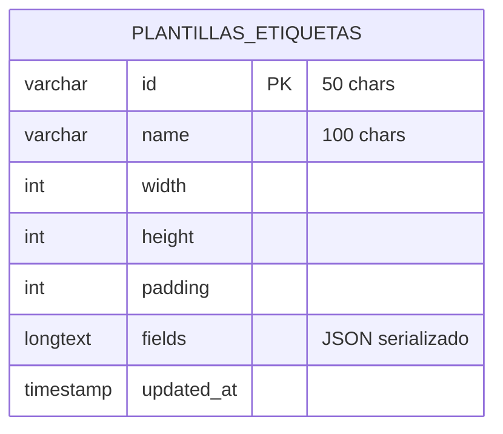
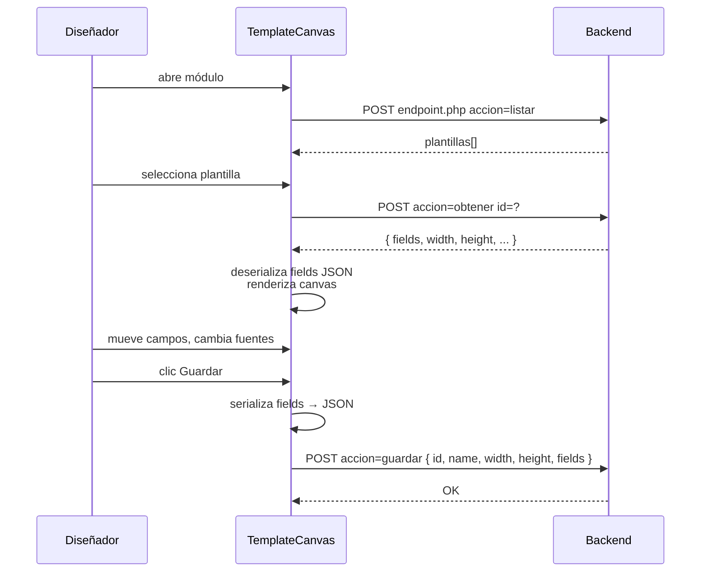
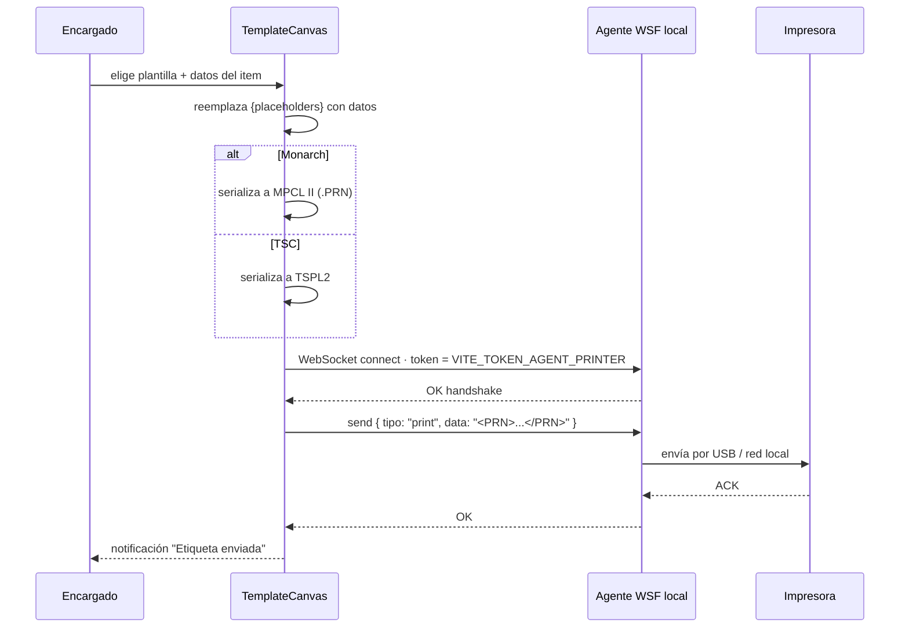

<div align="center">


# 23 · Módulo Publicidad

**Documentación técnica — Aplicativo SEAO**

</div>

---

|                      |                     |
| -------------------- | ------------------- |
| **Documento**        | 23 — Publicidad     |
| **Versión**          | 1.0                 |
| **Fecha**            | 14 de julio de 2026 |
| **Depende de**       | 03, 04, 09, 11, 14  |
| **Confidencialidad** | Uso interno         |

---

## 1 · Objetivo

El módulo **Publicidad** administra el **diseño e impresión de etiquetas de precio** para góndolas y estanterías de las sedes. Es el único módulo que:

- Habla con un **agente WebSocket local** (aplicación C# WPF en la máquina del usuario).
- Genera **PRN** binario en dos dialectos (MPCL II para impresoras Monarch y TSPL2 para TSC).
- Persiste plantillas de diseño como JSON serializado.

Es funcionalmente autónomo — no consulta al ERP (aunque la lista de items proviene de otros módulos como Separatas).

---

## 2 · Actores

| Actor                         | Rol       | Cargo típico                    |
| ----------------------------- | --------- | ------------------------------- |
| Diseñador de publicidad       | `usuario` | Diseñador                       |
| Encargado de sede (impresión) | `usuario` | Admin sede o Publicidad         |
| Administrador IT              | `admin`   | Configura plantillas y catálogo |

---

## 3 · Rutas del frontend

| Ruta                                      | Componente                                   |
| ----------------------------------------- | -------------------------------------------- |
| `/publicidad` (o `/publicidad/etiquetas`) | `TemplateCanvas` — editor visual + impresión |

Una sola ruta principal con la funcionalidad completa.

---

## 4 · Componentes React

Fuente: `frontend/src/components/Publicidad/`.

```
Publicidad/
├── TemplateCanvas.jsx                 ← orquestador — editor visual
├── hooks/
│   ├── usePlantillas.js               ← CRUD de plantillas
│   ├── useCanvas.js                   ← estado del canvas (fields, dimensiones)
│   ├── useAgentePrinter.js            ← conexión WebSocket + envío PRN
│   └── useSerializacion.js            ← generar MPCL/TSPL desde el diseño
├── components/
│   ├── sidebar/
│   │   ├── PlantillasList.jsx         ← plantillas guardadas
│   │   ├── PresetsRoll.jsx            ← selector de tamaño de rollo
│   │   ├── FieldsPanel.jsx            ← lista de campos
│   │   └── ConfigPanel.jsx            ← ancho, alto, padding
│   ├── CanvasArea.jsx                 ← lienzo de dibujo (SVG)
│   ├── FieldEditor.jsx                ← editar un campo específico
│   ├── BarcodeHelper.jsx              ← selector de simbología
│   └── PrintButton.jsx                ← disparar impresión
└── utils/
    ├── mpcl.js                        ← generador MPCL II
    ├── tspl.js                        ← generador TSPL2
    ├── barcodeUtils.js                ← detección de simbología
    └── constants.js                   ← presets de rollo, fuentes
```

### 4.1 Sobre el editor de canvas

`TemplateCanvas.jsx` es una **de las piezas más ricas del frontend**. Basado en el contexto del proyecto:

- **Roll presets** con lectura en mm de dimensiones estándar.
- **Toggle de orientación** con auto-rotación de campos al cambiar.
- **Rotación individual por campo** (0/90/180/270).
- **Modo de descripción en dos líneas** para nombres largos.
- **Toggle "Llenar alto"** para expandir un campo.
- **Auto-clasificación de simbología** de código de barras (EAN-13, UPC-A, EAN-8, Code 128) — con fallback documentado por firmware.

---

## 5 · Endpoints backend

Fuente: `backend/backend/api/publicidad/printer/`.

**Un solo endpoint consolidado** (Patrón B) — `endpoint.php` — con sub-acciones:

| Sub-acción | Propósito                          |
| ---------- | ---------------------------------- |
| `listar`   | Todas las plantillas               |
| `obtener`  | Una plantilla por `id`             |
| `guardar`  | Upsert por `id` (crea o actualiza) |
| `eliminar` | Borrar por `id`                    |

**Auth:** Bearer + Permiso `/publicidad` con `ver`/`crear`/`editar`/`eliminar`.

**El backend NO envía a la impresora.** Solo persiste el diseño. La impresión ocurre client-side vía el agente local.

---

## 6 · Acciones del framework LAN

**Ninguna.** El módulo es completamente independiente del ERP.

---

## 7 · Tabla MySQL



Una sola tabla. Todo el diseño (posición de campos, fuentes, tamaños, colores, rotaciones) vive **serializado en `fields`**.

**Ejemplo del JSON en `fields`:**

```json
[
  {
    "type": "text",
    "value": "{descripcion}",
    "x": 10,
    "y": 15,
    "font": "Arial",
    "size": 14,
    "bold": true,
    "rotation": 0
  },
  {
    "type": "barcode",
    "value": "{codigo_barras}",
    "symbology": "EAN-13",
    "x": 10,
    "y": 40,
    "width": 60,
    "height": 20
  },
  {
    "type": "text",
    "value": "$ {precio_ahora}",
    "x": 10,
    "y": 70,
    "font": "Arial",
    "size": 20,
    "bold": true
  }
]
```

Placeholders entre `{...}` se reemplazan al momento de imprimir con los datos del item concreto.

---

## 8 · Reglas de negocio

### 8.1 Serialización client-side, persistencia server-side

El navegador conoce el formato del JSON. El backend solo guarda/lee sin validar la estructura interna. **El backend es "tonto" respecto al contenido del diseño** — deliberadamente.

**Consecuencia:** el diseño puede evolucionar (nuevos tipos de campo, propiedades) sin modificar backend.

### 8.2 Impresión mediante agente WebSocket local

**Único flujo del sistema donde el frontend habla directamente con un servicio local** — sin pasar por el backend cPanel.

- El agente escucha en `ws://127.0.0.1:8181`.
- Autenticación con `VITE_TOKEN_AGENT_PRINTER`.
- El frontend serializa el diseño a MPCL II o TSPL2 y envía al agente.
- El agente reenvía a la impresora física (USB o red local).

### 8.3 Dialectos MPCL II vs TSPL2

- **MPCL II** — protocolo de Monarch 9830 / 9906. Fuente `50` fija, unidades `G`, justificación `L`.
- **TSPL2** — protocolo TSC ME240 / MB240T / MB241T. Fuente `"0"` (CG Triumvirate), `CODEPAGE 1252` para caracteres españoles.

El frontend decide qué dialecto usar según la impresora configurada.

### 8.4 Simbología de código de barras — fallback por firmware

- **EAN-13 con font 9** — no funciona en firmware antiguo del Monarch 9830.
- **Fallback: Code 128 con font 11** — funciona en todos los firmwares.

`BarcodeHelper` detecta automáticamente y usa el mejor disponible.

### 8.5 Plantillas compartidas entre sedes

Una plantilla guardada es accesible por cualquier usuario con permisos. Cambios en la plantilla afectan a todos los usuarios que la usen (efecto inmediato en próxima impresión).

### 8.6 Sin cronjobs ni notificaciones

Módulo puramente reactivo — impresión bajo demanda.

---

## 9 · Flujos principales

### 9.1 Editar una plantilla



### 9.2 Imprimir una etiqueta



Detalle en [06 §7](../06-flujo-de-una-peticion.md).

---

## 10 · Permisos por acción

| Ruta          | Cargo      | ver | crear | editar | eliminar |
| ------------- | ---------- | :-: | :---: | :----: | :------: |
| `/publicidad` | Diseñador  | ✅  |  ✅   |   ✅   |    ❌    |
| `/publicidad` | Admin sede | ✅  |  ❌   |   ❌   |    ❌    |
| `/publicidad` | Admin IT   | ✅  |  ✅   |   ✅   |    ✅    |

**Nota:** aunque un usuario tenga `puede_ver`, si no tiene el agente WebSocket instalado localmente **no puede imprimir**. El diseño sí es accesible.

---

## 11 · Configuración específica del módulo

Variables de entorno del frontend relacionadas:

| Variable                       | Rol                                                |
| ------------------------------ | -------------------------------------------------- |
| `VITE_WEBSOCKET_AGENT_PRINTER` | URL del agente (por default `ws://127.0.0.1:8181`) |
| `VITE_TOKEN_AGENT_PRINTER`     | Token para autenticar contra el agente             |

Ambas van en el bundle público — riesgo documentado en [12 §6.1](../12-seguridad.md).

---

## 12 · Deuda técnica del módulo

### 12.1 `VITE_TOKEN_AGENT_PRINTER` en el bundle

Ver [DT-004 en 26](../26-deuda-tecnica.md). Aceptable dado que el agente solo escucha en loopback, pero riesgo residual en máquinas compartidas o con acceso remoto (RDP).

### 12.2 Impresora "recordada" por sesión pero no persistida

Cada usuario elige impresora al iniciar. No hay persistencia server-side de la elección. Al recargar la página, hay que volver a seleccionar.

**Recomendación:** persistir en `localStorage` por usuario.

### 12.3 Serialización de MPCL/TSPL en frontend

Toda la lógica de generación de PRN vive en el frontend. Si mañana la empresa adopta otra impresora con otro protocolo, requiere código nuevo en el frontend.

**Alternativa:** mover la serialización al backend (recibir descripción en JSON, devolver PRN). Trade-off: el agente WebSocket vive en la máquina del usuario y no habla con el backend — habría que enrutar el PRN a través del backend, aumentando latencia.

Decisión actual (client-side) es correcta dado el modelo actual.

### 12.4 Sin previsualización de PRN

Antes de imprimir no hay "preview" de cómo se verá la etiqueta impresa. El diseñador debe imprimir para verificar.

**Recomendación:** simulador visual del PRN (renderizar el MPCL/TSPL a SVG para preview).

### 12.5 Sin auditoría de impresiones

No se registra qué etiquetas se imprimieron ni cuándo. Para consumibles caros (etiquetas grandes) sería útil.

**Recomendación menor:** endpoint `log_impresion.php` que registre por plantilla + usuario + cantidad.

---

## 13 · Puntos pendientes de análisis

- **Estructura exacta** del JSON en `plantillas_etiquetas.fields` — extraer un ejemplo del sistema en producción.
- **Detección automática de impresora** en el frontend — ¿usa mDNS o lista fija?
- **Manejo de errores del agente** — ¿qué hace si el agente rechaza el PRN?
- **Multi-impresión** — imprimir N etiquetas de un lote de items — ¿hay batch?

---

## 14 · Referencias cruzadas

| Necesitas…                                      | Documento                                                                                                                    |
| ----------------------------------------------- | ---------------------------------------------------------------------------------------------------------------------------- |
| Ver flujo end-to-end de impresión               | [../06-flujo-de-una-peticion.md#7-escenario-5--impresion-de-etiqueta-frontend--agente-local](../06-flujo-de-una-peticion.md) |
| Ver el agente WebSocket como componente externo | [../04-arquitectura-frontend.md#16-impresion-de-etiquetas--agente-websocket-local](../04-arquitectura-frontend.md)           |
| Ver `plantillas_etiquetas`                      | [../14-base-de-datos.md#103-publicidad--plantillas-etiquetas](../14-base-de-datos.md)                                        |
| Ver deuda de seguridad del token                | [../12-seguridad.md#6-seguridad-en-la-capa-de-aplicacion-frontend](../12-seguridad.md)                                       |

---

<div align="center">
<sub><b>Supermercados Belalcázar</b> · Documento 23 — Módulo Publicidad · v1.0 · 14 de julio de 2026</sub>
</div>
