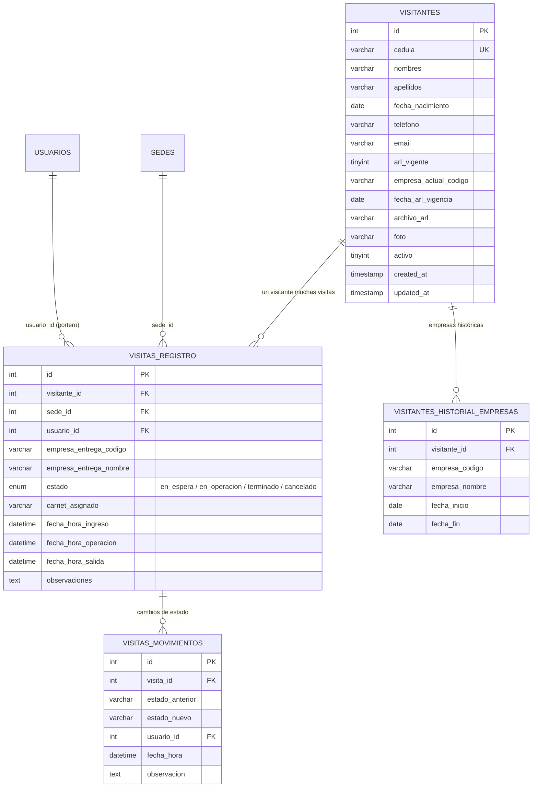
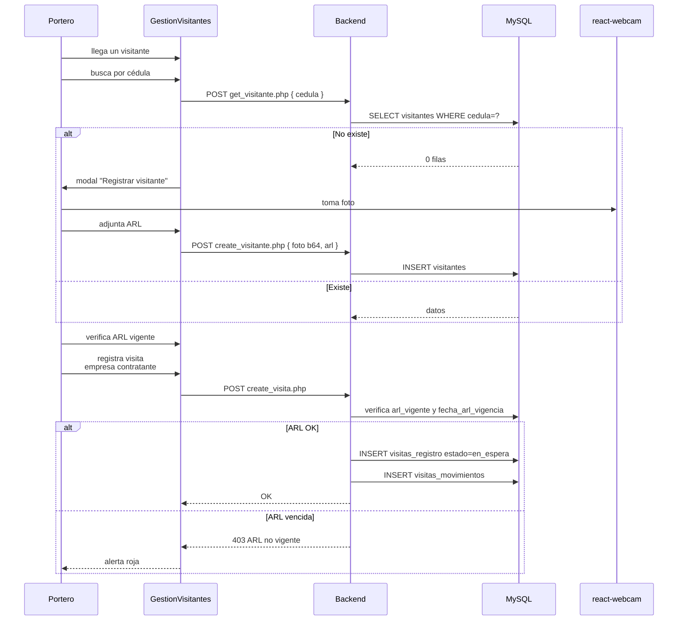
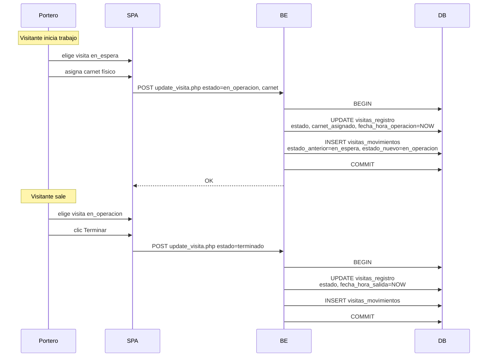

<div align="center">


# 23 · Módulo Seguridad — Visitantes

**Documentación técnica — Aplicativo SEAO**

</div>

---

|                      |                             |
| -------------------- | --------------------------- |
| **Documento**        | 23 — Seguridad (Visitantes) |
| **Versión**          | 1.0                         |
| **Fecha**            | 14 de julio de 2026         |
| **Depende de**       | 03, 04, 09, 11, 14          |
| **Confidencialidad** | Uso interno                 |

---

## 1 · Objetivo

El módulo **Seguridad — Gestión de Visitantes** administra el **control de ingreso de personas externas** (contratistas, proveedores en visita comercial, mensajería, familiares) a las sedes. Cubre:

- Registro maestro de visitantes con foto, cédula, ARL vigente.
- Ciclo de visita (en_espera → en_operacion → terminado / cancelado).
- Trazabilidad inmutable de cambios de estado.
- Historial de empresas a las que pertenecía cada visitante (útil para contratistas que rotan empleador).

Cumple con normativa de seguridad y salud ocupacional (verificación de ARL vigente antes del ingreso).

---

## 2 · Actores

| Actor                 | Rol       | Cargo típico                            |
| --------------------- | --------- | --------------------------------------- |
| Portero de sede       | `usuario` | Portero / vigilante                     |
| Administrador de sede | `usuario` | Admin de sede (consulta y correcciones) |
| Analista de seguridad | `admin`   | Auditor de accesos                      |

**Nota:** los visitantes **no tienen usuario en el aplicativo**. Son entidades registradas, no cuentas.

---

## 3 · Rutas del frontend

| Ruta                    | Componente          | Sub-módulo                                     |
| ----------------------- | ------------------- | ---------------------------------------------- |
| `/seguridad/visitantes` | `GestionVisitantes` | Panel principal — visitantes + visitas activas |

Ruta única con **múltiples paneles internos** (tabs o vistas condicionales dentro del componente).

---

## 4 · Componentes React

Fuente: `frontend/src/components/Seguridad/Gestion Visitantes/`.

⚠ **Estructura observada:** la carpeta existe pero sin desglose evidente en subcarpetas `hooks/components/utils/`. Es posible que:

- Sea un módulo aún no refactorizado al patrón thin orchestrator (candidato para 25).
- O tenga un único archivo grande con toda la lógica.

Componentes esperados (por dominio funcional):

- **`GestionVisitantes.jsx`** — orquestador.
- **Registro maestro** — form de visitante (cédula, nombre, teléfono, correo, foto, ARL).
- **Vista de visitas activas** — lista con estado (en_espera, en_operacion).
- **Formulario de nueva visita** — datos de la empresa contratante + carnet asignado.
- **Historial de visitas** — consulta filtrable.

Componentes técnicos:

- **Captura de webcam** con `react-webcam` para foto del visitante.
- **Upload de ARL** (PDF) con validación.

---

## 5 · Endpoints backend

Fuente: `backend/backend/api/seguridad/visitantes/`. Patrón A.

| Endpoint               | Propósito                                                                               |
| ---------------------- | --------------------------------------------------------------------------------------- |
| `get_visitantes.php`   | Lista con filtros (nombre, cédula, ARL vigente, empresa)                                |
| `get_visitante.php`    | Detalle de un visitante + historial de empresas                                         |
| `create_visitante.php` | Alta con foto (base64 en body) y ARL                                                    |
| `update_visitante.php` | Edición                                                                                 |
| `get_visitas.php`      | Visitas activas o históricas                                                            |
| `create_visita.php`    | Ingreso — crea `visitas_registro` en estado `en_espera` + fila en `visitas_movimientos` |
| `update_visita.php`    | Cambio de estado + fila en `visitas_movimientos`                                        |
| `get_proveedores.php`  | Catálogo de empresas contratistas para autocompletar                                    |

**Auth uniforme:** Bearer + Permiso `/seguridad/visitantes` con la acción correspondiente.

---

## 6 · Acciones del framework LAN

**Ninguna directa.** El módulo es puramente local. El catálogo de empresas viene de la BD del aplicativo (posiblemente de `cmproveedores` u otra tabla local).

---

## 7 · Tablas MySQL

Ver [14 §10.2](../14-base-de-datos.md).



### 7.1 Patrón trazabilidad por evento

`visitas_movimientos` replica el patrón de trazabilidad de solicitudes de [Compras](./compras.md). Cada cambio de estado inserta fila nueva — la historia es inmutable.

### 7.2 Historial de empresas del visitante

`visitantes_historial_empresas` permite que un contratista que rota de empresa (típico en outsourcing) mantenga historial trazable. `empresa_actual_codigo` en `visitantes` referencia la más reciente.

---

## 8 · Reglas de negocio

### 8.1 ARL vigente obligatoria

Al crear visita (`create_visita.php`), el backend verifica:

```sql
SELECT arl_vigente, fecha_arl_vigencia FROM visitantes WHERE id = ?
```

Si `arl_vigente = 0` o `fecha_arl_vigencia < CURDATE()`, la visita se rechaza con 403 y mensaje "ARL vencida o no vigente".

**Es la regla más importante del módulo** — cumplimiento con normativa de SST.

### 8.2 Cédula única por visitante

`visitantes.cedula` es UNIQUE. Al crear, si ya existe, se sugiere "actualizar el existente" en vez de duplicar.

### 8.3 Ciclo de estados

```
en_espera → en_operacion → terminado
en_espera → cancelado
```

`en_operacion → cancelado` no es una transición esperada.

### 8.4 Timestamps automáticos por estado

- `fecha_hora_ingreso` — al crear visita.
- `fecha_hora_operacion` — al pasar a `en_operacion`.
- `fecha_hora_salida` — al pasar a `terminado`.

Todos son NULL hasta que se produce el evento.

### 8.5 Carnet asignado obligatorio

Al pasar a `en_operacion`, el portero debe asignar un `carnet_asignado` (código físico visible). Sin carnet no se puede iniciar operación.

### 8.6 Historial inmutable de estados

Cada cambio de `estado` en `visitas_registro` inserta fila en `visitas_movimientos`. Nunca se sobrescribe.

### 8.7 Historial de empresas al cambiar

Cuando cambia la empresa actual del visitante (`update_visitante` con `empresa_actual_codigo` distinta), se **cierra** la entrada en `visitantes_historial_empresas` (setea `fecha_fin`) y se abre una nueva.

⚠ **Confirmar en código** — flujo hipotético basado en el esquema.

---

## 9 · Flujos principales

### 9.1 Ingreso de un visitante nuevo



### 9.2 Cambio de estado



---

## 10 · Permisos por acción

| Ruta                    | Cargo              | ver | crear | editar |            eliminar             |
| ----------------------- | ------------------ | :-: | :---: | :----: | :-----------------------------: |
| `/seguridad/visitantes` | Portero            | ✅  |  ✅   |   ✅   |               ❌                |
| `/seguridad/visitantes` | Analista seguridad | ✅  |  ✅   |   ✅   | ❌ (soft delete via `activo=0`) |
| `/seguridad/visitantes` | Admin IT           | ✅  |  ✅   |   ✅   |               ✅                |

---

## 11 · Notificaciones y cronjobs

**Ninguno detectado.** El módulo es puramente reactivo — no envía correos ni tiene cronjobs.

**Recomendación futura:** alertas automatizadas para:

- Visitantes con ARL próxima a vencer (30 días antes).
- Visitas `en_operacion` de duración anormalmente larga (posible olvido de "cerrar" la visita).

---

## 12 · Deuda técnica del módulo

### 12.1 Módulo no refactorizado al patrón thin orchestrator

⚠ Basado en la estructura de carpeta observada (sin `hooks/components/utils/` explícitos), el módulo probablemente vive en pocos archivos grandes. Es candidato para el refactor mencionado en el contexto del proyecto.

**Esfuerzo:** M.

### 12.2 Sin cronjob de ARL próxima a vencer

Ver §11. Se recomienda añadir.

### 12.3 `visitantes_historial_empresas` sin lógica automatizada visible

Ver §8.7. Verificar si el cambio de empresa se registra automáticamente o si requiere entrada manual.

### 12.4 Foto y ARL en filesystem

Las columnas `foto` y `archivo_arl` guardan rutas a archivos físicos. Aplican las mismas consideraciones de seguridad de uploads del módulo Compras (path traversal, ejecución PHP en `backend/files/`).

### 12.5 Sin exportación de historial

Un auditor que necesite el listado completo de visitantes de un mes lo hace vía phpMyAdmin. Se recomienda endpoint `export_visitas.php`.

---

## 13 · Puntos pendientes de análisis

- **Estructura interna** del componente `GestionVisitantes` — refactor pendiente?
- **Manejo de fotos** — ¿se comprime client-side antes de subir?
- **Cambio de empresa del visitante** — ¿flujo automatizado o manual?
- **Reglas específicas de ARL** — ¿solo se verifica vigencia o también tipo/nivel?
- **Integración con seguridad física real** — ¿hay hardware (torniquetes, biométrico) integrado?

---

## 14 · Referencias cruzadas

| Necesitas…                                     | Documento                                                                                    |
| ---------------------------------------------- | -------------------------------------------------------------------------------------------- |
| Ver ERD detallado                              | [../14-base-de-datos.md#102-seguridad-fisica--control-de-visitantes](../14-base-de-datos.md) |
| Ver el patrón trazabilidad-por-evento          | [../14-base-de-datos.md#72-carnes--patron-cabecera-detalle](../14-base-de-datos.md)          |
| Ver flujo de negocio del control de visitantes | [../21-flujo-de-negocio.md#47-proceso-7-control-de-visitantes](../21-flujo-de-negocio.md)    |
| Ver seguridad de uploads                       | [../12-seguridad.md](../12-seguridad.md)                                                     |

---

<div align="center">
<sub><b>Supermercados Belalcázar</b> · Documento 23 — Módulo Seguridad · v1.0 · 14 de julio de 2026</sub>
</div>
