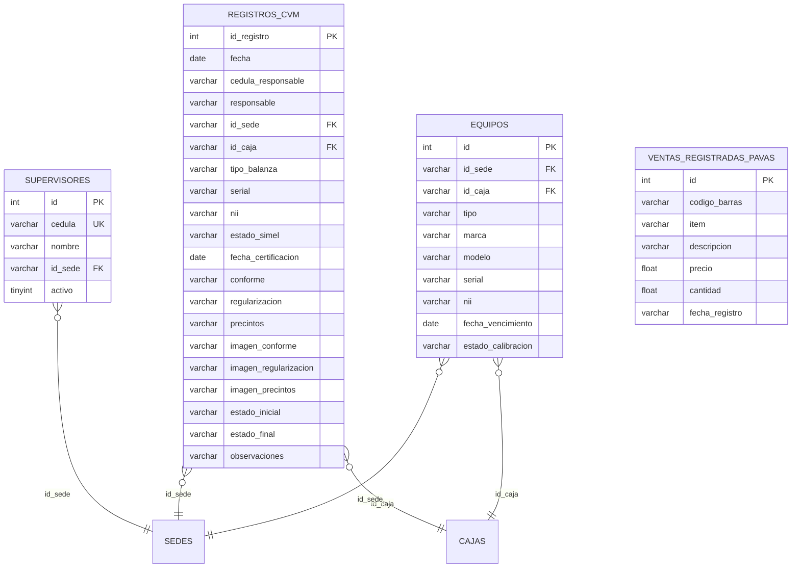
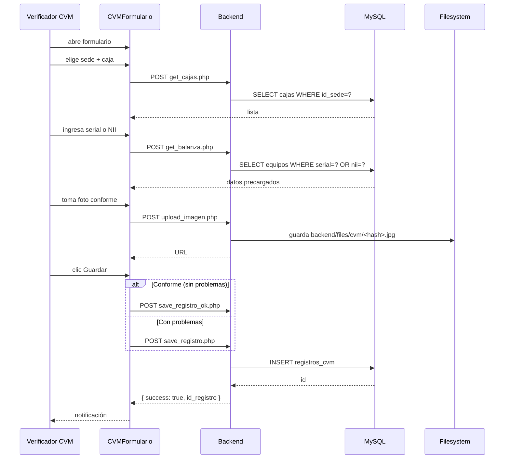
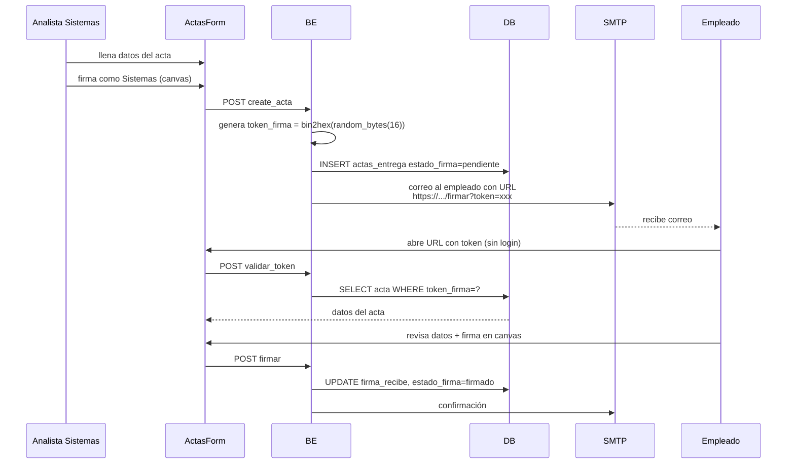
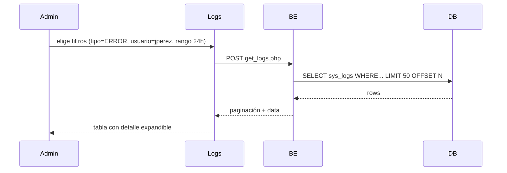

<div align="center">


# 23 · Módulo Sistemas

**Documentación técnica — Aplicativo SEAO**

</div>

---

|                      |                     |
| -------------------- | ------------------- |
| **Documento**        | 23 — Sistemas       |
| **Versión**          | 1.0                 |
| **Fecha**            | 14 de julio de 2026 |
| **Depende de**       | 03, 04, 09, 11, 14  |
| **Confidencialidad** | Uso interno         |

---

## 1 · Objetivo

El módulo **Sistemas** agrupa tres sub-dominios de trabajo del área de TI:

1. **CVM (Control Volumétrico Metrológico)** — verificación de balanzas comerciales por sede, con fotos de evidencia y estados (conforme, precintos rotos, fuera de certificación, regularizado). Cumplimiento con la Resolución SIC.
2. **Bitácora / Logs** — consulta administrativa de `sys_logs` con filtros por tipo, aplicación, usuario, IP, rango de fechas.
3. **Actas de Entrega TI** — registro y firma digital de entregas de equipos a empleados.
4. **System Status** — health check consolidado del framework LAN + MySQL.

⚠ **Observación estructural:** el sub-módulo de Actas tiene tabla en BD (`actas_entrega`) con 35+ columnas y flujo de estados (`token_firma`, `firma_recibe`, `estado_firma`), pero **los endpoints y componentes frontend no están presentes** en los ZIP analizados. Este documento lo describe **basado en el esquema de la tabla** — el detalle exacto de flujo requiere lectura del código no incluido.

---

## 2 · Actores

| Actor                      | Rol                                | Cargo típico                         |
| -------------------------- | ---------------------------------- | ------------------------------------ |
| Analista de sistemas       | `usuario`                          | Analista TI                          |
| Técnico de infraestructura | `usuario`                          | Técnico                              |
| Verificador CVM (por sede) | `usuario`                          | Supervisor de sede o auxiliar        |
| Auditor / Administrador    | `admin`                            | Admin IT                             |
| Empleado firmante (Actas)  | (no requiere login del aplicativo) | Cualquier empleado que reciba equipo |

---

## 3 · Rutas del frontend

| Ruta                                           | Componente              | Sub-módulo             |
| ---------------------------------------------- | ----------------------- | ---------------------- |
| `/sistemas/cvm/formulario`                     | `CVMFormulario`         | Registrar verificación |
| `/sistemas/cvm/reportes`                       | `CVMReportes`           | Consultar historial    |
| `/sistemas/logs`                               | `Logs`                  | Bitácora               |
| `/api/system/status/endpoint.php` (no ruta UI) | Consumido por dashboard | Health check           |
| ⚠ `/sistemas/actas` (probable — no verificado) | Actas de Entrega TI     | Actas                  |

---

## 4 · Componentes React

Fuente: `frontend/src/components/Sistemas/`.

### 4.1 CVM

Dividido en Formulario (crear/editar registro) y Reportes (consulta histórica):

```
Sistemas/CVM/
├── Formulario/
│   ├── CVMFormulario.jsx              ← orquestador
│   ├── hooks/
│   │   ├── useCVMFormulario.js        ← estado + fetch + upload fotos
│   │   └── useBalanzaLookup.js        ← autocompletar equipo por serial/NII
│   ├── components/
│   │   ├── DatosGenerales.jsx         ← fecha, responsable, sede, caja
│   │   ├── DatosBalanza.jsx           ← tipo, serial, NII, certificación
│   │   ├── EstadoVerificacion.jsx     ← precintos, fecha certificación, conforme
│   │   ├── UploadEvidencias.jsx       ← 3 imágenes (conforme, regularización, precintos)
│   │   └── ObservacionesFinal.jsx
│   └── utils/
│       └── validaciones.js
└── Reportes/
    ├── CVMReportes.jsx
    ├── hooks/
    │   ├── useReporteData.js
    │   └── useReporteFiltros.js
    ├── components/
    │   ├── FiltrosPanel.jsx
    │   ├── TablaRegistros.jsx
    │   └── ExportarBar.jsx
    └── utils/
        └── formato.js
```

### 4.2 Logs (Bitácora)

```
Sistemas/Logs/
├── Logs.jsx                           ← orquestador
├── hooks/
│   └── useLogs.js                     ← fetch paginado con filtros
└── components/
    ├── FiltrosPanel.jsx               ← tipo, aplicación, usuario, IP, rango
    ├── TablaLogs.jsx                  ← lista con detalle expandible por fila
    └── DetalleLog.jsx                 ← stack_trace y contexto extendido
```

---

## 5 · Endpoints backend

Fuente: `backend/backend/api/sistemas/`. Todos siguen Patrón A.

### 5.1 CVM (`/api/sistemas/cvm/`)

| Endpoint               | Propósito                                        |
| ---------------------- | ------------------------------------------------ |
| `get_supervisores.php` | Catálogo de supervisores por sede (autocomplete) |
| `get_cajas.php`        | Cajas registradas por sede                       |
| `get_balanza.php`      | Datos de una balanza por serial o NII            |
| `get_registros.php`    | Historial paginado con filtros                   |
| `save_registro.php`    | Crear registro con incidencia (con problemas)    |
| `save_registro_ok.php` | Crear registro conforme (variante simplificada)  |
| `update_registro.php`  | Editar registro existente                        |
| `upload_imagen.php`    | Subir evidencia fotográfica                      |
| `delete_imagen.php`    | Eliminar evidencia                               |

⚠ **Deuda:** `save_registro.php` vs `save_registro_ok.php` — dos endpoints con propósito similar. Debería consolidarse (ver §12.1).

### 5.2 Logs (`/api/sistemas/logs/`)

| Endpoint       | Propósito                                   |
| -------------- | ------------------------------------------- |
| `get_logs.php` | Consulta paginada de `sys_logs` con filtros |

### 5.3 System Status

Documentado en [09 §19](../09-api-endpoints.md).

### 5.4 Actas (esperado, no verificado)

Basado en el esquema de `actas_entrega` (35+ columnas incluyendo `token_firma`, `firma_sistemas`, `firma_recibe`), se infiere que existirán endpoints como:

- `/api/actas/create_acta.php`
- `/api/actas/get_actas.php`
- `/api/actas/firmar.php` (público, autenticado por `token_firma`)
- Upload de firma como SVG/imagen

**No confirmado en el ZIP.** Requiere lectura de un dump más completo.

---

## 6 · Acciones del framework LAN

**Ninguna directa.** El módulo Sistemas es **puramente local** — no consulta el ERP. Todos sus datos (logs, CVM, actas) están en MySQL.

La excepción es **System Status** — que sí llama al framework LAN para probar la conectividad hacia PostgreSQL, pero eso es infraestructura, no datos de negocio.

---

## 7 · Tablas MySQL

Ver [14 §10.1 y §5](../14-base-de-datos.md).

### 7.1 Tablas de CVM



### 7.2 Tabla de Actas (`actas_entrega`)

35+ columnas. Bloques principales:

- **Responsable** (nombre, cargo, email, departamento).
- **Equipo** (tipo enum `escritorio/portatil/no_aplica`, marca, modelo, serial, condición, componentes).
- **Otros equipos** (JSON abierto).
- **Software** (bandera + texto libre).
- **Firmas digitales** (`firma_sistemas`, `firma_recibe` JSON, `token_firma` 32 chars).
- **Estado del ciclo** (`estado`, `estado_firma`).
- **Auditoría** (timestamps auto).

### 7.3 `sys_logs`

Ver [14 §5](../14-base-de-datos.md) y [24 §10](../24-codigo-explicado.md). La bitácora central del sistema.

---

## 8 · Reglas de negocio

### 8.1 CVM — verificación por evento

Cada registro es una verificación puntual. No se sobrescriben — un problema regularizado deja el registro original + un nuevo registro de regularización.

### 8.2 CVM — estado_inicial vs estado_final

- `estado_inicial` — cómo se encontró la balanza al llegar.
- `estado_final` — cómo quedó tras la verificación (o regularización).

Estos dos campos son la clave del cumplimiento SIC — permiten demostrar que un problema detectado fue resuelto.

### 8.3 CVM — evidencia fotográfica opcional pero recomendada

Los tres campos de imagen (`imagen_conforme`, `imagen_regularizacion`, `imagen_precintos`) pueden estar vacíos, pero se recomienda subir al menos uno para respaldo ante inspección.

### 8.4 Actas — token de firma

Al crear un acta, sistemas genera `token_firma` (32 caracteres). Ese token se envía al empleado por correo con un enlace público de firma. Cualquiera con el token puede firmar — la seguridad es "posesión del token".

**Estado `firmado`** se establece cuando `firma_recibe` no es NULL.

### 8.5 Actas — snapshot inmutable

Una vez firmada, el acta no debería modificarse. La regla se aplica en frontend/backend (no visto en código, pero es la única interpretación coherente).

### 8.6 Logs — solo lectura

La bitácora `sys_logs` **no permite escritura desde la UI**. Solo se leen y filtran. Las escrituras vienen del propio código (Logger::info/warn/error) o del endpoint público de ingesta.

---

## 9 · Flujos principales

### 9.1 CVM — registrar una verificación



### 9.2 Actas — creación y firma (inferido)



⚠ **Flujo hipotético** — verificar con código real cuando esté disponible.

### 9.3 Consulta de bitácora



---

## 10 · Permisos por acción

Matriz sugerida:

| Ruta                             | Cargo               | ver | crear | editar | eliminar |
| -------------------------------- | ------------------- | :-: | :---: | :----: | :------: |
| `/sistemas/cvm/formulario`       | Verificador CVM     | ✅  |  ✅   |   ✅   |    ❌    |
| `/sistemas/cvm/reportes`         | Analista sistemas   | ✅  |  ❌   |   ❌   |    ❌    |
| `/sistemas/logs`                 | Admin IT            | ✅  |  ❌   |   ❌   |    ❌    |
| `/sistemas/actas`                | Analista sistemas   | ✅  |  ✅   |   ✅   |    ❌    |
| `/sistemas/actas/firmar/<token>` | (público con token) |  —  |   —   |   —    |    —     |

---

## 11 · Notificaciones y cronjobs

### 11.1 Cronjob `verificar_registros_cvm.php`

Diario (08:00 sugerido). Verifica que cada sede haya registrado la verificación esperada en el plazo definido. Envía correo consolidado a Sistemas.

Detalle:

- Consulta `registros_cvm` por sede en el rango de referencia.
- Compara contra `equipos` activos por sede.
- Alerta si alguna sede no tiene el mínimo esperado.

Es el **cronjob no `checker_*`** del sistema — parte esencial del cumplimiento SIC.

### 11.2 Notificación al empleado (Actas)

Cuando se crea un acta, se envía correo con URL de firma. Cuando el acta se firma, se envía confirmación tanto al empleado como al analista de sistemas.

---

## 12 · Deuda técnica del módulo

### 12.1 `save_registro.php` vs `save_registro_ok.php`

Dos endpoints casi idénticos con propósito ligeramente distinto. Consolidar en uno con parámetro `estado`.

**Esfuerzo:** S.

### 12.2 Actas — módulo no visible en dumps

Ver §1. La tabla existe pero endpoints/componentes no están en los ZIP entregados. Documentación incompleta hasta verificar.

### 12.3 CVM — semántica de `ventas_registradas_pavas`

Tabla adyacente al dominio CVM pero nombre ambiguo. ⚠ Aclarar con negocio.

### 12.4 `sys_logs` — retención

Ver deuda DT-011 en [26](../26-deuda-tecnica.md). Sin política de retención automática.

### 12.5 Bitácora sin exportación masiva

Solo consulta paginada. Para auditorías extensas se necesita exportar rangos grandes. Actualmente se hace vía phpMyAdmin.

**Recomendación:** endpoint `export_logs.php` que genere ZIP con múltiples archivos CSV.

---

## 13 · Puntos pendientes de análisis

- **Módulo Actas completo** — endpoints, componentes, flujo de firma con token.
- **`ventas_registradas_pavas`** — semántica del nombre y uso.
- **Cronograma exacto** de `verificar_registros_cvm.php`.
- **CVM — validación server-side** de fotos (MIME, tamaño, contenido).

---

## 14 · Referencias cruzadas

| Necesitas…                                    | Documento                                                                                |
| --------------------------------------------- | ---------------------------------------------------------------------------------------- |
| Ver estructura de `actas_entrega`             | [../14-base-de-datos.md#6-dominio-actas-de-entrega-ti](../14-base-de-datos.md)           |
| Ver estructura de tablas CVM                  | [../14-base-de-datos.md#101-cvm-control-volumetrico-metrologico](../14-base-de-datos.md) |
| Ver `sys_logs` completo                       | [../14-base-de-datos.md#51-tablas](../14-base-de-datos.md)                               |
| Ver Manual de Soporte con queries útiles      | [../18-manual-soporte.md](../18-manual-soporte.md)                                       |
| Ver módulo relacionado — Seguridad Visitantes | [./seguridad.md](./seguridad.md)                                                         |

---

<div align="center">
<sub><b>Supermercados Belalcázar</b> · Documento 23 — Módulo Sistemas · v1.0 · 14 de julio de 2026</sub>
</div>
